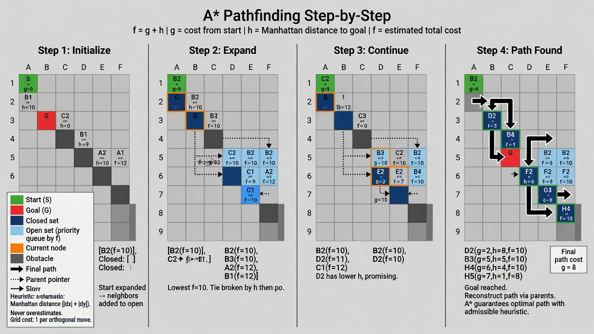

# 31 - A* Search (A-star)

## The Problem

Find the shortest path from start to goal with a **heuristic** that can guide the search.

A* is Dijkstra + a heuristic that estimates remaining cost to the goal.

### Canonical Problem: Shortest Path in a Grid with Obstacles and Costs (e.g., Game/Map Navigation)

**Problem Description:**

You are given a 2D grid (e.g. 100x100). Some cells are obstacles (walls). Each cell has a movement cost (1 for normal, 5 for mud, etc.).

Find the lowest-cost path from start (0,0) to goal (N-1, N-1). You can move up/down/left/right (or diagonally in variants).

Naive BFS fails because costs vary. Dijkstra works but explores too many unnecessary cells. A* with good heuristic (Manhattan distance) focuses the search toward the goal, making it much faster in practice while remaining optimal.

**Why this problem shows A* exists:**
- Pure shortest path algos waste time exploring away from the goal.
- Heuristic makes it "informed" search.
- Real maps/games have this exact shape: grids + varying terrain + obstacles.

**Real-world evidence:**
- Almost every video game pathfinding (Unity, Unreal, custom engines)
- Google Maps / Uber routing (with many optimizations on top of A*)
- Robotics (ROS navigation stack)
- Puzzle solvers



**Full Implementation (Grid A* with Manhattan heuristic)**

**C# (using PriorityQueue)**

```csharp
public static List<(int,int)> FindPath(int[,] grid, (int,int) start, (int,int) goal) {
    int rows = grid.GetLength(0), cols = grid.GetLength(1);
    var open = new PriorityQueue<(int,int), int>();
    var cameFrom = new Dictionary<(int,int), (int,int)>();
    var gScore = new Dictionary<(int,int), int> { [start] = 0 };
    open.Enqueue(start, 0);

    int H((int r, int c) p) => Math.Abs(p.r - goal.Item1) + Math.Abs(p.c - goal.Item2);

    while (open.Count > 0) {
        var current = open.Dequeue();
        if (current == goal) return Reconstruct(cameFrom, current);

        foreach (var nei in GetNeighbors(current, rows, cols)) {
            if (grid[nei.Item1, nei.Item2] == -1) continue; // obstacle
            int tentative = gScore.GetValueOrDefault(current, int.MaxValue) + grid[nei.Item1, nei.Item2];
            if (tentative < gScore.GetValueOrDefault(nei, int.MaxValue)) {
                cameFrom[nei] = current;
                gScore[nei] = tentative;
                int f = tentative + H(nei);
                open.Enqueue(nei, f);
            }
        }
    }
    return null; // no path
}

static List<(int,int)> Reconstruct(Dictionary<(int,int),(int,int)> came, (int,int) curr) { ... } // standard
```

**Go** version uses container/heap for priority queue.

Full details and optimizations in the chapter + examples/.

## The Formula

f(n) = g(n) + h(n)

- g(n) = cost from start to n (exact)
- h(n) = estimated cost from n to goal (heuristic)

If h is **admissible** (never overestimates), A* is optimal.

## Real World (This is Huge)

- Google Maps, Uber, game pathfinding (almost every game that does pathfinding uses A* or a variant)
- Robotics motion planning
- Puzzle solvers (15-puzzle, Rubik's cube solvers)
- Any grid or graph navigation with varying costs + a good heuristic

## Heuristics

- Manhattan distance (grid, 4 directions)
- Euclidean distance
- More advanced domain-specific heuristics

## Optimizations Used in Production

- Hierarchical pathfinding
- Jump Point Search (JPS) for grids
- Contraction hierarchies + A*
- Bidirectional A*

## Summary

A* is the workhorse of real-world pathfinding when you have a reasonable way to estimate "how far is the goal from here".
