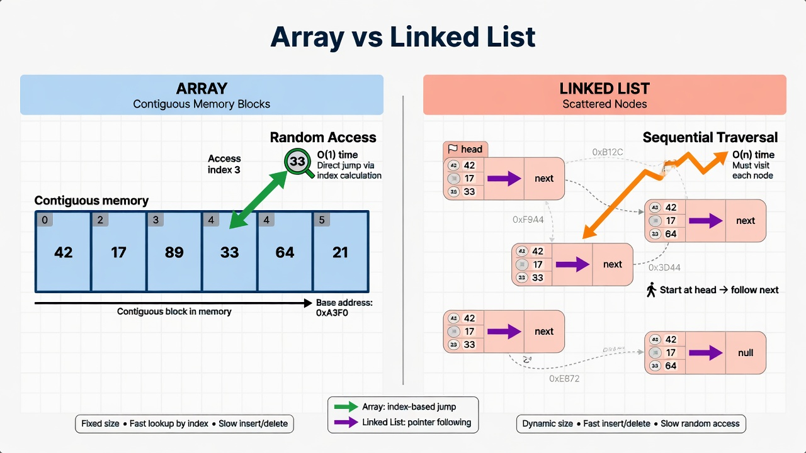

# 01 - Array

## What is an Array?

An **array** is the most fundamental data structure in computing.

It is a **contiguous block of memory** that holds a fixed number of elements of the same type, accessible by **index**.

- Contiguous = elements live right next to each other in memory.
- Index = you can jump directly to any position using math (base address + index × element size).

This is why arrays give you **O(1)** random access.

## Visual



```
Index:   0    1    2    3    4
Value:  42   17   99   23   11
Memory: [42][17][99][23][11]   ← one continuous chunk
```

## Why Arrays Are Special

Because they are contiguous:

- CPU cache loves them (spatial locality).
- You can do pointer arithmetic.
- Binary search becomes possible.
- Many other advanced structures are built on top of arrays.

## Fixed Size vs Dynamic

In this chapter we talk about **fixed-size arrays**.

The next chapter (Dynamic Array) is what most people actually use day to day (`List<T>`, Go slices).

## Operations & Complexity

| Operation            | Time     | Notes |
|----------------------|----------|-------|
| Access by index      | O(1)     | Magic |
| Update by index      | O(1)     | Magic |
| Search (unsorted)    | O(n)     | Have to look at everything |
| Insert at beginning  | O(n)     | Must shift everything |
| Insert at end        | O(n) or O(1) | O(1) only if space preallocated and not full |
| Delete               | O(n)     | Shifting required |

## Real Language Implementations

**C#**

```csharp
// Fixed size array
int[] scores = new int[5];           // All zeros
int[] scores2 = new int[] { 10, 20, 30, 40, 50 };

// Multidimensional
int[,] matrix = new int[3, 3];
int[][] jagged = new int[3][];       // Array of arrays (not contiguous 2D)
```

Access:
```csharp
scores[2] = 99;
int x = scores[0];
```

**Go**

```go
var arr [5]int                    // fixed array of 5 ints, zeroed
arr := [5]int{1, 2, 3, 4, 5}
arr[0] = 42
```

Go also has slices (next chapter), which are much more common.

## Memory Layout Reality

In C# and Go (and almost every language), for value types the elements are laid out inline.

For reference types, the array holds **references** (pointers), not the objects themselves.

This is crucial for performance.

Example:

```csharp
// C#
string[] names = new string[1000];   // Holds 1000 references (pointers)
// The actual string objects live elsewhere on the heap
```

## Real World Use Cases

### 1. .NET Runtime and Frameworks

- `Array` is the backbone of `List<T>`, `Dictionary<TKey,TValue>` buckets, many buffers.
- `Span<T>` and `Memory<T>` in modern .NET are designed to work directly over arrays with zero-copy.
- `ArrayPool<T>` exists because allocating arrays is expensive — we reuse them.

### 2. Go Runtime

- Go slices are headers pointing to an underlying array.
- Many internal structures (maps, channels, goroutine stacks in some cases) use arrays.
- `encoding/json`, `encoding/binary`, networking buffers all use `[]byte` arrays heavily.

### 3. Graphics, Games, Audio

- Vertex buffers, index buffers, pixel buffers = giant arrays.
- Audio samples = arrays of floats or ints.
- Game entity component systems often use arrays of structs for cache efficiency ("data oriented design").

### 4. Databases and Storage Engines

- Page caches are arrays of bytes (usually 4KB or 8KB pages).
- Columnar storage (Parquet, ClickHouse) stores each column as a big array.
- Bitmap indexes are arrays of bits.

### 5. Operating Systems

- Process page tables, file system block bitmaps, network packet buffers.

### 6. Everyday Code

```csharp
// Image processing
byte[] pixels = GetImageBytes();
pixels[i * width + j] = 255;           // direct access

// CSV parsing
string[] fields = line.Split(',');
```

## Common Patterns and Tricks

### 1. Prefix Sum Array (Very Useful)

Precompute cumulative sums so range sum queries become O(1).

```csharp
int[] prefix = new int[nums.Length + 1];
for (int i = 0; i < nums.Length; i++) {
    prefix[i + 1] = prefix[i] + nums[i];
}

// Sum from l to r inclusive
int sum = prefix[r + 1] - prefix[l];
```

Used in: stock price range queries, subarray sum problems, analytics.

### 2. Difference Array

Great for range updates.

### 3. Two-pointers on arrays (covered in fundamentals)

### 4. In-place reversal, rotation, etc.

## The "Two Crystal Balls" Connection

The famous two crystal balls problem (see Binary Search chapter) can be solved using a **step size** derived from square root — but it is really about intelligently skipping over an array using math.

Arrays enable these kinds of jump strategies because of O(1) access.

## Full Example: Building a Simple Fixed Buffer

**C#**

```csharp
public class FixedBuffer<T> {
    private readonly T[] _data;
    private int _count;

    public FixedBuffer(int capacity) {
        _data = new T[capacity];
    }

    public void Add(T item) {
        if (_count >= _data.Length) throw new InvalidOperationException("Full");
        _data[_count++] = item;
    }

    public T this[int index] {
        get => _data[index];
        set => _data[index] = value;
    }

    public int Count => _count;
}
```

**Go**

```go
type FixedBuffer[T any] struct {
    data  []T
    count int
}

func NewFixedBuffer[T any](capacity int) *FixedBuffer[T] {
    return &FixedBuffer[T]{data: make([]T, capacity)}
}

func (b *FixedBuffer[T]) Add(item T) {
    if b.count >= len(b.data) {
        panic("buffer full")
    }
    b.data[b.count] = item
    b.count++
}
```

Note: In Go we usually use slices and capacity checks instead of fixed arrays for this.

## Pitfalls

- **Buffer overflow / index out of range** — the #1 source of security bugs historically (C/C++). Modern languages throw or panic.
- **Cache line false sharing** in concurrent code (when threads write to different array indices that happen to live on the same cache line).
- Using arrays when you need dynamic growth → leads to manual resizing bugs.

## When to Use a Raw Fixed Array

- You know the exact size at creation and it never changes.
- You want maximum performance and control.
- You are implementing higher-level structures.
- Interop with native code or hardware.

Otherwise, reach for **Dynamic Array** (next chapter).

---

**Next:** [02 - Dynamic Array](02-dynamic-array.md) — what `List<T>` and Go slices actually are.
