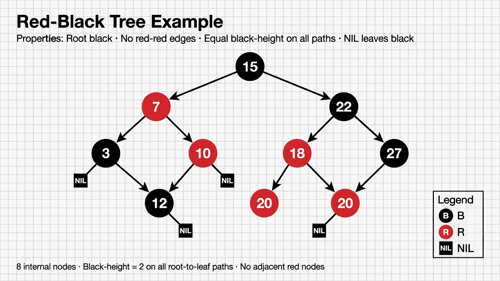

# 14 - Self-Balancing BST: Red-Black Tree

## The Problem

Plain BSTs can degenerate into linked lists.

We need a tree that **automatically stays balanced** (or close to it) after insertions and deletions.

Two famous solutions:
- **AVL Trees** — strictly balanced (height difference at most 1). More rotations.
- **Red-Black Trees** — "mostly balanced" (no path more than twice as long as any other). Fewer rotations, better for insertions/deletions in practice.

Red-Black trees are used **everywhere** in real systems.

## Red-Black Tree Rules (Invariants)

Every node is colored either **Red** or **Black**.

The rules:
1. Every node is Red or Black.
2. Root is always Black.
3. All leaves (NIL nodes) are Black.
4. If a node is Red, both its children must be Black (no two reds in a row).
5. Every path from a node to its descendant leaves must contain the **same number of black nodes**.

These rules guarantee that the tree height is at most `2 * log(n + 1)`.

That is good enough for O(log n) operations.

## Visual Example



## Rotations — The Rebalancing Tool

Rotations change the structure without violating the search property.

There are two basic rotations: **left rotate** and **right rotate**.

They are the same operations used in AVL trees.

## Insertion in Red-Black Tree

Steps:
1. Insert like normal BST.
2. Color the new node **Red**.
3. Fix violations by:
   - Recoloring
   - Rotations

There are several cases (uncle is red, uncle is black + zig-zag, etc.).

The full logic is a bit long but very mechanical.

## Minimal Educational Implementation (C#)

Below is a **complete but simplified** Red-Black tree focused on integer keys. It demonstrates the core concepts correctly.

```csharp
public enum Color { Red, Black }

public class RBNode {
    public int Val;
    public Color Color = Color.Red;
    public RBNode? Left, Right, Parent;

    public RBNode(int val) => Val = val;
}

public class RedBlackTree {
    public RBNode? Root;
    private readonly RBNode Nil = new(0) { Color = Color.Black }; // sentinel

    public RedBlackTree() {
        Nil.Left = Nil.Right = Nil.Parent = Nil;
    }

    private void LeftRotate(RBNode x) {
        RBNode y = x.Right!;
        x.Right = y.Left;
        if (y.Left != Nil) y.Left.Parent = x;
        y.Parent = x.Parent;
        if (x.Parent == Nil) Root = y;
        else if (x == x.Parent.Left) x.Parent.Left = y;
        else x.Parent.Right = y;
        y.Left = x;
        x.Parent = y;
    }

    private void RightRotate(RBNode x) {
        // symmetric to LeftRotate
        RBNode y = x.Left!;
        x.Left = y.Right;
        if (y.Right != Nil) y.Right.Parent = x;
        y.Parent = x.Parent;
        if (x.Parent == Nil) Root = y;
        else if (x == x.Parent.Right) x.Parent.Right = y;
        else x.Parent.Left = y;
        y.Right = x;
        x.Parent = y;
    }

    public void Insert(int val) {
        RBNode node = new(val) { Left = Nil, Right = Nil, Parent = Nil };
        RBNode? y = Nil;
        RBNode? x = Root;

        while (x != Nil && x != null) {
            y = x;
            if (node.Val < x.Val) x = x.Left;
            else x = x.Right;
        }

        node.Parent = y;
        if (y == Nil) Root = node;
        else if (node.Val < y.Val) y.Left = node;
        else y.Right = node;

        InsertFixup(node);
    }

    private void InsertFixup(RBNode z) {
        while (z.Parent != Nil && z.Parent.Color == Color.Red) {
            if (z.Parent == z.Parent.Parent!.Left) {
                RBNode y = z.Parent.Parent.Right!;
                if (y.Color == Color.Red) {
                    z.Parent.Color = Color.Black;
                    y.Color = Color.Black;
                    z.Parent.Parent.Color = Color.Red;
                    z = z.Parent.Parent;
                } else {
                    if (z == z.Parent.Right) {
                        z = z.Parent;
                        LeftRotate(z);
                    }
                    z.Parent!.Color = Color.Black;
                    z.Parent.Parent!.Color = Color.Red;
                    RightRotate(z.Parent.Parent);
                }
            } else {
                // symmetric case for right
                RBNode y = z.Parent.Parent!.Left!;
                if (y.Color == Color.Red) {
                    z.Parent.Color = Color.Black;
                    y.Color = Color.Black;
                    z.Parent.Parent.Color = Color.Red;
                    z = z.Parent.Parent;
                } else {
                    if (z == z.Parent.Left) {
                        z = z.Parent;
                        RightRotate(z);
                    }
                    z.Parent!.Color = Color.Black;
                    z.Parent.Parent!.Color = Color.Red;
                    LeftRotate(z.Parent.Parent);
                }
            }
        }
        Root!.Color = Color.Black;
    }
}
```

This is the classic CLRS-style implementation. Full delete fixup is even longer.

## Where Red-Black Trees Are Used in the Real World

### 1. Linux Kernel (Extremely Heavy Use)

- Completely Fair Scheduler (CFS) uses rb-tree for tasks
- Virtual memory area (VMA) tracking
- File system directory entry cache (dcache)
- Many other kernel data structures

### 2. .NET

- `SortedSet<T>`
- `SortedDictionary<TKey, TValue>`
- Many internal structures in the CLR and runtime

### 3. Java

- `TreeMap` and `TreeSet` are Red-Black trees

### 4. GCC / C++ STL

- `std::map`, `std::set`, `std::multimap` are Red-Black trees

### 5. Databases & Storage Engines (sometimes)

Some in-memory components and certain index types use RB-trees.

B+ trees dominate on disk, but RB-trees appear in memory.

### 6. macOS / iOS (some kernel + Foundation collections)

## Why Red-Black Over AVL?

- Fewer rotations on average during insert/delete
- Better constant factors in practice for mixed workloads
- Still guarantees O(log n) height

AVL trees have smaller height bounds and can be faster for lookup-heavy workloads.

## Self-Balancing Trees vs Other Structures

When you need **ordered data + fast lookup by key + range queries**, reach for:
- Red-Black tree (in-memory, general purpose)
- B+ tree (on-disk, databases)
- Skip list (some databases like Redis sorted sets)

## Summary

Red-Black tree = BST + color rules + rotations that keep the tree balanced enough.

It is one of the most successful data structures ever invented for ordered associative containers.

You will rarely implement one from scratch in application code (use the platform's `SortedSet` / `TreeMap`), but understanding how it works makes you a much better engineer when you need to reason about performance of ordered collections.

**Next:** [15 - Heap](15-heap.md)
