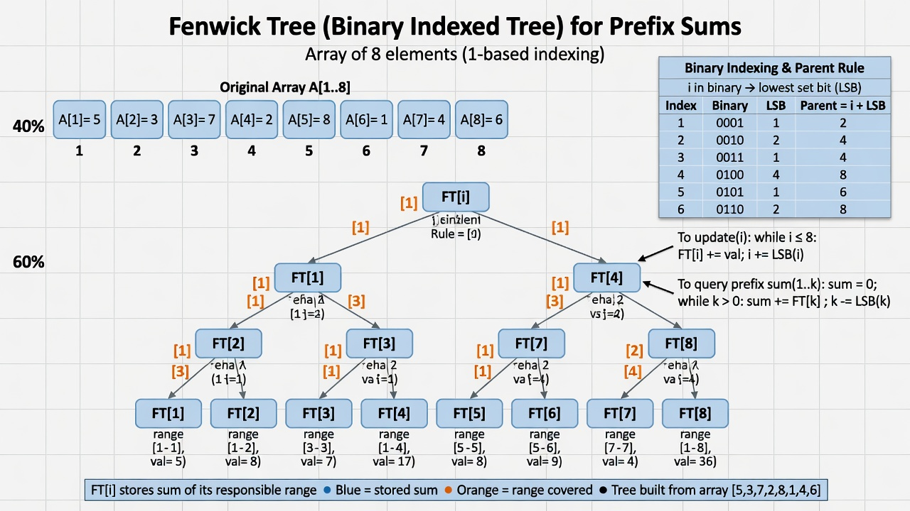

# 21 - Fenwick Tree (Binary Indexed Tree)

## What is a Fenwick Tree?

A **Fenwick Tree** (also called Binary Indexed Tree or BIT) is a data structure that provides extremely efficient **prefix sum** queries and **point updates**.

It was invented by Peter Fenwick in 1994 and is famous in competitive programming because it is:
- Much simpler to code than a segment tree for sum queries
- Uses less memory
- Slightly faster in practice for the operations it supports

## The Core Insight

Instead of storing the actual values, each position in the Fenwick tree stores the **sum of a specific range** whose size is a power of two.

The magic is in the binary representation of the index.

To compute prefix sum up to index `x`, you repeatedly subtract the lowest set bit.

To update index `x`, you repeatedly add the lowest set bit.

This gives O(log n) for both operations using a tiny amount of code.

## Operations

- Update(index, delta): O(log n)
- PrefixSum(index): O(log n)  — sum from 1 to index
- RangeSum(l, r): PrefixSum(r) - PrefixSum(l-1)

## Why "Binary Indexed"?

The position `i` is responsible for a range of length equal to the lowest set bit of `i`.

Example (1-based):

Index 1 (binary 1): responsible for 1 element
Index 2 (binary 10): responsible for 2 elements
Index 3 (binary 11): responsible for 1 element
Index 4 (binary 100): responsible for 4 elements

This is what allows jumping over ranges quickly.

### Canonical Problem: Count Inversions in an Array + Range Updates

**Problem Description (Inversion Count):**

Given an array of integers, count the number of inversions: pairs (i, j) where i < j but arr[i] > arr[j].

Naive: O(n²). Fenwick Tree solves it in O(n log n) after coordinate compression.

This is a classic "why Fenwick exists" problem because it turns a quadratic problem into near-linear using prefix frequency counts.

**Real-world motivation:**
- Sorting with custom comparators that need inversion stats
- In competitive programming and algorithm analysis
- Financial data: counting "crossings" or anomalies in time series
- Used together with Segment Trees in many analytics systems

**Full Implementation (Inversion Count using Fenwick)**

**C#**

```csharp
public static long CountInversions(int[] arr) {
    // Coordinate compression
    var sorted = arr.Distinct().OrderBy(x => x).ToList();
    var rank = new Dictionary<int, int>();
    for (int i = 0; i < sorted.Count; i++) rank[sorted[i]] = i + 1;

    var ft = new FenwickTree(sorted.Count + 1);
    long inv = 0;
    for (int i = arr.Length - 1; i >= 0; i--) {
        int r = rank[arr[i]];
        inv += ft.PrefixSum(r - 1);
        ft.Update(r, 1);
    }
    return inv;
}
```

(Using the FenwickTree class from earlier in the file.)

**Go** version analogous with map for ranks and the BIT.

See examples/ for full runnable inversion count demo.



## Simple Implementation (C#)

```csharp
public class FenwickTree {
    private long[] tree;
    private int n;

    public FenwickTree(int size) {
        n = size + 1;
        tree = new long[n];
    }

    public void Update(int idx, long delta) {
        idx++; // 1-based
        while (idx < n) {
            tree[idx] += delta;
            idx += idx & -idx; // add lowest set bit
        }
    }

    public long PrefixSum(int idx) {
        idx++;
        long sum = 0;
        while (idx > 0) {
            sum += tree[idx];
            idx -= idx & -idx; // subtract lowest set bit
        }
        return sum;
    }

    public long RangeSum(int left, int right) {
        return PrefixSum(right) - PrefixSum(left - 1);
    }
}
```

The Go version is almost identical.

## Real World Uses

### 1. Competitive Programming

Fenwick trees are everywhere in CP for:
- Inversion count
- Range sum with updates
- Order statistic problems (with coordinate compression)

### 2. Analytics & Time Series

When you have a stream of events at different times and want prefix counts or sums up to a certain time, Fenwick trees (or segment trees) are used.

### 3. Order Statistic Trees

With coordinate compression + Fenwick, you can answer "how many numbers <= X have been inserted so far" efficiently.

### 4. Some Database Components

Certain counting and aggregation structures in column stores or OLAP engines use Fenwick or Fenwick-like structures.

### 5. Game Development

Some advanced scoreboard or ranking systems use Fenwick trees.

## Limitations

- Only works well for **prefix / range sum** type operations (or things you can model as sums like count, xor in some cases).
- Harder to extend to min/max than segment trees.
- Point updates only (range updates require more advanced techniques like difference arrays + Fenwick or two Fenwicks).

## Fenwick vs Segment Tree

| Feature                  | Fenwick Tree       | Segment Tree          |
|--------------------------|--------------------|-----------------------|
| Code length              | Very short         | Longer                |
| Memory                   | Less               | More                  |
| Sum queries              | Excellent          | Excellent             |
| Min / Max / custom       | Hard               | Easy                  |
| Range updates (lazy)     | Possible with tricks | Natural               |
| Speed                    | Slightly faster    | Very fast             |

Choose Fenwick when you only need sums and want simplicity + speed.

## Summary

Fenwick Tree = one of the most elegant data structures ever invented for prefix sums.

It shows how deep understanding of binary representation can lead to incredibly simple and fast code.

**Next:** [22 - Merkle Tree](22-merkle-tree.md)
