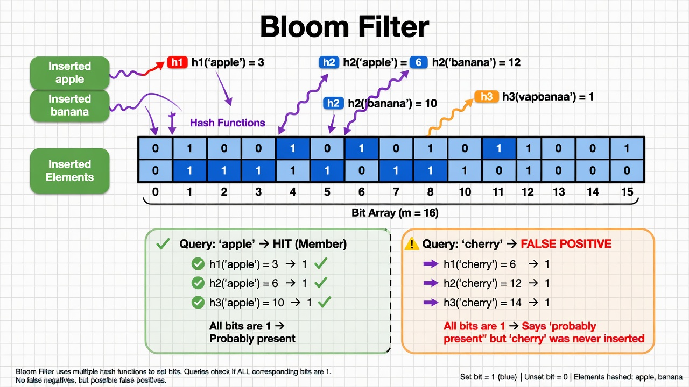

# 24 - Bloom Filter

## What is a Bloom Filter?

A **Bloom Filter** is a **probabilistic** data structure for answering:

"Have I seen this item before?"

With two special properties:
- It can say **"definitely not seen"** with 100% certainty.
- It can say **"probably seen"** (with a small false positive rate).

It **never** gives false negatives.

This is incredibly useful when false positives are acceptable but you want to save memory and be very fast.

## How It Works (Simple)



1. You have a bit array of size `m`, initially all zeros.
2. You have `k` different hash functions.
3. To **add** an item:
   - Hash it with all k hashes
   - Set the corresponding bits to 1
4. To **query** an item:
   - Hash it with all k hashes
   - If **any** bit is 0 → "definitely not present"
   - If all bits are 1 → "probably present"

## Tradeoff

You choose:
- Size of the bit array (`m`)
- Number of hash functions (`k`)

This controls the **false positive rate**.

Typical: 1% or 0.1% false positives with dramatically less memory than a real hash set.

## Real World Use Cases (Extremely Common)

### 1. Databases — Avoiding Disk Reads

- **Cassandra, HBase, ScyllaDB**: Each SSTable has a Bloom filter. Before reading from disk, check the filter. If it says "no", skip the file entirely. Huge win.
- **RocksDB / LevelDB**: Same pattern.

### 2. Caches

- Browser caches, CDN caches, Redis modules use Bloom filters to quickly say "we definitely don't have this".

### 3. Web Crawlers & URL Deduping

- "Have we already crawled this URL?" 
- Billions of URLs. Can't store every one in memory. Bloom filter lets them skip most duplicates with tiny memory.

### 4. Bitcoin / Cryptocurrency

- Bitcoin SPV (Simplified Payment Verification) clients use Bloom filters to ask nodes for relevant transactions without revealing exactly which addresses they care about.

### 5. Email / Spam Systems

- "Have we seen this email hash before?" for deduplication and rate limiting.

### 6. Advertising & Analytics

- Frequency capping ("has this user seen this ad already?") at massive scale.

### 7. Network Security

- Many DPI (deep packet inspection) and DDoS mitigation systems use Bloom filters.

### 8. .NET and Go Services

Many high-scale services at Microsoft, Google, Meta, Netflix, etc. use Bloom filters in their custom caching and dedup layers.

## Implementation Sketch (C#)

```csharp
public class BloomFilter {
    private readonly BitArray _bits;
    private readonly int _k; // number of hashes
    private readonly int _m;

    public BloomFilter(int expectedItems, double falsePositiveRate) {
        _m = (int)(-expectedItems * Math.Log(falsePositiveRate) / (Math.Log(2) * Math.Log(2)));
        _k = (int)(Math.Log(2) * _m / expectedItems);
        _bits = new BitArray(_m);
    }

    public void Add(string item) {
        foreach (int hash in GetHashes(item)) {
            _bits[Math.Abs(hash) % _m] = true;
        }
    }

    public bool MightContain(string item) {
        foreach (int hash in GetHashes(item)) {
            if (!_bits[Math.Abs(hash) % _m]) return false;
        }
        return true;
    }

    private IEnumerable<int> GetHashes(string item) {
        // In practice use multiple independent hashes or double hashing
        int h1 = item.GetHashCode();
        int h2 = item.GetHashCode() * 31;
        for (int i = 0; i < _k; i++) {
            yield return h1 + i * h2;
        }
    }
}
```

## Important Limitations

- Cannot remove items (standard Bloom filter).
- False positives increase as you add more items.
- You must know roughly how many items you will insert upfront.

## Variants That Fix Limitations

- **Counting Bloom Filter** — allows deletion (uses counters instead of bits)
- **Cuckoo Filter** (covered later) — supports deletion + better performance in some cases
- **Blocked Bloom Filter** — cache friendly
- **Scalable / Dynamic Bloom Filters**

## Cuckoo Filter (Preview)

Cuckoo filters are a modern improvement that many new systems are adopting because they support deletion and have better space efficiency at low false positive rates.

## When to Use a Bloom Filter

Use it when:
- You can tolerate a small false positive rate
- Memory is more expensive than the cost of occasional false positives
- You have a very large number of items

Do **not** use it when you need exact answers.

## Summary

Bloom Filter = one of the most practical probabilistic data structures ever created.

It powers a huge amount of the "fast path" decisions in modern databases, caches, and distributed systems by saying "we can skip this work with high probability".

See [`resources/further-reading.md`](../resources/further-reading.md) for the original Bloom paper and modern variants.

**Next:** [25 - Disjoint Set (Union-Find)](25-disjoint-set-union-find.md)
