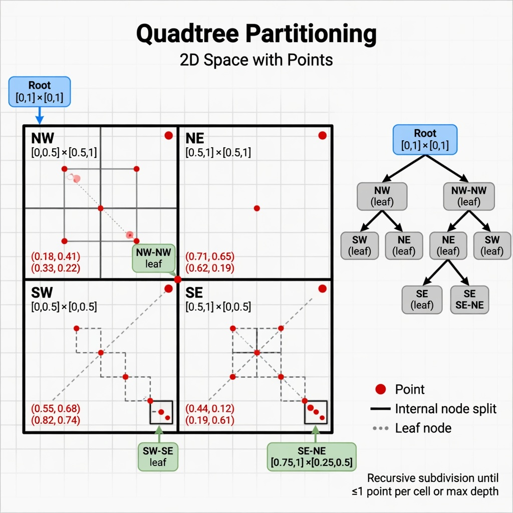

# 32 - Quadtree

## What is a Quadtree?

A **quadtree** is a tree data structure used to partition 2D space.

Each internal node has exactly **four children** (hence "quad"), representing four quadrants:
- North-West, North-East, South-West, South-East

It is the 2D equivalent of a binary tree for space partitioning.

## Why Quadtrees Exist

When you have many objects in 2D space and want to answer:
- "Which objects are near this point?"
- "Which objects overlap this rectangle?"
- "How do I efficiently render only visible objects?"

Naive O(n) scan is too slow.

Quadtree lets you discard huge empty regions quickly.

## Types of Quadtrees

- **Point Quadtree** — stores points
- **Region Quadtree** — subdivides space into uniform regions
- **PR Quadtree** (Point Region)
- **MX Quadtree**, **Compressed Quadtree**, etc.

## Real World Uses

### 1. Games (Extremely Common)

- Collision detection: "Which objects might be colliding with this one?"
- Visibility / frustum culling
- AI perception ("what can this unit see?")
- Particle systems

### 2. Geographic Information Systems (GIS) & Maps

- Efficient storage and querying of points of interest
- Map tile systems sometimes use quadtree-like subdivision (Google Maps, etc.)

### 3. Computer Graphics & Rendering

- Scene management
- Ray tracing acceleration structures (though KD-trees and BVH are also common)
- Terrain rendering (quadtree terrain)

### 4. Image Processing & Compression

- Quadtree image compression
- Region of interest processing

### 5. Robotics & Pathfinding

Spatial partitioning for obstacle avoidance.

### 6. Databases (some spatial indexes)

Although R-trees are more common for true spatial indexes, quadtrees appear in some systems.

## Implementation Intuition

Each node represents a bounding box.

When the number of points in a region exceeds a threshold, you subdivide into 4 children.

Queries descend only into quadrants that intersect the query region.

## Limitations

- Can become very deep with clustered data (all points in one corner).
- Not optimal for all types of spatial queries (range, nearest neighbor).
- 3D version is **octree**.

## Summary

Quadtree = recursive 2D space division into four quadrants.

It is one of the fundamental tools in games and any system that needs to deal with "nearby things in 2D".

**Next:** [33 - KD Tree](33-kd-tree.md)
