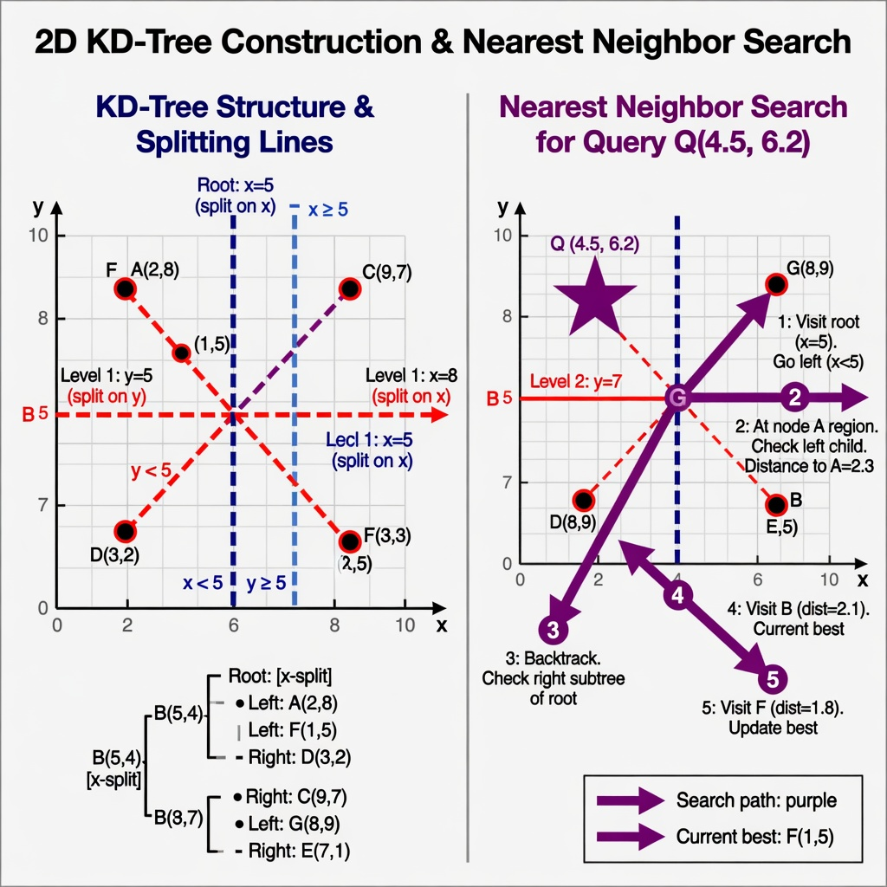

# 33 - KD Tree

## What is a KD Tree?

A **k-dimensional tree** (KD-tree) is a binary tree for organizing points in k-dimensional space.

For 2D: alternates splitting on X and Y.
For 3D: cycles through X, Y, Z.
For higher dimensions: cycles through the dimensions.

Each level splits the space along one axis.

## Strengths

- Very good for **nearest neighbor** searches in low dimensions (k ≤ 10–20).
- Relatively simple to build.
- Can answer range searches.

## Weaknesses

- Performance degrades badly in high dimensions (curse of dimensionality).
- Not great for frequent updates (most implementations are static).
- Nearest neighbor can degenerate in worst case.

## Real World Uses

### 1. Computer Graphics & Games

- Nearest neighbor queries
- Some collision and spatial queries
- Photon mapping in ray tracing

### 2. Machine Learning

- K-nearest neighbors (KNN) classification and regression
- Some clustering algorithms use KD-trees as acceleration

### 3. Geographic / Location Services

- "Find the 5 closest restaurants to this point"
- Some mapping and location-based services (for moderate data sizes)

### 4. Robotics & Computer Vision

- Point cloud processing
- Feature matching

## Comparison With Other Spatial Structures

- **Quadtree / Octree**: Better for uniform space partitioning and range queries in 2D/3D.
- **R-tree**: Better for rectangles, overlapping regions, and disk-based spatial indexes.
- **KD-tree**: Excellent for point nearest-neighbor in low dimensions.

## Summary

KD-tree = space-partitioning binary tree that alternates dimensions.

It is a classic tool for nearest-neighbor problems in low-dimensional spaces (especially in ML and graphics).

**Next:** [34 - R-Tree](34-rtree.md)
