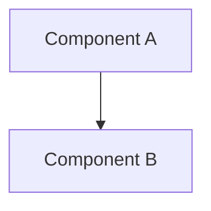

# Build Your Own [Project Name]

## 1. Motivation & Real-World Context

[Why this system exists in production. Cite 2–3 real products by name.]

---

## 2. Learning Objectives

By completing this project, you will deeply understand:

1. **[Concept]** — [what you'll learn]. See [Handbook Chapter](/data-structures/01-array).

---

## 3. Project Scope

**In Scope:**
- [Feature 1]
- [Feature 2]

**Out of Scope (for v1):**
- [Deferred feature]

---

## 4. Core DSA Concepts Used

| Concept | Role in this project | Handbook Link | Difficulty |
|---------|----------------------|---------------|------------|
| [Name] | [How it's used] | [/data-structures/01-array](/data-structures/01-array) | Beginner |

---

## 5. High-Level Architecture

**Key interfaces / abstractions:**

- `[Interface]` — [description]

---

## 6. Implementation Milestones (with Hints)

### Milestone 1: [Name]

**Goal:** [What to build]

**Key Challenges:** [What makes this hard]

**Hints & Guidance:**
- [Hint 1]
- [Hint 2]

**Success Criteria:**
- [Testable outcome]

---

## 7. Stretch Goals (for advanced learners)

1. **[Goal]** — [description]

---

## 8. Testing & Validation Strategy

**Unit tests:**
- [Test case]

**Benchmarks:**
- [What to measure]

---

## 9. C# and Go Implementation Notes

**C# notes:**
- [Language-specific tip]

**Go notes:**
- [Language-specific tip]

---

## 10. Potential Extensions & Related Projects

- **[Extension]** — [description and link to related project]