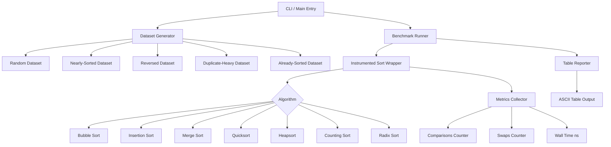

# Build Your Own Sorting Benchmarker

## 1. Motivation & Real-World Context

Developers who understand sorting algorithms do not write `list.sort()` — they ask "what does *this* sort do to *this* data?" Three production examples show why it matters:

**The Go runtime chose Pdqsort.** Go 1.19 replaced its previous quicksort implementation with pattern-defeating quicksort (Pdqsort) in `slices.Sort`. Pdqsort detects nearly-sorted inputs and degrades to insertion sort, detects already-sorted runs, and falls back to heapsort to avoid O(n²) worst-case. This was not a casual decision — it was driven by benchmark results on production data distributions. Without knowing what each algorithm does to what data, you cannot evaluate such a change.

**Python uses Timsort for everything.** CPython's `list.sort()` and `sorted()` are Timsort. It was designed by Tim Peters specifically for real-world data: log files, timestamps, records sorted by one field then another. Real data has *runs* — sequences that are already sorted. Timsort finds these runs in O(n) and merge-sorts them. On already-sorted data it runs in O(n), not O(n log n). When a team at Google replaced a hand-rolled sort with a naive quicksort, performance degraded because their event data was nearly-sorted by timestamp.

**Counting Sort and Radix Sort dominate narrow integer domains.** Sorting IP addresses (uint32, 4 billion possible values) by country code using comparison sort takes O(n log n). Using Radix Sort on 8-bit digits takes O(4n) — completely immune to dataset size for fixed-width keys. Network appliance vendors (Cisco, Juniper) and DNS resolvers use non-comparison sorts on routing tables for exactly this reason.

---

## 2. Learning Objectives

By completing this project, you will deeply understand:

1. **Time and space complexity of each sort** — not just the Big-O class but the constant factors, the best/average/worst cases, and which distributions trigger worst case. See [Bubble Sort](/algorithms/10-bubble-sort) through [Radix Sort](/algorithms/17-radix-sort).
2. **Stability and when it matters** — why stable sort is required when sorting database rows by a secondary key after a primary sort, and which algorithms are stable by definition. See [Merge Sort](/algorithms/12-merge-sort).
3. **In-place vs. out-of-place trade-offs** — why Merge Sort's O(n) auxiliary space is a real production constraint when sorting 100GB datasets, while Heapsort's in-place property saves memory at the cost of cache performance.
4. **Divide-and-conquer as a pattern** — how Merge Sort and Quicksort both split, recurse, and combine, and why the split strategy is what distinguishes them. See [Divide and Conquer](/fundamentals/03-divide-and-conquer).
5. **Cache behavior and memory access patterns** — why Heapsort is theoretically optimal but slower than Quicksort in practice (heap access jumps around memory), and why Insertion Sort outperforms Merge Sort on arrays under 32 elements.
6. **Instrumentation methodology** — how to measure comparisons, swaps, and wall time independently, and why comparison count and wall time can tell different stories (branch misprediction, cache misses).
7. **Adaptive algorithm selection** — how to inspect a dataset's properties (size, sortedness, range, duplicate ratio) and programmatically choose the fastest algorithm.

---

## 3. Project Scope

**In Scope:**
- Bubble Sort with early-exit optimization
- Insertion Sort
- Merge Sort (top-down, iterative bottom-up variant)
- Quicksort with median-of-3 pivot selection
- Heapsort
- Counting Sort (integer keys in bounded range)
- Radix Sort (LSD, base-256 for integers)
- Dataset generator (random, nearly-sorted, reversed, duplicate-heavy, already-sorted, small-random)
- Timing harness with nanosecond precision and median over N runs
- Comparison-count and swap-count instrumentation
- ASCII table reporter comparing all algorithms side-by-side
- Adaptive sort that inspects dataset and selects algorithm

**Out of Scope (for v1):**
- Timsort (complex to implement correctly; left as stretch goal)
- Parallel/concurrent sort
- External sort (disk-backed merge sort)
- String-specific sorts (suffix arrays, etc.)
- SIMD-accelerated sorting networks

---

## 4. Core DSA Concepts Used

| Concept | Role in this project | Handbook Link | Difficulty |
|---------|----------------------|---------------|------------|
| Bubble Sort | Baseline; teaches early-exit optimization and stable sort | [/algorithms/10-bubble-sort](/algorithms/10-bubble-sort) | Beginner |
| Insertion Sort | Efficient for small n and nearly-sorted data; used inside Timsort | [/algorithms/11-insertion-sort](/algorithms/11-insertion-sort) | Beginner |
| Merge Sort | Teaches divide-and-conquer; stable; requires O(n) auxiliary space | [/algorithms/12-merge-sort](/algorithms/12-merge-sort) | Intermediate |
| Quicksort | Average O(n log n); pivot selection is the critical implementation detail | [/algorithms/13-quicksort](/algorithms/13-quicksort) | Intermediate |
| Heapsort | Worst-case O(n log n) in-place; teaches heap property and sift-down | [/algorithms/14-heapsort](/algorithms/14-heapsort) | Intermediate |
| Counting Sort | O(n+k) for bounded integers; non-comparison sort | [/algorithms/16-counting-sort](/algorithms/16-counting-sort) | Beginner |
| Radix Sort | O(d*(n+k)); teaches digit decomposition and stability dependency | [/algorithms/17-radix-sort](/algorithms/17-radix-sort) | Intermediate |
| Divide and Conquer | Unifying pattern behind Merge Sort and Quicksort | [/fundamentals/03-divide-and-conquer](/fundamentals/03-divide-and-conquer) | Intermediate |

---

## 5. High-Level Architecture

The benchmarker has four independent subsystems: the algorithm library, the dataset generator, the instrumentation layer, and the reporter. Algorithms are wrapped with instrumentation so comparison and swap counts are collected without modifying algorithm source.

**Key interfaces/abstractions:**

- `SortFunc[T]` — `func([]T)` (Go) or `Action&lt;T[]&gt;` (C#). Every algorithm implements this signature.
- `InstrumentedSort[T]` — wraps a `SortFunc` and intercepts comparisons and swaps via a comparison callback, returning a `Metrics` struct.
- `Dataset` — struct holding the slice, its type (enum: Random/NearlySorted/Reversed/DuplicateHeavy/Sorted), size, and seed.
- `BenchmarkResult` — holds algorithm name, dataset type, size, median time, comparisons, and swaps.
- `Reporter` — takes `[]BenchmarkResult` and prints a formatted table.

---

## 6. Implementation Milestones (with Hints)

### Milestone 1: Implement All Eight Sorting Algorithms

**Goal:** Write correct implementations of all eight sorts. Each takes a `[]int` (or `[]T` for generics) and sorts it in place (or returns a new slice for Merge Sort's out-of-place variant).

**Key Challenges:**
- Bubble Sort: add a `swapped` boolean flag to enable early exit when the array is already sorted. Without it, Bubble Sort never achieves O(n) best case.
- Quicksort median-of-3 pivot: pick indices `lo`, `mid = (lo+hi)/2`, `hi`. Sort these three and use the median as pivot. This avoids O(n²) on already-sorted inputs.
- Merge Sort merge step: use a temporary slice for the merge. Merging in-place without a buffer is complex and not worth it for v1.
- Heapsort: build the heap bottom-up (start from `n/2 - 1`, sift down to 0). This is O(n), not O(n log n).
- Counting Sort: find min and max of the input first. Use `offset = min` so you allocate only `max - min + 1` count buckets, not 2^32 buckets for arbitrary integers.
- Radix Sort: must use a stable sort (Counting Sort) as its inner sort at each digit position, or the algorithm produces wrong results.

**Hints & Guidance:**
- Implement and test each algorithm in isolation before moving on. Sort a known input and verify against a reference (`sort.Ints` in Go, `Array.Sort` in C#).
- For Quicksort, implement Lomuto partition first (simpler). Hoare partition is faster but trickier to get right.
- For Counting Sort, use `counts[val - min]++` as the index formula.
- Test each algorithm on: empty slice, single element, two elements (both orderings), already-sorted, reverse-sorted, all-same elements.

**Success Criteria:**
- All eight algorithms produce identical sorted output as the reference sort for the same input.
- Heapsort's heap-build is bottom-up, verified by counting calls to sift-down (should be ≤ n).
- Counting Sort handles negative integers correctly via the min-offset trick.

---

### Milestone 2: Build the Dataset Generator

**Goal:** Implement a `GenerateDataset(config DatasetConfig) []int` function that produces deterministic datasets from a seed. Dataset types: Random, NearlySorted, Reversed, DuplicateHeavy, AlreadySorted.

**Key Challenges:**
- "Nearly-sorted" means take a sorted array and swap `k%` of random pairs (use `k = 5` as default). The resulting array is 95% sorted.
- "Duplicate-heavy" means values drawn from a range of only `sqrt(n)` distinct values, so many collisions occur.
- Datasets must be deterministic from seed so benchmark runs are reproducible.

**Hints & Guidance:**
- Use a seeded PRNG: `math/rand.New(math.rand.NewSource(seed))` in Go; `new Random(seed)` in C#.
- For NearlySorted: generate `[0, 1, 2, ..., n-1]`, then swap `n/20` random pairs.
- For DuplicateHeavy: generate values in range `[0, int(sqrt(n))]` randomly.
- Always copy the dataset before passing to each sort — all algorithms mutate in place (or Merge Sort's output) and you need a fresh copy for each run.

**Success Criteria:**
- Same seed and config produces the same dataset across runs and languages.
- NearlySorted dataset of 10,000 elements has between 90% and 99% elements in their final sorted position (measure by comparing to sorted version).
- DuplicateHeavy dataset of 10,000 elements has at most `sqrt(10000) = 100` distinct values.

---

### Milestone 3: Add Timing and Instrumentation

**Goal:** Wrap each sort in an `InstrumentedSort` that (a) times execution with nanosecond precision and (b) counts comparisons and swaps by injecting a comparison callback.

**Key Challenges:**
- To count comparisons without modifying each algorithm, the comparison function must be passed in. Refactor your algorithm signatures to accept a `less func(a, b T) bool` parameter instead of using `&lt;` directly.
- Timing a single sort of 100 elements takes ~1 microsecond, which is too noisy. You need to run it 1,000 times and take the median.
- JIT warm-up in C# means the first N runs are slower. Run 100 warm-up iterations before timing.

**Hints & Guidance:**
- For the instrumented comparator: use a closure that increments a counter. `comparisons := 0; less := func(a, b int) bool { comparisons++; return a &lt; b }`.
- For timing in Go: `start := time.Now(); sort(data); elapsed := time.Since(start)`. Collect 1,000 samples, sort them, take `samples[500]` as the median.
- For timing in C#: `var sw = Stopwatch.StartNew(); sort(data); sw.Stop(); var ns = sw.ElapsedTicks * 1_000_000_000L / Stopwatch.Frequency`.
- To prevent dead-code elimination: after sorting, XOR the first and last element into a global `Sink` variable. Go: `var Sink int`. C#: `[MethodImpl(MethodImplOptions.NoInlining)]` on the benchmark wrapper.
- Swap counting: for in-place sorts, wrap the swap operation in a helper `swap(arr, i, j)` that increments a counter.

**Success Criteria:**
- Instrumented sort produces identical output to non-instrumented version.
- Bubble Sort comparison count matches theoretical `n*(n-1)/2` on reversed input (within 5%).
- Merge Sort comparison count is in range `[n*log2(n)/2, n*log2(n)]` for random input.
- Timing results are reproducible within 15% across two runs on the same machine.

---

### Milestone 4: Build the Results Reporter

**Goal:** Implement a `Reporter` that takes `[]BenchmarkResult` and prints a human-readable ASCII table comparing all algorithms across dataset types and sizes.

**Key Challenges:**
- Column alignment: algorithm names have different lengths. Pad to the longest name.
- Scientific notation vs. human-readable: `1_234_567 ns` should display as `1.23 ms`. Add a `formatDuration` helper.
- The table needs both a per-algorithm view (rows = dataset types, columns = sizes) and a per-size view (rows = algorithms, columns = dataset types).

**Hints & Guidance:**
- Use `fmt.Sprintf("%-20s %10s %12s %10s %10s", ...)` in Go for column formatting. In C#: `string.Format("{0,-20}{1,10}...", ...)` or use `Console.Write` with `PadLeft`/`PadRight`.
- Format times as: &lt; 1µs → "XXX ns", &lt; 1ms → "X.XX µs", &lt; 1s → "X.XX ms".
- Add a "winner" column that bolds or marks (`*`) the fastest algorithm for each row.
- Output should be copy-pasteable into a GitHub issue or markdown table.

**Success Criteria:**
- Table renders correctly for all combinations of 5 dataset types × 5 sizes × 8 algorithms.
- Formatting handles durations across 6 orders of magnitude (nanoseconds to hundreds of milliseconds).
- Winner is correctly identified as the fastest algorithm for each dataset/size combination.

---

### Milestone 5: Implement Adaptive Sort

**Goal:** Implement `AdaptiveSort(data []int)` that inspects dataset properties and dispatches to the optimal algorithm automatically.

**Key Challenges:**
- Detecting nearly-sorted: scan adjacent pairs and count inversions (pairs where `arr[i] > arr[i+1]`). If inversion ratio &lt; 5%, use Insertion Sort.
- Detecting bounded integer range: scan min/max. If `max - min &lt; 2 * len(data)`, Counting Sort is likely faster.
- Decision must not cost more than the sort itself for small inputs.

**Hints & Guidance:**
- For small inputs (n ≤ 32): always use Insertion Sort regardless of other properties.
- For medium inputs (32 &lt; n ≤ 1000): sample 50 adjacent pairs to estimate inversions. Full scan not needed.
- For large inputs (n > 1000): check min/max first (O(n) but fast). If range is bounded, use Counting Sort. Else check inversion sample. If nearly sorted, Insertion Sort. Default to Quicksort.
- Add a `verbose` flag that prints which algorithm was selected and why.

**Success Criteria:**
- AdaptiveSort selects Counting Sort for an already-sorted integer array in range [0, 100].
- AdaptiveSort selects Insertion Sort for a nearly-sorted array of 500 elements.
- AdaptiveSort selects Quicksort for a random array of 1,000,000 elements.
- AdaptiveSort produces correct output for all dataset types and sizes tested in previous milestones.

---

### Milestone 6: Comparative Analysis Report

**Goal:** Run the full benchmark suite, analyze the results, and write a `FINDINGS.md` report that explains the empirical results in terms of the theoretical properties of each algorithm.

**Key Challenges:**
- Explaining *why* Heapsort is slower than Quicksort despite both being O(n log n) requires understanding cache behavior, not just algorithm theory.
- You need to reconcile comparison counts (where Quicksort and Merge Sort are similar) with wall time (where Quicksort is faster) by reasoning about memory access patterns.

**Hints & Guidance:**
- Run each algorithm 10 times per combination and record the standard deviation in addition to the median. High standard deviation in Quicksort hints at unlucky pivot selection.
- Note where Insertion Sort *beats* Merge Sort (n &lt; 32) despite worse Big-O.
- Record the exact crossover point where Counting Sort becomes faster than Quicksort as a function of `max - min` vs `n`.
- Include a section on "surprises" — results that differed from your theoretical expectations.

**Success Criteria:**
- Report includes a table of results for all 8 algorithms × 5 dataset types × 5 sizes.
- Report explains the Heapsort cache-miss penalty with a plausible mechanism.
- Report identifies the Insertion Sort crossover point empirically.
- All claims in the report are backed by data from your harness.

---

## 7. Stretch Goals (for advanced learners)

1. **Implement Timsort.** Find natural ascending and descending runs in the input, extend short runs to a minimum length using Insertion Sort (the `minrun` parameter, typically 32–64), then merge runs using merge sort. Match Python's behavior on the same inputs to validate.
2. **Implement Introsort.** Start with Quicksort; switch to Heapsort when recursion depth exceeds `2 * log2(n)`; switch to Insertion Sort for partitions below size 16. This is what .NET's `Array.Sort` uses. Benchmark against your pure Quicksort.
3. **Visualize sorting with terminal animation.** Print each step of the sort as an ASCII bar chart using ANSI escape codes. Add `--visualize` flag that shows the sort in slow motion. Bubble Sort and Insertion Sort are especially illuminating.
4. **Add memory allocation tracking.** Measure the number of heap allocations per sort (not just stack usage). In Go, use `runtime.ReadMemStats`. In C#, use `GC.GetAllocatedBytesForCurrentThread`. Merge Sort's O(n) allocations should be visible here.
5. **Implement parallel merge sort.** Spawn goroutines/Tasks to sort the two halves concurrently. Measure the speedup on 4-core vs 8-core hardware. Note the overhead of goroutine/task creation vs. the benefit for small arrays.

---

## 8. Testing & Validation Strategy

**Correctness tests (mandatory for all algorithms):**
- Empty slice → no panic, slice remains empty.
- Single-element slice → unchanged.
- Already-sorted input → output identical.
- Reverse-sorted input → correctly sorted.
- All-same elements → no panic, output correct.
- Random input of 1,000 elements: compare output to `sort.Ints` / `Array.Sort` result.
- Input with negative integers: Counting Sort must handle negatives via min-offset.

**Algorithm-specific tests:**
- Quicksort: verify it does not produce O(n²) behavior on already-sorted input of 10,000 elements (median-of-3 pivot must prevent this).
- Counting Sort: input `[-5, 3, -1, 0, 2]` (mixed negative/positive) should produce `[-5, -1, 0, 2, 3]`.
- Radix Sort: input `[170, 45, 75, 90, 802, 24, 2, 66]` should produce `[2, 24, 45, 66, 75, 90, 170, 802]`.
- Bubble Sort early exit: on an already-sorted array of 10,000 elements, comparison count should be exactly `n-1` (one pass, no swaps, exit early).

**Stability tests:**
- Sort `[]Pair{ {1, "b"}, {1, "a"}, {2, "c"} }` by first field only. Stable algorithms must preserve the relative order of `{1,"b"}` and `{1,"a"}`. Test this for Bubble, Insertion, Merge, Counting, and Radix Sort.
- Confirm Quicksort and Heapsort are NOT stable by constructing a counterexample.

**Performance targets (on modern hardware, single-threaded):**
- Quicksort, random input, 1,000,000 elements: under 200ms.
- Counting Sort, range [0, 1000], 1,000,000 elements: under 20ms.
- Insertion Sort, nearly-sorted, 10,000 elements: under 5ms.

---

## 9. C# and Go Implementation Notes

### C#

- **No LINQ in hot paths.** `arr.OrderBy(x => x)` allocates and uses reflection-based comparison. In sort implementations, use direct index arithmetic and comparison only.
- **`Span&lt;T&gt;` for slices.** Instead of passing `int lo, int hi` indices and an `int[]`, pass `Span&lt;int&gt;` to recursive calls. `Span&lt;int&gt; left = arr[lo..mid]` creates a zero-allocation slice view. This is especially important in Merge Sort's recursive splitting.
- **`System.Diagnostics.Stopwatch`** is the right timing tool. `Stopwatch.GetTimestamp()` before and after, divide by `Stopwatch.Frequency` for seconds, multiply by `1_000_000_000` for nanoseconds.
- **Comparison callback:** Define `Comparison&lt;T&gt;` (a delegate `int Compare(T x, T y)`) for instrumented sorts. `Array.Sort` already accepts this delegate overload.
- **Struct equality pitfall:** If you sort an array of custom structs, make sure `Equals` and `GetHashCode` are overridden or use an `IComparer&lt;T&gt;`. Default struct equality uses field-by-field reflection which is slow.
- **Counting Sort range check:** Use `checked` arithmetic when computing `max - min` to catch overflow if working with `int` and very large values. Or cast to `long` before subtraction.

### Go

- **Avoid interface in hot path.** A sort function that takes `interface{}` (pre-generics) incurs a heap allocation per element comparison. Use generics: `func BubbleSort[T constraints.Ordered](data []T)`. Go 1.21 provides `cmp.Ordered`.
- **`testing.Benchmark` is the canonical Go benchmark.** A function `func BenchmarkBubbleSort(b *testing.B) { for range b.N { ... } }` gives statistically stable results with `go test -bench=. -benchtime=5s -count=3`.
- **Slice copy before each benchmark run:** `dataCopy := make([]int, len(data)); copy(dataCopy, data)`. Each algorithm must sort a fresh copy, not the same already-sorted output from the previous run.
- **Avoid `sort.Slice` with closure in production.** It boxes the comparison function into an interface on every call. Use `sort.Ints` for `[]int` or the new `slices.Sort` (Go 1.21+) which uses generics.
- **Merge Sort temporary buffer:** Allocate the merge buffer once outside the recursion: `buf := make([]int, len(data))`, then pass it down. Allocating inside the merge function causes O(n log n) allocations.
- **Quicksort stack depth:** Go's default goroutine stack is 8KB and grows. Nonetheless, avoid deep recursion on 10M-element arrays: limit recursion depth to `2 * int(math.Log2(float64(len(data))))` and fall back to Heapsort (Introsort pattern).

---

## 10. Potential Extensions & Related Projects

1. **Build Your Own Priority Queue / Min-Heap** — the Heapsort implementation is 90% of the way to a heap data structure. Extract it into a `MinHeap` with `Push`, `Pop`, and `Peek` operations. Used in Dijkstra's algorithm and event-driven simulations.
2. **Build Your Own External Sort** — extend Merge Sort to handle a file larger than RAM by sorting chunks that fit in memory, writing them to disk, and k-way merging the runs. This is exactly how PostgreSQL handles `ORDER BY` on large result sets.
3. **Build Your Own Sorting Network** — implement a Bitonic Sort or Batcher's Odd-Even Merge Sort. These are comparison networks with fixed wiring, making them suitable for FPGA and GPU parallelization. A great bridge between algorithms and hardware.
4. **Build Your Own String Sort** — implement MSD Radix Sort for strings and compare it to Timsort on a dictionary of 500,000 English words. String sorting has different cache and comparison-cost properties than integer sorting.
