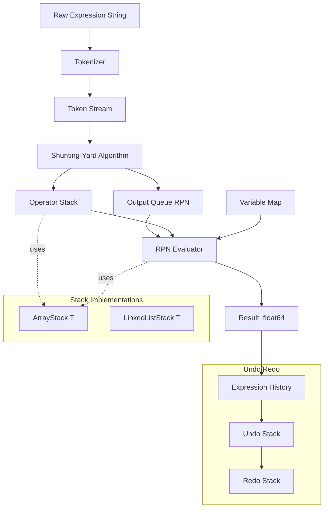

# Build Your Own Stack-Based Expression Evaluator

## 1. Motivation & Real-World Context

The stack is not just a data structure — it is the execution model of modern computing. Every language runtime you have ever used evaluates expressions with a stack.

**Bytecode interpreters.** Python's CPython compiles expressions to stack-based bytecode. `(a + b) * c` becomes `LOAD_NAME a`, `LOAD_NAME b`, `BINARY_OP +`, `LOAD_NAME c`, `BINARY_OP *`. You can inspect this with Python's `dis` module. The JVM and .NET CLR (Common Language Runtime) are also stack-based virtual machines — every `add`, `sub`, and `mul` IL (Intermediate Language) instruction pops operands from a virtual evaluation stack. V8 (Node.js/Chrome) compiles to native code, but its first-tier interpreter (Ignition) is still stack-based for simplicity and portability.

**Spreadsheet formula engines.** Microsoft Excel and Google Sheets parse formulas like `=SUM(A1:A10) * (B2 + 3)` using the shunting-yard algorithm to convert infix to RPN, then evaluate the RPN with a stack. Every formula cell in a spreadsheet with 50,000 formulas is evaluated this way millions of times per recalculation cycle.

**Undo/redo in editors.** VS Code, Vim, and virtually every text editor implement undo/redo as two stacks: an undo stack where each edit is pushed as an operation, and a redo stack where undone operations are pushed. Ctrl+Z pops from the undo stack and pushes to the redo stack; Ctrl+Y reverses this. This project builds exactly that.

---

## 2. Learning Objectives

By completing this project, you will deeply understand:

1. **Stack semantics and implementation trade-offs** — why a stack backed by a dynamic array has better cache locality than a linked-list stack, and when the linked list's O(1) prepend matters. See [Stack](/data-structures/04-stack) and [Linked List](/data-structures/03-linked-list).
2. **The shunting-yard algorithm** — how Dijkstra's 1961 algorithm converts infix notation to RPN using operator precedence and associativity rules, without building an AST. See [Stack](/data-structures/04-stack).
3. **RPN (postfix) evaluation** — why postfix notation eliminates the need for parentheses and precedence rules during evaluation, reducing it to a simple O(n) linear scan.
4. **Tokenization** — how to split a raw string like `"3.14 * (x + 2)"` into a stream of typed tokens (numbers, operators, identifiers, parentheses) without regular expressions.
5. **Dynamic array growth mechanics** — how the amortized O(1) push works, what the doubling strategy costs in terms of copies, and when to prefer a linked list. See [Dynamic Array](/data-structures/02-dynamic-array).
6. **Recursion and memoization** — how a recursive-descent parser naturally models the grammar of expressions, and how memoization can cache sub-expression results. See [Recursion and Memoization](/fundamentals/02-recursion-and-memoization).
7. **The command pattern** — how undo/redo is formalized as a stack of reversible operations, a pattern used throughout production codebases (database transaction logs, CRDT operations, event sourcing).

---

## 3. Project Scope

**In Scope:**
- `Stack&lt;T&gt;` backed by a dynamic array (with capacity doubling)
- `Stack&lt;T&gt;` backed by a singly-linked list
- Benchmark comparing both stack implementations
- Tokenizer: splits expression strings into typed tokens
- RPN evaluator: evaluates postfix notation expressions
- Shunting-yard algorithm: converts infix to postfix
- Full infix evaluator: tokenize → shunting-yard → evaluate
- Variable support: `Map&lt;string, float64&gt;` for substituting named variables
- Undo/redo history using a pair of stacks
- Operator precedence and right-associativity for `^` (exponentiation)

**Out of Scope (for v1):**
- Recursive descent parser (stretch goal)
- Custom functions (e.g., `sin(x)`, `max(a, b)`)
- Floating-point error handling / IEEE 754 special cases
- Multi-character operators (`&lt;=`, `>=`, `==`)
- Full programming language (conditionals, loops)

---

## 4. Core DSA Concepts Used

| Concept | Role in this project | Handbook Link | Difficulty |
|---------|----------------------|---------------|------------|
| Stack | Core data structure for both the evaluator and the undo/redo system | [/data-structures/04-stack](/data-structures/04-stack) | Beginner |
| Dynamic Array | Backing storage for the array-based stack; teaches amortized O(1) push | [/data-structures/02-dynamic-array](/data-structures/02-dynamic-array) | Beginner |
| Linked List | Alternative backing storage for the linked-list stack; teaches O(1) head insert vs. cache miss trade-off | [/data-structures/03-linked-list](/data-structures/03-linked-list) | Beginner |
| Recursion | Used in stretch-goal recursive-descent parser; also models shunting-yard's implicit call stack | [/fundamentals/02-recursion-and-memoization](/fundamentals/02-recursion-and-memoization) | Intermediate |
| Memoization | Caches results of repeated sub-expression evaluations for variable expressions | [/fundamentals/02-recursion-and-memoization](/fundamentals/02-recursion-and-memoization) | Intermediate |
| Queue | Used as the output queue in shunting-yard algorithm | [/data-structures/05-queue](/data-structures/05-queue) | Beginner |

---

## 5. High-Level Architecture

The evaluator is a pipeline: raw string → tokens → postfix queue → result. The undo/redo system sits alongside, recording expression history.

**Key interfaces/abstractions:**

- `Stack[T]` interface with `Push(T)`, `Pop() T`, `Peek() T`, `IsEmpty() bool`, `Size() int`. Both `ArrayStack[T]` and `LinkedListStack[T]` implement this interface.
- `Token` — a tagged union / discriminated union: `{Type: Number|Operator|LeftParen|RightParen|Identifier, Value: string}`.
- `Tokenizer` — `func Tokenize(expr string) ([]Token, error)`. Must handle multi-character numbers (`3.14`) and multi-character identifiers (`myVar`).
- `Evaluator` — `func Evaluate(tokens []Token, vars map[string]float64) (float64, error)`. Orchestrates shunting-yard then RPN evaluation.
- `History` — `type History struct { undoStack Stack[string]; redoStack Stack[string] }` with `Push(expr string)`, `Undo() string`, `Redo() string`.

---

## 6. Implementation Milestones (with Hints)

### Milestone 1: Implement Stack\<T\> with Both Backings

**Goal:** Implement `ArrayStack[T]` using a dynamic array (slice) with capacity doubling, and `LinkedListStack[T]` using a singly-linked list with a `head` pointer. Both must implement the `Stack[T]` interface. Then benchmark them against each other.

**Key Challenges:**
- `ArrayStack` Pop must not just decrement `size` — it must also nil out the vacated slot to prevent memory leaks (especially for reference types in C#, or pointers in Go).
- `LinkedListStack` Push is O(1) via prepend to the head. Pop removes the head node. No iteration needed.
- Capacity doubling: when `len == cap`, create a new backing array of size `2 * cap`, copy elements, replace the old array. Starting capacity of 4 is fine.

**Hints & Guidance:**
- In Go: `type ArrayStack[T any] struct { data []T; size int }`. Push: `s.data = append(s.data, val)` handles doubling automatically. But implement it manually to understand the mechanics: `if s.size == len(s.data) { newData := make([]T, s.size*2); copy(newData, s.data); s.data = newData }`.
- In C#: `public class Array`Stack&lt;T&gt;` { private T[] _data; private int _size; }`. Use `Array.Copy` for the resize. Set `_data[_size] = default(T)` after Pop to release GC references.
- For the linked list: `type Node[T any] struct { val T; next *Node[T] }`. The stack's `head` is the top. Push: `head = &Node{val, head}`. Pop: `val := head.val; head = head.next; return val`.
- Benchmark: push then pop 1,000,000 elements on each implementation. The array stack should be 2–5x faster due to cache locality. Verify this with your harness.

**Success Criteria:**
- Both implementations pass a shared test suite: push 5 elements, peek returns the last pushed, pop returns elements in LIFO order, pop on empty panics/throws.
- Memory leak test: push 10,000 pointers, pop all, verify no pointers remain accessible via a nil-check scan of the internal array (for ArrayStack).
- Benchmark shows array stack is faster per operation. Document the reason in a comment.

---

### Milestone 2: Implement the Tokenizer

**Goal:** Implement `Tokenize(expr string) ([]Token, error)` that converts a raw expression string into a `[]Token`. Must handle: multi-digit numbers, decimal numbers, named variables (`x`, `myVar`), operators (`+`, `-`, `*`, `/`, `^`), and parentheses.

**Key Challenges:**
- Unary minus: `-3` vs `3 - 2`. Detecting unary minus requires context: if the previous token was an operator or left paren (or there was no previous token), the `-` is unary, not binary.
- Whitespace: skip spaces, tabs. Do not emit a token for whitespace.
- Multi-digit numbers: accumulate digits (and a decimal point) until you see a non-digit. `3.14` is one number token, not three.
- Error reporting: `"3 + * 2"` should return an error indicating the unexpected `*` — but do this in the evaluator, not the tokenizer. The tokenizer should be permissive.

**Hints & Guidance:**
- Iterate character by character with an index `i`. Use a `switch` on `rune(expr[i])`.
- For numbers: when you see a digit or `.`, enter a number-accumulation loop: `for i &lt; len(expr) && (isDigit(expr[i]) || expr[i] == '.') { ... i++ }`. Use the accumulated string as the token value.
- For identifiers: same pattern but `isLetter(expr[i]) || isDigit(expr[i])`.
- In Go: avoid `strings.Split` — it does not handle multi-character tokens correctly. Scan with `[]rune(expr)` to handle Unicode identifiers.
- In C#: use `ReadOnlySpan&lt;char&gt;` and `int i` for zero-allocation tokenizing. `char.IsDigit(span[i])`, `char.IsLetter(span[i])`.
- Test input: `"3.14 * (x + 2) - -1"` → 9 tokens: Number(3.14), Op(*), LParen, Ident(x), Op(+), Number(2), RParen, Op(-), Number(-1) [with unary-minus handling] or Number(1) with Unary(-) token depending on your design.

**Success Criteria:**
- `Tokenize("3 + 4 * 2 / ( 1 - 5 ) ^ 2 ^ 3")` returns 15 tokens with correct types and values.
- `Tokenize("myVar * 3.14")` returns 3 tokens: Identifier, Operator, Number.
- Empty string returns empty token slice with no error.
- String with invalid character returns an error.

---

### Milestone 3: Implement the RPN Evaluator

**Goal:** Implement `EvaluateRPN(tokens []Token, vars map[string]float64) (float64, error)` that evaluates a postfix (RPN) expression. At this stage, you will construct RPN token slices manually to test the evaluator before the shunting-yard step exists.

**Key Challenges:**
- When you encounter an operator, you pop two operands. The order matters: `pop()` gives the right operand, the next `pop()` gives the left. `a - b` in RPN is `[a, b, -]`: pop `b`, pop `a`, compute `a - b`.
- Division by zero: return an error, do not panic.
- Undefined variable: if `vars["x"]` is missing, return an error.
- Stack underflow: if you try to pop when the stack is empty (malformed expression), return an error.

**Hints & Guidance:**
- Use your `ArrayStack[float64]` from Milestone 1.
- Algorithm: for each token: if Number → parse float and push; if Identifier → look up in `vars` and push; if Operator → pop right, pop left, compute, push result.
- After processing all tokens, the stack must have exactly one element (the result). If not, the expression is malformed.
- Test with manually-constructed RPN: `[3, 4, +]` → 7; `[5, 1, 2, +, 4, *, +, 3, -]` → 14 (classic example from Wikipedia).

**Success Criteria:**
- `EvaluateRPN(tokens for "3 4 +")` returns 7.0.
- `EvaluateRPN(tokens for "5 1 2 + 4 * + 3 -")` returns 14.0.
- Division by zero returns an error.
- Missing variable returns an error with the variable name in the message.
- Malformed expression (e.g., `[3, +]`) returns an error about insufficient operands.

---

### Milestone 4: Implement the Shunting-Yard Algorithm

**Goal:** Implement `InfixToRPN(tokens []Token) ([]Token, error)` using Dijkstra's shunting-yard algorithm. Takes infix-notation tokens (from Milestone 2), outputs RPN-notation tokens (for Milestone 3).

**Key Challenges:**
- Operator precedence: `*` and `/` have higher precedence than `+` and `-`. `^` has higher precedence than `*`.
- Associativity: `+`, `-`, `*`, `/` are left-associative: `1 - 2 - 3` = `(1 - 2) - 3`. `^` is right-associative: `2 ^ 3 ^ 2` = `2 ^ (3 ^ 2) = 512`, not `(2 ^ 3) ^ 2 = 64`.
- Mismatched parentheses: if you reach the end with a left paren still on the operator stack, or encounter a right paren with no matching left paren, return an error.

**Hints & Guidance:**
- Precedence table: `+ → 1, - → 1, * → 2, / → 2, ^ → 3`.
- Algorithm: for each token:
  - If number or identifier → enqueue to output.
  - If operator `o1` → while the top of the operator stack is an operator `o2` with higher precedence than `o1`, OR equal precedence and `o1` is left-associative (and `o2` is not a left paren): pop `o2` to output. Then push `o1`.
  - If `(` → push to operator stack.
  - If `)` → pop operators to output until you find `(`. Pop and discard the `(`. If stack is empty before finding `(`, mismatched parentheses error.
- After all tokens: pop remaining operators from stack to output. If any is a `(`, mismatched parentheses.
- Classic test: `"3 + 4 * 2 / ( 1 - 5 ) ^ 2 ^ 3"` → RPN `"3 4 2 * 1 5 - 2 3 ^ ^ / +"`. Result: 3.0001220703125.

**Success Criteria:**
- `InfixToRPN` for `"2 + 3 * 4"` produces `[2, 3, 4, *, +]`.
- `InfixToRPN` for `"(2 + 3) * 4"` produces `[2, 3, +, 4, *]`.
- `InfixToRPN` for `"2 ^ 3 ^ 2"` produces `[2, 3, 2, ^, ^]` (right-associative).
- Mismatched parentheses return errors in both directions.

---

### Milestone 5: Assemble the Full Infix Evaluator with Variables

**Goal:** Wire Milestone 2 + Milestone 4 + Milestone 3 into a single `Evaluate(expr string, vars map[string]float64) (float64, error)` function. Add variable support throughout.

**Key Challenges:**
- Variable names in shunting-yard: treat identifiers the same as numbers (push directly to output queue).
- Error propagation: errors from tokenizer, shunting-yard, and evaluator must propagate cleanly with context.
- Test that the full pipeline works end-to-end with compound expressions.

**Hints & Guidance:**
- `Evaluate` is just: `tokens, err := Tokenize(expr)` → `rpn, err := InfixToRPN(tokens)` → `result, err := EvaluateRPN(rpn, vars)` → `return result`.
- In Go, use `fmt.Errorf("evaluator: %w", err)` to wrap errors with context.
- In C#, use `throw new EvaluatorException("evaluator", inner: ex)` with a custom exception class.
- Test: `Evaluate("2 * x + 1", map{"x": 5})` → 11.0. `Evaluate("(a + b) ^ 2", map{"a": 3, "b": 4})` → 49.0.

**Success Criteria:**
- `Evaluate("3 + 4 * 2 / ( 1 - 5 ) ^ 2 ^ 3", nil)` returns 3.0001220703125.
- `Evaluate("2 * x + 1", {"x": 5})` returns 11.0.
- `Evaluate("1 / 0", nil)` returns a division-by-zero error.
- `Evaluate("x + 1", nil)` returns an undefined variable error naming `x`.
- `Evaluate("((2 + 3)", nil)` returns a mismatched parentheses error.

---

### Milestone 6: Add Undo/Redo History

**Goal:** Implement a `Calculator` struct with `Evaluate(expr string)`, `Undo() string`, and `Redo() string`. Each successful evaluation is pushed onto the undo stack. Undo pops from the undo stack and pushes to the redo stack. Redo does the reverse.

**Key Challenges:**
- What does "undo" mean for a stateless expression evaluator? Here it means: restore the *previous expression* as the active one, not the previous variable state. Model the history as a stack of expression strings.
- Redo stack must be cleared whenever a new expression is evaluated (same as all editors — branching history is not supported in v1).
- Undo when history is empty should return a meaningful error or empty string.

**Hints & Guidance:**
- `type Calculator struct { undoStack Stack[string]; redoStack Stack[string]; current string; vars map[string]float64 }`.
- `Evaluate(expr)`: on success, push `current` to undo stack, clear redo stack, set `current = expr`.
- `Undo()`: push `current` to redo stack, pop from undo stack, set `current = popped`. Return the popped expression.
- `Redo()`: push `current` to undo stack, pop from redo stack, set `current = popped`. Return the popped expression.
- Use your `ArrayStack[string]` from Milestone 1.

**Success Criteria:**
- Three evaluations followed by two undos followed by one redo produce the expected history sequence.
- Undo on empty history returns empty string or error without panicking.
- Redo stack is cleared after a new evaluation is called post-undo.

---

## 7. Stretch Goals (for advanced learners)

1. **Recursive-descent parser.** Replace the shunting-yard + RPN pipeline with a recursive-descent parser that builds an AST. Each grammar rule (`expr`, `term`, `factor`) becomes a function. Evaluate the AST with a tree walk. This approach is closer to how production compilers (GCC, Clang, Roslyn) parse expressions. See [Recursion and Memoization](/fundamentals/02-recursion-and-memoization).
2. **Memoized expression caching.** For expressions containing only constants, cache the result by expression string. A hash map from expression string to float64. For expressions with variables, cache based on the expression + variable state hash. Measure speedup when evaluating the same expression 10,000 times in a loop.
3. **User-defined functions.** Extend the tokenizer and evaluator to support `sin(x)`, `max(a, b)`, `pow(x, n)`. Store functions in a `map[string]func(...float64) float64`. The shunting-yard algorithm handles functions by pushing them to the operator stack and treating commas as argument separators.
4. **Error recovery.** Instead of returning on the first error, collect all errors in the expression and report them together. Useful for formula editors that highlight all invalid sub-expressions at once (like Excel's formula bar).
5. **REPL (read-eval-print loop).** Build an interactive command-line calculator with line history, variable assignment syntax (`x = 3 * 4`), and the `:undo` / `:redo` commands. Use `readline` (Go) or `System.Console.ReadLine` with terminal history (C#).

---

## 8. Testing & Validation Strategy

**Tokenizer tests:**
- `""` → empty token slice, no error.
- `"42"` → one Number token with value "42".
- `"3.14159"` → one Number token.
- `"myVar"` → one Identifier token.
- `"+"` → one Operator token.
- `"3 + 4 * 2"` → 5 tokens: Number, Op, Number, Op, Number.
- `"#"` → error for unknown character.

**Shunting-yard tests (compare output token sequences directly):**
- `"1 + 2"` → `[1, 2, +]`
- `"1 + 2 * 3"` → `[1, 2, 3, *, +]`
- `"(1 + 2) * 3"` → `[1, 2, +, 3, *]`
- `"2 ^ 3 ^ 2"` → `[2, 3, 2, ^, ^]` (right-assoc `^`)
- `"((3 + 2)"` → error: mismatched parenthesis
- `"3 + 2)"` → error: mismatched parenthesis

**Evaluator end-to-end tests:**
- `"2 + 2"` → 4.0
- `"10 / 2 - 3"` → 2.0
- `"2 ^ 10"` → 1024.0
- `"(2 + 3) * (4 - 1)"` → 15.0
- `"2 ^ 3 ^ 2"` → 512.0 (right-associative, not 64.0)
- `"1 / 0"` → error
- `"x * 2"` with `{"x": 7}` → 14.0
- `"x * 2"` with `{}` → error mentioning "x"

**Undo/redo sequence test:**
1. Evaluate `"1 + 1"` → current = `"1 + 1"`, undo = [], redo = []
2. Evaluate `"2 + 2"` → current = `"2 + 2"`, undo = [`"1 + 1"`], redo = []
3. Evaluate `"3 + 3"` → current = `"3 + 3"`, undo = [`"1 + 1"`, `"2 + 2"`], redo = []
4. Undo → current = `"2 + 2"`, undo = [`"1 + 1"`], redo = [`"3 + 3"`]
5. Undo → current = `"1 + 1"`, undo = [], redo = [`"3 + 3"`, `"2 + 2"`]
6. Evaluate `"4 + 4"` → current = `"4 + 4"`, undo = [`"1 + 1"`], redo = [] (redo cleared)

---

## 9. C# and Go Implementation Notes

### C#

- **`System.Collections.Generic.Stack&lt;T&gt;` exists** in the BCL — do not use it; implement `ArrayStack&lt;T&gt;` and `LinkedListStack&lt;T&gt;` from scratch. After building your own, compare to the BCL's `Stack&lt;T&gt;` in benchmarks to validate performance.
- **`ReadOnlySpan&lt;char&gt;` for tokenizing.** Instead of `string.Split` or `Substring`, use `ReadOnlySpan&lt;char&gt;` and an integer index to scan the expression without any heap allocations. `span[i..]` creates a sub-span at zero cost. Use `span.IndexOfAny('+', '-', '*', '/')` to find the next operator.
- **No `dynamic` for token values.** Use a discriminated union pattern: `record Token(TokenType Type, string Value)` where `double.Parse(token.Value)` is called only in the evaluator, not the tokenizer.
- **Division by zero:** In C# with `double`, `1.0 / 0.0` returns `double.PositiveInfinity`, not an exception. You must check explicitly: `if (right == 0.0) throw new DivisionByZeroException(...)`.
- **Operator precedence table as `Dictionary&lt;string, int&gt;`.** `var precedence = new `Dictionary&lt;string, int&gt;` { ["+"] = 1, ["-"] = 1, ["*"] = 2, ["/"] = 2, ["^"] = 3 }`. Associativity as `HashSet&lt;string&gt; rightAssociative = new() { "^" }`.
- **Undo/redo:** `private readonly Stack&lt;string&gt; _undoStack = new ArrayStack&lt;string&gt;()`. Clear redo stack on new evaluation with a `while (!_redoStack.IsEmpty) _redoStack.Pop()` loop.

### Go

- **No built-in stack.** The idiomatic Go stack is `[]T` with `append` for push and `s = s[:len(s)-1]` for pop. However, this hides the data structure. For this project, implement a proper `struct` with an internal slice.
- **Rune parsing for multi-digit numbers.** Convert the expression string to `[]rune` before tokenizing, or use `utf8.DecodeRuneInString` to iterate correctly over Unicode. `expr[i]` gives a byte, not a character — this causes bugs with non-ASCII identifiers.
- **Function type for operators.** `type BinaryOp func(a, b float64) float64`. Store operators in a `map[string]BinaryOp`: `ops := map[string]BinaryOp{ "+": func(a, b float64) float64 { return a + b }, ... }`. This avoids a long switch statement in the evaluator.
- **Division by zero in Go with `float64`:** same as C# — `1.0/0.0` returns `+Inf`, not a panic. Check `right == 0` before dividing.
- **Stack nil-out on pop (memory leak prevention).** After popping from an `ArrayStack[*MyStruct]`, set `s.data[s.size] = nil` before decrementing `s.size`. Otherwise the backing array holds a reference to the popped value, preventing garbage collection.
- **Error wrapping:** `fmt.Errorf("shunting-yard: mismatched parenthesis at position %d: %w", pos, ErrMismatchedParens)`. Use `errors.Is` in tests.

---

## 10. Potential Extensions & Related Projects

1. **Build Your Own Recursive Descent Parser / Mini-Language.** Extend the expression evaluator with `if`/`else`, variable assignment, and simple loops. A grammar-based recursive descent parser scales naturally to these constructs in a way shunting-yard cannot. This is the foundation of interpreter and compiler construction.
2. **Build Your Own Browser DevTools Expression Evaluator.** Add a WASM-compiled Go or a Blazor C# version of your evaluator that runs in the browser, with a web UI showing the token stream, RPN queue, and evaluation stack side by side — a visual debugger for your own algorithm.
3. **Build Your Own Spreadsheet Formula Engine.** Extend the evaluator with cell reference tokens (`A1`, `B2:C4`), range aggregation functions (`SUM`, `AVERAGE`), and circular dependency detection (cells that reference themselves transitively). Requires building a dependency graph alongside the expression evaluator.
4. **Build Your Own Symbolic Differentiator.** Rather than evaluating the expression to a number, transform the AST symbolically: `d/dx(x^2 + 3*x)` → `2*x + 3`. Requires building an AST (see recursive descent stretch goal). A classic AI/algorithms project from the Lisp era.
