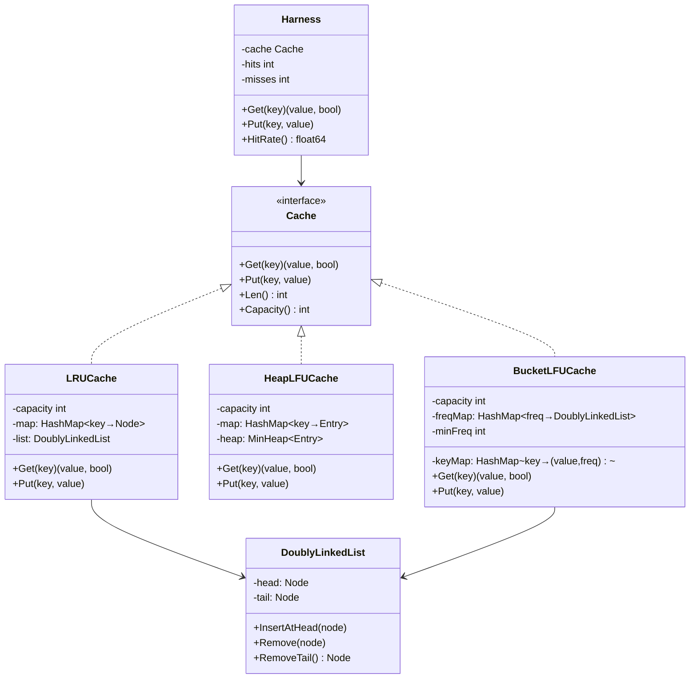

# Build Your Own Cache with Eviction Policies

## 1. Motivation & Real-World Context

Every production system that serves data faster than it can compute or fetch it relies on a cache — and every cache eventually fills up. Eviction policies determine what gets thrown out when capacity is exhausted. Getting this wrong means either thrashing (evicting hot data) or stale data accumulating while useful entries are dropped.

**Redis** implements both LRU and LFU eviction natively (selectable via `maxmemory-policy`). When Redis memory hits `maxmemory`, it samples keys and evicts based on the configured policy. Redis's LFU implementation uses a Morris counter (approximate frequency) with decay, because exact LFU over millions of keys would require too much bookkeeping. Understanding exact LFU first makes the approximation meaningful.

**Cloudflare and Fastly CDN edge caches** use LRU variants to decide which cached HTTP responses to retain at each PoP (point of presence). A cache hit at the edge saves a round trip to the origin, so eviction decisions directly affect tail latency for millions of users. Cloudflare's edge caches use tiered eviction: a small hot-object store with LRU, backed by a larger LFU-based store.

**Web browsers** implement LRU caches for resource caching (images, JS, fonts). Chrome's disk cache uses an LRU-approximating eviction policy. Every time you reload a page without network round trips, LRU is why it's fast. The same structure underlies CPU L1/L2/L3 cache replacement policies at the hardware level.

This project transforms the classic "implement LRU Cache" interview question into a complete, benchmarkable, policy-swappable system you can reason about at production scale.

## 2. Learning Objectives

By completing this project, you will deeply understand:

1. **Why O(1) eviction requires two data structures working together** — a hash map alone gives O(1) lookup but O(n) eviction; a doubly linked list alone gives O(1) eviction but O(n) lookup. See [`/data-structures/09-hash-map`](/data-structures/09-hash-map) and [`/data-structures/03-linked-list`](/data-structures/03-linked-list).

2. **How LRU Cache achieves O(1) get and put** — moving accessed nodes to the head of a doubly linked list in O(1) using direct pointer manipulation, with the hash map storing node pointers rather than values. See [`/data-structures/10-lru-cache`](/data-structures/10-lru-cache).

3. **How LFU Cache achieves O(1) get and put** — the freq→DoublyLinkedList bucketing structure, why a `minFreq` pointer is necessary, and why it must be reset to 1 on every insert. See [`/data-structures/11-lfu-cache`](/data-structures/11-lfu-cache).

4. **The heap-based LFU alternative and its trade-offs** — O(log n) per operation versus O(1), simpler implementation but worse under high-throughput workloads. See [`/data-structures/15-heap`](/data-structures/15-heap).

5. **Zipfian access patterns (the 80/20 rule)** — why real workloads are skewed, how to generate synthetic Zipfian distributions for stress testing, and why LFU outperforms LRU on skewed workloads by retaining the small set of ultra-hot keys.

6. **The Strategy Pattern for swappable eviction policies** — structuring code so LRU, LFU, FIFO, and future policies implement a common interface and can be selected at construction time.

7. **Cache hit rate measurement and workload sensitivity** — computing `hits / total_requests` as a percentage, and understanding why the same cache capacity with different policies can produce wildly different hit rates on the same workload.

## 3. Project Scope

**In Scope:**
- Doubly linked list implemented from scratch with O(1) insert-at-head, remove-arbitrary-node, and remove-from-tail
- LRU Cache using hash map + doubly linked list, O(1) get and put
- Heap-based LFU Cache using a min-heap keyed on (frequency, last_access_time), O(log n) get and put
- O(1) LFU Cache using the freq-bucket doubly linked list approach with minFreq pointer
- Strategy/policy interface so eviction policy is swappable at construction
- Hit rate instrumentation (hit count, miss count, hit rate percentage)
- Zipfian workload generator for stress testing
- Benchmarks comparing LRU vs LFU on uniform and Zipfian access patterns

**Out of Scope (for v1):**
- Persistence (writing cache contents to disk on shutdown)
- Distributed caching or sharding across nodes
- TTL-based expiry (time-to-live per key)
- Approximate LFU with Morris counters (Redis-style)
- CLOCK or CLOCK-Pro eviction algorithms
- Thread safety (mentioned as a stretch goal only)
- Generics beyond a single type parameter (keep it simple)

## 4. Core DSA Concepts Used

| Concept | Role in this project | Handbook Link | Difficulty |
|---------|----------------------|---------------|------------|
| Hash Map | O(1) key→node lookup for both LRU and LFU | [/data-structures/09-hash-map](/data-structures/09-hash-map) | Beginner |
| Doubly Linked List | O(1) move-to-head and remove-tail for LRU; frequency buckets for LFU | [/data-structures/03-linked-list](/data-structures/03-linked-list) | Intermediate |
| LRU Cache | Main cache implementation v1 | [/data-structures/10-lru-cache](/data-structures/10-lru-cache) | Intermediate |
| LFU Cache | Main cache implementation v2 | [/data-structures/11-lfu-cache](/data-structures/11-lfu-cache) | Hard |
| Heap / Priority Queue | Heap-based LFU alternative; O(log n) eviction | [/data-structures/15-heap](/data-structures/15-heap) | Intermediate |

## 5. High-Level Architecture

The cache exposes a uniform `Cache` interface. Concrete implementations (`LRUCache`, `HeapLFUCache`, `BucketLFUCache`) plug in behind it. A `Harness` wraps any cache implementation and records hit/miss statistics.

**Key Interfaces / Abstractions:**

- `Cache` interface: `Get(key K) (V, bool)` and `Put(key K, val V)`. Both implementations satisfy this interface, enabling the harness to benchmark any policy without changing measurement code.
- `Node` struct: holds `key`, `value`, `prev *Node`, `next *Node`. For LFU bucket nodes, also holds `freq int`.
- `DoublyLinkedList` struct: sentinel head and tail nodes (dummy nodes) eliminate all nil checks in insert/remove. This is the standard trick — always use sentinel nodes.
- `MinHeap` (for heap-LFU): entries keyed by `(freq, insertionIndex)` to break frequency ties by recency.

## 6. Implementation Milestones (with Hints)

### Milestone 1: Doubly Linked List with O(1) Operations

**Goal:** Implement a doubly linked list with sentinel head/tail nodes, supporting InsertAtHead, Remove(node), and RemoveTail in O(1).

**Key Challenges:** Managing prev/next pointers correctly without nil checks; understanding why sentinel nodes make the code dramatically simpler.

**Hints & Guidance:**
- Create `head` and `tail` sentinel nodes in the constructor. Connect them: `head.next = tail`, `tail.prev = head`. These are never removed.
- `InsertAtHead(node)`: wire node between `head` and `head.next`. Four pointer assignments.
- `Remove(node)`: `node.prev.next = node.next`, `node.next.prev = node.prev`. No nil checks needed because sentinels absorb the edge cases.
- `RemoveTail()`: call `Remove(tail.prev)` and return it. If `tail.prev == head`, the list is empty.
- Write a `ToSlice()` debug method that walks from `head.next` to `tail` collecting values. Use it in unit tests.
- Test independently before building the cache on top. Every pointer bug here cascades into hard-to-debug cache corruption.

**Success Criteria:**
- Insert 5 nodes, verify order with ToSlice
- Remove the middle node, verify order
- RemoveTail on a 1-element list returns that element and leaves the list empty (head.next == tail)
- InsertAtHead on an empty list sets head.next == tail.prev == the new node

### Milestone 2: LRU Cache on Top of the Linked List

**Goal:** Implement LRU Cache with O(1) Get and Put using the doubly linked list from Milestone 1 and a hash map.

**Key Challenges:** On Get, move the accessed node to the head (not just return the value). On Put when key already exists, update value and move to head. On Put when full, evict the tail before inserting.

**Hints & Guidance:**
- The hash map stores `key → *Node`. Nodes hold both the key and value. You need the key in the node so that when you evict the tail, you can delete it from the map.
- Get flow: lookup in map → if found, call `list.Remove(node)`, then `list.InsertAtHead(node)`, return value. If not found, return miss.
- Put flow (new key): if at capacity, call `list.RemoveTail()`, delete that node's key from the map, then insert new node at head and add to map. If not at capacity, just insert at head and add to map.
- Put flow (existing key): update the node's value in place, call Remove + InsertAtHead.
- The order invariant: most recently used is always at `head.next`. Least recently used is always at `tail.prev`.

**Success Criteria:**
- `Get` on a missing key returns false
- After `Put(A), Put(B), Put(C)` with capacity 3, `Get(A)` makes A the MRU; next Put evicts B (now LRU)
- A sequence of puts that exceeds capacity evicts the correct element each time
- All gets and puts complete in O(1) time (verify with large-scale timing, not just correctness)

### Milestone 3: Stress Test with Zipfian Access Pattern

**Goal:** Generate a synthetic Zipfian workload and measure LRU hit rate under realistic skewed access.

**Key Challenges:** Implementing a Zipfian generator correctly; interpreting hit rate numbers.

**Hints & Guidance:**
- Zipfian distribution: probability of accessing key `k` is proportional to `1/k^s` where `s ≈ 1.0`. Key 1 is accessed s times more than key 2, key 2 is s times more than key 3, etc.
- Simple approximation: generate cumulative probabilities, binary search on a random float. Or use rejection sampling.
- Create a workload of 1,000,000 accesses over a key space of 10,000 keys with a cache capacity of 1,000 (10%). On a Zipfian workload you should see ~40-60% hit rates. On a uniform workload you should see ~10% (capacity ratio).
- Use the Harness from the architecture section: wrap your LRU cache and count hits/misses automatically.
- Print a histogram of key access frequencies to confirm your generator is truly skewed.

**Success Criteria:**
- Zipfian generator produces clearly skewed histogram (top 10% of keys account for ~80% of accesses)
- LRU hit rate on Zipfian workload is measurably higher than on uniform workload with the same capacity
- Harness correctly counts hits and misses; `hits + misses == total_requests`

### Milestone 4: Heap-Based LFU Cache

**Goal:** Implement LFU Cache using a min-heap keyed on (frequency, insertion_counter), O(log n) per operation.

**Key Challenges:** Deciding what to do when frequencies tie (use insertion order as tiebreaker); handling the "lazy deletion" problem when heap entries become stale.

**Hints & Guidance:**
- Each cache entry has: key, value, frequency, insertionCounter (monotonically increasing).
- Min-heap orders by frequency first, then by insertionCounter (older entries evicted first on tie — LRU tiebreaking).
- On Get: increment frequency in the map, but the heap still holds the old frequency. You have two options: (a) mark old heap entry as stale and do lazy deletion, or (b) rebuild heap on every access (too slow). Go with lazy deletion: add a `valid bool` field, when popping check if the heap entry's frequency matches the map's current frequency; if not, skip it.
- On Put when full: pop from heap, skipping stale entries, until you find a valid entry to evict.
- This is your "working draft" LFU before tackling the O(1) version. It is significantly simpler.

**Success Criteria:**
- LFU correctly evicts the least-frequently-used key, with LRU tiebreaking on equal frequencies
- Get(A) three times, Get(B) once, Put(C) causing eviction: B is evicted (freq=1), A is retained (freq=3)
- Heap-based LFU produces correct evictions on a 1,000-operation randomized test

### Milestone 5: O(1) LFU with Frequency Buckets

**Goal:** Upgrade to the O(1) LFU implementation using `freqMap: HashMap&lt;freq, DoublyLinkedList&gt;` and a `minFreq` pointer.

**Key Challenges:** Correctly maintaining minFreq across gets and puts. This is the trickiest invariant in the entire project.

**Hints & Guidance:**
- Data structures: `keyMap: map[key→{value, freq}]`, `freqMap: map[freq→DoublyLinkedList]`, `minFreq int`.
- Get(key): look up in keyMap, get current freq, remove node from `freqMap[freq]`, increment freq, insert node at head of `freqMap[freq+1]`, update keyMap. If `freqMap[minFreq]` is now empty, increment `minFreq`.
- Put(key) — new key: if at capacity, evict tail of `freqMap[minFreq]`. Then insert new key at head of `freqMap[1]`, set `minFreq = 1`. Critical: always reset minFreq to 1 on new insert, because the new key has freq=1.
- Put(key) — existing key: same as Get (update freq), then update value in keyMap. Do NOT reset minFreq.
- Each node in the freq lists needs to store its key (not just its value) so eviction can clean up the keyMap.
- Use the same DoublyLinkedList from Milestone 1. Each frequency bucket is one list.

**Success Criteria:**
- All the same correctness tests as Milestone 4 pass
- Confirmed O(1) behavior: 1M operations complete in the same order of magnitude time as LRU (no log n overhead)
- minFreq invariant: after every operation, `freqMap[minFreq]` is always non-empty

### Milestone 6: Strategy Pattern + Hit Rate Comparison

**Goal:** Wire all implementations behind a common interface; run comparative benchmarks of LRU vs heap-LFU vs O(1)-LFU on Zipfian workloads.

**Key Challenges:** Designing the interface so the harness is policy-agnostic; producing fair benchmarks (same workload, same random seed, same capacity).

**Hints & Guidance:**
- Define `type Cache[K comparable, V any] interface { Get(K) (V, bool); Put(K, V) }` (or equivalent in C#).
- The Harness wraps any Cache, adding hit/miss counters. Tests and benchmarks always talk to the Harness.
- Fix the random seed for reproducibility: the same Zipfian sequence produces exactly the same hit rates across runs, making comparisons valid.
- Run at three capacity ratios: 1%, 5%, 10% of key space. Plot hit rate vs capacity for each policy.
- Expected finding: LFU outperforms LRU on skewed workloads because it retains the ultra-hot keys that LRU might evict after a scan of cold keys.

**Success Criteria:**
- All three implementations satisfy the same Cache interface
- Benchmark produces a table: Policy | Capacity | Hit Rate
- LFU hit rate is measurably higher than LRU on Zipfian workload at 5% and 10% capacity
- LRU and LFU show similar hit rates on uniform workload (confirming frequency tracking adds value only on skewed data)

## 7. Stretch Goals (for advanced learners)

1. **Thread-safe cache with RWMutex / ReaderWriterLockSlim:** Wrap the cache in a mutex. Allow concurrent reads with `RLock` (Go: `sync.RWMutex.RLock()`, C#: `ReaderWriterLockSlim.EnterReadLock()`). Write operations (Put, eviction) take a full write lock. Benchmark the lock contention under concurrent load.

2. **TTL-based expiry (time-to-live):** Add an optional TTL per key. On Get, check if the entry has expired before returning it. Use a background goroutine (Go) or `System.Threading.Timer` (C#) for periodic cleanup, or do lazy expiry on access. Combine with LRU/LFU eviction.

3. **Approximate LFU with Morris (logarithmic probabilistic) counters:** Instead of exact frequency counts, use an 8-bit counter that increments with probability `1/2^count`. This keeps counts in a single byte with a range up to ~255 but representing actual frequencies up to billions. This is what Redis actually uses. Implement and compare accuracy vs exact LFU.

4. **CLOCK eviction algorithm:** A practical O(1) LRU approximation used in OS page replacement. Maintain a circular buffer with a "clock hand" and a reference bit per entry. On eviction, advance the hand; clear the reference bit on first pass, evict on second pass. Compare hit rate to true LRU.

5. **Segmented LRU (SLRU):** Split the cache into a "probationary" segment and a "protected" segment. New entries go into probationary. On second access, they promote to protected. Eviction hits probationary first. This avoids the scan-pollution problem where a one-time sequential scan evicts all hot data. Used in Caffeine (Java's production cache library).

## 8. Testing & Validation Strategy

**Unit tests — correctness:**
- Test LRU eviction order with exactly capacity+1 insertions. Verify the oldest-unused key is evicted.
- Test LFU: insert A (access 3 times), B (access 1 time), C (access 2 times) with capacity 2. Adding D should evict B. Adding E should evict C.
- Test edge cases: capacity=1, all puts are same key, interleaved gets and puts.
- Test DoublyLinkedList in isolation: all four operations, empty list edge cases.

**Property-based tests:**
- Invariant: `cache.Len() &lt;= cache.Capacity()` always.
- Invariant: a key retrieved by Get was previously inserted by Put and not subsequently evicted.
- Invariant: LFU never evicts a key with frequency higher than the minimum frequency of any other key.

**Benchmarks:**
- Micro-benchmark: 1M Get+Put operations on a cache of size 1000 with 10,000 key space.
- Compare: LRU, HeapLFU, BucketLFU — all should produce the same eviction decisions; timing reveals the O(1) vs O(log n) difference.
- Workload benchmark: Zipfian (s=1.0) vs uniform. Fix seed. Report hit rate per policy per workload type.

**Regression tests:**
- Golden file: for a fixed random seed and fixed workload sequence, record the sequence of evicted keys as the ground truth. Re-run and compare output. This catches subtle pointer bugs that don't cause crashes but produce wrong eviction order.

## 9. C# and Go Implementation Notes

**C# notes:**

- `LinkedList&lt;T&gt;` exists in `System.Collections.Generic` and uses sentinel nodes internally, but build the doubly linked list from scratch using `class Node&lt;K, V&gt; { public K Key; public V Value; public Node&lt;K,V&gt; Prev, Next; }` to understand the mechanics.
- Use `Dictionary<K, Node&lt;K,V&gt;>` for the hash map. `TryGetValue` avoids double-lookup.
- For heap-based LFU, `PriorityQueue&lt;TElement, TPriority&gt;` (introduced in .NET 6) makes the heap straightforward. Priority is a `(int freq, int counter)` ValueTuple with tuple comparison giving lexicographic order.
- `ConcurrentDictionary&lt;K, V&gt;` and `ReaderWriterLockSlim` are the tools for the thread-safety stretch goal. `ReaderWriterLockSlim` outperforms `lock` under read-heavy workloads.
- No `IDisposable` is needed unless you cache large objects like `Stream` or `HttpClient` — in that case, implement IDisposable on your cache and call `Dispose()` on evicted values if they implement it.
- Use `record struct` for heap entries to get value equality for free.

**Go notes:**

- Go has `container/list` (a doubly linked list), but build yours from scratch with `type Node[K comparable, V any] struct { Key K; Val V; Prev, Next *Node[K,V] }`. This is the only way to understand the pointer arithmetic.
- Go generics (`[K comparable, V any]`) make the cache type-safe without `interface{}`. Use Go 1.21+ for the cleanest generic syntax.
- For the heap-based LFU, implement `container/heap`'s interface: `Len()`, `Less(i,j int) bool`, `Swap(i,j int)`, `Push(x any)`, `Pop() any`. This is verbose but idiomatic Go.
- `sync.RWMutex`: `RLock/RUnlock` for reads, `Lock/Unlock` for writes. Defer unlocks. Pattern: `mu.Lock(); defer mu.Unlock()`.
- `map[rune]*Node` is unnecessary here — keys are strings or ints. Use `map[K]*Node[K,V]` with the generic K.
- Benchmark with `testing.B`: `b.ResetTimer()` after setup, `b.N` iterations, `b.ReportAllocs()` to confirm O(1) allocation behavior.

## 10. Potential Extensions & Related Projects

- **Build Your Own Redis (subset):** After completing this project, you understand the core of Redis's memory management. Add a TCP server (net.Listen in Go, TcpListener in C#) that speaks a simplified RESP protocol, and you have the skeleton of Redis.
- **Build Your Own Database Buffer Pool:** Database engines (PostgreSQL, MySQL) use an in-memory buffer pool with LRU/Clock eviction to cache disk pages. Your LRU cache is structurally identical. Add a "pin count" (pages in use cannot be evicted) and you have the core of a buffer pool manager.
- **Build Your Own CDN Edge Cache:** Extend with TTL, cache-control headers, and an HTTP server layer. Pair with the Route Planner project (`08-route-planner.md`) to simulate edge node selection.
- **Relate to Trie Autocomplete (`07-autocomplete-engine.md`):** A Trie autocomplete engine benefits from a frequency-aware cache on the result layer: the top-K results for a given prefix can be cached in an LFU cache, since popular prefixes (e.g., "the", "go") are accessed orders of magnitude more than rare ones.
