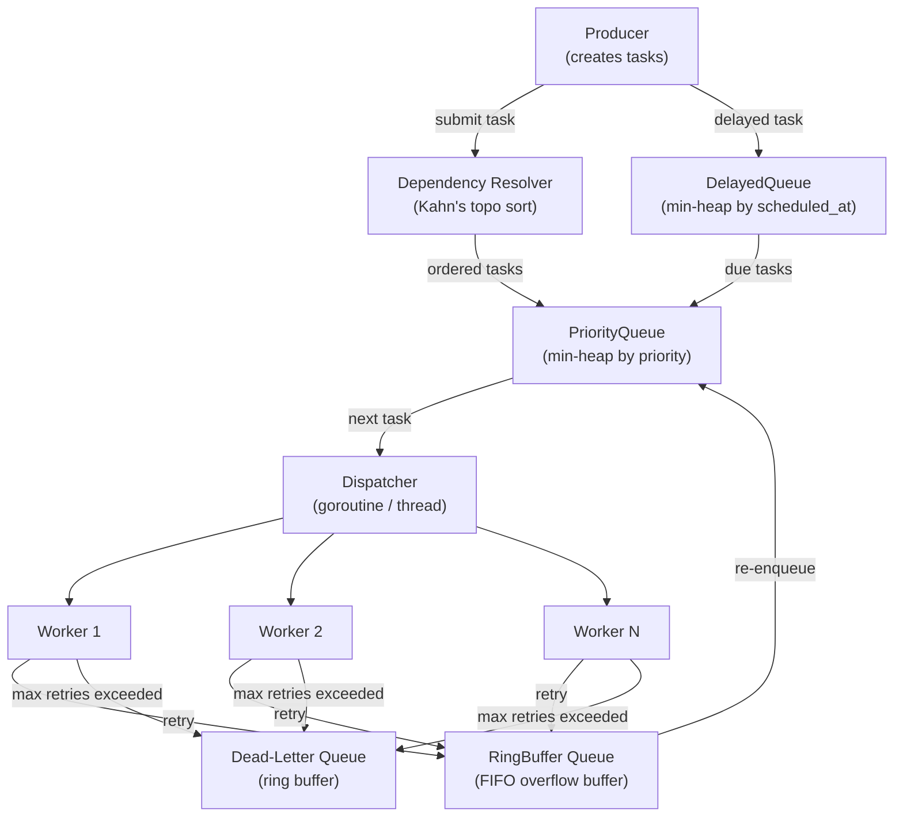

# Build Your Own Task Queue System

## 1. Motivation & Real-World Context

Task queues decouple producers (code that creates work) from consumers (code that executes work), enabling reliable async processing at scale. Nearly every backend system of consequence uses one.

**Celery, BullMQ, Sidekiq, and Go machinery** are the dominant task queue libraries across Python, Node.js, Ruby, and Go respectively. All of them implement the same core primitives: a FIFO queue backed by a ring buffer or linked list, a priority queue for critical tasks, a delay mechanism for scheduled work, and a dead-letter queue for failed tasks. Understanding the underlying structures makes debugging production incidents — task storms, priority inversions, delayed-task backlog — tractable rather than mysterious.

**AWS SQS** (Simple Queue Service) is a managed task queue handling trillions of messages per year. Its core guarantees — at-least-once delivery, configurable visibility timeouts, dead-letter queues — all have direct analogs in the data structures you implement here. When engineers debug SQS message duplication or out-of-order delivery, they are reasoning about queue semantics at exactly this level.

**GitHub Actions, Jenkins pipelines, and Kubernetes controllers** all rely on queue-based scheduling. The Kubernetes controller pattern uses a work queue (`workqueue.Interface` in `client-go`) with rate limiting and exponential backoff — built on the same ring buffer and heap primitives you will implement. Understanding the internal data structures makes you effective with these systems, not just a user of them.

## 2. Learning Objectives

By completing this project, you will deeply understand:

1. **Ring buffer mechanics and why they are the default queue implementation** — fixed-capacity, zero-allocation after init, O(1) all operations, cache-friendly contiguous memory. See [`/data-structures/07-ring-buffer`](/data-structures/07-ring-buffer).

2. **Deque (double-ended queue) and its applications** — O(1) push/pop from both ends; used for sliding window maximum, monotone queue problems, and work-stealing schedulers. See [`/data-structures/06-deque`](/data-structures/06-deque).

3. **Min-heap as a priority queue** — how `heapify`, `push`, and `pop` maintain the heap invariant, and why O(log n) per operation is usually fast enough for task scheduling. See [`/data-structures/15-heap`](/data-structures/15-heap) and [`/data-structures/16-priority-queue`](/data-structures/16-priority-queue).

4. **Topological sort for dependency resolution** — directed acyclic graphs, Kahn's BFS algorithm, in-degree computation, and what a cycle in the dependency graph means operationally (deadlock). See [`/algorithms/26-topological-sort`](/algorithms/26-topological-sort).

5. **Queue vs Deque vs Ring Buffer trade-offs** — when to use each, what happens when a ring buffer is full (drop, block, or grow), and how linked-list queues avoid the fixed-capacity limitation at the cost of allocation pressure. See [`/data-structures/05-queue`](/data-structures/05-queue).

6. **Delayed task scheduling with a min-heap** — why a heap keyed on scheduled_at timestamp lets you efficiently find the next due task without scanning the full task list.

7. **Dead-letter queues and failure handling** — why failed tasks should not simply be dropped, how to track retry counts, and when to move a task to a dead-letter queue for manual inspection.

## 3. Project Scope

**In Scope:**
- Ring buffer queue with configurable capacity, O(1) enqueue/dequeue, overflow detection
- Doubly-ended queue (deque) implemented as a circular array
- Task struct with ID, payload, priority, dependencies (list of task IDs), scheduled_at timestamp, retry_count
- Min-heap priority queue ordered by task priority (lower number = higher urgency)
- Topological sort (Kahn's BFS algorithm) for dependency ordering with cycle detection
- Delayed task scheduling via min-heap keyed on scheduled_at
- Dead-letter queue for tasks that exceed max retry count
- Dispatcher that reads from the priority queue and routes tasks to a pool of worker goroutines/threads

**Out of Scope (for v1):**
- Persistence (writing queue state to disk or Redis)
- Distributed coordination across multiple machines
- Exactly-once delivery semantics
- Rate limiting or throttling per worker
- Metrics/observability beyond basic counters
- Real HTTP/gRPC API surface

## 4. Core DSA Concepts Used

| Concept | Role in this project | Handbook Link | Difficulty |
|---------|----------------------|---------------|------------|
| Queue (FIFO) | Basic task ordering; conceptual foundation before ring buffer | [/data-structures/05-queue](/data-structures/05-queue) | Beginner |
| Deque | Double-ended task buffer; work-stealing preview; sliding window variant | [/data-structures/06-deque](/data-structures/06-deque) | Beginner |
| Ring Buffer | Memory-efficient fixed-capacity queue; real I/O buffer implementation | [/data-structures/07-ring-buffer](/data-structures/07-ring-buffer) | Intermediate |
| Heap / Priority Queue | Priority-ordered task dispatch; delayed task scheduling via timestamp heap | [/data-structures/15-heap](/data-structures/15-heap) | Intermediate |
| Priority Queue | Min-heap as the dispatcher's primary data structure | [/data-structures/16-priority-queue](/data-structures/16-priority-queue) | Intermediate |
| Graph + Topological Sort | Dependency resolution; deadlock (cycle) detection | [/algorithms/26-topological-sort](/algorithms/26-topological-sort) | Intermediate |

## 5. High-Level Architecture

The system has three layers: storage (the queue implementations), scheduling (the dispatcher), and execution (workers). Tasks flow from producer → dispatcher → worker. Failed tasks flow to the dead-letter queue.

**Key interfaces / abstractions:**

- `Queue[T]` interface: `Enqueue(T) error`, `Dequeue() (T, bool)`, `Len() int`, `IsFull() bool`. Both ring buffer and linked-list queue implement this.
- `Task` struct: `ID string`, `Payload []byte`, `Priority int`, `DependsOn []string`, `ScheduledAt time.Time`, `RetryCount int`, `MaxRetries int`.
- `PriorityQueue` wraps the min-heap and implements the Queue interface with priority ordering.
- `Dispatcher` goroutine/thread: runs a loop, checks the delayed heap for due tasks, pops from the priority queue, fans tasks out to workers.
- `Worker` goroutine/thread: executes task, signals success or failure back to dispatcher.

## 6. Implementation Milestones (with Hints)

### Milestone 1: Ring Buffer Queue

**Goal:** Implement a fixed-capacity FIFO queue as a circular array with head and tail indices.

**Key Challenges:** Distinguishing full from empty when `head == tail`; handling the wrap-around at array boundaries.

**Hints & Guidance:**
- Allocate array of size `capacity + 1`. The extra slot is the classic trick: full is `(tail+1) % cap == head`; empty is `head == tail`. Capacity is therefore `N-1`, not `N`.
- `Enqueue`: check full, write `arr[tail] = item`, advance `tail = (tail+1) % cap`.
- `Dequeue`: check empty, read `item = arr[head]`, advance `head = (head+1) % cap`, return item.
- Modular arithmetic (`% cap`) handles the wrap-around. Draw it on paper first with cap=5.
- Alternative: use a `count` field instead of the extra slot. Then full is `count == capacity`, empty is `count == 0`. Simpler mentally, slightly more state.
- Implement both approaches and compare. The count-field version is easier to reason about; the extra-slot version is more commonly found in systems code.

**Success Criteria:**
- Enqueue N items to a capacity-N buffer, then dequeue all N in FIFO order
- Enqueue to a full buffer returns an error or overflow signal (not silent data loss)
- Dequeue from an empty buffer returns a not-found signal (not a panic/exception)
- Wrap-around works: enqueue 3, dequeue 2, enqueue 3 more — items come out in correct FIFO order despite index wrap

### Milestone 2: Min-Heap Priority Queue

**Goal:** Implement a min-heap from scratch supporting Push (O(log n)) and PopMin (O(log n)), ordered by task priority.

**Key Challenges:** Implementing sift-up (after push) and sift-down (after pop) correctly; the index arithmetic for parent/child in a 1-indexed or 0-indexed heap.

**Hints & Guidance:**
- Store the heap as a slice/array. For 0-indexed arrays: parent of `i` is `(i-1)/2`; left child is `2*i+1`; right child is `2*i+2`.
- Push: append to the end, then sift-up. Sift-up: while item &lt; parent, swap with parent, move up.
- PopMin: swap root with last element, shrink slice by 1, sift-down from root. Sift-down: compare with smaller child, swap if smaller, repeat.
- For tasks: `Less(a, b Task) bool` returns `a.Priority &lt; b.Priority` (min-heap; lower number = higher urgency). Tasks with the same priority use `a.ScheduledAt.Before(b.ScheduledAt)` as tiebreaker.
- Do not use the language's built-in heap until you have built your own. The goal is understanding sift operations, not convenience.

**Success Criteria:**
- Push 100 tasks with random priorities, PopMin repeatedly produces them in ascending priority order
- Single-element heap: push one, pop one, heap is empty
- Duplicate priorities: tasks with same priority come out in FIFO-ish order (ScheduledAt tiebreaker)
- PopMin on empty heap returns not-found, not panic

### Milestone 3: Task Struct and Dependency Graph

**Goal:** Define the Task struct and build a dependency graph representation to prepare for topological sort.

**Key Challenges:** Representing a directed graph with string node IDs; computing in-degrees efficiently.

**Hints & Guidance:**
- `Task.DependsOn []string` is a list of task IDs that must complete before this task runs. This represents edges in a dependency graph: if B depends on A, add directed edge A→B.
- Build the graph: `adj map[string][]string` (adjacency list: key = task ID, value = list of tasks that depend on it). Also compute `inDegree map[string]int` (how many tasks each task is waiting on).
- Iterate over all tasks: for each task T, for each dependency D in T.DependsOn, add edge D→T in adj and increment inDegree[T].
- Tasks with inDegree[T] == 0 are ready to run immediately (no outstanding dependencies).
- Test the graph construction with a simple 3-task chain: A→B→C. inDegree should be: A=0, B=1, C=1.

**Success Criteria:**
- Given 5 tasks with dependencies forming a DAG, adjacency list and in-degree map are correctly computed
- Tasks with no dependencies have inDegree = 0
- Tasks with two dependencies have inDegree = 2

### Milestone 4: Topological Sort for Dependency Resolution (Kahn's Algorithm)

**Goal:** Implement Kahn's BFS-based topological sort to produce a valid execution order, with cycle detection.

**Key Challenges:** Detecting cycles (when topological sort cannot complete); deciding what to do with independent tasks (they can run in any order — use priority to break ties).

**Hints & Guidance:**
- Kahn's algorithm: initialize a queue with all inDegree=0 nodes. While queue is not empty: dequeue node N, add N to result, for each neighbor M of N decrement inDegree[M], if inDegree[M] == 0 enqueue M.
- Use your ring buffer queue from Milestone 1 as the BFS queue. Or, since priorities matter, use the min-heap from Milestone 2 instead — tasks with inDegree=0 are enqueued by priority. This gives you priority-respecting topological order for free.
- Cycle detection: after the algorithm, if `len(result) != len(tasks)`, some tasks were never processed because they're in a cycle. Return an error identifying the cyclic tasks (those not in result).
- A cycle means two tasks directly or indirectly depend on each other — a deadlock. Report it clearly: "Cycle detected: tasks [B, C] form a dependency cycle."
- Edge case: a single task with no dependencies. Returns immediately with that one task.

**Success Criteria:**
- Chain A→B→C produces output [A, B, C]
- Diamond A→B, A→C, B→D, C→D produces [A, B or C, C or B, D] (both B and C are valid before D)
- Cyclic graph A→B→C→A is detected and returns an error
- Empty task list returns empty result (not panic)

### Milestone 5: Delayed Task Scheduling

**Goal:** Add support for tasks with a `ScheduledAt` timestamp. Tasks should not be dispatched until `now >= ScheduledAt`.

**Key Challenges:** Efficiently finding the next due task without busy-waiting; integrating the delayed heap with the main priority queue.

**Hints & Guidance:**
- Maintain a second min-heap (`delayedHeap`) keyed on `ScheduledAt` (earliest due time at root).
- The dispatcher loop runs continuously: peek at `delayedHeap.Min()`. If `now >= min.ScheduledAt`, pop it and push it onto the main priority queue. Repeat until no more due tasks, then dispatch from the priority queue.
- For sleeping between checks: sleep until `min(nextDueTime, now + pollInterval)`. In Go, use `time.NewTimer(d)`. In C#, use `Task.Delay(d)` or `Monitor.Wait` with a timeout.
- Tasks with zero ScheduledAt (not set) should be treated as immediately due (ScheduledAt = time.Time{} or DateTime.MinValue).
- Test with a task scheduled 2 seconds in the future: it should not appear in dispatch output until 2 seconds have passed.

**Success Criteria:**
- A task with `ScheduledAt = now + 500ms` is not dispatched immediately; appears in output after 500ms
- Multiple delayed tasks are dispatched in scheduled-time order (earliest due first)
- Non-delayed tasks continue dispatching normally while delayed tasks wait
- `delayedHeap` correctly handles the case where multiple tasks become due simultaneously

### Milestone 6: Dead-Letter Queue for Failed Tasks

**Goal:** Track task failures, retry failed tasks up to MaxRetries, and move exhausted tasks to a dead-letter queue (DLQ).

**Key Challenges:** Distinguishing transient failures (retry) from permanent failures (DLQ); keeping the DLQ as a separate, inspectable ring buffer.

**Hints & Guidance:**
- When a worker returns an error, increment `task.RetryCount`. If `task.RetryCount &lt; task.MaxRetries`, re-enqueue into the priority queue (or into a retry ring buffer to avoid starvation). If `task.RetryCount >= task.MaxRetries`, move to the DLQ.
- DLQ is itself a ring buffer (Milestone 1) with its own configurable capacity. If the DLQ is full, either drop the oldest DLQ entry or block (configurable policy).
- Implement exponential backoff for retries: delay before retry = `baseDelay * 2^retryCount`. Push the retry as a delayed task into the `delayedHeap`.
- Expose a `DLQ.Drain()` method that returns all DLQ entries for inspection or replay. This is how operators recover from incidents: inspect DLQ, fix the root cause, replay tasks.
- Add counters: `successCount`, `failureCount`, `dlqCount`. Print a summary after processing a batch.

**Success Criteria:**
- A task that always fails is retried MaxRetries times, then appears in DLQ exactly once
- A task that fails twice then succeeds is not in the DLQ
- DLQ.Drain() returns all failed tasks with their retry counts and error information
- Exponential backoff delays are observable in timing output (first retry fast, subsequent retries slower)

## 7. Stretch Goals (for advanced learners)

1. **Concurrent dispatcher with worker pool:** Spin up N worker goroutines (Go channels) or threads (C# `Task.Run` with `SemaphoreSlim`). The dispatcher sends tasks over a channel/BlockingCollection. Measure throughput (tasks/second) vs worker count to find the optimal pool size for CPU-bound vs I/O-bound tasks.

2. **Work-stealing deque:** Implement the deque as a double-ended structure where the dispatcher pushes to the tail and idle workers steal from the head of other workers' local queues. This is the algorithm behind Go's goroutine scheduler and Java's ForkJoinPool. Requires lock-free or fine-grained locking on the deque.

3. **Persistent queue backed by append-only log:** Write each enqueue/dequeue operation to an append-only log file. On startup, replay the log to reconstruct queue state. This gives you crash recovery. Prune the log by checkpointing the current queue state periodically.

4. **Rate-limited task dispatch:** Add a token bucket rate limiter (`capacity` tokens, refill at `rate` tokens/second) in front of task dispatch. Tasks wait for a token before being handed to a worker. Implement the token bucket from scratch — it's a classic application of monotonic clocks and simple arithmetic.

5. **Real-time queue depth metrics via SSE:** Expose queue depth, worker utilization, and DLQ depth as a Server-Sent Events stream from a minimal HTTP endpoint. Lets you build a live dashboard. Pair with a simple HTML page that reads the SSE stream and draws a chart.

## 8. Testing & Validation Strategy

**Unit tests — correctness:**
- Ring buffer: enqueue/dequeue, full detection, empty detection, wrap-around, single-element edge case.
- Min-heap: 1000 random priority tasks pushed then popped; verify monotonically non-decreasing order.
- Topological sort: all four cases — linear chain, diamond, parallel tasks, cycle detection.
- Delayed tasks: use a fake clock (injectable `func Now() time.Time`) to test time-based dispatch without real sleeps.

**Integration tests:**
- Submit 100 tasks with mixed priorities and dependencies. After all tasks complete, verify: (a) every task ran exactly once, (b) no task ran before its dependencies completed, (c) priorities were respected within the set of ready tasks.
- Failure/retry: inject a worker that fails the first two attempts, succeeds on third. Verify the task succeeds and does not enter DLQ.
- DLQ overflow: submit 10 tasks that always fail with MaxRetries=1 and DLQ capacity=5. Verify DLQ holds exactly 5 (oldest are dropped or newest are dropped, depending on your policy — document which).

**Benchmarks:**
- Enqueue + dequeue throughput for ring buffer: target >10M ops/second (no allocations).
- Priority queue push+pop throughput with 1M tasks.
- End-to-end: 10,000 tasks, 8 workers, no dependencies — measure wall-clock time and tasks/second.

## 9. C# and Go Implementation Notes

**C# notes:**

- `Queue&lt;T&gt;` and `Stack&lt;T&gt;` exist in `System.Collections.Generic` but implement them from scratch first. The understanding is the point.
- `PriorityQueue&lt;TElement, TPriority&gt;` (introduced in .NET 6) is the reference implementation. Build your own min-heap from scratch, then compare outputs to validate correctness.
- `DateTimeOffset.UtcNow` (not `DateTime.Now`) for scheduling timestamps. Always use UTC throughout; convert to local only for display.
- For worker pool concurrency: `System.Threading.Channels.Channel&lt;Task&gt;` (unbounded or bounded) is the idiomatic .NET producer-consumer primitive. `BlockingCollection&lt;T&gt;` is the older alternative.
- Dependency graph: `Dictionary<string, List&lt;string&gt;>` for adjacency list, `Dictionary&lt;string, int&gt;` for in-degrees. `Queue&lt;string&gt;` (or your ring buffer) for Kahn's BFS queue.
- For fake clock injection in tests: define `interface IClock { DateTimeOffset Now { get; } }` and inject it into the dispatcher. Tests provide a `FakeClock` that advances on demand.

**Go notes:**

- Implement `container/heap` interface for the priority queue: `Len()`, `Less(i, j int) bool`, `Swap(i, j int)`, `Push(x any)`, `Pop() any`. This is the canonical Go approach — verbose but correct.
- `time.Timer` / `time.After` for delayed task scheduling. In the dispatcher select loop: `select { case &lt;-timer.C: checkDelayedTasks(); case task := &lt;-taskChan: dispatch(task) }`.
- Ring buffer: use a fixed-size array (`[N]Task`) rather than a slice to make the no-allocation property explicit.
- Worker pool: `N` goroutines each reading from a shared `chan Task`. The dispatcher writes to the channel. Use `sync.WaitGroup` to wait for all workers to finish.
- `math/rand/v2` (Go 1.22+) for any random priority generation in tests. Seed with a fixed value for reproducibility.
- For fake clock: `type Clock interface { Now() time.Time }`. Inject into the dispatcher struct. Tests use `type fakeClock struct{ t time.Time }` with a `Advance(d time.Duration)` method.

## 10. Potential Extensions & Related Projects

- **Build Your Own Redis Queue (like a mini-SQS):** Add a TCP server and RESP protocol on top of this project. Clients submit tasks via network; the server manages queueing, priority, and DLQ. Now you have a networked task queue.
- **Build Your Own Build System:** A build system (like Make, Bazel, or Ninja) is fundamentally a topological sort over a dependency graph of build targets. Extend the dependency resolver here with file change detection (mtime comparison) to build only what changed.
- **Build Your Own Kubernetes Controller:** The Kubernetes controller pattern uses exactly this architecture: a work queue (ring buffer), a reconciler (worker), a rate limiter (token bucket), and retry logic. Reading `k8s.io/client-go/util/workqueue` source code after completing this project will be illuminating.
- **Relate to Cache with Eviction (`05-cache-with-eviction.md`):** A task queue system benefits from caching expensive task results. If task A and task B both compute the same expensive resource, an LRU/LFU cache layer between the worker and downstream services avoids redundant work.
