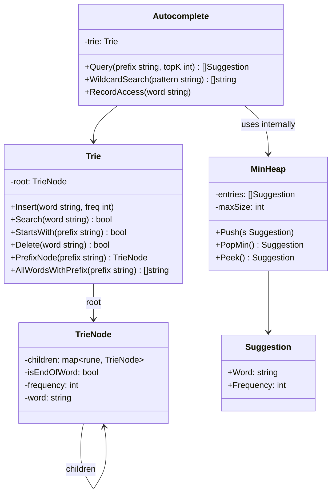

# Build Your Own Autocomplete Engine

## 1. Motivation & Real-World Context

Autocomplete is so ubiquitous that users notice its absence immediately. Behind every typeahead suggestion, code completion, and search hint is a data structure designed for exactly one operation: given a prefix string, return all words that begin with it, as fast as possible. The Trie is that structure.

**Google Search autocomplete** processes billions of prefix queries per day. Google's infrastructure uses distributed Tries (split across machines by prefix shard) with frequency-ranked completion. When you type "how to" and see "how to tie a tie" before "how to learn programming", the ranking is driven by global query frequency stored per Trie node. The core prefix-lookup mechanism is exactly what you will build.

**VS Code IntelliSense and GitHub Copilot** both use Trie-based indexes at their symbol lookup layer. IntelliSense indexes every exported symbol in a workspace into a prefix tree. When you type `str.`, the engine does a prefix lookup in a Trie over the type's method names and returns suggestions ordered by usage frequency and type relevance. The same structure applies to package imports, file path completion, and variable name completion.

**Amazon product search typeahead** handles millions of prefix queries per second across a catalog of hundreds of millions of products. Amazon uses a combination of Tries for prefix indexing and inverted indexes for full-text, with frequency data baked into the Trie nodes for ranking. The difference between O(L) Trie lookup and O(n*L) brute-force scan is the difference between a 1ms response and a 10-second timeout at Amazon's scale.

## 2. Learning Objectives

By completing this project, you will deeply understand:

1. **Why Trie achieves O(L) prefix lookup where L is the query length** — lookup time is independent of the total number of words stored, unlike O(n*L) for scanning all n words. See [`/data-structures/17-trie`](/data-structures/17-trie).

2. **The complete set of Trie operations** — insert, exact search, prefix search (startsWith), delete, and wildcard matching — and the edge cases that make delete the trickiest of them all. See [`/algorithms/24-trie-operations`](/algorithms/24-trie-operations).

3. **DFS for prefix enumeration** — how to collect all words stored under a given prefix node using backtracking DFS, building up word strings character by character. See [`/algorithms/26-dfs`](/algorithms/26-dfs).

4. **BFS as an alternative traversal** — BFS enumerates words level-by-level from the prefix node, giving you breadth-first ordering (shorter words first). Contrast with DFS to understand when each is appropriate. See [`/algorithms/25-bfs`](/algorithms/25-bfs).

5. **Top-K selection with a min-heap** — given M candidates from prefix search, returning the top K by frequency in O(M log K) using a min-heap of size K. Why not sort? Sorting all M is O(M log M); a size-K heap is faster when K &lt;&lt; M. See [`/data-structures/16-priority-queue`](/data-structures/16-priority-queue).

6. **Wildcard matching with recursive DFS** — how the '.' wildcard decomposes into trying all 26 (or all Unicode) children at that Trie level, and why the complexity is O(26^depth) in the worst case but O(M) in practice.

7. **The trade-off between children as array vs hash map** — `children[26]` for ASCII-only is O(1) lookup and compact; `map[rune]*Node` for Unicode is O(1) average but has allocation overhead. For a multilingual autocomplete engine, the choice matters.

## 3. Project Scope

**In Scope:**
- TrieNode with children map and isEndOfWord flag
- Insert (O(L)), exact search (O(L)), startsWith prefix check (O(L))
- DFS prefix enumeration — collect all words under a prefix node
- Word frequency tracking per word (frequency stored at the terminal node)
- Top-K autocomplete via min-heap of size K over frequency-ranked matches
- Wildcard search where '.' matches any single character
- Delete operation with proper node pruning
- Benchmark against brute-force scan using a real dictionary file

**Out of Scope (for v1):**
- Fuzzy matching / edit distance (Levenshtein) — see stretch goals
- Ternary search tree (TST) alternative implementation
- Compressed Trie / Patricia Trie / Radix Tree
- Distributed Trie sharding
- Unicode normalization (NFC/NFD)
- Persistent storage of the Trie to disk

## 4. Core DSA Concepts Used

| Concept | Role in this project | Handbook Link | Difficulty |
|---------|----------------------|---------------|------------|
| Trie | Core data structure; all insert/search/prefix/delete operations | [/data-structures/17-trie](/data-structures/17-trie) | Intermediate |
| Trie Operations | Implementation of the full operation set | [/algorithms/24-trie-operations](/algorithms/24-trie-operations) | Intermediate |
| DFS | Backtracking DFS to collect all words under a prefix node | [/algorithms/26-dfs](/algorithms/26-dfs) | Intermediate |
| BFS | Level-order traversal for breadth-first word enumeration | [/algorithms/25-bfs](/algorithms/25-bfs) | Beginner |
| Priority Queue (Min-Heap) | Top-K selection from M prefix-match candidates | [/data-structures/16-priority-queue](/data-structures/16-priority-queue) | Intermediate |

## 5. High-Level Architecture

The Trie is the central structure. An `Autocomplete` service wraps the Trie and exposes the high-level query interface. A min-heap is used internally for top-K ranking and is not exposed to callers.

**Key interfaces / abstractions:**

- `TrieNode` stores `children map[rune]*TrieNode`, `isEndOfWord bool`, `frequency int`, and `word string`. The `word` field at terminal nodes makes DFS collection O(1) per word instead of reconstructing from the path — store the full word when you mark `isEndOfWord = true`.
- `Trie` is the raw data structure with structural operations (Insert, Delete, exact Search, StartsWith, PrefixNode, AllWordsWithPrefix).
- `Autocomplete` is the service layer that adds ranking, frequency tracking, and wildcard matching on top of the raw Trie.
- `MinHeap` of size K is created fresh for each `Query` call — it is a short-lived computation helper, not persistent state.

## 6. Implementation Milestones (with Hints)

### Milestone 1: TrieNode and Basic Operations

**Goal:** Implement the TrieNode struct and the Trie's Insert, Search, and StartsWith operations.

**Key Challenges:** Getting the character-by-character traversal right for both creating new nodes (Insert) and traversing existing ones (Search).

**Hints & Guidance:**
- TrieNode: `children map[rune]*TrieNode` (use `rune` not `byte` from the start — it costs nothing and handles Unicode correctly), `isEndOfWord bool`, `frequency int`.
- In Insert: iterate over `[]rune(word)` (not `[]byte(word)`). For each rune, if `node.children[c] == nil`, create a new node and store it. Advance to the child. At the end, set `isEndOfWord = true` and increment `frequency`.
- In Search: same traversal but never create nodes — return false if any child is missing. Return `node.isEndOfWord` at the end.
- In StartsWith: identical to Search but return `true` at the end regardless of `isEndOfWord`. A prefix exists if all characters are present in the Trie.
- Edge cases: empty string (valid word? Decide your convention — most implementations allow it as a special root-node case), single character words, words that are prefixes of other words ("app" and "apple").
- Store `word` at the terminal node: `if isEndOfWord { node.word = word }`. This avoids string reconstruction during DFS later.

**Success Criteria:**
- Insert 10 words, Search for each word returns true
- Search for a non-inserted word returns false
- StartsWith returns true for every prefix of every inserted word
- StartsWith returns false for a string that shares no prefix with any inserted word
- "app" inserted, then Search("app") = true, StartsWith("appl") = false

### Milestone 2: DFS Prefix Enumeration

**Goal:** Implement `AllWordsWithPrefix(prefix)` — traverse to the prefix node, then DFS to collect all words in the subtree.

**Key Challenges:** The backtracking string accumulation; remembering to check `isEndOfWord` at every node, not just leaves.

**Hints & Guidance:**
- First, walk the Trie character by character along the prefix. If any character is missing, return an empty slice (prefix not found).
- From the prefix node, run DFS. Collect words by checking `if node.isEndOfWord { results = append(results, node.word) }` (using the stored word string from Milestone 1 — no reconstruction needed).
- Recursive DFS: `func dfs(node *TrieNode, results *[]string) { if node.isEndOfWord { *results = append(*results, node.word) }; for _, child := range node.children { dfs(child, results) } }`.
- In C#: use a `List&lt;string&gt;` passed by reference, or return `IEnumerable&lt;string&gt;` with `yield return` inside a recursive iterator.
- Alternatively: implement BFS from the prefix node. Use a queue; enqueue the prefix node; dequeue, check `isEndOfWord`, enqueue all children. BFS produces shorter words first (breadth-first order), which may be desirable for autocomplete.
- Edge case: prefix is empty string — your function should return all words in the Trie (full DFS from root).
- Edge case: prefix is itself a complete word ("app" is a word, and "apple", "application" are also words). All three should appear in results.

**Success Criteria:**
- AllWordsWithPrefix("app") on a Trie containing ["app", "apple", "application", "apt", "banana"] returns ["app", "apple", "application"] in any order
- AllWordsWithPrefix("") returns all inserted words
- AllWordsWithPrefix("xyz") on a Trie with no "xyz" words returns empty slice
- AllWordsWithPrefix("apple") returns ["apple"] only (not "application", since "apple" is not a prefix of "application")

### Milestone 3: Frequency Tracking

**Goal:** Add frequency tracking per word. When a word is searched (accessed), its frequency increments. Insert with an initial frequency.

**Key Challenges:** Frequency must increment correctly for existing words on repeated Insert calls; this enables loading a pre-frequency-counted dictionary.

**Hints & Guidance:**
- Modify Insert to accept `frequency int`. If the word already exists (`isEndOfWord == true` at the terminal node), add the new frequency to the existing one rather than overwriting it. This lets you bulk-load a dictionary file where word frequencies are pre-counted.
- Add `RecordAccess(word string)` to the Autocomplete service (not the Trie). It calls `trie.Insert(word, 1)` — adding 1 to the word's frequency each time it's accessed. This simulates query logging.
- Load `/usr/share/dict/words` on Linux (one word per line, no frequencies) as a flat dictionary. All words start at frequency=0. Then simulate a skewed access pattern: access "the", "go", "run" 1000 times each; access obscure words 1-2 times. Observe how frequencies diverge.
- For a richer test: use a word frequency list (e.g., the Google Ngram corpus or a Wikipedia word count file). These are publicly available TSV files with word and count per line.

**Success Criteria:**
- Insert "go" with frequency 100, then RecordAccess("go") 5 times → frequency is 105
- Insert same word twice: Insert("cat", 10) + Insert("cat", 5) → frequency is 15
- Frequency is stored at the terminal node and accessible via the Trie
- Loading /usr/share/dict/words (if available) completes in &lt; 1 second

### Milestone 4: Ranked Top-K Autocomplete with Min-Heap

**Goal:** Implement `Query(prefix, K)` that returns the top K words by frequency from all words matching the prefix.

**Key Challenges:** Using a min-heap of size K correctly — min-heap, not max-heap, because you want to efficiently discard low-frequency items as you scan.

**Hints & Guidance:**
- Get all words with the prefix (from Milestone 2). You now have M candidates.
- Maintain a min-heap of size K. For each candidate word: if heap size &lt; K, push it. If heap size == K and candidate.frequency > heap.Min().frequency, pop the min and push the candidate.
- At the end, pop all K entries from the heap. The order coming out is ascending frequency (smallest first), so reverse the result slice for descending (highest frequency first) presentation.
- Why min-heap and not max-heap? A max-heap would let you pop the maximum efficiently, but you want to maintain a "top K so far" window. With a min-heap of size K, the minimum of your current top-K candidates sits at the root, ready to be replaced by a better candidate.
- Complexity: O(L + M log K) where L is prefix length, M is the number of matching words, K is the result count. When K is small (e.g., 10) and M is large (e.g., 50,000 words start with "a"), this is dramatically faster than sorting all M.
- Handle ties: words with equal frequency are ordered alphabetically (consistent with how real autocomplete handles this — deterministic ordering).

**Success Criteria:**
- Query("app", 3) on a Trie with ["app" freq=5, "apple" freq=100, "application" freq=50, "apt" freq=10] returns ["apple", "application", "apt"] in that order
- Query("app", 1) returns only ["apple"]
- Query with K > number of matching words returns all matching words
- Query on a prefix with no matches returns empty slice

### Milestone 5: Wildcard Search

**Goal:** Implement `WildcardSearch(pattern)` where '.' matches any single character. Return all words matching the pattern.

**Key Challenges:** The recursive branching on '.'; avoiding combinatorial explosion by pruning early.

**Hints & Guidance:**
- Recursive approach: `func wildcardDFS(node *TrieNode, pattern []rune, idx int, results *[]string)`.
- Base case: `idx == len(pattern)`. If `node.isEndOfWord`, append `node.word` to results. Return.
- Recursive case: `c = pattern[idx]`. If `c != '.'`, look up `node.children[c]` — if it exists, recurse. If `c == '.'`, iterate over all `node.children` and recurse into each.
- The worst case is a pattern of all dots with a large character set — every possible path is explored. In practice, patterns with specific characters prune aggressively.
- Test with patterns like `"a.."` (three-letter words starting with 'a'), `"..."` (all three-letter words), `"go"` (exact match, equivalent to Search).
- Optionally support '`*`' for zero-or-more matching as a stretch — this is significantly harder (requires memoization or a state machine).

**Success Criteria:**
- WildcardSearch("a..") returns all 3-letter words starting with 'a'
- WildcardSearch("go") returns ["go"] if "go" is in the Trie
- WildcardSearch("g.") returns all 2-letter words starting with 'g' (e.g., "go", "go")
- WildcardSearch(".") returns all 1-letter words
- WildcardSearch("xyz") returns empty if "xyz" is not in the Trie

### Milestone 6: Load Real Dictionary and Benchmark

**Goal:** Load `/usr/share/dict/words` (or an equivalent word list), run autocomplete queries, and compare Trie vs brute-force performance.

**Key Challenges:** Fair benchmarking; measuring the right things (latency distribution, not just average).

**Hints & Guidance:**
- `/usr/share/dict/words` on Linux typically contains ~235,000 words, one per line. Read line by line, Insert each word with frequency=1.
- Brute-force baseline: store all words in a plain list. For prefix query, iterate over all words, check `strings.HasPrefix(word, prefix)`. This is O(n*L).
- Benchmark both approaches for prefixes of different popularity: "a" (very common, ~20,000 matches), "anti" (moderate, ~1,000 matches), "antidisest" (rare, ~few matches).
- Measure: (1) dictionary load time, (2) prefix query latency (time to get all matches), (3) top-K query latency. Use Go's `testing.B` or C#'s `BenchmarkDotNet`.
- Expected results: Trie should be ~10-100x faster on prefix lookup for common prefixes. On rare prefixes, the difference narrows (both are fast on a small result set).
- Memory: Trie will use significantly more memory than a plain word list. Measure memory usage. A Trie over 235k words typically uses 10-50 MB depending on child representation.

**Success Criteria:**
- Dictionary loads correctly: Search("apple") returns true, Search("xyzqwerty") returns false
- Trie prefix query is measurably faster than brute-force for common prefixes (verified by benchmark numbers)
- Benchmark results printed as a table: approach | prefix | query_time_ns | result_count
- Top-K query for Query("the", 5) returns 5 words starting with "the" ranked by frequency

## 7. Stretch Goals (for advanced learners)

1. **Delete with node pruning:** Implement correct Trie deletion. A node can only be physically removed if it is not a prefix of any other word (no children) and is not itself a word. The delete must walk back up from the deleted node, removing nodes that are now childless and not end-of-word. This is trickier than it sounds — implement it recursively, returning a boolean indicating whether the current node should be deleted by its parent.

2. **Fuzzy search with edit distance (Levenshtein):** Given a query string with potential typos, find all Trie words within edit distance K. Use DFS with a row of the DP edit distance matrix passed down the recursion. Prune branches where the minimum possible edit distance already exceeds K. This is how spell-checkers work. See the handbook's dynamic programming section.

3. **Compressed Trie (Patricia Trie / Radix Tree):** Merge chains of single-child nodes into single edges with multi-character labels. "application" becomes a single edge on the node for "applicat" if no other word branches there. Reduces Trie memory by 40-60% for typical dictionaries. Golang's `net/http` router uses a radix tree for URL path matching.

4. **Prefix frequency ranking without enumerating all matches:** Store in each TrieNode the top-K words in its subtree (by frequency). Query("app", 5) returns `root["a"]["p"]["p"].topK` in O(L) without DFS. The trade-off: Insert and RecordAccess must update the topK lists up the path, making writes O(L*K). This is how production autocomplete systems avoid scanning millions of matches per query.

5. **Concurrent Trie with fine-grained locking:** Add a `sync.RWMutex` (Go) or `ReaderWriterLockSlim` (C#) per TrieNode rather than a single global lock. Concurrent reads on different prefixes proceed in parallel; only writes to the same node contend. Benchmark concurrent throughput vs single-lock throughput under a mixed read/write workload.

## 8. Testing & Validation Strategy

**Unit tests — correctness:**
- Insert + Search: insert 100 words, search for each, verify true. Search for 100 non-inserted words, verify false.
- StartsWith: for every inserted word and every prefix of that word, StartsWith returns true.
- AllWordsWithPrefix: insert ["cat", "car", "card", "care", "bat"]; AllWordsWithPrefix("ca") must return exactly ["cat", "car", "card", "care"] in any order.
- Delete: insert "cat" and "car", delete "cat", Search("cat") = false, Search("car") = true, StartsWith("ca") = true. Delete "car", StartsWith("ca") = false.
- Frequency: after inserting "go" with freq=10 and recording 5 accesses, frequency must be 15.

**Property-based tests:**
- For any word W inserted into the Trie: Search(W) = true.
- For any word W inserted: for every prefix P of W: StartsWith(P) = true.
- For any word W never inserted: Search(W) = false.
- AllWordsWithPrefix(P) contains exactly the words that start with P and were inserted.

**Benchmarks:**
- Load /usr/share/dict/words. Measure: Trie build time, memory usage, prefix query latency for "a", "pre", "super", "anti".
- Top-K query for K=5, K=10, K=50. Verify latency scales with K (O(M log K)), not with total words.
- Wildcard search latency for "a.." (many results) vs "xyz" (no results).

## 9. C# and Go Implementation Notes

**C# notes:**

- Use `Dictionary&lt;char, TrieNode&gt;` for children, not `TrieNode[26]`, to support Unicode from the start. For an ASCII-only implementation, `TrieNode[26]` with `c - 'a'` indexing is faster and cache-friendlier.
- Recursive DFS is natural in C#. For very deep Tries (long words), recursion depth is bounded by word length (max ~50 for typical words), so stack overflow is not a concern.
- `yield return` in an iterator method makes `IEnumerable&lt;string&gt;` lazy: the DFS only generates results as the caller consumes them. This is elegant and avoids materializing all M results when the caller only needs the first K.
- `string` in C# is already Unicode (UTF-16). Iterate with `foreach (char c in word)` for BMP characters. For full Unicode (emoji, CJK extensions), use `StringInfo` and enumerate `TextElement` boundaries — but for an autocomplete engine, char iteration is sufficient.
- `BenchmarkDotNet` (NuGet) is the standard C# benchmarking library. Add it as a dev dependency for Milestone 6.

**Go notes:**

- `map[rune]*TrieNode` for children. Runes are int32 Unicode code points. Iterating with `for _, c := range word` automatically decodes UTF-8 to runes — no explicit conversion needed.
- `strings.Builder` in DFS: if you choose to reconstruct the word string from the traversal path rather than storing it in the node, use `strings.Builder` for efficient concatenation. However, storing `node.word` at terminal nodes (Milestone 1 hint) avoids this entirely.
- Go does not have built-in generic containers yet (Go 1.21 has `slices` and `maps` but no generic tree). Define `type TrieNode struct { ... }` as a concrete type — generics add no value for a fixed-purpose Trie.
- `testing.Benchmark` for Milestone 6. Use `b.ResetTimer()` after loading the dictionary. `b.ReportAllocs()` to see per-operation allocation count — a well-implemented Trie DFS should allocate only for the result slice, not during traversal.
- For file loading: `bufio.Scanner` with `os.Open("/usr/share/dict/words")`. Each `scanner.Text()` is one word.

## 10. Potential Extensions & Related Projects

- **Build Your Own Search Engine (inverted index):** The Trie handles prefix queries efficiently. For full-text search (query words anywhere in a document, not just at the start), combine the Trie with an inverted index (word → list of document IDs). The Trie is the prefix-query front end; the inverted index handles arbitrary term queries.
- **Build Your Own Code Formatter/Linter:** A linter indexes all identifiers in a codebase into a Trie for fast "did you mean X?" suggestions. When it sees an undefined variable "lengt", it prefix-searches the Trie for "lengt" and suggests "length", "lengths". The edit-distance stretch goal above is the completion of this feature.
- **Relate to Cache with Eviction (`05-cache-with-eviction.md`):** An autocomplete engine serving millions of users should cache the top-K results for popular prefixes in an LFU cache. The 1000 most-queried prefixes (e.g., "the", "how", "wh") account for a disproportionate share of traffic. Cache their results and skip the DFS entirely on cache hit.
- **Relate to Route Planner (`08-route-planner.md`):** Airport code autocomplete ("LAX", "LHR", "CDG") is a natural Trie application. After building the route planner, add a Trie layer for airport name and code completion, enabling a CLI interface: type "Lon" → suggest "London Heathrow (LHR)", "London Gatwick (LGW)", "London City (LCY)".
