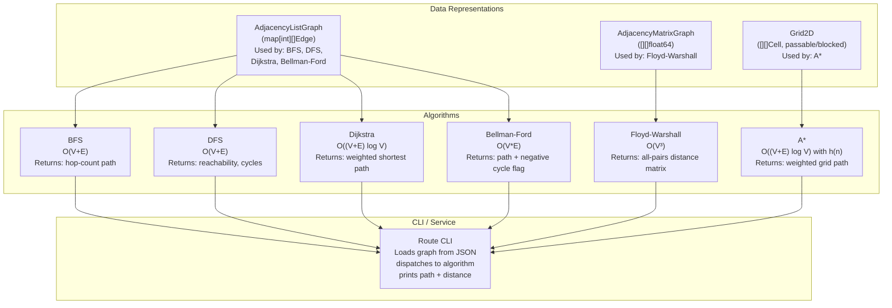

# Build Your Own Route Planner

## 1. Motivation & Real-World Context

Finding the shortest path between two points is one of the oldest and most practically important problems in computer science. The algorithms you implement here power navigation, networking, and logistics at planet scale.

**Google Maps and Apple Maps** use A* with contraction hierarchies (CH) — a preprocessing technique that adds shortcut edges to the graph to dramatically speed up Dijkstra queries. When you ask for driving directions from Los Angeles to New York, the underlying algorithm navigates a graph of ~50 million road nodes in under 100ms. The core of that query is still Dijkstra; contraction hierarchies reduce the search space by orders of magnitude. Understanding Dijkstra is prerequisite to understanding how Maps actually works.

**OSRM (Open Source Routing Machine)**, the routing engine behind many mapping APIs, uses a multi-level Dijkstra variant (MLD) on preprocessed OpenStreetMap data. Uber, Mapbox, and HERE Technologies all build routing on top of OSRM or similar Dijkstra-based engines. When an Uber driver app plots a route, OSRM is doing the graph search.

**Network routing protocols** are direct applications of these algorithms. **RIP (Routing Information Protocol)** — one of the oldest and still widely deployed routing protocols — uses Bellman-Ford: each router periodically broadcasts its distance vector to neighbors, who update their tables and rebroadcast. **OSPF (Open Shortest Path First)** — the dominant enterprise and ISP routing protocol — uses Dijkstra: each router maintains the full network topology graph (via link-state advertisements) and runs Dijkstra locally. The split between these two protocols maps directly to the split between Bellman-Ford and Dijkstra you will implement.

## 2. Learning Objectives

By completing this project, you will deeply understand:

1. **Graph representation trade-offs** — adjacency list (O(V+E) space, good for sparse graphs like road networks) vs adjacency matrix (O(V²) space, good for dense graphs and Floyd-Warshall). See [`/data-structures/23-graph`](/data-structures/23-graph).

2. **BFS for unweighted shortest paths** — why BFS finds the minimum hop count, and why it cannot handle edge weights. The relationship between BFS and Dijkstra (Dijkstra is BFS with a priority queue instead of a plain queue). See [`/algorithms/25-bfs`](/algorithms/25-bfs).

3. **DFS for structural graph analysis** — cycle detection, reachability, and topological ordering. Why DFS over BFS for these tasks. See [`/algorithms/26-dfs`](/algorithms/26-dfs).

4. **Dijkstra's algorithm and its correctness invariant** — why the greedy selection of the minimum-distance unvisited node is correct, and why negative edge weights break it. O((V+E) log V) with a min-heap. See [`/algorithms/28-dijkstra`](/algorithms/28-dijkstra).

5. **Bellman-Ford and negative edge weights** — the relaxation-based approach, why V-1 passes suffice, and how one additional pass detects negative cycles. O(VE) vs Dijkstra's O((V+E) log V) — understanding when to pay the extra cost. See [`/algorithms/29-bellman-ford`](/algorithms/29-bellman-ford).

6. **Floyd-Warshall for all-pairs shortest paths** — the DP formulation `dist[i][j] = min(dist[i][j], dist[i][k] + dist[k][j])`, why the outer loop is over intermediate nodes k, and O(V³) time with O(V²) space. See [`/algorithms/30-floyd-warshall`](/algorithms/30-floyd-warshall).

7. **A* and admissible heuristics** — how the heuristic function h(n) guides search toward the goal, why admissibility (never overestimates) is necessary for correctness, and why Manhattan distance is admissible for grid graphs but Euclidean distance is needed for geographic coordinates. See [`/algorithms/32-astar`](/algorithms/32-astar).

## 3. Project Scope

**In Scope:**
- Graph struct with weighted directed and undirected edges, adjacency list representation
- Add/remove vertex and edge operations
- BFS (unweighted shortest path — minimum hops)
- DFS (cycle detection, reachability check, all paths from source)
- Dijkstra with min-heap (weighted shortest path, non-negative weights)
- A* on a 2D grid with Manhattan distance heuristic
- Bellman-Ford with negative cycle detection
- Floyd-Warshall for all-pairs shortest paths (adjacency matrix representation)
- Path reconstruction (not just distance, but the actual node sequence)
- CLI that loads a graph from JSON and finds routes between nodes

**Out of Scope (for v1):**
- Contraction hierarchies or other preprocessing for large graphs
- Bidirectional Dijkstra
- Johnson's algorithm (reweighting for negative edges before Dijkstra)
- Real map data parsing (OSM format, Shapefile)
- Visualization beyond ASCII grid output
- Multi-criteria routing (optimize for time AND distance simultaneously)

## 4. Core DSA Concepts Used

| Concept | Role in this project | Handbook Link | Difficulty |
|---------|----------------------|---------------|------------|
| Graph (adjacency list) | Core data structure for road/network graphs; BFS/DFS/Dijkstra/Bellman-Ford | [/data-structures/23-graph](/data-structures/23-graph) | Intermediate |
| BFS | Unweighted shortest path; minimum hop count | [/algorithms/25-bfs](/algorithms/25-bfs) | Beginner |
| DFS | Cycle detection; reachability; all-paths enumeration | [/algorithms/26-dfs](/algorithms/26-dfs) | Beginner |
| Dijkstra | Weighted shortest path; main routing algorithm | [/algorithms/28-dijkstra](/algorithms/28-dijkstra) | Intermediate |
| Bellman-Ford | Negative-weight edges; negative cycle detection | [/algorithms/29-bellman-ford](/algorithms/29-bellman-ford) | Intermediate |
| Floyd-Warshall | All-pairs shortest paths; adjacency matrix DP | [/algorithms/30-floyd-warshall](/algorithms/30-floyd-warshall) | Intermediate |
| A* | Heuristic-guided shortest path on 2D grids | [/algorithms/32-astar](/algorithms/32-astar) | Hard |

## 5. High-Level Architecture

The project has two graph representations (adjacency list and adjacency matrix) and a suite of algorithms operating on each. A CLI layer composes them into a usable route planner.

**Key interfaces / abstractions:**

- `Edge` struct: `{ To int, Weight float64 }`. For undirected graphs, adding edge (u,v,w) inserts edges in both directions.
- `ShortestPathResult` struct: `{ Distance float64, Path []int, HasNegativeCycle bool }`. Uniform return type across all single-source algorithms.
- `Graph` interface (optional): `AddVertex(id int)`, `AddEdge(from, to int, weight float64)`, `Neighbors(id int) []Edge`. Allows swapping list vs matrix representation in benchmarks.
- A* `Cell` struct: `{ Row, Col int, Passable bool }`. Heuristic function is injected (not hardcoded) to make it easy to swap Manhattan for Euclidean.
- Path reconstruction: all algorithms store a `prev[]` array (parent map) alongside distances. Call `reconstructPath(prev, source, dest)` to walk backwards from dest to source and reverse.

## 6. Implementation Milestones (with Hints)

### Milestone 1: Graph Struct and BFS

**Goal:** Implement a weighted directed graph using an adjacency list and BFS for unweighted shortest paths.

**Key Challenges:** Deciding on the graph representation; implementing BFS correctly with a visited set; path reconstruction via parent tracking.

**Hints & Guidance:**
- Adjacency list: `map[int][]Edge` where `Edge = struct{ To int; Weight float64 }`. This naturally handles non-contiguous vertex IDs (e.g., city IDs from a database).
- BFS: use a queue (your ring buffer from the task queue project, or a plain `[]int` slice used as a queue). Track `visited map[int]bool` and `prev map[int]int` (parent of each node).
- BFS correctness: visit a node when you enqueue it (not when you dequeue it). Otherwise, the same node can be enqueued multiple times, ruining O(V+E) complexity.
- For undirected graphs: when adding edge (u, v, w), also add edge (v, u, w). Add an `undirected bool` flag to AddEdge, or expose `AddUndirectedEdge`.
- Path reconstruction: after BFS, walk `prev` from destination back to source, building the path in reverse, then reverse the result. Return nil if destination was never reached (not connected).
- Test on a simple 5-node graph with known shortest paths.

**Success Criteria:**
- BFS finds minimum-hop path (not minimum-weight path) between connected nodes
- BFS returns nil/empty path for disconnected source-destination pairs
- Path reconstruction returns the correct node sequence, not just the distance
- Graph correctly stores directed and undirected edges

### Milestone 2: DFS for Cycle Detection and Reachability

**Goal:** Implement DFS for three use cases: reachability check (can we get from A to B?), all-paths enumeration, and cycle detection in a directed graph.

**Key Challenges:** Distinguishing "visited in this DFS path" (on the recursion stack) from "visited ever" (fully processed) for cycle detection in directed graphs.

**Hints & Guidance:**
- Reachability: simple DFS/BFS from source. Return true if destination is ever reached.
- All paths (backtracking DFS): pass a `currentPath []int` slice down the recursion. At each node, append to currentPath, recurse into unvisited neighbors, pop after recursion returns. When destination is reached, save a copy of currentPath to results.
- Cycle detection in directed graphs: maintain two sets — `visited` (all nodes seen) and `inStack` (nodes on the current DFS path). A back edge (edge to a node in `inStack`) indicates a cycle. This is different from undirected cycle detection (which only needs `visited`).
- Iterative DFS: use an explicit stack `[]int` instead of recursion. Useful for avoiding stack overflow on very deep graphs. Implement both and compare.
- Topological order (DFS-based): after fully processing a node (all descendants visited), push to a result stack. Reverse at the end. This is Tarjan's topological sort — compare with Kahn's BFS approach from the task queue project.

**Success Criteria:**
- Reachability(A, B) = true for connected pairs, false for disconnected
- AllPaths(A, D) in a 4-node DAG returns all valid paths (not just the shortest)
- Cycle detection returns true for a graph with a cycle, false for a DAG
- DFS identifies the correct set of nodes in the cycle (not just that one exists)

### Milestone 3: Dijkstra with Min-Heap

**Goal:** Implement Dijkstra's algorithm for weighted shortest paths using a min-heap priority queue.

**Key Challenges:** Handling the "stale entry" problem in the min-heap; understanding why Dijkstra fails on negative edges.

**Hints & Guidance:**
- Initialize `dist[source] = 0`, all others `+Infinity`. Push `(dist=0, node=source)` onto the min-heap.
- Main loop: pop minimum `(d, u)` from heap. If `d > dist[u]`, skip — this is a stale entry (we found a shorter path to u already). Otherwise, relax all edges from u: if `dist[u] + edge.Weight &lt; dist[v]`, update `dist[v]` and push `(dist[v], v)` onto the heap. Do NOT update the old heap entry — just push a new one. Old entries become stale and are skipped when popped.
- Visited set: once u is popped with `d == dist[u]`, u is finalized. You can use a `visited[]bool` array as an alternative to the stale-check above, but the lazy deletion (stale-check) approach works with immutable heap entries.
- Path reconstruction: maintain `prev[v] = u` whenever you update `dist[v]` through u.
- Negative edges: demonstrate the failure. Add a negative edge and show that Dijkstra produces an incorrect result. Then show Bellman-Ford produces the correct result. This is the key pedagogical transition to Milestone 5.

**Success Criteria:**
- Dijkstra finds correct shortest paths on a 10-node weighted directed graph (verify against hand calculation)
- Path reconstruction gives the correct node sequence
- Dijkstra is faster than brute-force (enumerate all paths, take minimum) on a 50-node graph — verify with timing
- Demonstrable incorrect result on a graph with a negative edge (setup for Milestone 5)

### Milestone 4: A* on a 2D Grid

**Goal:** Implement A* search on a 2D grid with obstacles, using Manhattan distance as the heuristic.

**Key Challenges:** Understanding the f(n) = g(n) + h(n) formulation; ensuring the heuristic is admissible; visualizing the search on a grid.

**Hints & Guidance:**
- Grid representation: `[][]Cell` where `Cell` has `passable bool`. Neighbors are up/down/left/right (4-directional), or include diagonals for 8-directional (use Euclidean heuristic if so).
- A* data: `gScore[node] = cost from start to node`, `fScore[node] = gScore[node] + h(node)`. Min-heap ordered by fScore.
- Manhattan distance heuristic: `h(node) = abs(node.row - goal.row) + abs(node.col - goal.col)`. This is admissible for 4-directional grids because you cannot travel fewer than |Δrow| + |Δcol| steps.
- A* = Dijkstra when `h(n) = 0` for all n (no heuristic guidance). Show this empirically: A* with h=0 visits the same nodes as Dijkstra. A* with Manhattan h visits fewer nodes (directed toward the goal).
- Visualize: print the grid as ASCII after A* completes. Mark: `.` for unvisited passable, `#` for obstacles, `*` for the path, `~` for visited (explored by A* but not on the path).
- Count nodes explored: A* should explore fewer nodes than Dijkstra on a grid with a clear path. This is the point.

**Success Criteria:**
- A* finds the shortest path on a 10x10 grid with obstacles
- A* produces the same path length as Dijkstra on the same grid
- A* explores fewer nodes than Dijkstra (verify with exploration count)
- ASCII visualization clearly shows path and explored frontier

### Milestone 5: Bellman-Ford with Negative Cycle Detection

**Goal:** Implement Bellman-Ford for graphs with negative edge weights and demonstrate negative cycle detection.

**Key Challenges:** Running exactly V-1 relaxation passes, then one more pass for cycle detection; constructing a meaningful negative cycle demonstration.

**Hints & Guidance:**
- Bellman-Ford: initialize `dist[source] = 0`, all others `+Infinity`. Repeat V-1 times: for every edge (u, v, w) in the graph, if `dist[u] + w &lt; dist[v]`, update `dist[v]` and `prev[v] = u`.
- Iteration order over edges does not matter for correctness (unlike Dijkstra's greedy order). After V-1 iterations, all shortest paths are found (if no negative cycle).
- Negative cycle detection: one additional V-th pass. If any `dist[v]` is still updated, a negative cycle exists reachable from source.
- Cycle identification: when the V-th pass updates `dist[v]`, follow `prev` pointers starting from v for V steps — you are guaranteed to land on a node that is part of the cycle. Then walk `prev` again from that node until you return to it. This is the cycle.
- Demonstrate: graph with edges A→B (-1), B→C (-1), C→A (-1). Total cycle weight = -3. Show Bellman-Ford correctly detects it. Show Dijkstra produces wrong results on this graph (for educational contrast).
- Time complexity O(VE): for a dense graph (E ≈ V²), this is O(V³). Compare with Dijkstra on the same graph (with all-positive weights after removing negatives).

**Success Criteria:**
- Bellman-Ford finds correct shortest paths on a graph with some negative edges but no negative cycles
- Bellman-Ford correctly detects the negative cycle A→B→C→A and returns an error
- Bellman-Ford path matches Dijkstra's path on graphs with no negative edges (same result, different mechanism)
- Comparison printout: "Dijkstra on this negative-edge graph gives X (wrong). Bellman-Ford gives Y (correct)."

### Milestone 6: Floyd-Warshall and CLI Route Finder

**Goal:** Implement Floyd-Warshall for all-pairs shortest paths, then build a CLI that loads a city graph from JSON and finds routes using any algorithm.

**Key Challenges:** The DP recurrence and why k must be the outermost loop; designing a clean JSON graph format.

**Hints & Guidance:**
- Adjacency matrix: `dist[V][V]` initialized to `+Infinity`. Set `dist[i][i] = 0`. For each edge (u,v,w), set `dist[u][v] = w`. For undirected, also `dist[v][u] = w`.
- Floyd-Warshall: three nested loops. **Critically: k (intermediate node) is the outermost loop**. `for k in 0..V: for i in 0..V: for j in 0..V: dist[i][j] = min(dist[i][j], dist[i][k] + dist[k][j])`.
- Also maintain `next[i][j] = k` or `next[i][j] = j` for path reconstruction. Update `next[i][j] = next[i][k]` whenever dist[i][j] is updated through k.
- Negative cycle detection: after running, if `dist[i][i] &lt; 0` for any i, there is a negative cycle through i.
- JSON city graph format: `{"nodes": [{"id": 0, "name": "LAX"}, ...], "edges": [{"from": 0, "to": 1, "weight": 350.5}, ...]}`.
- CLI interface: `route-planner --from LAX --to JFK --algo dijkstra --graph cities.json`. Parse args, load graph, run algorithm, print path and total distance.
- Bonus: for Floyd-Warshall, print the full distance matrix in a readable format — this demonstrates "all pairs" in a concrete, visual way.

**Success Criteria:**
- Floyd-Warshall computes correct all-pairs distances on a 5-city graph (verify against hand-running Dijkstra from each city)
- CLI loads a JSON graph file and finds routes correctly for all implemented algorithms
- CLI handles missing/unreachable paths gracefully: "No path exists from LAX to [unreachable city]"
- Path + distance printed for each algorithm selection

## 7. Stretch Goals (for advanced learners)

1. **Bidirectional Dijkstra:** Run two simultaneous Dijkstra searches — one forward from source, one backward from destination (in the reversed graph). Stop when the two frontiers meet. The meeting point gives the shortest path. Reduces the search space to approximately half, which matters enormously on large road graphs. Implement and measure node exploration count vs standard Dijkstra.

2. **Contraction Hierarchies (simplified):** Rank nodes by importance (degree, local shortcut count). Preprocess by contracting low-importance nodes: remove node v, add shortcut edges between all pairs of v's neighbors if the shortcut is the unique shortest path. During query, run bidirectional Dijkstra using only upward edges. Reduces query time on road networks from O((V+E) log V) to milliseconds.

3. **Johnson's Algorithm (negative edges + Dijkstra):** Use Bellman-Ford once to compute a reweighting function h(v) that makes all edge weights non-negative, then run Dijkstra V times (once per source). Total complexity O(V² log V + VE) — better than Floyd-Warshall for sparse graphs with negative edges. Implement and benchmark against Floyd-Warshall.

4. **Real OpenStreetMap data:** Download a small OSM extract (e.g., a city) from Geofabrik. Parse the PBF or XML format to extract road nodes and edges. Run Dijkstra and A* on real road data. Compare route quality to Google Maps on the same source/destination pair.

5. **Multi-criteria Pareto-optimal routing:** Some routes are faster, some are shorter, some use fewer toll roads. Implement a Pareto-front search that finds all routes that are not dominated (no other route is simultaneously shorter AND faster). This requires maintaining a set of non-dominated (distance, time) pairs per node rather than a single scalar distance.

## 8. Testing & Validation Strategy

**Unit tests — correctness:**
- BFS: 5-node graph, verify minimum hop counts match hand calculation.
- Dijkstra: 6-node graph with known shortest paths (from a textbook or verified by hand). Compare dist[] array element by element.
- A*: 10x10 grid, verify A* path length equals BFS hop count (confirming A* finds optimal).
- Bellman-Ford: same 6-node graph as Dijkstra — both must return identical paths. Plus the negative-cycle graph.
- Floyd-Warshall: 4-node complete graph. Verify dist[i][j] == dist[j][i] for undirected. Verify dist[i][j] &lt;= dist[i][k] + dist[k][j] for all i,j,k (triangle inequality).

**Property-based tests:**
- For any graph with non-negative weights: Dijkstra distance from i to j equals Floyd-Warshall dist[i][j].
- For any connected unweighted graph: BFS hop count from i to j equals the length of the path returned by BFS minus 1.
- A* never returns a path longer than Dijkstra's shortest path (admissibility guarantee).
- Bellman-Ford on a graph with no negative edges returns the same distances as Dijkstra.

**Benchmarks:**
- Random 100-node, 500-edge graph: Dijkstra vs Bellman-Ford timing comparison.
- 50x50 grid: A* vs Dijkstra node exploration count and wall-clock time.
- Floyd-Warshall: 50-node dense graph — O(V³) should be measurably slower than Dijkstra from one source.

## 9. C# and Go Implementation Notes

**C# notes:**

- `PriorityQueue&lt;TElement, TPriority&gt;` (.NET 6+) for Dijkstra and A*. Priority is `double` (distance/fScore). `TElement` is `int` (node ID) or a `(int Row, int Col)` ValueTuple for grid A*.
- Adjacency list: `Dictionary<int, List&lt;(int To, double Weight)>>`. ValueTuples avoid the overhead of a separate Edge class.
- `double.PositiveInfinity` for initial distances (no sentinel -1 or int.MaxValue needed).
- Floyd-Warshall: use a 2D `double[,]` array. `double[V, V]` is contiguous in memory and faster than `double[][]` for the three nested loops.
- Path reconstruction: `Dictionary&lt;int, int&gt; prev` for single-source algorithms; `int[,] next` matrix for Floyd-Warshall.
- CLI: `System.CommandLine` (NuGet, official Microsoft library) for argument parsing. Or a simple manual parse with `args[0]`, `args[1]` for a quick prototype.

**Go notes:**

- Adjacency list: `map[int][]Edge` where `type Edge struct { To int; Weight float64 }`. No generics needed.
- Min-heap for Dijkstra: implement `container/heap` interface. `type Item struct { Node int; Dist float64 }`. `Less(i,j int) bool { return h[i].Dist &lt; h[j].Dist }`.
- `math.Inf(1)` for positive infinity in distance initialization. `math.IsInf(d, 1)` to check.
- Floyd-Warshall: `dist := make([][]float64, V)` with nested make. Access as `dist[i][j]`. Go slices-of-slices are not contiguous but the simple indexing works correctly.
- CLI: `flag` package from the standard library is sufficient. `flag.String("from", "", "source node")`, `flag.String("to", "", "destination node")`, `flag.String("algo", "dijkstra", "algorithm")`.
- `encoding/json` for loading the city graph JSON. Define `type GraphJSON struct { Nodes []NodeJSON; Edges []EdgeJSON }` and `json.Unmarshal`.

## 10. Potential Extensions & Related Projects

- **Build Your Own Network Packet Router:** Replace cities with network routers and road distances with link latencies. Implement RIP (periodic Bellman-Ford broadcasts) and OSPF (Dijkstra on full topology). This is a direct application of the exact algorithms you implemented.
- **Build Your Own Task Queue with Dependency Resolution (`06-task-queue-system.md`):** The topological sort in the task queue project is a special case of graph algorithms — directed acyclic graph traversal. After completing both projects, the connections between graph theory and system design become concrete.
- **Build Your Own Autocomplete with Airport Codes (`07-autocomplete-engine.md`):** The route planner's city/airport nodes naturally feed an autocomplete engine. Build a Trie over airport names and IATA codes, use the route planner to find routes, and combine them into a flight planning CLI: type partial airport name, get autocomplete suggestions, select source and destination, get the shortest route.
- **Build Your Own Warehouse Picker (TSP approximation):** The Travelling Salesman Problem (visiting N locations and returning to start with minimum total distance) is NP-hard exactly, but a greedy nearest-neighbor heuristic + 2-opt improvement gives good practical results. This extends Floyd-Warshall (all-pairs precomputation) with a combinatorial optimization layer on top.
