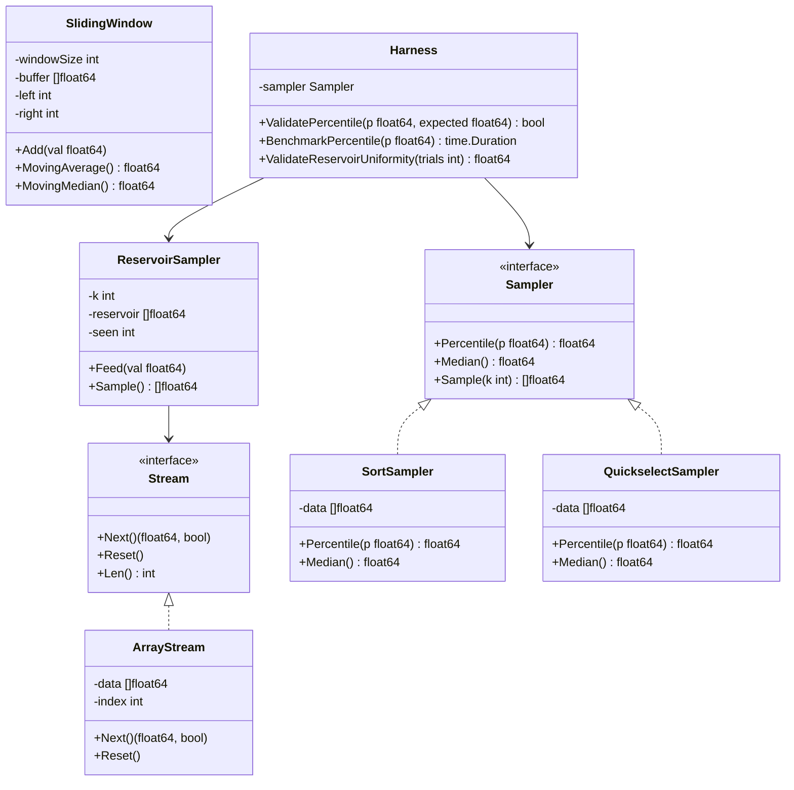

# Build Your Own Statistical Sampler

## 1. Motivation & Real-World Context

You cannot store every event a production system generates. At scale, the question is never "how do I process all the data?" — it is "how do I draw statistically valid conclusions from a bounded amount of it?" Sampling and order-statistics algorithms are how analytics platforms, databases, and stream processors answer that question without reading every row or byte.

**Analytics dashboards (Datadog, Grafana, Amplitude).** A dashboard showing p95 API latency over the last hour is not computing latency for every request — it is computing an order statistic over a time-bounded window. Datadog's distribution metrics use approximate quantile sketches (DDSketch) internally, but the exact algorithms — quickselect for offline batches, sliding windows for live streams — are what you implement first. Understanding exact percentile computation makes the approximations meaningful.

**A/B testing platforms (Optimizely, LaunchDarkly, Google Optimize).** When an experiment runs on 10 million users, the analysis pipeline samples conversion events to estimate lift with confidence intervals. Reservoir sampling guarantees that every user in the stream has an equal probability of appearing in the analysis sample, even when the total population size is unknown at stream start. Getting this wrong biases experiment results.

**Streaming data platforms (Apache Kafka, AWS Kinesis, Apache Flink).** Kafka consumers processing billions of events per day use reservoir sampling for debug sampling ("show me 1,000 random events from this topic") and sliding windows for tumbling/hopping aggregations. Flink's window operators are sliding-window algorithms with watermark semantics layered on top. The two-pointer sliding window you implement here is the algorithmic core.

**Database TABLESAMPLE (PostgreSQL, SQL Server, BigQuery).** PostgreSQL's `TABLESAMPLE BERNOULLI(n)` and `TABLESAMPLE SYSTEM(n)` draw random row subsets without scanning the full table. BigQuery's `TABLESAMPLE` uses reservoir-style techniques for approximate query acceleration. When a query planner chooses a 1% sample to estimate `COUNT(DISTINCT user_id)`, it is running the same statistical primitives you build here.

This project transforms "find the k-th smallest element" and "sample k items from a stream" from isolated interview problems into a unified, benchmarkable sampling toolkit you can reason about in production contexts.

## 2. Learning Objectives

By completing this project, you will deeply understand:

1. **Order statistics and why sorting is overkill** — the difference between needing the full sorted array versus needing only the k-th smallest element; why quickselect achieves O(n) average time where sorting costs O(n log n). See [`/algorithms/19-quickselect`](/algorithms/19-quickselect).

2. **Quickselect mechanics and partition invariants** — how Lomuto and Hoare partitioning place the pivot in its final sorted position, and why recursing on only one side of the pivot gives linear average time. See [`/algorithms/19-quickselect`](/algorithms/19-quickselect) and [`/algorithms/13-quicksort`](/algorithms/13-quicksort).

3. **Reservoir sampling for unknown-length streams** — why a fixed-size buffer of k items with probability k/i at step i produces a uniform random sample over all n items seen so far, and why this property holds even when n is unknown. See [`/algorithms/20-reservoir-sampling`](/algorithms/20-reservoir-sampling).

4. **Percentile computation via sorting and via selection** — mapping percentile p to index `ceil(p/100 * n)`, and comparing the sort-then-index baseline against quickselect for single-percentile queries on large arrays. See [`/algorithms/12-merge-sort`](/algorithms/12-merge-sort) and [`/algorithms/19-quickselect`](/algorithms/19-quickselect).

5. **Sliding window aggregates with two pointers** — how a fixed-size window over a stream computes moving average in O(1) per step and moving median in O(log w) per step with a sorted window structure. See [`/fundamentals/05-two-pointers-sliding-window`](/fundamentals/05-two-pointers-sliding-window).

6. **Sampling bias and validation** — why reservoir sampling produces uniform samples but sliding-window percentiles are time-local; how to verify statistical properties with chi-squared tests or frequency histograms over repeated trials.

7. **Strategy pattern for swappable sampling policies** — structuring quickselect, sort-based, and reservoir implementations behind a common interface so the same validation harness benchmarks any policy.

## 3. Project Scope

**In Scope:**
- Sort-based percentile and median computation (baseline reference implementation)
- Quickselect for O(n) average single order-statistic queries (median, p95, p99)
- Multi-percentile queries via repeated quickselect or partial quicksort
- Reservoir sampling (Algorithm R) for uniform random k-sample from a stream of unknown length
- Sliding window moving average (two-pointer, O(n) total)
- Sliding window moving median (sorted window or two-heap approach, O(n log w))
- `Stream` abstraction supporting both finite slices and iterator/generator-style infinite streams
- Validation harness: compare quickselect output against sort baseline; verify reservoir uniformity over 10,000 trials
- Benchmarks: sort vs quickselect on 1M-element arrays; reservoir throughput on 10M-element streams

**Out of Scope (for v1):**
- Approximate quantile sketches (t-digest, Q-digest, DDSketch)
- Weighted reservoir sampling (items with non-uniform selection probability)
- Stratified sampling across multiple cohorts
- Distributed sampling across partitions (map-reduce style)
- Thread-safe concurrent sampling
- Persistence or replay from Kafka-style log segments
- HyperLogLog or Count-Min Sketch (see Stream Analytics Pipeline, `19-stream-analytics-pipeline.md`)

## 4. Core DSA Concepts Used

| Concept | Role in this project | Handbook Link | Difficulty |
|---------|----------------------|---------------|------------|
| Quickselect | O(n) average order-statistic queries: median, p95, p99 without full sort | [/algorithms/19-quickselect](/algorithms/19-quickselect) | Intermediate |
| Reservoir Sampling | Uniform random k-sample from a stream of unknown length in O(1) space | [/algorithms/20-reservoir-sampling](/algorithms/20-reservoir-sampling) | Intermediate |
| Sorting (Merge/Quick) | Baseline percentile computation; correctness oracle for quickselect | [/algorithms/12-merge-sort](/algorithms/12-merge-sort) | Beginner |
| Two Pointers | Sliding window boundary management; O(n) moving average | [/fundamentals/05-two-pointers-sliding-window](/fundamentals/05-two-pointers-sliding-window) | Beginner |
| Sliding Window | Moving median and moving percentile over a fixed time/count window | [/fundamentals/05-two-pointers-sliding-window](/fundamentals/05-two-pointers-sliding-window) | Intermediate |

## 5. High-Level Architecture

The toolkit exposes a `Sampler` interface for drawing samples and computing order statistics. Concrete implementations plug in behind it. A `Stream` abstraction feeds data from finite arrays or generators. A `Harness` validates correctness and records timing statistics.

**Key interfaces / abstractions:**

- `Stream` interface: `Next() (float64, bool)` returns the next value and whether more data exists. `Reset()` rewinds for replay. Enables the same reservoir sampler to consume arrays, files, or generators.
- `Sampler` interface: `Percentile(p float64) float64` where p is in [0, 100]; `Median() float64` is shorthand for `Percentile(50)`.
- `ReservoirSampler`: maintains a fixed-size buffer; call `Feed(val)` for each stream element; `Sample()` returns the current reservoir contents.
- `SlidingWindow`: accepts values one at a time via `Add(val)`; exposes `MovingAverage()` and `MovingMedian()` for the current window contents.

## 6. Implementation Milestones (with Hints)

### Milestone 1: Sort-Based Percentile Baseline

**Goal:** Implement percentile and median computation by sorting a copy of the input array and indexing into the sorted result. This is your correctness oracle for all subsequent milestones.

**Key Challenges:** Mapping percentile to the correct index (off-by-one errors are common); handling even-length arrays for median (average of two middle elements).

**Hints & Guidance:**
- Copy the input array before sorting — never sort in place if other code still needs the original order.
- For percentile p on n elements (1-indexed intuition): index = `min(n-1, max(0, int(math.Ceil(p/100.0*float64(n))-1)))`. Test with n=100, p=95 → index 94.
- Median of even n: average `sorted[n/2-1]` and `sorted[n/2]`. Median of odd n: `sorted[n/2]`.
- Build a small test table: `[3, 1, 4, 1, 5]`, p50 → 3, p0 → 1, p100 → 5. Hard-code these expected values.
- This implementation is intentionally slow. Its purpose is correctness, not performance.

**Success Criteria:**
- `Percentile(50)` on `[3, 1, 4, 1, 5]` returns 3
- `Percentile(0)` returns minimum; `Percentile(100)` returns maximum
- Even-length median: `[1, 2, 3, 4]` → 2.5
- Sorting does not mutate the caller's original slice/array

### Milestone 2: Quickselect for O(n) Order Statistics

**Goal:** Implement quickselect to find the k-th smallest element (0-indexed) in O(n) average time without fully sorting the array.

**Key Challenges:** Correct partitioning (Lomuto vs Hoare); recursing only on the side containing k; handling duplicate values.

**Hints & Guidance:**
- Lomuto partition: choose pivot (last element or random), scan left-to-right, swap elements ≤ pivot to the left region. Pivot ends at position `p`.
- After partition: if `p == k`, return `arr[k]`. If `k &lt; p`, recurse on left subarray `[lo, p-1]`. If `k > p`, recurse on right `[p+1, hi]`.
- Random pivot selection (`rand.Intn(hi-lo+1) + lo`) prevents O(n²) on sorted input. Always randomize in production code.
- `Percentile(p)` maps to k = `ceil(p/100 * n) - 1`, then calls quickselect.
- Compare output against Milestone 1 on 10,000 random arrays. Every percentile must match exactly.

**Success Criteria:**
- Quickselect median matches sort-based median on 1,000 random arrays of size 1,000
- Single-element array: quickselect returns that element for any k=0
- Performance: quickselect p50 on 1M elements is measurably faster than full sort (target: 3-10x)

### Milestone 3: Reservoir Sampling (Algorithm R)

**Goal:** Implement reservoir sampling to maintain a uniform random sample of size k from a stream where the total length is unknown.

**Key Challenges:** Understanding why the probability replacement rule produces uniformity; handling streams shorter than k.

**Hints & Guidance:**
- Initialize reservoir with the first k elements from the stream.
- For each subsequent element at position i (1-indexed, i > k): generate random integer j in [0, i-1]. If j &lt; k, replace `reservoir[j]` with the new element.
- Intuition: at step i, the new element has probability k/i of entering the reservoir; each existing element has probability (k/i) * (1/k) = 1/i of being replaced, and (1 - 1/i) of surviving — this maintains uniformity.
- If stream length &lt; k, return all elements seen (the reservoir is not full).
- Test uniformity: stream of integers 0..999, k=10, run 10,000 trials. Count how often each integer 0..999 appears in any reservoir. Each should appear with roughly equal frequency (~100 times). Chi-squared or visual histogram.
- Use `Stream.Next()` rather than reading a full array — the point is unknown-length streams.

**Success Criteria:**
- Reservoir of size 10 from a 100-element stream always has exactly 10 elements
- Reservoir from a 5-element stream with k=10 returns all 5 elements
- Uniformity test: no integer in range [0, 999] appears more than 2x the expected frequency over 10,000 trials
- Same random seed produces identical reservoir contents (reproducibility)

### Milestone 4: Sliding Window Moving Average

**Goal:** Implement a fixed-size sliding window that computes the moving average over the last `windowSize` elements in O(1) amortized per `Add` call.

**Key Challenges:** Maintaining window boundaries with two pointers; handling the warm-up period when fewer than `windowSize` elements have arrived.

**Hints & Guidance:**
- Use a circular buffer of size `windowSize` and a running `sum` variable.
- On `Add(val)`: if window is full, subtract the element being evicted from `sum` before overwriting. Add `val` to `sum`. Advance write index with modulo arithmetic.
- `MovingAverage()` returns `sum / count` where `count = min(windowSize, totalAdded)`.
- Two-pointer view: `left` and `right` indices into the circular buffer. `right` advances on every Add; `left` advances when `right - left >= windowSize`.
- Test with `windowSize=3`, stream `[1, 2, 3, 4, 5]`: averages are 1, 1.5, 2, 3, 4.
- This is the algorithm underneath Flink tumbling window averages and Grafana `avg_over_time`.

**Success Criteria:**
- Moving average on `[1,2,3,4,5]` with window=3 produces [1, 1.5, 2, 3, 4]
- O(1) per Add: 10M adds complete without O(n) recomputation (verify with timing)
- Window size 1: moving average equals the most recent value

### Milestone 5: Sliding Window Moving Median

**Goal:** Implement moving median over a fixed-size sliding window. Target O(log w) per update where w is window size.

**Key Challenges:** Efficiently tracking the median as elements enter and leave the window; choosing between sorted insertion, two-heap, or periodic quickselect on the window.

**Hints & Guidance:**
- Simple approach (acceptable for v1): maintain a sorted slice of window contents. On Add, binary-search insert the new element, remove the evicted element. O(w) per update but easy to verify.
- Better approach: two heaps — max-heap for lower half, min-heap for upper half. Balance sizes so median is always at heap tops. Lazy deletion when evicting elements from the window.
- For the simple approach: use binary search to find insertion point in the sorted window slice. When evicting, binary search for the evicted value and remove it (shift or swap-with-last).
- Median of window `[1, 3, 5]` is 3. After adding 7 and evicting 1: window `[3, 5, 7]`, median 5.
- Compare moving median against sort-based median on the window contents for every step — they must match exactly.

**Success Criteria:**
- Moving median on `[1, 3, 5, 7, 2]` with window=3: [1, 3, 5, 5, 5]
- Matches brute-force (sort window, take median) on 1,000 random streams
- Handles window warm-up correctly when fewer than `windowSize` elements present

### Milestone 6: Unified Sampler API + Benchmarks

**Goal:** Wire all implementations behind common interfaces; run comparative benchmarks of sort vs quickselect percentiles and reservoir sampling throughput.

**Key Challenges:** Designing interfaces so the harness is policy-agnostic; producing fair benchmarks with fixed random seeds.

**Hints & Guidance:**
- Define `Sampler` and `Stream` interfaces as shown in the architecture section.
- The Harness runs three benchmark suites: (1) percentile queries on 1M-element arrays, (2) reservoir sampling on 10M-element streams, (3) sliding window updates on 1M-element streams.
- Fix random seed for reproducibility. Report: algorithm, input size, operation, time, allocations.
- Expected finding: quickselect is 3-10x faster than sort for single-percentile queries; multi-percentile (p50, p95, p99) via three quickselect calls still beats one full sort.
- Expected finding: reservoir sampling processes 10M elements in linear time with O(k) memory regardless of stream length.

**Success Criteria:**
- All implementations satisfy the same interfaces
- Benchmark table: Algorithm | Input Size | Operation | Time | Memory
- Quickselect faster than sort for single-percentile on 1M elements
- Reservoir sampling uses O(k) memory on a 10M-element stream (verify with memory profiling or allocation counts)

## 7. Stretch Goals (for advanced learners)

1. **Weighted reservoir sampling:** Extend reservoir sampling so items with higher weight are more likely to be selected. Maintain cumulative weights and use binary search for replacement decisions. Used in A/B testing when treatment groups have unequal allocation ratios.

2. **Vitter's Algorithm Z (optimized reservoir):** Replace the O(n) per-element random calls of Algorithm R with geometric skip sampling. Processes streams faster when k &lt;&lt; n. Compare throughput against Algorithm R on 100M-element streams.

3. **t-digest or P² quantile estimator:** Implement an approximate percentile sketch that uses O(1) memory regardless of stream length. Compare accuracy (error vs true percentile) against quickselect on known distributions. This is what Datadog DDSketch and Prometheus quantiles approximate.

4. **Stratified sampler for A/B cohorts:** Given a stream tagged with `cohort` labels (A, B, control), maintain separate reservoirs per cohort and a global reservoir. Report per-cohort statistics and verify that each cohort's sample size is proportional to its stream volume.

5. **File-backed stream with chunked quickselect:** Read a large CSV file in chunks without loading it entirely into memory. Compute approximate global percentiles by merging per-chunk order statistics. This mirrors how BigQuery `TABLESAMPLE` and MapReduce combiners work.

## 8. Testing & Validation Strategy

**Unit tests — correctness:**
- Sort baseline: known arrays with hand-computed percentiles (including edge cases: all equal, two elements, single element).
- Quickselect: k-th smallest for all k in [0, n-1] on small arrays; matches sort baseline.
- Reservoir: deterministic test with fixed seed — verify exact reservoir contents after a known stream.
- Sliding window: moving average and median on hand-crafted sequences with window sizes 1, 2, and 10.

**Statistical tests:**
- Reservoir uniformity: 10,000 trials over stream 0..N-1, k=K. Chi-squared test or max-deviation-from-expected &lt; 20%.
- Percentile stability: quickselect and sort produce identical results on 1,000 random seeds × 1,000-element arrays for p ∈ {1, 5, 50, 95, 99}.

**Property-based tests:**
- Invariant: `Percentile(0) &lt;= Percentile(p) &lt;= Percentile(100)` for all p.
- Invariant: reservoir size is always `min(k, stream_length_seen)`.
- Invariant: moving average of a constant stream equals that constant.

**Benchmarks:**
- Sort vs quickselect: p50, p95, p99 on arrays of size 10K, 100K, 1M.
- Reservoir: feed rate (elements/second) for k=10, k=100, k=1000 on 10M-element stream.
- Sliding window: Add throughput for window sizes 10, 100, 1000.

**Regression tests:**
- Golden file: for a fixed random seed and fixed 1,000-element array, record percentile values at p = [1, 5, 25, 50, 75, 95, 99]. Re-run and compare.

## 9. C# and Go Implementation Notes

**C# notes:**

- Use `double[]` or `Span&lt;double&gt;` for numeric arrays. `Span&lt;T&gt;` avoids allocations when partitioning in place.
- For sorting baseline, `Array.Sort(data)` mutates in place — copy first with `data.ToArray()` or `(double[])data.Clone()`.
- Quickselect: implement partition on `Span&lt;double&gt;` with `Swap(i, j)` helper. Random pivot: `Random.Shared.Next(lo, hi + 1)`.
- Reservoir sampling: `List&lt;double&gt;` for the reservoir, `Random.Shared` for random numbers. `IEnumerable&lt;double&gt;` or `IAsyncEnumerable&lt;double&gt;` for the stream abstraction.
- Sliding window: circular buffer as `double[]` with `head` and `count` indices. For two-heap median: `PriorityQueue&lt;double, double&gt;` (.NET 6+) — one max-heap (negate values) and one min-heap.
- Benchmark with `BenchmarkDotNet`. Use `[MemoryDiagnoser]` to verify O(k) reservoir memory.
- For statistical tests, consider `MathNet.Numerics` for chi-squared, or implement a simple max-deviation check.

**Go notes:**

- Use `[]float64` for arrays. Copy with `append([]float64(nil), data...)` before sorting.
- Sorting baseline: `sort.Float64s(data)` from `sort` package.
- Quickselect: implement on a slice with swap via `data[i], data[j] = data[j], data[i]`. Random pivot: `rand.Intn(hi-lo+1) + lo` from `math/rand/v2`.
- Stream abstraction: `type Stream interface { Next() (float64, bool); Reset() }`. Generator streams can be closures capturing an index.
- Reservoir: fixed-size `make([]float64, k)` slice. No append — overwrite in place.
- Sliding window median (two-heap): Go lacks a built-in heap with max-heap support. Use `container/heap` with inverted `Less` for the max-heap side, or use the simple sorted-slice approach for v1.
- Benchmark with `testing.B`: `b.ReportAllocs()` to confirm reservoir uses zero allocations per Feed after initialization.
- `rand.New(rand.NewPCG(seed, seed))` (Go 1.22+) for reproducible tests.

## 10. Potential Extensions & Related Projects

- **Build Your Own Stream Analytics Pipeline (`19-stream-analytics-pipeline.md`):** Reservoir sampling is one primitive in a full stream analytics system. Combine your sampler with HyperLogLog (distinct count), Count-Min Sketch (frequency), and Bloom filters for a complete streaming analytics toolkit.
- **Build Your Own Time-Series Analytics Engine (`12-time-series-analytics.md`):** Sliding window aggregates in this project are the same algorithms underlying Prometheus `avg_over_time` and Grafana dashboards. Extend with segment trees for O(log n) range queries over historical windows.
- **Build Your Own A/B Testing Analyzer:** Use stratified reservoir sampling to draw experiment cohorts, compute conversion rate confidence intervals over the sample, and compare against the full-population baseline.
- **Relate to Sorting Benchmarker (`02-sorting-benchmarker.md`):** Your sort-based percentile baseline can use any sort algorithm from the benchmarker project. Compare how merge sort vs quicksort vs heapsort affects percentile computation time — the sort choice matters when you need multiple percentiles simultaneously.
- **Relate to API Rate Limiter (`18-api-rate-limiter.md`):** Sliding window log rate limiters use the same two-pointer window management as your moving average. The difference is what you aggregate (request timestamps vs numeric values).