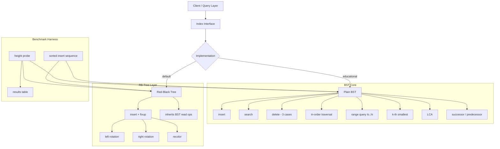

# Build Your Own In-Memory Database Index

## 1. Motivation & Real-World Context

Every time you run `SELECT * FROM orders WHERE created_at BETWEEN '2024-01-01' AND '2024-03-31'`, the database does not scan every row. It descends a tree. Understanding exactly which tree, and why, is the difference between writing queries that are fast by design and queries that are fast by accident.

**SQLite's B-tree indexes.** SQLite stores every index as a B-tree whose pages are read into memory during a query. The in-memory subtrees involved in a range scan are essentially the same BST range-query algorithm you will implement here, just paged from disk. When you understand in-order traversal and the [lo, hi] range query, you understand why `WHERE last_name = 'Smith'` can use an index on `(last_name)` but cannot use an index on `(first_name, last_name)` — the tree is sorted by first name first. The last name values are scattered across the entire tree.

**Redis sorted sets.** `ZADD`, `ZRANGEBYSCORE`, and `ZRANK` are the API surface of a skip list (probabilistically equivalent to a balanced BST) maintained in sorted order. When you call `ZRANGEBYSCORE leaderboard 1000 2000`, Redis performs exactly the range query [1000, 2000] you will implement — descend to the lower bound, then collect nodes until the upper bound is exceeded.

**LevelDB and RocksDB MemTable.** Before data is flushed to an SSTable on disk, it lives in a MemTable implemented as a skip list or Red-Black Tree. Every `Put` is a tree insert. Every `Get` is a tree search. The O(log n) height guarantee of a Red-Black Tree is what keeps write latency predictable even as the MemTable grows to tens of megabytes.

**The composite index lesson.** A BST on `(first_name, last_name)` compares tuples lexicographically: first by first name, then by last name as a tiebreaker. This means querying by `last_name` alone requires visiting every node — there is no subtree to prune. Building this project makes that constraint viscerally obvious rather than a rule to memorize.

---

## 2. Learning Objectives

By completing this project, you will deeply understand:

1. **BST invariants and traversal order** — why in-order traversal of a BST always yields sorted output, and how that property drives every practical use of trees in databases. See [Binary Search Tree](/data-structures/13-binary-search-tree).
2. **BST insert, search, and the three-case delete** — why deleting a two-child node requires finding the in-order successor and splicing it in, and why that operation preserves the BST property. See [BST Operations](/algorithms/21-bst-operations).
3. **Degeneration and its consequences** — why inserting a sorted sequence into a plain BST produces a linked list with O(n) height, and why databases cannot tolerate this. See [Binary Search Tree](/data-structures/13-binary-search-tree).
4. **Red-Black Tree invariants and rotations** — how four invariants constrain the tree shape to guarantee O(log n) height, and how left/right rotations plus recoloring restore those invariants after insertion. See [Red-Black Tree](/data-structures/14-red-black-tree).
5. **Range queries and their complexity** — why a BST range query [lo, hi] costs O(k + log n) rather than O(n), where k is the number of results, and what that means for database index scans. See [BST Operations](/algorithms/21-bst-operations).
6. **k-th smallest and LCA** — how to find the k-th element in sorted order in O(h + k) time using an augmented in-order traversal, and why Lowest Common Ancestor answers "which subtree contains both keys?" See [BST Operations](/algorithms/21-bst-operations).
7. **Binary search as the degenerate tree case** — how a perfectly balanced BST search and binary search over a sorted array are the same decision tree, making binary search the right mental model for tree traversal. See [Binary Search](/algorithms/07-binary-search).

---

## 3. Project Scope

**In Scope:**
- BST with insert, search, and delete (all three cases)
- In-order traversal returning sorted keys
- Successor and predecessor queries
- Range query [lo, hi] returning all keys in the range
- k-th smallest key
- Lowest Common Ancestor (LCA) of two keys
- Height and balance factor calculation
- Red-Black Tree with insert and insertion fixup (rotations + recoloring)
- `Index` abstraction wrapping either BST or RB-Tree behind a common interface
- Benchmark comparing sorted-insert height: plain BST vs RB-Tree

**Out of Scope (for v1):**
- Red-Black Tree deletion (complex; left as stretch goal)
- Disk persistence or paging
- Concurrent access / locking
- B-Tree or B+ Tree (separate project)
- Composite key (multi-column) indexes
- Augmented trees for order statistics beyond k-th smallest

---

## 4. Core DSA Concepts Used

| Concept | Role in this project | Handbook Link | Difficulty |
|---------|----------------------|---------------|------------|
| Binary Search Tree | Core data structure; all index operations are built on its invariant | [/data-structures/13-binary-search-tree](/data-structures/13-binary-search-tree) | Beginner |
| BST Operations (insert/delete/search/successor/LCA) | The full operational vocabulary that makes a BST useful as an index | [/algorithms/21-bst-operations](/algorithms/21-bst-operations) | Intermediate |
| Red-Black Tree | Self-balancing variant that guarantees O(log n) height regardless of insert order | [/data-structures/14-red-black-tree](/data-structures/14-red-black-tree) | Advanced |
| Self-Balancing Tree Algorithms | Rotations and recoloring that restore RB-Tree invariants after mutation | [/algorithms/23-self-balancing-trees](/algorithms/23-self-balancing-trees) | Advanced |
| Binary Search | Conceptual foundation; a balanced BST search is binary search expressed as a tree | [/algorithms/07-binary-search](/algorithms/07-binary-search) | Beginner |
| N-ary Tree | Generalization that motivates why BSTs keep branching factor at 2 for simplicity | [/data-structures/13-binary-search-tree](/data-structures/13-binary-search-tree) | Beginner |

---

## 5. High-Level Architecture

The project has three layers: the raw BST implementation, the Red-Black Tree extending it, and an `Index` abstraction that a database client would interact with.

**Key interfaces:**

- `Node[K]` — holds `Key K`, `Left *Node[K]`, `Right *Node[K]`, `Parent *Node[K]`. RB-Tree nodes additionally carry `Color` (Red/Black).
- `Index[K]` interface — `Insert(key K)`, `Search(key K) bool`, `Delete(key K)`, `RangeQuery(lo, hi K) []K`, `KthSmallest(k int) K`, `InOrder() []K`.
- The sentinel `nil`-node pattern for RB-Trees: a single shared black node `NIL` is used as the leaf sentinel. All null checks become comparisons to this sentinel, eliminating special-case nil handling in rotation code.

---

## 6. Implementation Milestones (with Hints)

### Milestone 1: Plain BST with Insert, Search, Delete, and In-Order Traversal

**Goal:** Implement a generic BST that correctly handles all three delete cases and produces sorted output from in-order traversal.

**Key Challenges:**
- Delete with two children: do not simply copy the successor's key and delete it naively. You must find the in-order successor (leftmost node in the right subtree), copy its key up, then delete the successor node — which itself has at most one child (no left child by definition), making it a simpler case.
- Correctly updating parent pointers. If you use a parent pointer, the transplant operation that replaces one subtree with another must fix three pointer directions: the parent's child pointer, the new subtree's parent pointer, and the case where the replaced node is the root.
- In-order traversal using an explicit stack (iterative) to avoid stack overflow on large trees.

**Hints & Guidance:**
- Define a `transplant(u, v *Node)` helper: replaces node `u` with node `v` in the tree. This is used by delete in all three cases and makes the logic dramatically cleaner.
- For in-order traversal: push left spine to the stack, pop, visit, then push the right child's left spine. This produces sorted order without recursion.
- Test delete by running 1,000 random inserts followed by 1,000 random deletes and verifying that in-order traversal of the remaining nodes is still sorted and contains exactly the expected keys.

**Success Criteria:**
- In-order traversal of any sequence of inserts returns a sorted slice.
- Delete correctly handles leaf nodes, one-child nodes, and two-child nodes.
- Search returns false for deleted keys.
- Tree remains a valid BST after every operation (write a validity checker that recursively asserts `left.Key &lt; node.Key &lt; right.Key`).

---

### Milestone 2: Successor, Predecessor, k-th Smallest, Range Query, and LCA

**Goal:** Add the five operations that make a BST useful as a database index beyond simple lookup.

**Key Challenges:**
- Successor when the node has a right subtree: leftmost node of the right subtree. Successor when no right subtree: walk up via parent pointers until you come from a left child. If you never come from a left child, there is no successor (node is the maximum).
- k-th smallest without augmentation (no subtree-size field): use in-order traversal with a counter. O(h + k) time.
- Range query [lo, hi]: the key insight is pruning. When visiting a node with key `v`: if `v &lt; lo`, the entire left subtree is too small — only recurse right. If `v > hi`, the entire right subtree is too large — only recurse left. If `lo &lt;= v &lt;= hi`, include `v` and recurse both. This gives O(k + log n) rather than O(n).
- LCA: if both keys are less than the current node, the LCA is in the left subtree. If both are greater, it is in the right subtree. Otherwise, the current node is the LCA. This only works if both keys exist in the tree — validate that first.

**Hints & Guidance:**
- Range query [lo, hi] can be implemented as a recursive function `collect(node, lo, hi, results)` that accumulates results into a slice. The pruning conditions are the performance-critical part.
- For LCA: a clean iterative implementation starts at the root and descends. At each node, check whether both keys are on the same side. If so, descend that side. The first node where they diverge is the LCA.

**Success Criteria:**
- `RangeQuery(3, 7)` on a tree containing `{1,2,3,4,5,6,7,8,9}` returns `[3,4,5,6,7]` in sorted order.
- `KthSmallest(1)` returns the minimum; `KthSmallest(n)` returns the maximum.
- `Successor` of the maximum returns a not-found indicator; `Predecessor` of the minimum likewise.
- Range query on 100,000 nodes returning 100 results completes noticeably faster than a full in-order traversal with filtering.

---

### Milestone 3: Height, Balance Factor, and Degeneration Visualization

**Goal:** Measure tree height and demonstrate why sorted inserts destroy BST performance, motivating the need for self-balancing.

**Key Challenges:**
- Height of an empty tree is conventionally -1; height of a single node is 0. Be consistent.
- Balance factor of a node: `height(left) - height(right)`. A perfectly balanced BST has balance factor 0 at every node. An AVL tree allows -1, 0, +1. A degenerated BST has balance factor n-1 at the root.

**Hints & Guidance:**
- Insert `[1, 2, 3, ..., 10000]` in order into a plain BST. Call `Height()`. It should return 9999 (a right-skewed linked list). Print this alongside `math.Log2(10000) ≈ 13`, the expected height of a balanced tree.
- Generate a table: for n in `{100, 1000, 10000, 100000}`, insert sorted sequence, measure height, measure average search time, and print. The O(n) degradation should be unmistakable.
- Also test with shuffled input to show that random insert order produces near-logarithmic height.

**Success Criteria:**
- `Height()` returns the correct height for manually constructed trees of depth 0, 1, and 5.
- A sorted insert sequence of n keys produces height n-1 for plain BST.
- A random insert sequence of 10,000 keys produces height in the range [13, 40] (empirically typical).
- Output a printed comparison table showing sorted vs random insert height.

---

### Milestone 4: Red-Black Tree with Insertion Fixup

**Goal:** Implement RB-Tree insert that maintains all four Red-Black invariants: (1) every node is red or black, (2) the root is black, (3) red nodes have only black children, (4) every path from any node to a descendant nil-leaf has the same number of black nodes.

**Key Challenges:**
- There are four insertion fixup cases. After inserting a red node, if its parent is also red, invariant 3 is violated. The cases are determined by the color of the uncle node (parent's sibling) and whether the new node is a left or right child.
- Case 1 (uncle is red): recolor parent and uncle to black, grandparent to red. Move the fixup pointer to the grandparent and repeat.
- Case 2 (uncle is black, new node is inner grandchild): rotate the parent in the direction that makes the new node an outer grandchild. Fall through to Case 3.
- Case 3 (uncle is black, new node is outer grandchild): rotate grandparent in the opposite direction, swap colors of parent and grandparent. Fixup complete.
- The sentinel NIL node must be treated as black in all color checks. Using a real allocated sentinel simplifies code over null checks.

**Hints & Guidance:**
- Define `leftRotate(x)` and `rightRotate(x)`. These are symmetric. Implement one, then derive the other by swapping left/right. Test rotations in isolation before calling them from fixup.
- The fixup loop has a left-case and a symmetric right-case (determined by whether the parent is its grandparent's left or right child). Write the left-case fully first, then duplicate and swap left/right for the right-case.
- After the fixup loop, always force the root to black: `tree.root.color = Black`. This handles the case where fixup colors the root red.

**Success Criteria:**
- After 10,000 sorted inserts, the RB-Tree height is at most `2 * log2(10001) ≈ 28` (the RB-Tree height bound is 2 * log2(n+1)).
- A validator that checks all four invariants passes after every insert in a test suite of 10,000 random inserts.
- In-order traversal of the RB-Tree after 10,000 random inserts returns a sorted slice.
- RB-Tree height for sorted inserts stays under 30 for n=10,000 (vs 9,999 for plain BST).

---

### Milestone 5: Index Abstraction for Database-Style Operations

**Goal:** Define an `Index[K]` interface and implement it over both BST and RB-Tree. Show that both expose the same API, but RB-Tree is safe for production use.

**Key Challenges:**
- The interface must expose `Insert`, `Search`, `Delete`, `RangeQuery`, `InOrder`, and `KthSmallest` — the operations a database query engine needs from an index.
- Delete is not implemented in the RB-Tree (stretch goal). The interface should either exclude it for RB-Tree or return an unimplemented error. Be explicit about this limitation.

**Hints & Guidance:**
- In Go: define `type Index[K constraints.Ordered] interface { Insert(K); Search(K) bool; RangeQuery(K, K) []K; InOrder() []K; KthSmallest(int) K }`.
- Write a generic test function `testIndex[K constraints.Ordered](t *testing.T, idx Index[K])` that runs the same correctness suite against any implementation. This lets you test BST and RB-Tree with the same test code.
- In C#: define `IIndex&lt;K&gt; where K : IComparable&lt;K&gt;` with the same methods. Use `abstract class IndexBase&lt;K&gt;` for shared logic.

**Success Criteria:**
- Both `BSTIndex[int]` and `RBTreeIndex[int]` satisfy the `Index[int]` interface.
- The same test suite passes against both implementations.
- A simple demo prints: "Exact lookup: O(log n)", "Range scan [lo, hi]: O(k + log n)", "Ordered iteration: O(n)" — and shows the actual timing for each on 100,000 key inserts.

---

### Milestone 6: Benchmark — Sorted Inserts, O(n) vs O(log n) Height

**Goal:** Produce a concrete benchmark that shows the cost of BST degeneration and the value of RB-Tree balancing. This is the "demo slide" of the whole project.

**Key Challenges:**
- Benchmark must be fair: same keys, same insert order, same search targets, same measurement methodology.
- Measure average search time per lookup (not total insert time), since search performance is what degrades with height.

**Hints & Guidance:**
- For each n in `{1000, 10000, 100000}`: insert keys `[1..n]` in sorted order into both trees. Then perform 10,000 searches for random keys and measure average time.
- Print: `n | BST height | RBT height | BST avg search (ns) | RBT avg search (ns)`.
- The BST search times should scale linearly with n. The RBT search times should scale logarithmically.
- Additionally, insert the same keys in random order and show that random-order BST performance approaches RBT performance — confirming that it is sorted insert order, not the BST data structure itself, that is pathological.

**Success Criteria:**
- For n=100,000 sorted inserts: BST height ≈ 99,999; RBT height ≤ 34.
- BST average search time for sorted inserts scales at least 50x from n=1,000 to n=100,000.
- RBT average search time for sorted inserts scales at most 2x over the same range.
- Output table is printed to stdout and is visually clear.

---

## 7. Stretch Goals

1. **RB-Tree deletion.** Implement the full deletion with fixup. There are six cases (three + symmetric mirror) for restoring the double-black invariant. This is the hardest single algorithm in the handbook and is rarely implemented from scratch outside of a compiler or database codebase.
2. **AVL Tree alternative.** Implement an AVL Tree (balance factor strictly in {-1, 0, 1}) and benchmark it against RB-Tree. AVL trees are more rigidly balanced and thus faster for read-heavy workloads; RB-Trees require fewer rotations and are faster for write-heavy workloads.
3. **Order-statistic tree.** Augment each BST node with a `SubtreeSize int` field. Update it on every insert and delete. Now `KthSmallest` runs in O(log n) instead of O(h + k), and you can answer "rank of key X" in O(log n) — the same operation Redis ZRANK performs.
4. **Composite key index.** Define a `CompositeKey[A, B comparable]` type with lexicographic ordering. Index tuples like `(first_name, last_name)`. Write a query that demonstrates why `WHERE last_name = 'Smith'` cannot use this index efficiently.
5. **Persistent (copy-on-write) BST.** Instead of mutating nodes, return a new root on every insert/delete, sharing unchanged subtrees. This gives you an immutable, version-history-capable tree — the basis of persistent functional data structures and some MVCC database designs.

---

## 8. Testing & Validation Strategy

**Structural invariant checker (run after every mutation in tests):**
- BST property: for every node, all keys in its left subtree are strictly less than its key, and all keys in its right subtree are strictly greater.
- RB-Tree property checker: (1) every node is red or black, (2) root is black, (3) no red node has a red child, (4) every root-to-nil path has the same black-height. Run this recursively and return the black-height (or -1 on violation).

**Correctness tests:**
- Insert `{5, 3, 7, 1, 4, 6, 8}` in order; verify in-order traversal returns `[1, 3, 4, 5, 6, 7, 8]`.
- Delete the root (two-child case); verify BST invariant still holds.
- Delete a leaf; verify tree size decrements by 1.
- `RangeQuery(3, 6)` on the above tree returns `[3, 4, 5, 6]`.
- `KthSmallest(1) == 1`, `KthSmallest(7) == 8`.
- `LCA(1, 4)` returns `3`; `LCA(1, 8)` returns `5`.

**Property-based / randomized tests:**
- 1,000 trials: insert 500 random integers, delete 100 random integers, verify in-order output is sorted and contains exactly the expected keys.
- For every trial, run the RB-Tree invariant checker and fail immediately on any violation.

**Performance tests:**
- 10,000 sorted inserts into RB-Tree: height must remain ≤ `2 * ceil(log2(10001))`.
- Range query returning 100 results from a tree of 100,000 nodes must complete in under 50 microseconds.

---

## 9. C# and Go Implementation Notes

### C#

- `SortedSet&lt;T&gt;` and `SortedDictionary&lt;K, V&gt;` in the BCL are both Red-Black Trees internally. Implement from scratch to understand rotations — then compare your results to BCL for correctness validation.
- Use `Nullable&lt;T&gt;` or a sentinel node instance for empty/nil nodes. A sentinel `static readonly Node&lt;K&gt; NIL = new Node&lt;K&gt; { Color = Color.Black }` simplifies null checks in rotation code: every check becomes `node != NIL` instead of `node != null`.
- For generics: `class BSTNode&lt;K&gt; where K : IComparable&lt;K&gt;`. Use `key.CompareTo(node.Key)` returning `&lt; 0`, `== 0`, or `> 0` for three-way comparison.
- Enum for color: `enum Color { Red, Black }`. Avoid `bool IsRed` — it reads poorly in rotation code.
- Stack-based iterative in-order traversal avoids `StackOverflowException` for large trees. The recursive version will overflow at approximately 10,000 sorted inserts (which produce a 10,000-deep call stack).

### Go

- No tree in the standard library. Use a sentinel nil-node: `var nilNode = &Node[K]{color: Black}`. Initialize both child pointers and the parent pointer of every new node to `nilNode`, not `nil`. This eliminates all nil-pointer panics in rotation code.
- Generics: `type BST[K constraints.Ordered] struct { root *Node[K] }`. The `constraints.Ordered` constraint (from `cmp` package in Go 1.21+) covers all integer, float, and string types.
- The three-way comparison pattern: `switch { case key &lt; node.key: ...; case key > node.key: ...; default: ... }`.
- For the benchmark, use `testing.B` with `b.ResetTimer()` after tree construction. For the printed comparison table, use `fmt.Printf("%-10d %-12d %-12d\n", n, bstHeight, rbtHeight)` for alignment.
- Avoid pointer-to-interface patterns. Keep `*BST[K]` as a concrete type and write the benchmark driving both trees directly.

---

## 10. Potential Extensions & Related Projects

1. **Build Your Own Persistent Key-Value Store** — extend this in-memory index to support disk persistence. The RB-Tree becomes the MemTable; flushing to sorted SSTable files on disk is the next step. This is exactly what LevelDB does. See project 11.
2. **Build Your Own Skip List** — skip lists are a probabilistic alternative to balanced BSTs with the same O(log n) expected complexity but simpler insertion logic. Redis sorted sets use skip lists rather than RB-Trees. Comparing them directly reveals the trade-offs between deterministic and probabilistic balancing.
3. **Build Your Own B-Tree** — when the index does not fit in memory, tree nodes become disk pages and the branching factor increases from 2 to hundreds. The B-Tree generalizes everything in this project to multi-level paging. See project 11.
4. **Build Your Own Order-Statistic Tree** — augment the RB-Tree with subtree sizes to support rank queries in O(log n). This is the data structure behind `ZRANK` in Redis and `nth_value()` window functions in SQL.
5. **Build Your Own AVL Tree** — stricter balance condition (height difference ≤ 1 at every node) means more rotations on write but shallower trees on read. Benchmarking AVL vs RB-Tree on a read-heavy vs write-heavy workload reveals a concrete trade-off to quote in interviews.
