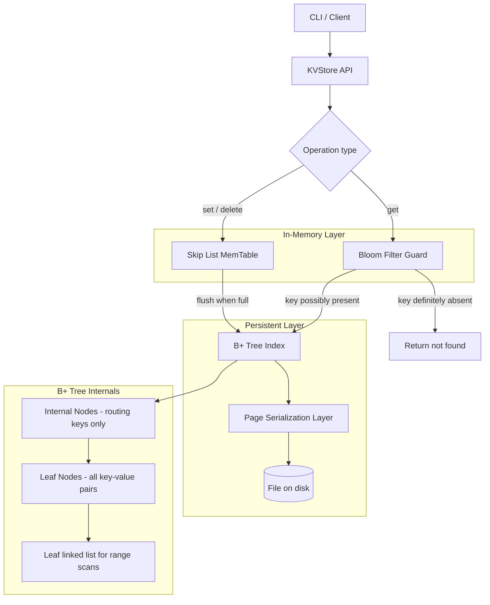

# Build Your Own Persistent Key-Value Store

## 1. Motivation & Real-World Context

Every database, cache, and message queue that exists in production is, at its lowest level, a machine that maps keys to values and stores that mapping durably. Understanding the data structures underneath demystifies why some systems are fast on writes, others on reads, and why the choice of storage engine is the most consequential architectural decision in a database.

**BoltDB / bbolt.** etcd, the distributed key-value store that powers Kubernetes' cluster state, uses bbolt (a pure-Go B-tree implementation) as its storage engine. Every Kubernetes object — every Pod, Service, Deployment — is stored as a key-value pair in a B-tree on disk. bbolt's B-tree maps directly to the structure you will implement: nodes of up to 2t-1 keys, split on overflow, with all data in leaf nodes for efficient range scans.

**LevelDB and RocksDB.** RocksDB (used by MySQL's MyRocks engine, CockroachDB, TiDB, and Kafka's log compaction) uses an LSM (Log-Structured Merge) tree: writes go first into a MemTable (a skip list), then are flushed to sorted SSTable files on disk. Before a flush, a `Get` must check the MemTable first, then each SSTable level. A Bloom filter guards every SSTable: if the filter says the key is definitely absent, the expensive disk read is skipped entirely. You will implement all three components.

**Redis.** Redis is the most widely deployed in-memory key-value store in the world. Its `HSET`, `GET`, and `DEL` commands are the same operations you will expose from your CLI. Redis uses a hash table for O(1) average-case lookups and a skip list for sorted sets. The skip list is an alternative to the B-tree for in-memory use: probabilistically balanced, simpler to implement, with the same O(log n) expected complexity.

**SQLite.** SQLite stores every table and index as a B-tree within a single file. The page size (default 4096 bytes) determines the branching factor. Understanding why a B-tree with branching factor t=100 has height log₁₀₀(n) — meaning 5 levels for a billion keys — is understanding why SQLite is fast despite being file-based.

---

## 2. Learning Objectives

By completing this project, you will deeply understand:

1. **Skip list structure and probabilistic balancing** — how a multi-level linked list achieves O(log n) expected search, insert, and delete without any explicit rebalancing, and why p=0.5 is the standard level promotion probability. See [Skip List](/data-structures/19-skip-list).
2. **B-Tree node structure and the split-on-overflow invariant** — why every non-root node must have at least t-1 keys, why splits propagate upward, and what it means for a tree of height h to guarantee at least t^h leaf nodes. See [B-Tree / B+ Tree](/data-structures/18-btree-bplustree).
3. **B+ Tree leaf-linked-list and range scans** — why real databases use B+ Trees rather than B-Trees: internal nodes hold only routing keys, all data lives in leaves, and leaves form a linked list for O(k + log n) range scans. See [B-Tree / B+ Tree](/data-structures/18-btree-bplustree).
4. **Bloom filter false positive rate and the k-hash trade-off** — how a bit array of m bits with k hash functions achieves a configurable false positive rate, and why false negatives are impossible by construction. See [Bloom Filter](/data-structures/24-bloom-filter) and [Bloom Filter Algorithm](/algorithms/45-bloom-filter-alg).
5. **Hashing as the O(1) lookup primitive** — how open addressing and separate chaining differ, what load factor controls collision rate, and why a good hash function is a prerequisite for all of the above. See [Hashing](/algorithms/18-hashing).
6. **Page-based serialization** — how to map a tree node to a fixed-size byte buffer, write it to a specific file offset, and read it back — the same operation SQLite performs for every B-tree access.
7. **The MemTable pattern** — how separating fast in-memory writes (skip list or RB-Tree) from durable on-disk reads (sorted files + Bloom filters) enables high write throughput without sacrificing read performance.

---

## 3. Project Scope

**In Scope:**
- Skip list with insert, search, and delete (probabilistic level assignment, p=0.5)
- B-Tree with insert (proactive split on the way down) and search
- B+ Tree with leaf-linked-list for range scans
- Bloom filter with k configurable hash functions (double hashing technique)
- In-memory key-value store backed by B+ Tree
- Page serialization: write tree nodes as fixed-size byte pages to a file
- CLI: `set key value`, `get key`, `range key1 key2`, `delete key`

**Out of Scope (for v1):**
- Write-ahead log (WAL) or crash recovery
- Concurrent access / locking (single-threaded v1)
- LSM-tree compaction
- Variable-length values (use fixed 256-byte values for simplicity)
- Deletion in B-Tree (node merging and rotation; stretch goal)
- Custom hash function design (use standard library hash + seeded variations)

---

## 4. Core DSA Concepts Used

| Concept | Role in this project | Handbook Link | Difficulty |
|---------|----------------------|---------------|------------|
| Skip List | In-memory ordered structure for the MemTable layer; same asymptotic complexity as balanced BST with simpler implementation | [/data-structures/19-skip-list](/data-structures/19-skip-list) | Intermediate |
| B-Tree / B+ Tree | On-disk (and in-memory) ordered structure; high branching factor minimizes tree height and disk seeks | [/data-structures/18-btree-bplustree](/data-structures/18-btree-bplustree) | Advanced |
| Hashing | Underlies Bloom filter and can be used as an alternative O(1) lookup layer for exact key matches | [/algorithms/18-hashing](/algorithms/18-hashing) | Intermediate |
| Bloom Filter | Guards disk reads: definitively eliminates keys that don't exist, avoiding expensive I/O | [/data-structures/24-bloom-filter](/data-structures/24-bloom-filter) | Intermediate |
| Bloom Filter Algorithm | k-hash design, false positive rate formula, optimal k for given m and n | [/algorithms/45-bloom-filter-alg](/algorithms/45-bloom-filter-alg) | Intermediate |
| Array | Underlying storage for Bloom filter bit array and B-Tree key/child arrays within each node | [/data-structures/02-dynamic-array](/data-structures/02-dynamic-array) | Beginner |

---

## 5. High-Level Architecture

The store has four components: a skip list for fast in-memory ordered access, a B+ Tree for the persistent ordered layer, a Bloom filter guard, and a serialization layer for page I/O.

**Key interfaces:**

- `SkipList[K, V]` — `Insert(k K, v V)`, `Search(k K) (V, bool)`, `Delete(k K) bool`, `Range(lo, hi K) []KVPair[K, V]`. Each node holds a value and a slice of forward pointers of length equal to the node's level.
- `BPlusTree[K, V]` — `Insert(k K, v V)`, `Search(k K) (V, bool)`, `RangeScan(lo, hi K) []KVPair[K, V]`. Internally, all insert paths proactively split full nodes on the way down (avoids a second pass upward).
- `BloomFilter` — `Add(key []byte)`, `MightContain(key []byte) bool`. Backed by a `[]uint64` bit array. Uses double hashing: `h(i, key) = (h1(key) + i*h2(key)) % m` to generate k independent hash positions.
- `PageStore` — `WritePage(pageID int, data []byte) error`, `ReadPage(pageID int) ([]byte, error)`. Wraps a file with fixed page size (e.g., 4096 bytes). B+ Tree node serialization converts a node to exactly one page.

---

## 6. Implementation Milestones (with Hints)

### Milestone 1: Skip List with Insert, Search, and Delete

**Goal:** Implement a skip list that maintains keys in sorted order and supports all three operations in O(log n) expected time.

**Key Challenges:**
- Level assignment: on each insert, flip a coin (rand &lt; 0.5) to decide whether to promote the node to the next level. Stop when the coin says "no" or the maximum level is reached. The maximum level is typically `log₂(maxExpectedElements)` — use 16 or 32 for a general implementation.
- The `update` array during insert and delete: before modifying the list, scan downward from the highest level and record, for each level, the rightmost node whose forward pointer at that level needs to be updated. This array is how you splice in or out a node without a second pass.
- Delete: after finding the target node using the `update` array, splice it out by setting `update[i].forward[i] = target.forward[i]` for each level i where `update[i].forward[i] == target`. Then shrink the header's level if the top levels became empty.

**Hints & Guidance:**
- Use a header sentinel node with the maximum number of forward pointer slots, all initialized to nil. The header is never removed and does not hold a real key.
- For search: start at the highest occupied level of the header, move forward while the next node's key is less than the target, drop a level when the next node's key is greater than or equal to the target. When at level 0, check if the next node equals the target.
- Write `Range(lo, hi K) []KVPair` by finding the first node with key >= lo using normal search descent, then following level-0 forward pointers until key > hi.

**Success Criteria:**
- Insert `{5, 2, 8, 1, 3, 7, 9}` in any order; in-order traversal via level-0 forward pointers returns `[1, 2, 3, 5, 7, 8, 9]`.
- `Range(3, 7)` returns `[3, 5, 7]`.
- Delete a key that does not exist returns false without modifying the list.
- After 10,000 random inserts and 5,000 random deletes, the list contains exactly the expected keys in sorted order.

---

### Milestone 2: B-Tree with Insert and Search

**Goal:** Implement a B-Tree with minimum degree t=3 (up to 5 keys per node). Use proactive splitting: split full nodes on the way down during insert, so the insertion path always has room.

**Key Challenges:**
- B-Tree node: `keys []K` (up to 2t-1 entries), `children []*BTreeNode[K]` (up to 2t entries for internal nodes), `isLeaf bool`. A leaf node has no children.
- Splitting a full node: when a node has 2t-1 keys, promote the median key (index t-1) up to the parent, and split the 2t-1 keys and 2t children into two nodes of t-1 keys each. The parent gets a new child pointer for the right half.
- Proactive split on the way down: before descending into a child, check if the child is full. If it is, split it before descending. This ensures there is always room to insert without backtracking.
- Root split: when the root is full and needs splitting, create a new root with the median as its only key and the two halves as children. The tree grows in height by 1.

**Hints & Guidance:**
- Implement `splitChild(parent *BTreeNode, i int)` that splits `parent.children[i]` (which must be full). This is the single most important operation to get right — test it exhaustively.
- The insert algorithm: call `insertNonFull(node, key)` which assumes `node` is not full. If the root is full, split it first, then call `insertNonFull` on the new root.
- `insertNonFull`: if the node is a leaf, insert the key in sorted position. If the node is internal, find the child to descend into, split it if full, then recurse.

**Success Criteria:**
- Insert `[1..10]` in order; a tree with t=3 should have height 1 (a root with the median key promoted from one split, two leaf children).
- Search for every inserted key returns true; search for any non-inserted key returns false.
- Write a validator that checks: every non-root internal node has at least t-1 keys, every node has at most 2t-1 keys, all keys in a node are sorted, all keys in left child are less than the separating key, all keys in right child are greater.

---

### Milestone 3: B+ Tree with Leaf-Linked-List for Range Scans

**Goal:** Extend the B-Tree to a B+ Tree: all values live in leaf nodes, internal nodes hold only routing (separator) keys, and leaf nodes are linked as a doubly or singly linked list.

**Key Challenges:**
- In a B+ Tree, when a leaf node splits, the separator key pushed up to the parent is a copy of the new right leaf's smallest key — it stays in the left leaf too. In a B-Tree, the promoted median is removed from the node. This is a critical structural difference.
- After inserting and building the tree, leaf nodes must all be linked: the rightmost leaf of the left half must point to the leftmost leaf of the right half. During a split, wire `leftLeaf.next = rightLeaf` before completing the split.
- Range scan: descend to the leaf containing the lower bound using normal tree search, then follow `next` pointers across leaves until the upper bound is exceeded.

**Hints & Guidance:**
- Add a `next *BPlusLeaf[K, V]` pointer to leaf nodes only. Internal nodes do not need it.
- `RangeScan(lo, hi K)`: find the leaf that would contain `lo` (the search descends to a leaf regardless of whether `lo` exists). Then scan leaf values while `currentKey &lt;= hi`, following `next` pointers when a leaf is exhausted.
- Verify by inserting 1..1000 in random order, then calling `RangeScan(100, 200)` and confirming 101 results in sorted order.

**Success Criteria:**
- `RangeScan(lo, hi)` returns all keys in [lo, hi] in sorted order.
- Range scan is measurably faster than "search for each key individually from the root" for ranges containing 100+ keys.
- All leaf nodes reachable via the `next` linked list contain keys in sorted order with no gaps.
- Leaves are fully linked: traversing all leaves from leftmost to rightmost via `next` pointers yields all inserted keys in sorted order.

---

### Milestone 4: Bloom Filter Guard Layer

**Goal:** Implement a Bloom filter and place it in front of the B+ Tree lookup path to eliminate disk reads (or tree traversals) for keys that are definitely absent.

**Key Challenges:**
- Choosing m (bit array size) and k (number of hash functions): for a desired false positive rate p and expected n keys, optimal values are `m = -n * ln(p) / (ln 2)²` and `k = (m/n) * ln 2`. For p=0.01 and n=100,000: m ≈ 958,506 bits ≈ 117 KB, k ≈ 7.
- Double hashing to simulate k independent hash functions: compute two base hashes `h1` and `h2` using two different seeds (or algorithms), then derive k positions as `(h1 + i*h2) % m` for i in 0..k-1.
- The Bloom filter has no delete operation (a deleted key's bits may be shared with other keys). This is acceptable for the MemTable pattern where the filter is rebuilt on flush.

**Hints & Guidance:**
- Use a `[]uint64` as the underlying bit array. To set bit i: `bits[i/64] |= 1 &lt;&lt; (i % 64)`. To test bit i: `(bits[i/64] >> (i % 64)) & 1 == 1`.
- For hash functions: use the FNV-1a or xxHash algorithm seeded with different values. In Go, `maphash.Hash` with different seeds is sufficient. In C#, use `HashCode.Combine` variants or a custom Murmur3 implementation.
- After building the filter from all currently stored keys, a lookup sequence is: (1) check Bloom filter — if definitely absent, return not-found immediately; (2) if possibly present, search the B+ Tree.

**Success Criteria:**
- Zero false negatives: every key that was added to the Bloom filter must return `MightContain = true`.
- False positive rate measured over 100,000 non-inserted keys is less than 2% (with m and k configured for 1% target).
- A benchmark shows that Bloom filter rejection of absent keys is at least 10x faster than a B+ Tree lookup that descends to a leaf.

---

### Milestone 5: Page Serialization and File-Based Persistence

**Goal:** Serialize B+ Tree nodes as fixed-size pages and write them to a file. On startup, read the file back and reconstruct the tree.

**Key Challenges:**
- Fixed page size means a node must always fit in one page. With page size 4096 bytes, 4-byte keys, 4-byte child page IDs, and 256-byte values, a leaf node holds approximately 14 key-value pairs. This determines the minimum degree t.
- Node format: `[isLeaf: 1 byte] [numKeys: 2 bytes] [keys: numKeys * keySize bytes] [values or childPageIDs: ...]`. All integers in little-endian byte order.
- The root page is always page 0. On startup, read page 0 first. If the file is new or empty, initialize a new tree.
- Free page management: maintain a free-page list (stored in a special page) so deleted nodes can be reused. For v1, simply append new pages to the file (no deletion).

**Hints & Guidance:**
- In Go: use `os.OpenFile` with `O_RDWR|O_CREATE`. Use `file.WriteAt(buf, int64(pageID)*pageSize)` for random-access writes. `binary.LittleEndian.PutUint32` and `binary.LittleEndian.Uint32` for serialization.
- In C#: `BinaryWriter` over a `FileStream` opened with `FileMode.OpenOrCreate`. Use `stream.Seek(pageID * pageSize, SeekOrigin.Begin)` before each page write.
- Keep an in-memory `pageCache map[int]*BPlusNode` to avoid redundant file reads during a single operation. Invalidate on write.

**Success Criteria:**
- Insert 1,000 key-value pairs, close the store, reopen from the same file, and verify all keys are still present.
- The file size is exactly `numPages * pageSize` bytes.
- A `ReadPage` followed by immediate `WritePage` of the same data is idempotent (file content unchanged).

---

### Milestone 6: CLI — `set`, `get`, `range`, `delete`

**Goal:** Build a command-line interface that exposes the full key-value store and demonstrates all implemented operations interactively.

**Key Challenges:**
- Parsing the `range key1 key2` command requires splitting on whitespace and handling quoted keys with spaces.
- The CLI must properly close and flush the store on exit (SIGINT/Ctrl-C) to avoid a partially-written last page.

**Hints & Guidance:**
- Use a REPL loop: read a line, parse the command word, dispatch to the appropriate store method, print the result.
- Command format: `set &lt;key&gt; &lt;value&gt;`, `get &lt;key&gt;`, `range &lt;lo&gt; &lt;hi&gt;`, `delete &lt;key&gt;`, `quit`.
- On `get`, print `&lt;key&gt; => &lt;value&gt;` if found, or `(not found)` if absent.
- On `range`, print each key-value pair on its own line, followed by a count: `(3 results)`.
- Trap `os.Interrupt` (Go) or `Console.CancelKeyPress` (C#) to flush and close before exit.

**Success Criteria:**
- The CLI starts, accepts commands, and responds correctly for all five operations.
- After `set a 1`, `set b 2`, `set c 3`, `range a b` returns `a => 1` and `b => 2`.
- Restarting the CLI and calling `get a` returns `1` (data was persisted).
- Calling `delete b` followed by `get b` returns `(not found)`.

---

## 7. Stretch Goals

1. **B-Tree deletion with node merging.** Implement the delete operation with borrow-from-sibling and merge-with-sibling cases. This is the symmetric partner to the split-on-overflow insert strategy and completes the B-Tree implementation.
2. **Write-ahead log (WAL).** Before writing any page, append the operation to a sequential log file. On startup, replay the log to recover from a crash mid-write. This is how PostgreSQL and SQLite achieve crash safety.
3. **LRU page cache.** Add an LRU cache of N pages so that frequently accessed nodes (especially the root and upper levels) stay in memory without repeated file reads. This mirrors the buffer pool in a real database.
4. **Concurrent reads with RWMutex.** Allow multiple goroutines or threads to call `Get` simultaneously while serializing `Set` and `Delete`. Implement fine-grained locking at the page level for bonus points.
5. **Benchmarking against BoltDB/bbolt.** Insert the same dataset into your B+ Tree and into bbolt (Go) or SQLite (C#). Compare insertion throughput and range scan latency. Document where the gap comes from (WAL, page cache, concurrency).

---

## 8. Testing & Validation Strategy

**Skip list tests:**
- After n random inserts, verify in-order traversal via level-0 pointers returns n sorted, distinct keys.
- `Range(lo, hi)` returns exactly the keys in [lo, hi], no more, no less.
- 1,000 trials of 100 random inserts + 50 random deletes: list always contains exactly the expected keys.

**B+ Tree structural validator:**
- Every internal node has between t-1 and 2t-1 keys (except the root, which may have as few as 1).
- All keys in each node are sorted.
- For every internal node key k at index i: all keys in `children[i]` are less than k, all keys in `children[i+1]` are greater than or equal to k.
- All leaf nodes are reachable from the root and from the leaf linked list; both paths yield identical key sets.

**Bloom filter tests:**
- Zero false negatives: add 10,000 keys, check all 10,000 — all must return `MightContain = true`.
- Empirical false positive rate: check 100,000 non-inserted keys, count positives, verify rate &lt; 2%.
- After computing optimal m and k for n=10,000 and p=0.01, verify the filter size is within 10% of the theoretical optimum.

**Persistence tests:**
- Insert 500 keys, call `Close()`, create a new store instance over the same file, verify all 500 keys are present and all lookups return correct values.
- Simulate a crash by calling `os.Exit(1)` after writing 250 keys; verify the file is not corrupted and the 250 committed keys are still readable.

---

## 9. C# and Go Implementation Notes

### C#

- Use `byte[]` for serialized page buffers. `BinaryWriter` and `BinaryReader` over `MemoryStream` for in-memory node serialization before writing the result to disk.
- `record struct KVPair&lt;K, V&gt;(K Key, V Value)` makes range scan results clean to work with and supports value equality out of the box.
- No lock needed for the single-threaded v1. For the concurrent stretch goal, use `ReaderWriterLockSlim` which allows multiple concurrent readers and one exclusive writer.
- For the Bloom filter's bit array, use `System.Collections.BitArray` for convenience, or `ulong[]` for raw bit manipulation that matches Go's implementation.
- `PriorityQueue&lt;TElement, TPriority&gt;` is in the BCL (since .NET 6) if you need a min-heap in any extension. Not needed for the core implementation.

### Go

- `encoding/binary` with `binary.LittleEndian` for all page serialization. Fixed-size types only — no variable-length encoding in page format to keep offset arithmetic simple.
- For file I/O: `os.OpenFile(path, os.O_RDWR|os.O_CREATE, 0644)`. Use `file.WriteAt` and `file.ReadAt` for page-aligned access. Avoid `bufio` wrappers — they buffer and can cause partial-page writes.
- Skip list random level: `func randomLevel(maxLevel int) int { level := 1; for level &lt; maxLevel && rand.Float64() &lt; 0.5 { level++ }; return level }`. Use a seeded `rand.Rand` for reproducible tests.
- Generics for the B+ Tree: `type BPlusTree[K constraints.Ordered, V any] struct { ... }`. The `constraints.Ordered` constraint handles key comparison with `&lt;` directly.
- `sync.RWMutex` for the concurrent stretch goal: `RLock`/`RUnlock` for reads, `Lock`/`Unlock` for writes.

---

## 10. Potential Extensions & Related Projects

1. **Build Your Own In-Memory Database Index** — this project's B+ Tree is the on-disk component; project 10 covers the in-memory BST and Red-Black Tree that serve the same role before data is flushed. Together they form a complete storage engine.
2. **Build Your Own LSM Tree** — combine the MemTable (skip list from this project), the Bloom filter, and sorted SSTable files into a full Log-Structured Merge tree with compaction. This is the architecture of LevelDB, RocksDB, and Apache Cassandra.
3. **Build Your Own Time-Series Analytics Engine** — time-series databases often use B-Tree variants partitioned by time windows, with range scans being the primary query pattern. The range scan infrastructure from this project transfers directly.
4. **Build Your Own Cache (LRU/LFU)** — building an LRU page cache on top of this project's `PageStore` introduces the interplay between the hash table (for O(1) lookup by page ID) and the doubly-linked list (for O(1) eviction order tracking).
5. **Build Your Own Distributed KV Store** — extend this single-node store with Raft consensus for leader election and log replication. etcd is exactly this: bbolt (a B-tree KV store) underneath Raft on top.
