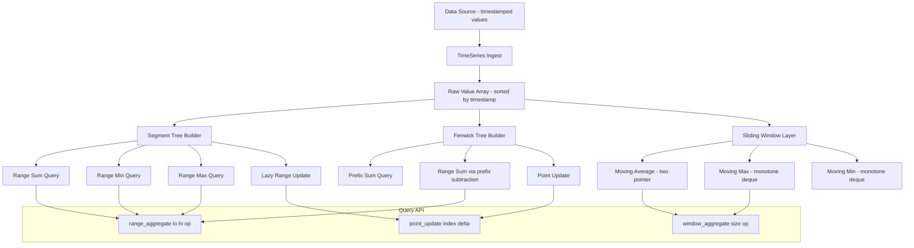

# Build Your Own Time-Series Analytics Engine

## 1. Motivation & Real-World Context

Every monitoring system, financial data feed, and IoT platform is fundamentally the same problem: a stream of timestamped numbers arrives continuously, and operators need to answer questions about ranges of that stream in milliseconds. The data structures that make this possible are range-query trees and sliding window algorithms — two of the most practically important ideas in competitive programming and systems engineering.

**Prometheus and Kubernetes monitoring.** Prometheus ingests time-series metrics (CPU usage, memory pressure, request latency) at fixed intervals and stores them as immutable blocks. Grafana dashboards issue PromQL queries like `avg_over_time(cpu_usage[5m])` — a range aggregate over a moving 5-minute window. The block storage layer uses range scans; the query engine evaluates sliding window functions. This project builds both layers from scratch.

**Financial systems.** Trading systems compute technical indicators like the RSI (Relative Strength Index), Bollinger Bands, and VWAP (Volume-Weighted Average Price) over rolling windows of market data. These are not simple averages — RSI requires the ratio of average gains to average losses over 14 periods, which changes with every tick. A naive O(n) recomputation per tick means a 1-second update loop over a 14-period window is cheap, but a 1-second update loop over a 10,000-period window is not. Segment trees and Fenwick trees make both cases O(log n) per update.

**ClickHouse.** ClickHouse (used by Uber, Cloudflare, and ByteDance) is a columnar analytics database optimized for range aggregate queries over time-series data. Its vectorized query execution is equivalent to batched range-sum queries over Fenwick trees, operating on hundreds of millions of rows per second. Understanding Fenwick trees tells you why columnar storage plus range aggregation is so fast.

**Gaming leaderboards.** A leaderboard of 10 million players that must answer "total score of players ranked 100 to 200" is a Fenwick tree range-sum query. The same structure also supports "rank of player X" via binary lifting on the Fenwick tree — a technique you will implement in the stretch goals.

---

## 2. Learning Objectives

By completing this project, you will deeply understand:

1. **Segment tree construction and query mechanics** — how a binary tree over an array where each node stores an aggregate for a contiguous range enables O(log n) range queries and O(log n) point updates. See [Segment Tree](/data-structures/20-segment-tree).
2. **Lazy propagation for range updates** — how to delay the application of range-assign or range-add operations until the affected subtree is actually visited, enabling O(log n) range updates instead of O(n). See [Segment Tree](/data-structures/20-segment-tree).
3. **Fenwick tree (Binary Indexed Tree) mechanics** — how the `i & (-i)` lowest-set-bit trick drives both prefix-sum updates and queries in O(log n) with a single flat array, and why this is 2-3x faster in practice than a segment tree. See [Fenwick Tree](/data-structures/21-fenwick-tree).
4. **Choosing between Fenwick and Segment Tree** — Fenwick trees support prefix queries (and thus range queries by subtraction) and point updates; segment trees additionally support range-max, range-min, and lazy range updates that Fenwick trees cannot express. See [Fenwick Tree](/data-structures/21-fenwick-tree).
5. **Sliding window for O(n) aggregates** — how a two-pointer approach computes a moving average or moving sum in O(n) total rather than O(n*k) for a window of size k, and how a monotone deque computes sliding window maximum in O(n). See [Two Pointers & Sliding Window](/fundamentals/05-two-pointers-sliding-window).
6. **Greedy interval selection** — how to choose a maximal non-overlapping set of time intervals (e.g., metric retention policies, downsampling windows) using the earliest-deadline-first greedy strategy. See [Greedy Paradigm](/fundamentals/04-greedy-paradigm).

---

## 3. Project Scope

**In Scope:**
- Segment tree for range-sum queries with point update
- Segment tree for range-min and range-max queries
- Lazy propagation for range-assign updates on the segment tree
- Fenwick tree (BIT) for prefix-sum queries and point updates
- Performance comparison: Fenwick vs Segment Tree on the same workload
- Sliding window moving average (two-pointer, O(n))
- Sliding window maximum using a monotone deque (O(n))
- `TimeSeries` data structure: ingest timestamped float values, answer range-aggregate queries over time windows
- CLI or driver that ingests a CSV of timestamped values and answers queries

**Out of Scope (for v1):**
- Persistent storage / disk-backed time series
- Concurrent ingestion
- Downsampling / data compaction
- 2D range queries (range trees)
- Fractional cascading
- Complex PromQL-style query language parsing

---

## 4. Core DSA Concepts Used

| Concept | Role in this project | Handbook Link | Difficulty |
|---------|----------------------|---------------|------------|
| Segment Tree | Core range-query structure; supports sum, min, max, and lazy range updates in O(log n) | [/data-structures/20-segment-tree](/data-structures/20-segment-tree) | Intermediate |
| Fenwick Tree (BIT) | Faster, simpler alternative for prefix-sum queries; used to benchmark against segment tree | [/data-structures/21-fenwick-tree](/data-structures/21-fenwick-tree) | Intermediate |
| Two Pointers / Sliding Window | O(n) computation of moving aggregates over a fixed-size window; baseline for time-series queries | [/fundamentals/05-two-pointers-sliding-window](/fundamentals/05-two-pointers-sliding-window) | Beginner |
| Greedy Paradigm | Optimal non-overlapping interval selection for metric retention / downsampling scheduling | [/fundamentals/04-greedy-paradigm](/fundamentals/04-greedy-paradigm) | Intermediate |

---

## 5. High-Level Architecture

The engine has three layers: the raw data ingestion and storage, the query processing layer built on Segment Tree and Fenwick Tree, and an analytics layer for sliding window operators.

**Key interfaces:**

- `SegmentTree` — built from `[]int64` of size n. Internal array of size 4n (1-indexed). Operations: `Build(arr []int64)`, `Query(l, r int) int64`, `Update(pos int, val int64)`, `RangeUpdate(l, r int, val int64)` (lazy), `QueryMin(l, r int) int64`, `QueryMax(l, r int) int64`.
- `FenwickTree` — flat `[]int64` of size n+1 (1-indexed). Operations: `Update(i int, delta int64)`, `PrefixSum(i int) int64`, `RangeSum(l, r int) int64`.
- `SlidingWindow` — stateless functions operating on `[]float64`: `MovingAverage(data []float64, k int) []float64`, `MovingMax(data []float64, k int) []float64`.
- `TimeSeries` — wraps a sorted `[]TimePoint{Timestamp int64, Value float64}`. Provides `RangeAggregate(tFrom, tTo int64, op AggOp) float64` where `AggOp` is `Sum`, `Min`, `Max`, or `Count`.

---

## 6. Implementation Milestones (with Hints)

### Milestone 1: Segment Tree for Range-Sum and Point Update

**Goal:** Build a segment tree over an array of integers that answers range-sum queries and supports point updates, each in O(log n).

**Key Challenges:**
- The segment tree is stored in a flat array of size 4n (to be safe; 2 * nextPow2(n) is the tight bound). Node at index `i` has children at `2i` and `2i+1`. The root is at index 1 (1-indexed makes the arithmetic cleaner).
- Build is O(n): recursively build left and right children, then `tree[node] = tree[2*node] + tree[2*node+1]`.
- Query [l, r]: when the current node's range is entirely inside [l, r], return the stored value. When entirely outside, return 0 (additive identity). When partially overlapping, recurse on both children and sum.
- Update at position `pos`: recurse down to the leaf, update its value, then recompute the sum on the way back up.

**Hints & Guidance:**
- Avoid using `tree[0]` — it is wasted but simplifies the index math. Use `build(node=1, lo=0, hi=n-1)`.
- The query function signature: `query(node, lo, hi, l, r int) int64`. `lo` and `hi` are the current node's covered range (not the query range). `l` and `r` are the query bounds.
- Test with a known array like `[1, 3, 5, 7, 9, 11]`: `RangeSum(2, 4)` should return `5+7+9=21`. After `Update(2, 10)` (setting index 2 to 10), `RangeSum(2, 4)` should return `10+7+9=26`.

**Success Criteria:**
- `RangeSum(l, r)` returns the correct sum for all l, r combinations on a manually verified array.
- `Update(pos, val)` correctly updates the value and all ancestor nodes in the segment tree.
- Build time for n=1,000,000 is under 100 milliseconds.
- Query and update each complete in under 1 microsecond for n=1,000,000.

---

### Milestone 2: Range-Min and Range-Max Queries

**Goal:** Extend the segment tree to support range-minimum and range-maximum queries alongside range-sum. Use a combined node struct rather than three separate trees.

**Key Challenges:**
- A single segment tree node must now store `sum int64`, `min int64`, and `max int64` for its covered range.
- The identity values differ: for sum, the identity is 0; for min, it is `math.MaxInt64`; for max, it is `math.MinInt64`. When a query range is entirely outside the current node's range, return the appropriate identity.
- Build: `tree[node].min = min(tree[2*node].min, tree[2*node+1].min)` and similarly for max.

**Hints & Guidance:**
- Define a `SegNode struct { Sum, Min, Max int64 }` and store `[]SegNode`.
- Write a `merge(a, b SegNode) SegNode` helper that combines two children into a parent. All three fields must be merged correctly. This helper is reused in build, query, and update.
- Test: on array `[4, 1, 7, 3, 5]`, `RangeMin(1, 3)` should return 1, `RangeMax(1, 3)` should return 7, `RangeSum(1, 3)` should return 11.

**Success Criteria:**
- All three query types return correct results on a manually verified array.
- A single `Query(l, r)` call returns all three aggregates simultaneously (single tree traversal).
- After a point update, all three aggregates are correctly recomputed.

---

### Milestone 3: Lazy Propagation for Range-Assign Updates

**Goal:** Add a range-assign operation: `RangeAssign(l, r int, val int64)` sets all elements in [l, r] to `val`. With lazy propagation, this runs in O(log n) rather than O(n).

**Key Challenges:**
- Lazy propagation requires a `lazy int64` field on each segment tree node plus a boolean `hasLazy bool` to distinguish "no pending update" from "pending update of 0".
- The `pushDown` operation: before recursing into children, check if the current node has a pending lazy value. If so, propagate it to both children (update their values and set their lazy fields), then clear the current node's lazy field.
- For range-assign: the node's sum becomes `val * (hi - lo + 1)` (the value times the number of covered elements), its min and max become `val`, and its lazy is set to `val`.

**Hints & Guidance:**
- Call `pushDown(node, lo, hi)` at the beginning of every `update` and `query` call when the range partially overlaps. Never forget a pushDown — this is the most common source of wrong answers with lazy propagation.
- Use a sentinel lazy value (e.g., `math.MinInt64` or `hasLazy bool`) to represent "no pending update". This avoids misinterpreting a pending update of 0 as no update.
- Test: on array `[1, 2, 3, 4, 5]`, call `RangeAssign(1, 3, 10)`, then query `RangeSum(0, 4)`. Expected: `1 + 10 + 10 + 10 + 5 = 36`.

**Success Criteria:**
- `RangeAssign(l, r, val)` correctly updates all positions in [l, r] in O(log n).
- `RangeSum`, `RangeMin`, `RangeMax` all return correct values after a mix of point updates and range assigns.
- A stress test of 100,000 random operations (mix of range assigns and queries) against a naive O(n) brute-force implementation produces identical results.

---

### Milestone 4: Fenwick Tree and Comparison with Segment Tree

**Goal:** Implement a Fenwick Tree (Binary Indexed Tree) that supports point updates and prefix-sum queries in O(log n). Compare it with the segment tree on the same workload.

**Key Challenges:**
- The Fenwick tree is 1-indexed. `tree[i]` stores the sum of a specific range whose length is determined by the lowest set bit of i: `i & (-i)`.
- Update at position i: add `delta` to `tree[i]`, then move to the next responsible index: `i += i & (-i)`. Repeat until `i > n`.
- Prefix sum from 1 to i: add `tree[i]`, then move to the previous responsible index: `i -= i & (-i)`. Repeat until `i == 0`.
- Range sum [l, r]: `PrefixSum(r) - PrefixSum(l-1)`.

**Hints & Guidance:**
- Initialize a Fenwick tree from an array by calling `Update(i, arr[i-1])` for each element. Alternatively, use the O(n) build: set `tree[i] += tree[i - (i & (-i))]` for each i in order — but only after copying the array into the tree first.
- The lowest-set-bit trick `i & (-i)` works because `-i` in two's complement flips all bits and adds 1, which carries through all trailing zeros and flips the lowest set bit while clearing all lower bits.
- Benchmark: insert 1,000,000 elements, perform 1,000,000 alternating point updates and range queries, and measure total time for both Fenwick and Segment Tree. Fenwick should be 2-3x faster due to better cache behavior.

**Success Criteria:**
- `RangeSum(l, r)` returns the same values as the segment tree for all test cases.
- Fenwick tree's inner loop (Update and PrefixSum) touches at most `ceil(log2(n))` positions — verify by counting loop iterations.
- Benchmark results show Fenwick Tree is measurably faster than Segment Tree for pure prefix-sum workloads.
- Print a comparison table: operation | segment tree (ns/op) | fenwick tree (ns/op) | speedup.

---

### Milestone 5: Sliding Window Operators

**Goal:** Implement three sliding window computations: moving average (O(n) with two pointers), moving maximum (O(n) with monotone deque), and moving minimum (O(n) with monotone deque). These are the building blocks of financial indicators like SMA, Bollinger Bands, and ATR.

**Key Challenges:**
- Moving average of window size k: maintain a running sum. Add `data[right]` when expanding, subtract `data[left]` when contracting. The average is `sum / k` at each position.
- Sliding window maximum with monotone deque: maintain a deque of indices whose corresponding values are in decreasing order. When a new element arrives: (1) remove from the back of the deque all indices whose values are less than the new element (they can never be the maximum while the new element is in the window), (2) add the new index to the back, (3) remove from the front any index that has fallen out of the window. The front of the deque is always the index of the current window's maximum.
- The deque for sliding max must store indices, not values, so that the "out of window" check (`deque.front &lt;= right - k`) works correctly.

**Hints & Guidance:**
- For moving average: `results[i] = (runningSum) / float64(k)` where the left pointer advances when `right - left + 1 > k`.
- Monotone deque: use a `[]int` slice as a deque with `append` for push-back and `deque[1:]` for pop-front (simple but allocates). For a production version, use a ring buffer of fixed size k.
- Test sliding max on `[3, 1, 2, 5, 2, 1, 4]` with k=3: expected max array is `[3, 5, 5, 5, 4]`.

**Success Criteria:**
- `MovingAverage(data, k)` returns a slice of length `n - k + 1` where each element is the average of a k-element window.
- `MovingMax(data, k)` returns a slice of length `n - k + 1` where each element is the maximum of a k-element window.
- Both run in O(n) time; verify by timing on n=10,000,000 and confirming linear scaling.
- Results match a naive O(n*k) brute-force implementation on all test cases.

---

### Milestone 6: TimeSeries Data Structure and Range-Aggregate API

**Goal:** Combine the segment tree (or Fenwick tree) with a timestamp index to build a `TimeSeries` data structure that ingests timestamped float values and answers range-aggregate queries over arbitrary time windows.

**Key Challenges:**
- Timestamps are not necessarily contiguous integers — they are Unix nanoseconds or similar. You need to map them to array indices. Use a sorted slice of timestamps and binary search to find the index range [l, r] corresponding to a time window [tFrom, tTo].
- If timestamps arrive out of order, the internal array must be re-sorted and the segment tree rebuilt. For v1, assume timestamps arrive in increasing order.
- Supporting multiple aggregate operations (Sum, Min, Max, Count) requires the combined segment tree node from Milestone 2.

**Hints & Guidance:**
- `TimeSeries` stores `timestamps []int64` and `values []float64` (parallel arrays, sorted by timestamp). On `RangeAggregate(tFrom, tTo, op)`: binary search for the leftmost index `l` where `timestamps[l] >= tFrom`, binary search for the rightmost index `r` where `timestamps[r] &lt;= tTo`, then call the appropriate segment tree query on `[l, r]`.
- Use `sort.SearchInts` (Go) or `Array.BinarySearch` (C#) for the timestamp binary searches.
- Build the segment tree lazily on first query, or eagerly after each batch ingestion. Mark a dirty flag when new data is appended.

**Success Criteria:**
- `Ingest(timestamp, value)` adds a data point and marks the tree as dirty.
- `RangeAggregate(tFrom, tTo, Sum)` returns the sum of all values in the time window.
- `RangeAggregate` using the segment tree is at least 10x faster than a naive linear scan over the values array for large datasets.
- A demo ingests 1,000,000 data points and answers 10,000 random range-aggregate queries, printing average query time.

---

## 7. Stretch Goals

1. **Fenwick tree for range-sum with range-update.** Extend the Fenwick tree to support both range-add updates and range-sum queries using two BITs (one for `a[i]` and one for `i * a[i]` coefficients). This is less well-known than the basic BIT and demonstrates the mathematical elegance of the structure.
2. **Order-statistic Fenwick tree.** Use the BIT to answer "how many values in [l, r] are less than or equal to X?" by maintaining a BIT over value buckets. This enables quantile queries (median, P95) over a time window.
3. **Segment tree beats (Ji driver segmentation).** Implement the "segment tree beats" technique that supports range-min/chmin updates (capping all values in a range at a given value) in amortized O(n log² n). This powers certain competitive programming problems and is used in some database query optimizers.
4. **Persistent segment tree.** Instead of modifying the tree in-place, create a new root and new nodes along the update path, sharing all unchanged nodes. This gives O(log n) per version and O(1) to roll back to any historical version — a key technique for version-controlled time series.
5. **Greedy metric retention policy.** Given M metrics each with a time range [start_i, end_i] and a priority, select the maximum number of non-overlapping metrics to retain (classic interval scheduling). Implement with the earliest-deadline-first greedy strategy and prove its correctness via the exchange argument.

---

## 8. Testing & Validation Strategy

**Stress testing against brute force:**
- For every segment tree and Fenwick tree operation, maintain a parallel plain `[]int64` array and verify results match. Run 100,000 random operations per test.
- Operations to stress test: point update, range query (sum, min, max), range assign (with lazy propagation).
- Shrink failing cases to the minimum repro by logging the sequence of operations.

**Edge cases:**
- Single-element array: `RangeSum(0, 0)` returns `arr[0]`.
- Query where l == r: returns a single element's value.
- Query spanning the entire array: returns the precomputed root value.
- Range assign to the entire array: all subsequent queries should reflect the new value.
- Fenwick tree with n=1: update and prefix sum work without indexing out of bounds.

**Sliding window tests:**
- `MovingMax([5, 4, 3, 2, 1], 1)` returns `[5, 4, 3, 2, 1]` (each window is a single element).
- `MovingMax([1, 2, 3, 4, 5], 5)` returns `[5]` (one window covering the whole array).
- `MovingAverage(data, k)` where all elements are equal returns a constant array.

**Performance tests:**
- Segment tree build for n=1,000,000 completes in under 50 milliseconds.
- 1,000,000 range queries on a segment tree of size 1,000,000 complete in under 2 seconds.
- Fenwick tree is at least 2x faster than segment tree for the same number of prefix-sum queries.

---

## 9. C# and Go Implementation Notes

### C#

- Segment tree as `long[]` of size `4 * n`. Avoid LINQ in the hot query and update loops — it allocates and has higher constant factors than direct array access.
- `System.Diagnostics.Stopwatch` for benchmarking. Run 10 warm-up iterations (JIT compilation) before timing.
- For the sliding window deque: `LinkedList&lt;int&gt;` provides O(1) front/back add and remove. For performance-critical code, use a fixed-size `int[]` ring buffer with head and tail indices.
- `Math.Max` and `Math.Min` are fine in the segment tree merge — the JIT inlines them. Do not use LINQ `.Max()` on arrays in hot paths.
- For the `TimeSeries` struct: `List&lt;long&gt;` for timestamps and `List&lt;double&gt;` for values allows dynamic growth. Convert to arrays before building the segment tree.

### Go

- Segment tree as `[]int64` with 1-indexing (allocate `4 * n + 1` to be safe). The extra element at index 0 is unused.
- Fenwick tree: build as `[]int64` of size `n + 1`, 1-indexed. The `i & (-i)` expression is idiomatic Go and compiles to a single `BLSI` instruction on x86.
- For the monotone deque in sliding window max: a simple `[]int` slice with `append` for push-back and re-slicing (`q = q[1:]`) for pop-front is acceptable for correctness. For production: implement as a fixed-size `[k]int` circular buffer.
- Do not use `make([][]int64, n)` for 2D arrays — instead use a single `make([]int64, rows*cols)` with manual index arithmetic `[row*cols + col]` for better cache performance.
- `sort.Search` for binary search in the `TimeSeries` timestamp lookup: `l := sort.Search(len(ts.timestamps), func(i int) bool { return ts.timestamps[i] >= tFrom })`.

---

## 10. Potential Extensions & Related Projects

1. **Build Your Own In-Memory Database Index** — the segment tree is a specialized index over a contiguous array, while the BST-based index in project 10 covers arbitrary key-value stores. Comparing the two reveals when a position-based index beats a key-based index.
2. **Build Your Own Full-Text Search Engine** — text search and time-series analytics share the range-query pattern: both need to efficiently locate a contiguous range of matching entries. The suffix array in project 13 is structurally similar to the segment tree's binary decomposition of ranges.
3. **Build Your Own Network Optimizer** — the greedy interval scheduling algorithm used in the stretch goal (Milestone 7) is a special case of the greedy graph algorithms in project 15. Both use the exchange argument for correctness proofs.
4. **Build Your Own Leaderboard System** — a gaming leaderboard with real-time rank queries maps directly to a Fenwick tree with order-statistics extension. The `rank(score)` query is a Fenwick prefix count; `topK()` is a range query.
5. **Build Your Own Rate Limiter** — sliding window rate limiters (e.g., "at most 100 requests in any 60-second window") use exactly the two-pointer sliding window algorithm from Milestone 5, applied to a timestamp deque rather than a value array.
