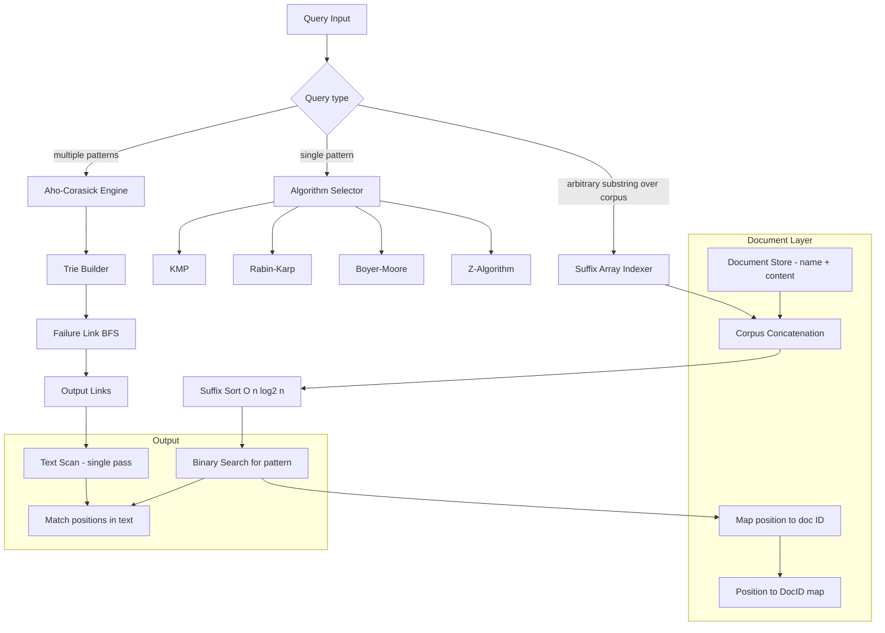

# Build Your Own Full-Text Search Engine

## 1. Motivation & Real-World Context

`LIKE '%pattern%'` in SQL is a full-table scan. There is no index that helps it. For a table with 10 million rows averaging 1 KB each, a `LIKE` query reads 10 GB of data and applies O(n*m) string comparison at every row. The algorithms in this project replace that with O(n + m) or sub-linear search, and a suffix array index that turns arbitrary substring queries into binary search.

**Elasticsearch and Lucene.** Elasticsearch, the most widely deployed full-text search engine in the world, is built on Apache Lucene. Lucene uses an inverted index (a trie mapping terms to document lists) for term queries, and for phrase and fuzzy queries it applies edit-distance scoring using Levenshtein automata — a generalization of the Edit Distance algorithm. When you implement Aho-Corasick here, you are implementing the algorithmic core of multi-keyword alerting in Elasticsearch's Watcher.

**grep.** The GNU grep utility, which processes gigabytes of log files per second, uses Boyer-Moore-Horspool for single-pattern search on large alphabets. Its sub-linear best case — reading only a fraction of input bytes on patterns that have no match — is the reason grep is faster than any naive implementation. When you implement Boyer-Moore, you understand why `grep 'abcdefg' large_file.log` is extremely fast even for files that are mostly not the pattern.

**Antivirus signature matching.** ClamAV and other antivirus engines maintain databases of tens of thousands of malware signatures (byte patterns). Scanning a file against all signatures simultaneously using Aho-Corasick runs in O(n + total_pattern_length + matches) rather than O(n * num_patterns). This is why antivirus scanning is practical even on large files.

**Code search.** GitHub Code Search, Sourcegraph, and `ripgrep` use suffix arrays for general substring search that does not require an inverted index. A suffix array over a file corpus enables any substring query in O(m log n) where m is the pattern length and n is the total corpus size — no prior knowledge of the query vocabulary needed.

---

## 2. Learning Objectives

By completing this project, you will deeply understand:

1. **KMP failure function construction and its meaning** — why the failure function encodes the longest proper prefix of the pattern that is also a suffix, and how this allows the algorithm to avoid re-examining already-matched characters. See [KMP](/algorithms/39-kmp).
2. **Rolling hash and Rabin-Karp collision handling** — how polynomial rolling hash enables O(1) window hash updates, why hash collisions cause the O(nm) worst case, and how to use double hashing to make collision probability negligible. See [Rabin-Karp](/algorithms/40-rabin-karp).
3. **Boyer-Moore's two heuristics and sub-linear behavior** — how the bad-character table allows skipping `m` characters at once on a mismatch, and how the good-suffix table provides an alternative skip when the bad-character skip is small. See [Boyer-Moore](/algorithms/41-boyer-moore).
4. **Z-Array semantics** — how Z[i] (the length of the longest substring starting at position i that matches a prefix of the full string) enables pattern matching via a single O(n+m) scan after concatenating pattern and text. See [Z-Algorithm](/algorithms/42-z-algorithm).
5. **Aho-Corasick as a finite automaton** — how failure links on a trie create the same effect as KMP's failure function but for a set of patterns simultaneously, enabling O(n + total_pattern_length + number_of_matches) multi-pattern matching. See [Aho-Corasick](/algorithms/43-aho-corasick).
6. **Suffix array construction and binary search for substring lookup** — why a suffix array of a string is equivalent to sorting all suffixes lexicographically, and how binary search over this sorted array finds all occurrences of a pattern in O(m log n). See [Suffix Array](/data-structures/31-suffix-array).
7. **Trie as a prefix-index structure** — how a trie supports O(m) exact and prefix lookups regardless of how many strings are indexed, and how it forms the foundation of Aho-Corasick. See [Trie](/data-structures/17-trie).

---

## 3. Project Scope

**In Scope:**
- KMP with correct failure function (partial match table) construction
- Rabin-Karp with rolling hash and collision verification
- Boyer-Moore with bad-character table (simplified; good-suffix is stretch)
- Z-Algorithm for pattern matching
- Trie with insert, search, and prefix-search
- Aho-Corasick: trie + BFS-built failure links + output links
- Suffix array with O(n log² n) sort-based construction
- Document indexer: build a suffix array over a concatenated corpus, answer pattern queries with matching document IDs and positions
- CLI: `index &lt;file&gt;`, `search &lt;pattern&gt;`, output document and position

**Out of Scope (for v1):**
- Fuzzy / edit-distance matching
- TF-IDF ranking or BM25 scoring
- Inverted index for word-level search
- Unicode normalization (ASCII/UTF-8 bytes is sufficient for v1)
- Good-suffix table in Boyer-Moore (left as stretch goal)
- O(n) suffix array construction (SA-IS; stretch goal)

---

## 4. Core DSA Concepts Used

| Concept | Role in this project | Handbook Link | Difficulty |
|---------|----------------------|---------------|------------|
| KMP | O(n+m) single-pattern search via failure function; foundational algorithm for all string matching | [/algorithms/39-kmp](/algorithms/39-kmp) | Intermediate |
| Rabin-Karp | O(n+m) average case via rolling hash; natural extension to multi-pattern matching of equal length | [/algorithms/40-rabin-karp](/algorithms/40-rabin-karp) | Intermediate |
| Boyer-Moore | Sub-linear best case via bad-character heuristic; most practical single-pattern algorithm for large alphabets | [/algorithms/41-boyer-moore](/algorithms/41-boyer-moore) | Intermediate |
| Z-Algorithm | O(n+m) via Z-array; elegant alternative to KMP with a single unified scan | [/algorithms/42-z-algorithm](/algorithms/42-z-algorithm) | Intermediate |
| Aho-Corasick | O(n + total_m + matches) multi-pattern matching; combines trie with KMP failure function | [/algorithms/43-aho-corasick](/algorithms/43-aho-corasick) | Advanced |
| Trie | Prefix index structure; foundation of Aho-Corasick and autocomplete | [/data-structures/17-trie](/data-structures/17-trie) | Intermediate |
| Suffix Array | O(m log n) substring search after O(n log² n) build; enables arbitrary substring queries without vocabulary pre-knowledge | [/data-structures/31-suffix-array](/data-structures/31-suffix-array) | Advanced |

---

## 5. High-Level Architecture

The engine has three independently useful components: the single-pattern algorithms, the Aho-Corasick multi-pattern matcher, and the suffix array document indexer.

**Key interfaces:**

- `Matcher` — functional type `func(text, pattern string) []int` returning all starting positions of `pattern` in `text`. All single-pattern algorithms implement this signature.
- `AhoCorasick` — `Build(patterns []string)`, `Search(text string) []Match` where `Match` holds `PatternIndex int` and `Position int`.
- `SuffixArray` — `Build(corpus string) []int` (the suffix array), `Search(sa []int, corpus, pattern string) (lo, hi int)` returning the range of suffix array entries that start with `pattern`.
- `DocumentIndex` — wraps `SuffixArray` and a `[]Document`. `IndexDocuments(docs []Document)` concatenates documents with a sentinel separator (`$`). `Query(pattern string) []Hit` where `Hit` holds `DocName string` and `Offset int`.

---

## 6. Implementation Milestones (with Hints)

### Milestone 1: KMP — Failure Function and Pattern Search

**Goal:** Implement KMP string matching that finds all occurrences of a pattern in a text in O(n + m) time.

**Key Challenges:**
- The failure function (also called the partial match table or `lps` array): `lps[i]` is the length of the longest proper prefix of `pattern[0..i]` that is also a suffix. Building it requires a two-pointer approach: `len` starts at 0, `i` starts at 1. If `pattern[i] == pattern[len]`, set `lps[i] = len+1` and advance both. Otherwise, if `len > 0`, set `len = lps[len-1]` (fall back, do not advance i). Otherwise set `lps[i] = 0` and advance i.
- During the search, when a mismatch occurs at text position `i` and pattern position `j`, do not reset `j` to 0. Instead, set `j = lps[j-1]`. Only reset `j = 0` when `j == 0` and there is a mismatch.
- Returning all matches: when `j == m` (full match), record the position `i - m`, then set `j = lps[j-1]` (continue searching for overlapping matches).

**Hints & Guidance:**
- Test the failure function independently before using it in search. For pattern `"ababc"`, the lps array should be `[0, 0, 1, 2, 0]`. For `"aabaabaaa"`, it should be `[0, 1, 0, 1, 2, 3, 4, 2, 3]`.
- Edge case: pattern length 1 never uses the failure function (lps is all zeros). Pattern equal to text returns one match at position 0.
- Test with a pattern that appears multiple times with overlapping occurrences: `KMP("aaa", "a")` should return `[0, 1, 2]`.

**Success Criteria:**
- Returns all match positions (not just the first) for all test cases.
- The failure function matches manually verified lps arrays for at least 5 patterns.
- Total comparisons for a text of length n and pattern of length m is at most n + m (track a comparison counter in a test mode).
- Handles empty pattern and empty text without panicking.

---

### Milestone 2: Rabin-Karp with Rolling Hash

**Goal:** Implement Rabin-Karp using a polynomial rolling hash. Verify matches to eliminate false positives from hash collisions.

**Key Challenges:**
- Rolling hash: `hash(s[i..i+m-1]) = (s[i]*b^(m-1) + s[i+1]*b^(m-2) + ... + s[i+m-1]) % mod`. Sliding the window: `hash_new = (hash_old - s[i]*b^(m-1)) * b + s[i+m]`, all modulo `mod`.
- Precompute `b^(m-1) % mod` before the search loop. This is the value subtracted when removing the leftmost character.
- Use a large prime for `mod` (e.g., `1_000_000_007`) and base `b=31` (for lowercase ASCII; 256 for general byte strings). Even with a good mod, verify character-by-character on every hash match.
- All arithmetic must stay non-negative: `(hash_old - s[i]*highPow % mod + mod) % mod` — the `+ mod` prevents negative modulo in languages where `%` can return negative values.

**Hints & Guidance:**
- Double hashing (using two different (b, mod) pairs) reduces the probability of a false positive to approximately 1/(mod1 * mod2) ≈ 10^(-18), which is negligible. Implement single hash first, then add the second as a stretch.
- Test specifically for hash collisions: `"abracadabra"` with pattern `"bra"` has two matches at positions 1 and 8. Verify both are returned and there are no false positives.
- Rabin-Karp shines for multi-pattern matching of equal-length patterns: compute the hash of each pattern, put them in a hash set, then scan the text once, checking each window hash against the set.

**Success Criteria:**
- Returns the same match positions as KMP on all test cases (use KMP output as ground truth).
- The character-by-character verification step catches at least one false positive in a stress test of 1,000 patterns on a random text.
- Time complexity is empirically O(n) for non-pathological inputs: verify by timing on texts of 10,000, 100,000, and 1,000,000 characters.

---

### Milestone 3: Boyer-Moore with Bad-Character Table

**Goal:** Implement Boyer-Moore single-pattern search with the bad-character heuristic. Demonstrate its sub-linear behavior on long non-matching patterns.

**Key Challenges:**
- Bad-character table: for each character `c` in the alphabet, `badChar[c]` is the rightmost index of `c` in the pattern, or -1 if `c` does not appear in the pattern. For ASCII, this is a `[256]int` array.
- The search: align the pattern to the text. Compare right-to-left (from the last character of the pattern). On a mismatch at text position `i` and pattern position `j`: the shift is `max(1, j - badChar[text[i]])`. The `max(1, ...)` ensures the pattern always moves forward.
- When a full match is found, record the position and shift by 1 (or by the good-suffix shift in the stretch goal).

**Hints & Guidance:**
- Precompute the bad-character table in O(m + |alphabet|) time. Use 256 as the alphabet size for byte strings.
- Demonstrate sub-linear behavior: search for pattern `"aaab"` in a text of a million `'a'` characters. Boyer-Moore skips 3 characters on each mismatch — it reads roughly n/3 characters total (sub-linear), while KMP reads all n.
- Test on both matching and non-matching cases. The classic worst case for Boyer-Moore with bad-character only (no good-suffix) is pattern `"aaa"` in text `"aaa...a"` — it degrades to O(nm). Demonstrate this empirically.

**Success Criteria:**
- Returns the same match positions as KMP and Rabin-Karp on all test cases.
- On a text of 1,000,000 characters where the pattern is 10 characters not present in the text, Boyer-Moore reads at most 200,000 characters (10x sub-linear).
- Benchmarks show Boyer-Moore is faster than KMP for long patterns on large texts with small alphabets where mismatches cause large skips.

---

### Milestone 4: Z-Algorithm

**Goal:** Implement the Z-Algorithm and use it for pattern matching by concatenating `pattern + '$' + text` and computing the Z-array.

**Key Challenges:**
- Z[i]: the length of the longest string starting at `s[i]` that is also a prefix of `s`. By definition, Z[0] is undefined (or set to 0 or n).
- The linear-time Z-array construction: maintain a window `[l, r]` where `r` is the rightmost extent of any Z-box found so far. For each position `i`: if `i &lt; r`, Z[i] can be initialized to `min(Z[i-l], r-i)` and then extended naively. If `i >= r`, compute Z[i] naively and update `[l, r]`. The key insight is that each character is examined at most twice — once to advance `r`, once to compute within the Z-box.
- Pattern matching: concatenate `pattern + '$' + text` (where `$` is a character not in either string). A Z-value of exactly `m` (pattern length) at position `> m` means a match at that position minus `m+1`.

**Hints & Guidance:**
- Use `$` as the separator only if you know it does not appear in the input. For binary data, use a value outside the byte range of the input. For general strings, use a character you know is unused, or use a length-encoded concatenation.
- Verify: for `s = "aabxaa"`, the Z-array should be `[0, 1, 0, 0, 2, 1]`.
- The Z-Algorithm is particularly clean to implement compared to KMP — there is no asymmetric failure function to build; the same logic constructs the array linearly.

**Success Criteria:**
- Z-array matches manually computed values for test strings of length 5, 10, and 20.
- Pattern matching returns the same positions as KMP.
- The number of character comparisons is at most `2*(n+m)` — verify with a comparison counter.
- Handles repeated patterns: `s = "aaaa"` gives Z-array `[0, 3, 2, 1]`.

---

### Milestone 5: Aho-Corasick Multi-Pattern Matching

**Goal:** Build an Aho-Corasick automaton from a set of patterns and scan a text once to find all occurrences of all patterns in O(n + total_pattern_length + number_of_matches).

**Key Challenges:**
- Building the trie: insert each pattern into a trie character by character. Each trie node stores `children map[byte]*TrieNode` (or `children [256]*TrieNode` for speed), `isEnd bool`, and `patternIndex int` (which pattern ends here).
- Failure links: built via BFS from the root. The root's children have failure links pointing to the root. For each node `u` at depth > 1, if `u` was reached via character `c` from parent `p`, then `u.fail = p.fail.goto(c)` — follow `p`'s failure link, then try to match `c`. If that node exists, it is the failure link. Otherwise, follow failure links recursively up to the root.
- Output links: a shortcut that points from a node to the nearest ancestor (via failure links) that is also the end of a pattern. This allows collecting all matching patterns at a position without walking the full failure link chain during text scan.
- Text scan: at each character of the text, follow the goto (trie edge if it exists, or failure link then goto). When reaching a node that is the end of a pattern (or has an output link), record all matches.

**Hints & Guidance:**
- Use BFS to build failure links — do not use DFS (it processes children before their parents' failure links are set, causing incorrect links).
- During the text scan, when a character has no outgoing edge in the trie, follow failure links until an edge is found or the root is reached. This is equivalent to using the failure link as a fallback, exactly as KMP does.
- Test with patterns `{"he", "she", "his", "hers"}` on text `"ushers"`. Expected matches: `"she"` at 1, `"he"` at 2, `"hers"` at 2.

**Success Criteria:**
- All match positions and pattern indices are correct on the classic `{"he", "she", "his", "hers"}` example.
- Single text scan (exactly one pass over the text, regardless of number of patterns).
- On 1,000 patterns and a text of 1,000,000 characters, completes in under 100 milliseconds.
- Failure links form a proper tree rooted at the root node (verify with BFS traversal).

---

### Milestone 6: Suffix Array with O(n log² n) Construction

**Goal:** Build a suffix array for a string corpus and use binary search to answer all substring queries in O(m log n) after the O(n log² n) build.

**Key Challenges:**
- Suffix array: an array of integers `sa[0..n-1]` where `sa[i]` is the starting index of the i-th lexicographically smallest suffix of the string.
- Naive O(n² log n) construction: create a list of all (suffix_index, suffix_string) pairs and sort lexicographically. This is correct but too slow for large inputs.
- O(n log² n) construction: sort suffixes by their first 1 character, then 2 characters, then 4 characters, doubling the comparison length each time (`log n` rounds). In each round, use the rank array from the previous round to compare length-`2k` substrings as pairs of integers — enabling O(n log n) radix or comparison sort per round.
- Binary search for pattern: a pattern `p` matches suffix `sa[i]` if `text[sa[i]..sa[i]+m-1] == p`. Since the suffix array is sorted, all matching suffixes form a contiguous range. Use two binary searches: one for the leftmost match (`lo`) and one for the rightmost match (`hi`). Each binary search step compares only the first `m` characters of the suffix.

**Hints & Guidance:**
- For the O(n log² n) build, maintain a `rank[]` array alongside the suffix array. After each round of doubling, recompute ranks based on the new sorted order. Two suffixes have the same rank if and only if their first `2k` characters are identical.
- For binary search: implement `lowerBound(pattern)` and `upperBound(pattern)` that use `strings.Compare(corpus[sa[mid]:sa[mid]+m], pattern)` (clamped to not go out of bounds).
- Append a unique sentinel character (byte value 0, which is lexicographically smallest) to the corpus before building the suffix array. This ensures no suffix is a prefix of another, simplifying the sort.

**Success Criteria:**
- Suffix array for `"banana$"` matches the known result: `[6, 5, 3, 1, 0, 4, 2]` (indices of sorted suffixes: `"$", "a$", "ana$", "anana$", "banana$", "na$", "nana$"`).
- Binary search for pattern `"an"` in `"banana$"` returns indices 1 and 3 (positions of `"ana$"` and `"anana$"`).
- Suffix array construction for a 1,000,000-character string completes in under 5 seconds.
- Pattern search for a 10-character pattern in a 1,000,000-character corpus completes in under 1 millisecond.

---

### Milestone 7: Document Indexer CLI

**Goal:** Build a CLI that indexes a set of text files using the suffix array and answers pattern queries returning matching document names and character offsets.

**Key Challenges:**
- Concatenate all documents into a single string, separated by unique sentinel characters (one per document boundary). Maintain a `docBoundaries []int` array to map a corpus position back to a document index.
- A pattern match at corpus position `p` belongs to document `d` where `docBoundaries[d] &lt;= p &lt; docBoundaries[d+1]`. Binary search over `docBoundaries` to find `d`.
- A match that spans a sentinel character (i.e., `p + m > docBoundaries[d+1]`) is a spurious match that straddles two documents — filter it out.

**Hints & Guidance:**
- Use byte value 0 or the Unicode Private Use Area characters as per-document sentinels to ensure they are not present in normal text.
- Print matches grouped by document: `file.txt:42: "...surrounding context..."`.
- For context: include the 20 characters before and after the match position, clamped to document boundaries.

**Success Criteria:**
- `index &lt;dir&gt;` builds a suffix array over all `.txt` files in a directory.
- `search &lt;pattern&gt;` returns all matching files and positions in under 100 milliseconds for a corpus of 10 MB.
- Matches spanning document boundaries are correctly filtered out.
- Result output includes document name, character offset, and surrounding context.

---

## 7. Stretch Goals

1. **Boyer-Moore good-suffix table.** Implement the good-suffix heuristic in addition to bad-character. The combined heuristic gives the true O(n/m) best-case behavior and O(n) worst-case — the holy grail of single-pattern matching. This requires computing the border array and case analysis for the three good-suffix sub-cases.
2. **SA-IS O(n) suffix array construction.** Implement the Skew algorithm or SA-IS (Suffix Array Induced Sorting) to build the suffix array in O(n) time. This is a significant algorithmic challenge but is the standard approach in production text indexers and bioinformatics tools.
3. **LCP array and LCP-based range compression.** Build the Longest Common Prefix (LCP) array alongside the suffix array. The LCP array enables: (1) counting distinct substrings, (2) finding the longest repeated substring in O(n), (3) compressing suffix array pattern search to avoid redundant character comparisons.
4. **Compressed Trie (Patricia Tree / Radix Tree.** Compress the Aho-Corasick trie by merging chains of single-child nodes into single edges labeled with multi-character strings. This reduces memory usage from O(total_characters) to O(total_patterns) nodes, which matters when patterns are long and few.
5. **Fuzzy search with edit distance bound.** Given a pattern `p` and a maximum edit distance `k`, find all substrings of the text within edit distance `k` of `p`. This uses the edit distance DP from project 14 as a subroutine, applied via a Levenshtein automaton that runs as a DFA over the text.

---

## 8. Testing & Validation Strategy

**Ground-truth comparison:**
- For all single-pattern algorithms (KMP, Rabin-Karp, Boyer-Moore, Z-Algorithm), verify that they return identical match positions. Use a naive O(nm) brute-force implementation as the reference. Run 10,000 random (text, pattern) pairs.
- For Aho-Corasick, verify by running each pattern through the KMP implementation independently and checking that the union of KMP results equals the Aho-Corasick results.

**Edge cases:**
- Pattern longer than text: returns empty match list.
- Pattern equals text: returns `[0]`.
- Empty pattern: returns all positions (or empty list, depending on your convention — document it and test it).
- Pattern with repeated characters: `"aaa"` in `"aaaa"` returns `[0, 1]` (overlapping matches).
- Text containing only the pattern character: O(n²) matches possible — verify your implementation handles this without quadratic behavior.

**Suffix array specific:**
- For strings up to length 20, verify the suffix array against a brute-force sort of all suffixes.
- The LCP of adjacent entries in the suffix array must be correctly ordered: for the `"banana"` example, manually verify all adjacent suffix comparisons.

**Performance tests:**
- KMP, Z-Algorithm: 10,000,000 characters, 100-character pattern — under 100 milliseconds.
- Boyer-Moore: same input, demonstrate that character comparisons are at most 2,000,000 (sub-linear).
- Aho-Corasick: 1,000 patterns, 1,000,000-character text — under 100 milliseconds.
- Suffix array build: 1,000,000 characters — under 5 seconds. Pattern search: under 1 millisecond.

---

## 9. C# and Go Implementation Notes

### C#

- `ReadOnlySpan&lt;char&gt;` for zero-copy substring operations in KMP and Boyer-Moore. Avoid `string.Substring` in hot loops — it allocates a new string per call.
- For byte-level matching (Aho-Corasick on arbitrary binary patterns): work with `byte[]` and `ReadOnlySpan&lt;byte&gt;` rather than `char`. This avoids encoding issues and matches the behavior of antivirus and network scanning tools.
- `Encoding.UTF8.GetBytes(text)` to convert to byte arrays for byte-level algorithms. For ASCII-only text, `(byte)char_value` casting is safe.
- For the suffix array, `string.Compare(text[sa[mid]..], pattern, StringComparison.Ordinal)` is the correct comparison for lexicographic order. Use `StringComparison.Ordinal` — never use culture-aware comparison in algorithms.
- `Span&lt;int&gt;` for the suffix array when passing it as a parameter to avoid copying large arrays.

### Go

- `strings.Builder` for assembling the concatenated corpus in the document indexer. Pre-allocate with `builder.Grow(totalSize)` to avoid reallocations.
- `[]byte` rather than `string` for Aho-Corasick trie keys, since byte-level indexing is cleaner and avoids UTF-8 decoding overhead in hot loops.
- For the suffix array: sort using `sort.Slice(sa, func(i, j int) bool { return text[sa[i]:] &lt; text[sa[j]:] })` for the naive O(n² log n) build. Then replace with the doubling algorithm for O(n log² n).
- `sort.Search` for binary search over the suffix array: `lo := sort.Search(n, func(i int) bool { return corpus[sa[i]:] >= pattern })`.
- For the Aho-Corasick BFS: use a `[]int` queue instead of a `list.List` — append/re-slice avoids linked list allocation overhead.

---

## 10. Potential Extensions & Related Projects

1. **Build Your Own Dynamic Programming Toolkit** — the Edit Distance algorithm (project 14) is the key building block for fuzzy search over a full-text index. Combining a suffix array from this project with the Levenshtein DP yields approximate string matching, the basis of spell-check and DNA alignment.
2. **Build Your Own In-Memory Database Index** — a text search engine and a database index are the same structure from different angles. A trie (used in Aho-Corasick here) is a prefix-tree database index; a suffix array is a suffix-sorted inverted index. Building both reveals their duality.
3. **Build Your Own Key-Value Store** — Bloom filters (project 11) are used by search engines (Elasticsearch) to avoid costly index lookups for terms that are definitely absent. The Bloom filter from project 11 plugs directly into the document indexer here.
4. **Build Your Own Compression Library** — LZ77 (the basis of gzip and Deflate) uses a sliding window pattern match that is algorithmically equivalent to the suffix array search here: find the longest match for the current position in the previous 32 KB of input. Implementing a compressor reveals a direct application of everything in this project.
5. **Build Your Own Diff Tool** — the LCS algorithm (project 14) is the foundation of the Myers diff algorithm used by `git diff`. Diff is essentially the LCS problem applied to lines of text rather than characters. A suffix array accelerates the LCS computation for large files.
