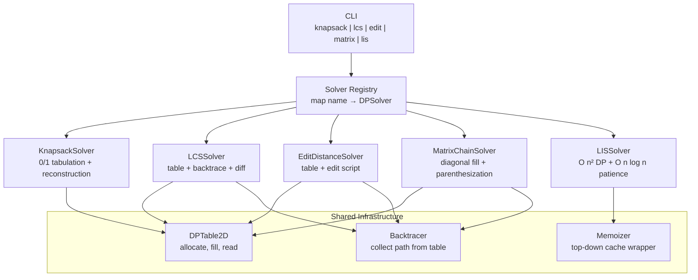

# Build Your Own Dynamic Programming Toolkit

## 1. Motivation & Real-World Context

Dynamic programming is not an interview trick — it is how production systems solve optimization and sequence-alignment problems where brute force is exponential and greedy approaches fail. The DP problems in this project appear independently in bioinformatics, spell checkers, cloud resource planners, and compiler backends. Building them as a unified toolkit teaches both the individual algorithms and the meta-pattern of recognizing overlapping subproblems.

**Bioinformatics (BLAST, BWA, Clustal Omega).** Sequence alignment — determining how similar two DNA or protein sequences are — is fundamentally the Longest Common Subsequence (LCS) and Edit Distance (Levenshtein) problems at scale. The BLAST algorithm finds local alignments using heuristic extensions of DP scoring matrices. When a genomics pipeline reports "92% identity over 1,200 base pairs," it is reporting the output of DP-style alignment. Understanding LCS and edit distance makes those tools interpretable rather than black boxes.

**Spell checkers and autocorrect (Hunspell, macOS/NSSpellChecker, Google).** "Did you mean 'algorithm'?" is answered by computing edit distance between the misspelled word and every dictionary candidate, then ranking by distance. Production spell checkers prune the search space with Trie-based lookups and SymSpell (delete-all-edits indexing), but the scoring function is edit distance. When you implement edit distance with backtrace, you understand exactly what "1 edit away" means.

**Resource allocation (Kubernetes, AWS Spot Fleet, bin packing).** The 0/1 Knapsack problem models selecting a subset of tasks or instances that maximizes value within a capacity constraint — CPU cores, memory, budget. Kubernetes pod scheduling with resource requests is a multidimensional knapsack variant. Cloud cost optimizers use knapsack DP to select reserved instances that minimize cost while covering predicted demand. The 0/1 constraint (take it or leave it) maps directly to scheduling decisions.

**Compiler optimization (matrix chain multiplication, register allocation).** Matrix chain multiplication determines the optimal parenthesization of a chain of matrix multiplications to minimize scalar multiplications — the same problem LLVM's loop optimizer faces when fusing nested loops. Register allocation in compilers (graph coloring + spilling) uses DP variants of interval scheduling. Matrix chain DP is the cleanest introduction to "optimal parenthesization" before tackling real compiler IR.

**Stock analysis and trend detection.** The Longest Increasing Subsequence (LIS) identifies the longest upward trend in a time series. Patience sorting (the O(n log n) LIS algorithm) is the same algorithm behind efficient card-sorting and some portfolio analysis heuristics. The O(n log n) LIS with binary search on tails is one of the most elegant applications of DP + binary search in the handbook.

This project transforms six classic DP problems from isolated LeetCode exercises into a reusable toolkit with shared infrastructure, path reconstruction, and a CLI that demonstrates each algorithm on real-world-shaped inputs.

## 2. Learning Objectives

By completing this project, you will deeply understand:

1. **The DP recognition checklist** — overlapping subproblems, optimal substructure, and the decision between top-down memoization and bottom-up tabulation. See [`/algorithms/33-dp-fundamentals`](/algorithms/33-dp-fundamentals) and [`/fundamentals/02-recursion-and-memoization`](/fundamentals/02-recursion-and-memoization).

2. **0/1 Knapsack state transitions and space optimization** — why `dp[i][w] = max(dp[i-1][w], dp[i-1][w-weight[i]] + value[i])`, and how rolling the 2D table into a 1D array works by iterating weights in reverse. See [`/algorithms/34-0-1-knapsack`](/algorithms/34-0-1-knapsack).

3. **LCS table construction and diff reconstruction** — how the LCS DP table encodes all optimal alignments, and how backtracking from `dp[m][n]` produces the actual subsequence for diff-style output. See [`/algorithms/35-lcs`](/algorithms/35-lcs).

4. **Edit distance operations and backtrace** — the three operations (insert, delete, substitute) as state transitions, and how backtrace through the DP table reconstructs the minimum edit script. See [`/algorithms/36-edit-distance`](/algorithms/36-edit-distance).

5. **Matrix chain multiplication and optimal parenthesization** — why the state is `(i, j)` representing the subchain from matrix i to j, and how `dp[i][j] = min over k of dp[i][k] + dp[k+1][j] + cost(i,k,j)` fills the table diagonally. See [`/algorithms/37-matrix-chain-multiplication`](/algorithms/37-matrix-chain-multiplication).

6. **LIS via patience sorting** — the O(n log n) algorithm maintaining a `tails` array where `tails[i]` is the smallest tail element of an increasing subsequence of length i+1, with binary search for insertion position. See [`/algorithms/38-longest-increasing-subsequence`](/algorithms/38-longest-increasing-subsequence).

7. **Shared DP infrastructure** — building a reusable 2D table allocator, memoization wrapper, and backtrace utility that all six solvers share, mirroring how real libraries (e.g., bioinformatics toolkits) structure algorithm families.

## 3. Project Scope

**In Scope:**
- Shared DP utilities: 2D table builder, memoization decorator, generic backtrace helper
- 0/1 Knapsack: tabulation, space-optimized 1D version, item selection reconstruction
- Longest Common Subsequence: table construction, LCS string reconstruction, diff output (aligned sequences with `-` gaps)
- Edit Distance (Levenshtein): table construction, minimum distance, edit script backtrace (insert/delete/substitute operations)
- Matrix Chain Multiplication: optimal parenthesization, minimum scalar multiplication count, parenthesized expression output
- Longest Increasing Subsequence: O(n²) DP baseline and O(n log n) patience-sorting version
- `DPSolver` interface with `Solve(input) → (result, steps)` for uniform CLI access
- CLI: `knapsack`, `lcs`, `edit`, `matrix`, `lis` subcommands with stdin/file input

**Out of Scope (for v1):**
- Unbounded knapsack or fractional knapsack
- Weighted edit distance (different costs per operation)
- Affine gap penalties for sequence alignment (Gotoh algorithm)
- CYK parsing or other grammar-based DP
- Parallel or GPU-accelerated DP
- Approximate DP / meet-in-the-middle for exponential state spaces
- Full BLAST or SymSpell implementation (spell-checker uses edit distance as a building block only)

## 4. Core DSA Concepts Used

| Concept | Role in this project | Handbook Link | Difficulty |
|---------|----------------------|---------------|------------|
| DP Fundamentals | Shared patterns: state definition, recurrence, tabulation vs memoization | [/algorithms/33-dp-fundamentals](/algorithms/33-dp-fundamentals) | Intermediate |
| 0/1 Knapsack | Canonical optimization DP; resource allocation modeling | [/algorithms/34-0-1-knapsack](/algorithms/34-0-1-knapsack) | Intermediate |
| Longest Common Subsequence | Sequence alignment foundation; diff and version comparison | [/algorithms/35-lcs](/algorithms/35-lcs) | Intermediate |
| Edit Distance | Spell checking, fuzzy matching, sequence alignment with gaps | [/algorithms/36-edit-distance](/algorithms/36-edit-distance) | Intermediate |
| Matrix Chain Multiplication | Optimal parenthesization; compiler loop optimization preview | [/algorithms/37-matrix-chain-multiplication](/algorithms/37-matrix-chain-multiplication) | Advanced |
| Longest Increasing Subsequence | Trend detection; O(n log n) via patience sorting + binary search | [/algorithms/38-longest-increasing-subsequence](/algorithms/38-longest-increasing-subsequence) | Advanced |

## 5. High-Level Architecture

The toolkit has three layers: shared DP infrastructure, individual problem solvers, and a CLI that routes input to the appropriate solver. Each solver implements a common interface and can optionally return the DP table for debugging.

**Key interfaces / abstractions:**

- `DPSolver` interface: `Name() string`, `Solve(input Input) Result`. Each problem defines its own `Input` and `Result` structs.
- `DPTable2D`: generic 2D table with `Rows()`, `Cols()`, `Get(i,j)`, `Set(i,j,val)`, `Fill(val)`. Used by knapsack, LCS, edit distance, and matrix chain.
- `Backtracer`: given a filled DP table and a direction function `func(i,j) Direction`, walks from `(m,n)` to `(0,0)` collecting the optimal path.
- `KnapsackInput`: `Weights []int`, `Values []int`, `Capacity int`. `KnapsackResult`: `MaxValue int`, `SelectedItems []int`.
- `EditInput`: `Source string`, `Target string`. `EditResult`: `Distance int`, `Script []EditOp` where `EditOp` is insert/delete/substitute with position and character.

## 6. Implementation Milestones (with Hints)

### Milestone 1: Shared DP Infrastructure

**Goal:** Build reusable 2D table utilities, a memoization wrapper, and a backtrace helper that all subsequent solvers will use.

**Key Challenges:** Designing generic enough utilities without over-abstracting; backtrace direction functions that correctly handle ties in DP tables.

**Hints & Guidance:**
- `DPTable2D` can be a simple `[][]int` wrapper with bounds-checked `Get`/`Set`. Allocate with `make([][]int, rows)` then `make([]int, cols)` per row.
- Memoization wrapper: `func Memoize[K comparable, V any](fn func(K) V) func(K) V` — use a `map[K]V` cache. Key is the function argument (e.g., `(i, j)` tuple for matrix chain).
- Backtracer: start at `(m, n)`, loop while not at `(0, 0)`. At each cell, call `direction(i, j)` which returns UP, LEFT, or DIAGONAL based on which predecessor cell's value + transition cost equals `dp[i][j]`.
- Test the infrastructure with a trivial DP: compute `dp[i][j] = i + j` for a 3×3 table. Backtrace from (2,2) should produce a path summing to 4.
- Do not build solvers yet. Get the plumbing right first — every subsequent milestone depends on it.

**Success Criteria:**
- `DPTable2D` allocates, fills, and reads correctly for arbitrary dimensions
- Memoization wrapper caches results: second call with same key does not recompute
- Backtracer on a hand-filled 3×3 table produces the expected path

### Milestone 2: 0/1 Knapsack with Item Reconstruction

**Goal:** Implement 0/1 Knapsack via bottom-up tabulation and reconstruct which items were selected.

**Key Challenges:** Space-optimized 1D version (reverse iteration over weights); backtracking to find selected items after computing max value.

**Hints & Guidance:**
- State: `dp[i][w]` = max value using items 0..i-1 with capacity w. Base: `dp[0][w] = 0` for all w.
- Transition: `dp[i][w] = max(dp[i-1][w], dp[i-1][w-weights[i-1]] + values[i-1])` if `w >= weights[i-1]`, else `dp[i][w] = dp[i-1][w]`.
- Space optimization: single `dp[w]` array. Iterate items outer, weights inner **in reverse** (w from Capacity down to weights[i]). Reverse order prevents using the same item twice.
- Reconstruction: start at `dp[n][Capacity]`, walk backwards. If `dp[i][w] != dp[i-1][w]`, item i-1 was taken; subtract its weight and continue.
- Test: weights=[1,3,4,5], values=[1,4,5,7], capacity=7 → max value=9, items=[1,2] (weights 3+4) or items=[0,3] (weights 1+5) depending on tie-breaking.

**Success Criteria:**
- Max value matches known test cases (including the classic example above)
- Reconstructed items have total weight ≤ capacity and total value = max value
- Space-optimized 1D version produces identical max value as 2D version
- Empty knapsack (capacity=0) returns value 0 and no items

### Milestone 3: Longest Common Subsequence + Diff Output

**Goal:** Implement LCS table construction, reconstruct the LCS string, and produce a two-line diff showing aligned sequences with gap characters.

**Key Challenges:** Correct recurrence for LCS; backtrace that handles both match (diagonal) and non-match (max of up/left) cases; formatting diff output.

**Hints & Guidance:**
- State: `dp[i][j]` = LCS length of `X[0..i-1]` and `Y[0..j-1]`.
- Transition: if `X[i-1] == Y[j-1]`, `dp[i][j] = dp[i-1][j-1] + 1`. Else, `dp[i][j] = max(dp[i-1][j], dp[i][j-1])`.
- Backtrace: from `(m, n)`, if characters match go diagonal (include char in LCS). Else go in direction of larger predecessor (up or left). Collect characters in reverse, then reverse the result.
- Diff output: during backtrace, build two aligned strings. On match, append both chars. On gap (up), append char from X and `-` in Y line. On gap (left), append `-` in X line and char from Y.
- Test: X="ABCDGH", Y="AEDFHR" → LCS="ADH" (length 3). Diff shows where gaps occur.

**Success Criteria:**
- LCS length and string match brute-force on small inputs (enumerate all subsequences for n ≤ 10)
- Diff output correctly aligns "ABCDGH" and "AEDFHR" with gap characters
- Empty string LCS with anything: length 0, LCS ""
- Identical strings: LCS equals the full string

### Milestone 4: Edit Distance + Spell Checker Suggestions

**Goal:** Implement Levenshtein edit distance and backtrace to produce the minimum edit script. Build a simple spell checker that ranks dictionary words by edit distance.

**Key Challenges:** Correct base cases (empty string costs); backtrace that produces a valid minimum-cost edit sequence; efficient dictionary lookup for spell-checker demo.

**Hints & Guidance:**
- State: `dp[i][j]` = min edits to transform `source[0..i-1]` into `target[0..j-1]`.
- Base: `dp[i][0] = i` (delete all i chars), `dp[0][j] = j` (insert all j chars).
- Transition: if `source[i-1] == target[j-1]`, `dp[i][j] = dp[i-1][j-1]`. Else, `dp[i][j] = 1 + min(dp[i-1][j], dp[i][j-1], dp[i-1][j-1])` (delete, insert, substitute).
- Backtrace: from `(m, n)`, if chars match go diagonal. Else go to whichever predecessor gave the min (delete=up, insert=left, substitute=diagonal).
- Spell checker: load a dictionary (word list file), compute edit distance from input word to each dictionary word, return top-5 closest. Prune: only consider words with `len(word) ± 2` of input length for speed.
- Test: "kitten" → "sitting" → distance 3 (substitute k→s, substitute e→i, insert g).

**Success Criteria:**
- Edit distance matches known pairs: ("", "abc")=3, ("abc", "")=3, ("abc", "abc")=0, ("kitten", "sitting")=3
- Edit script has cost equal to reported distance
- Spell checker: "algoritm" suggests "algorithm" as top result from a standard dictionary
- Backtrace produces valid script: applying operations to source yields target

### Milestone 5: Matrix Chain Multiplication

**Goal:** Implement matrix chain DP to find the minimum number of scalar multiplications and output the optimal parenthesization.

**Key Challenges:** Diagonal fill order (by chain length, not row-by-row); correct cost function using matrix dimensions; parenthesization reconstruction.

**Hints & Guidance:**
- Given dimensions `dims[0..n]` where matrix i has dimensions `dims[i-1] × dims[i]`, there are n matrices to multiply.
- State: `dp[i][j]` = min cost to multiply matrices i through j (1-indexed). Base: `dp[i][i] = 0`.
- Transition: `dp[i][j] = min over k in [i, j-1] of dp[i][k] + dp[k+1][j] + dims[i-1]*dims[k]*dims[j]`.
- Fill order: iterate chain length from 2 to n, then i from 1 to n-length+1, then j = i+length-1. This ensures subproblems are solved before dependents.
- Reconstruction: store `split[i][j] = k` that achieved the minimum. Recursively print parenthesization: if i==j, print `A_i`; else print `( left(i, split[i][j]) × right(split[i][j]+1, j) )`.
- Test: dims=[1,2,3,4,5] (four matrices) → min cost=38, parenthesization=((A1×A2)×(A3×A4)) or equivalent optimal form.

**Success Criteria:**
- Min cost matches known examples from the handbook
- Parenthesization is valid: multiplying in that order produces the correct result dimensions
- Single matrix: cost 0, output "A1"
- Two matrices: cost = dims[0]*dims[1]*dims[2]

### Milestone 6: LIS (Both Versions) + Unified CLI

**Goal:** Implement O(n²) and O(n log n) LIS, wire all solvers into a CLI, and verify all solvers through the shared infrastructure.

**Key Challenges:** O(n log n) LIS tail array maintenance and binary search for insertion position; CLI argument parsing and input formatting.

**Hints & Guidance:**
- O(n²) DP: `dp[i]` = LIS length ending at index i. For each i, check all j &lt; i where `nums[j] &lt; nums[i]`, set `dp[i] = max(dp[j]) + 1`. Answer = max of dp array.
- O(n log n): maintain `tails` array. For each `num`, binary search the leftmost position in `tails` where `tails[pos] >= num`, replace `tails[pos] = num`. If `num` is larger than all tails, append. Length of `tails` at end is the LIS length.
- Binary search in O(n log n) version: find leftmost `pos` where `tails[pos] >= num` (lower bound). This is the patience sorting card game: each number goes on the leftmost pile whose top card is ≥ num.
- CLI: `dp-toolkit knapsack --weights 1,3,4,5 --values 1,4,5,7 --capacity 7`. Each subcommand reads flags or stdin.
- Run all solvers on handbook example inputs and verify against known answers.

**Success Criteria:**
- O(n²) and O(n log n) LIS produce the same length on 1,000 random arrays
- LIS of [10, 9, 2, 5, 3, 7, 101, 18] → length 4
- CLI `knapsack`, `lcs`, `edit`, `matrix`, `lis` subcommands all produce correct output
- All solvers use shared `DPTable2D` or `Memoizer` (verify by code inspection, not duplication)

## 7. Stretch Goals (for advanced learners)

1. **Space-optimized LCS and edit distance:** Reduce LCS from O(mn) space to O(min(m,n)) using rolling two-row arrays. Implement Hirschberg's algorithm for LCS reconstruction in O(min(m,n)) space — the algorithm used in production diff tools for large files.

2. **Weighted edit distance:** Assign different costs to insert (1), delete (1), and substitute (2). Model keyboard-distance-aware spell checking where transpositions cost less than arbitrary substitutions.

3. **Longest Common Substring via DP:** Modify the LCS recurrence to reset to 0 on mismatch and track the global maximum. Output the actual substring. Used in plagiarism detection and DNA repeat finding.

4. **Coin change (unbounded knapsack variant):** Given coin denominations and a target amount, find minimum coins needed. Demonstrates the difference between 0/1 (each item once) and unbounded (unlimited copies) DP.

5. **CYK parsing for context-free grammars:** Given a grammar in Chomsky normal form and an input string, determine if the string is parseable. Shows DP on a 3D table (start, end, nonterminal) — the foundation of NLP parsers.

## 8. Testing & Validation Strategy

**Unit tests — correctness:**
- Knapsack: classic examples, capacity=0, single item, all items too heavy.
- LCS: identical strings, completely disjoint strings, one empty string, single-character match.
- Edit distance: all base cases, known pairs (kitten/sitting, sunday/saturday).
- Matrix chain: 2-matrix case (manual cost), 4-matrix handbook example, single matrix.
- LIS: strictly increasing, strictly decreasing, all equal, single element.

**Integration tests:**
- Spell checker end-to-end: load dictionary, query "recieve", verify "receive" in top-3.
- Diff end-to-end: LCS diff of two version-control-style strings produces readable aligned output.
- CLI: each subcommand with file input produces expected stdout.

**Cross-validation tests:**
- O(n²) LIS vs O(n log n) LIS: same length on 10,000 random arrays.
- 2D knapsack vs 1D space-optimized: same max value on 1,000 random instances.
- Edit distance: verify that applying the backtraced script to source produces target.

**Property-based tests:**
- Invariant: `0 &lt;= edit_distance(s, t) &lt;= len(s) + len(t)`.
- Invariant: `LCS(X, Y)` length ≤ `min(len(X), len(Y))`.
- Invariant: knapsack reconstructed items have total weight ≤ capacity.

**Benchmarks:**
- LCS on 1000×1000 character strings: report time and memory.
- Edit distance on 500×500 strings: report time.
- Matrix chain on 20 matrices: report time (O(n³)).
- LIS O(n²) vs O(n log n) on n=10,000: report time ratio.

## 9. C# and Go Implementation Notes

**C# notes:**

- `DPTable2D` can be `int[,]` (rectangular array) for cache-friendly access. Index as `table[i, j]`.
- Knapsack space-optimized: `int[] dp = new int[capacity + 1]`. Iterate items outer, `for (int w = capacity; w >= weights[i]; w--)` inner.
- LCS/edit distance on strings: `s[i-1]` for 1-indexed DP loops. `string` is immutable — build LCS with `StringBuilder` during backtrace.
- Edit script: define `record EditOp(EditType Type, int Pos, char Char)` with enum `EditType { Insert, Delete, Substitute }`.
- Matrix chain: use 1-indexed arrays or be very careful with 0-indexed off-by-one on dimensions. Store `split[i,j]` in a parallel `int[,]` table.
- LIS O(n log n): `List&lt;int&gt; tails` with `tails.BinarySearch(num)` — if not found, `~index` gives insertion point. Or use custom lower-bound binary search.
- CLI: `System.CommandLine` (NuGet) for subcommand parsing. Each solver is a separate command handler.
- No need for `IDisposable` — all allocations are small integer arrays.

**Go notes:**

- `DPTable2D`: `[][]int` with `make([][]int, rows)` and per-row `make([]int, cols)`. Go slices are 0-indexed throughout.
- Knapsack: `dp := make([]int, capacity+1)`. Reverse weight iteration: `for w := capacity; w >= weights[i]; w--`.
- LCS/edit: convert strings to `[]rune` if Unicode support matters; `[]byte` is sufficient for ASCII v1.
- Backtrace: collect operations in a slice, reverse at the end with a simple loop.
- Matrix chain: store dimensions as `[]int` with length n+1 for n matrices. Fill with nested loops over chain length, start, end.
- LIS O(n log n): `tails := []int{}`. Custom `sort.Search(len(tails), func(i int) bool { return tails[i] >= num })` for lower bound.
- CLI: `flag` package with subcommands, or `cobra` for richer CLI. Each solver in its own file under `solvers/`.
- Benchmark with `testing.B`. LCS 1000×1000 is a good stress test for memory: `b.ReportAllocs()`.

## 10. Potential Extensions & Related Projects

- **Build Your Own Full-Text Search Engine (`13-full-text-search-engine.md`):** Fuzzy matching in search engines uses edit distance (Levenshtein automata in Elasticsearch). After completing edit distance here, implement fuzzy query support in the search engine project.
- **Build Your Own Text Editor Engine (`20-text-editor-engine.md`):** The diff output from LCS is the foundation of line-level diff in version control and text editors. Extend LCS to line-level diff with Myers diff algorithm for better human-readable output.
- **Build Your Own Mini Version Control System (`16-mini-version-control.md`):** File diffing in git uses Myers diff (an optimization of LCS). Your LCS solver is the pedagogical predecessor to understanding `git diff`.
- **Build Your Own Autocomplete Engine (`07-autocomplete-engine.md`):** Spell-checker suggestions combine Trie prefix lookup with edit distance scoring. Build a "did you mean?" feature using your edit distance solver and the Trie from the autocomplete project.
- **Relate to Task Queue System (`06-task-queue-system.md`):** Kubernetes-style pod scheduling is a multidimensional knapsack. Extend the 0/1 knapsack solver with multiple weight dimensions (CPU, memory) to model realistic resource allocation.