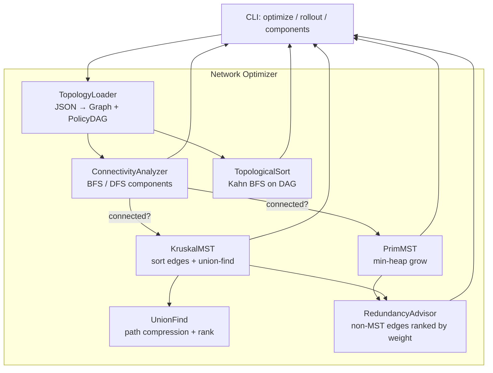

# Build Your Own Network Optimizer

## 1. Motivation & Real-World Context

Every large network is a graph: routers are vertices, links are edges, and bandwidth or latency is the weight. The question "how do we connect all sites at minimum cost?" is not an abstract exercise — it is the daily work of backbone engineers, cloud architects, and platform teams who must balance cost, redundancy, and deploy order.

**ISP backbone design** uses Minimum Spanning Tree (MST) algorithms to plan fiber routes. When a carrier connects 200 cities, laying cable along every possible pair is economically impossible. Kruskal's and Prim's algorithms find the cheapest set of links that still connects every city. AT&T, Verizon, and regional fiber providers use MST variants as the starting point for network planning tools — redundancy links are added on top of the MST baseline, not instead of it.

**AWS VPC peering and transit gateways** model connectivity as a weighted graph. Peering two VPCs is cheap (one edge); routing traffic through a transit hub adds hop cost. When you design a multi-account AWS topology, you are implicitly solving a graph optimization problem: which peerings minimize cross-region data transfer cost while keeping every VPC reachable? MST gives you the cost-minimal spanning backbone; additional edges provide fault tolerance.

**Kubernetes network policies** define directed allow/deny rules between pods and namespaces. Before applying policies, platform teams must verify that the dependency graph is acyclic — a circular policy chain can create deadlock-like routing behavior. Topological sort over the policy dependency DAG tells you a safe rollout order: apply parent-namespace rules before child-namespace rules, ingress before egress overrides.

**Social graph clustering** uses graph connectivity and MST-derived structures to find communities. When LinkedIn suggests "people you may know" or when fraud-detection systems group related accounts, union-find (disjoint set) tracks which nodes belong to the same connected component in near-constant time. Kruskal's MST built on union-find is the canonical pairing of algorithm and data structure.

## 2. Learning Objectives

By completing this project, you will deeply understand:

1. **Graph representation for network topologies** — adjacency list for sparse ISP-style graphs, edge list for Kruskal, and when to use directed vs undirected edges. See [`/data-structures/23-graph`](/data-structures/23-graph).

2. **BFS and DFS for connectivity analysis** — how BFS finds connected components in O(V+E), how DFS detects cycles in directed graphs, and why connectivity checks are prerequisite to MST. See [`/algorithms/25-bfs`](/algorithms/25-bfs) and [`/algorithms/26-dfs`](/algorithms/26-dfs).

3. **Union-Find (Disjoint Set) with path compression and union by rank** — the O(α(n)) amortized `Find` and `Union` operations that make Kruskal's algorithm practical on graphs with millions of edges. See [`/data-structures/25-disjoint-set-union-find`](/data-structures/25-disjoint-set-union-find).

4. **Kruskal's MST via greedy edge selection** — sort edges by weight, add the next cheapest edge that does not form a cycle (union-find check), stop at V-1 edges. See [`/algorithms/31-mst-kruskal-prim`](/algorithms/31-mst-kruskal-prim).

5. **Prim's MST via greedy vertex growth** — grow a tree from a start vertex using a min-heap to repeatedly add the cheapest edge crossing the cut. See [`/algorithms/31-mst-kruskal-prim`](/algorithms/31-mst-kruskal-prim) and [`/data-structures/16-priority-queue`](/data-structures/16-priority-queue).

6. **Topological sort for dependency-ordered rollout** — Kahn's BFS algorithm on a DAG, in-degree tracking, and cycle detection when no valid order exists. See [`/algorithms/27-topological-sort`](/algorithms/27-topological-sort).

7. **How greedy algorithms compose in real network design** — MST minimizes cable cost, topological sort orders policy deployment, and BFS/DFS validate reachability before either runs.

## 3. Project Scope

**In Scope:**
- Weighted undirected graph with adjacency list and edge list representations
- BFS/DFS: connected components, reachability, undirected cycle detection
- Union-Find with path compression and union by rank
- Kruskal's MST returning edge list and total weight
- Prim's MST from a chosen start vertex using a min-heap
- Proof that Kruskal and Prim produce the same total weight on the same graph
- Directed acyclic graph (DAG) support for policy/rule dependencies
- Topological sort (Kahn's algorithm) with cycle detection
- `NetworkOptimizer` service: load topology JSON, compute MST, suggest redundant edges, output rollout order
- CLI: `optimize <topology.json>`, `rollout <policies.json>`, `components <graph.json>`

**Out of Scope (for v1):**
- Steiner tree (MST with optional Steiner vertices)
- k-edge connectivity or max-flow min-cut redundancy analysis
- Dynamic graph updates (link failures during operation)
- Geographic coordinate parsing (lat/lon distances are pre-computed weights)
- Real BGP or OSPF protocol simulation
- Multi-commodity flow or capacitated MST

## 4. Core DSA Concepts Used

| Concept | Role in this project | Handbook Link | Difficulty |
|---------|----------------------|---------------|------------|
| Graph | Core topology model; adjacency list for traversal, edge list for Kruskal | [/data-structures/23-graph](/data-structures/23-graph) | Intermediate |
| BFS | Connected components; unweighted reachability; Kahn's topological sort | [/algorithms/25-bfs](/algorithms/25-bfs) | Beginner |
| DFS | Cycle detection in directed graphs; component exploration | [/algorithms/26-dfs](/algorithms/26-dfs) | Beginner |
| Topological Sort | Safe rollout order for network policies and dependency chains | [/algorithms/27-topological-sort](/algorithms/27-topological-sort) | Intermediate |
| MST (Kruskal + Prim) | Minimum-cost backbone connecting all network nodes | [/algorithms/31-mst-kruskal-prim](/algorithms/31-mst-kruskal-prim) | Intermediate |
| Disjoint Set (Union-Find) | O(α(n)) cycle detection during Kruskal's edge selection | [/data-structures/25-disjoint-set-union-find](/data-structures/25-disjoint-set-union-find) | Intermediate |
| Greedy Paradigm | Both MST algorithms are canonical greedy proofs | [/fundamentals/04-greedy-paradigm](/fundamentals/04-greedy-paradigm) | Beginner |
| Priority Queue | Prim's algorithm: extract-min edge crossing the growing tree | [/data-structures/16-priority-queue](/data-structures/16-priority-queue) | Intermediate |

## 5. High-Level Architecture

The `NetworkOptimizer` loads a topology graph and a policy DAG. It runs connectivity checks, computes MST via both Kruskal and Prim, identifies candidate redundancy edges, and produces a topological rollout order for policies.



**Key interfaces:**

```
Graph
  AddVertex(id string)
  AddEdge(u, v string, weight float64)
  Vertices() []string
  Edges() []Edge          // for Kruskal
  Neighbors(v string) []Edge

UnionFind
  Find(x string) string
  Union(x, y string) bool  // returns false if already same set

MSTResult
  Edges []Edge
  TotalWeight float64

PolicyDAG
  AddRule(id string, dependsOn []string)
  TopologicalOrder() ([]string, error)  // error if cycle

NetworkOptimizer
  OptimizeMST() MSTResult
  SuggestRedundancy(k int) []Edge       // k cheapest non-MST edges
  RolloutOrder() []string
```

## 6. Implementation Milestones (with Hints)

### Milestone 1: Graph Representation and Connectivity

**Goal:** Implement a weighted undirected graph with adjacency list and edge list views. Use BFS to find connected components and verify the graph is connected before running MST.

**Key Challenges:** Keeping adjacency list and edge list in sync on `AddEdge`. Handling disconnected graphs gracefully (MST requires connectivity).

**Hints & Guidance:**
- `Edge` struct: `{ U, V string, Weight float64 }`. For undirected graphs, store the edge once in `edges[]` and add to both adjacency lists.
- BFS connected components: iterate all vertices; for each unvisited vertex, run BFS and collect the component. A graph is connected iff there is exactly one component.
- Use a `map[string]bool` or `map[string]struct{}` for visited tracking — vertex IDs are strings (city names, VPC IDs).
- Test on a 6-node graph with two disconnected subgraphs: MST should return an error or empty result with a clear message.
- In Go: represent adjacency as `map[string][]Edge`. In C#: `Dictionary<string, List&lt;Edge&gt;>`.

**Success Criteria:**
- `AddEdge("A", "B", 10)` makes B reachable from A and A reachable from B
- BFS finds all vertices in a connected graph from any start vertex
- Disconnected graph reports number of components and lists member vertices per component
- Edge list length equals the number of undirected edges added

### Milestone 2: Union-Find with Path Compression

**Goal:** Implement disjoint set union with path compression and union by rank. Use it to detect whether adding an edge would form a cycle.

**Key Challenges:** Correct `Find` with path compression (every node on the path points directly to root). Union by rank to keep trees shallow.

**Hints & Guidance:**
- `MakeSet(x)`: `parent[x] = x`, `rank[x] = 0`.
- `Find(x)`: if `parent[x] != x`, set `parent[x] = Find(parent[x])` (path compression), return `parent[x]`.
- `Union(x, y)`: find roots of x and y. If same root, return false (cycle). Otherwise, attach smaller-rank root under larger-rank root; if ranks equal, increment rank of new root.
- Test: union A-B, B-C, then try union A-C — should return false (cycle).
- Amortized complexity is O(α(n)) — for n ≤ 100,000, α(n) ≤ 4. Your implementation should handle 100,000 unions in &lt; 100ms.

**Success Criteria:**
- `Union` on nodes in the same component returns false
- After V-1 successful unions on a connected graph with V vertices, all vertices share one root
- Path compression verified: after many `Find` calls, tree height is ≤ log n for union by rank
- 100,000 union operations complete in under 100ms

### Milestone 3: Kruskal's MST

**Goal:** Implement Kruskal's algorithm: sort edges by weight ascending, iterate and add edges that do not form a cycle (union-find check). Return MST edges and total weight.

**Key Challenges:** Sorting stability on equal weights. Stopping at exactly V-1 edges. Handling disconnected graphs (MST does not exist).

**Hints & Guidance:**
- Sort `edges` by `Weight` ascending. Use `sort.Slice` in Go or `Array.Sort` with a custom comparer in C#.
- Initialize union-find with all vertices. For each edge (u, v, w): if `Union(u, v)` succeeds, add edge to MST and accumulate weight.
- Stop when MST has V-1 edges. If fewer than V-1 edges after exhausting all edges, graph is disconnected.
- Classic test graph: 4 nodes, edges (0,1,1), (1,2,2), (0,3,3), (2,3,4), (1,3,5). MST weight = 6, edges = (0,1), (1,2), (0,3).
- Benchmark: on a graph with 10,000 vertices and 50,000 edges, Kruskal should complete in &lt; 500ms.

**Success Criteria:**
- Returns exactly V-1 edges for a connected graph with V vertices
- Total MST weight is minimal (verify against known test graphs)
- Disconnected graph returns an error, not a partial MST silently
- Edge with maximum weight in the graph is excluded from MST unless necessary for connectivity

### Milestone 4: Prim's MST

**Goal:** Implement Prim's algorithm starting from an arbitrary vertex. Use a min-heap keyed on edge weight to grow the MST. Verify total weight matches Kruskal's result.

**Key Challenges:** Lazy heap entries (stale edges for vertices already in the tree). Handling disconnected graphs when the heap empties before V vertices are reached.

**Hints & Guidance:**
- Start from vertex `vertices[0]`. Maintain `inMST map[string]bool` and a min-heap of `(weight, from, to)` edges.
- Push all edges from the start vertex onto the heap. Pop minimum. If `to` is already in MST, skip (lazy deletion). Otherwise, add edge, mark `to` in MST, push all edges from `to`.
- Stop when MST has V-1 edges or heap is empty. If fewer than V-1 edges, graph is disconnected.
- Compare: run Kruskal and Prim on the same 1,000-node random graph. Total weights must match exactly.
- Prim is O((V+E) log V) with a binary heap — faster than Kruskal on dense graphs where E ≈ V².

**Success Criteria:**
- Prim and Kruskal produce identical total weight on 10 random graphs
- MST from Prim contains exactly V-1 edges for connected graphs
- Handles graphs with up to 10,000 vertices without stack overflow
- Min-heap never contains more than E entries (with lazy deletion, may contain up to 2E)

### Milestone 5: Topological Sort for Policy Rollout

**Goal:** Support a directed acyclic graph of network policy rules. Implement Kahn's algorithm (BFS on in-degrees) to produce a safe rollout order. Detect and report cycles.

**Key Challenges:** Building the in-degree map correctly. Handling multiple valid topological orders. Clear error messages when a cycle prevents ordering.

**Hints & Guidance:**
- `PolicyDAG`: vertices are rule IDs, edges are `dependsOn` (if A depends on B, edge B → A meaning B must be applied before A).
- Kahn's algorithm: compute in-degree for each vertex. Enqueue all vertices with in-degree 0. Dequeue, append to result, decrement in-degree of neighbors; enqueue any that reach 0.
- If result length &lt; total vertices, a cycle exists. Return the remaining vertices (all with in-degree > 0) as the cycle participants.
- Test: rules `ingress-allow` → `egress-deny` → `namespace-isolate`. Valid order: ingress first, egress second, isolate third.
- Cycle test: A → B → C → A. Topological sort returns error listing {A, B, C}.

**Success Criteria:**
- Valid DAG produces an ordering where every dependency appears before its dependent
- Cycle detection returns the vertices involved in the cycle
- Multiple valid orderings are both acceptable — test that any valid order passes validation
- Empty DAG returns empty ordering without error

### Milestone 6: Network Optimizer Service and Redundancy Advisor

**Goal:** Compose all components into a `NetworkOptimizer` that loads JSON topology, computes MST, suggests k cheapest non-MST edges for redundancy, and outputs policy rollout order.

**Key Challenges:** Identifying non-MST edges (edges in the full graph but not in the MST). Ranking redundancy candidates by weight and connectivity impact.

**Hints & Guidance:**
- Redundancy advisor: after computing MST, iterate all graph edges. If edge is not in MST (compare by unordered pair + weight), it is a redundancy candidate. Sort by weight ascending, return top k.
- Each redundancy edge creates exactly one cycle in the MST — adding it provides an alternate path between its endpoints.
- JSON topology format: `{ "vertices": ["vpc-a", "vpc-b"], "edges": [{"u": "vpc-a", "v": "vpc-b", "weight": 100}] }`.
- CLI output: print MST edges with weights, total cost, then "Suggested redundancy links:" with top 3 non-MST edges.
- Integration test: 8-node ISP topology from a known example. MST cost matches published answer. Redundancy edge with lowest weight is the first suggestion.

**Success Criteria:**
- End-to-end: load JSON → MST → redundancy suggestions → printed report
- Redundancy suggestions are all edges not in the MST, sorted by weight
- Adding the top redundancy edge to the MST creates exactly one cycle
- Policy rollout order is printed when a policy DAG is provided alongside topology

## 7. Stretch Goals

1. **k-edge connectivity analysis:** After computing the MST, identify the k cheapest non-MST edges that increase edge connectivity. Measure how many edge failures the augmented network tolerates before becoming disconnected.

2. **Weighted Prim with multiple start points:** Run Prim from every vertex and compare resulting MST edge sets. Verify all produce the same total weight (MST uniqueness when edge weights are distinct).

3. **Dynamic link failure simulation:** Given an MST + redundancy edges, simulate random link failures. Use BFS after each failure to check connectivity. Report the fraction of failures that disconnect the network.

4. **Steiner tree approximation:** Given a graph and a subset of "terminal" vertices that must be connected, implement a 2-approximation Steiner tree using MST on the metric closure. Compare cost to the plain MST.

5. **VPC peering cost optimizer:** Extend the JSON format with region labels and data-transfer pricing. Penalize cross-region edges. Compute MST that minimizes total monthly peering cost, not just hop count.

## 8. Testing & Validation Strategy

**Unit tests — graph and connectivity:**
- Empty graph: zero components, MST returns error.
- Single vertex: MST is empty (zero edges), weight 0.
- Two vertices, one edge: MST is that edge.
- Complete graph K₄: MST has 3 edges, verify weight against manual calculation.

**Unit tests — union-find:**
- 1,000 random unions on 1,000 elements: final root count equals (1000 - successful_unions).
- `Find` after path compression: querying all elements returns the same root for each component.

**Unit tests — MST algorithms:**
- Kruskal and Prim produce identical total weight on 20 randomly generated connected graphs (V=50, E=200).
- Known graph from CLRS textbook: verify exact MST edge set and weight.
- Disconnected graph: both algorithms return error, not partial result.

**Unit tests — topological sort:**
- Linear chain A → B → C: the only valid order is [A, B, C].
- Diamond DAG (A → B, A → C, B → D, C → D): valid orders are [A, B, C, D] or [A, C, B, D].
- 3-node cycle: error returned, no ordering produced.

**Integration tests:**
- Load a 20-node ISP topology JSON. MST total weight within expected range. Top redundancy edge is not in MST.
- Policy DAG with 10 rules and no cycles: rollout order passes dependency validation function.

**Benchmark suite:**
- Kruskal vs Prim on sparse (E=2V) and dense (E=V²/2) graphs with V=10,000.
- Union-find: 1,000,000 union operations timing.
- Topological sort on DAG with 10,000 vertices and 50,000 edges.

## 9. C# and Go Implementation Notes

**C# notes:**
- `Dictionary<string, List&lt;Edge&gt;>` for adjacency list. `List&lt;Edge&gt;` for the edge list used by Kruskal.
- Union-Find: `Dictionary&lt;string, string&gt; parent` and `Dictionary&lt;string, int&gt; rank`. String vertex IDs map naturally to VPC or city names.
- Kruskal: `edges.Sort((a, b) => a.Weight.CompareTo(b.Weight))`.
- Prim: use `PriorityQueue&lt;HeapEntry, double&gt;` (.NET 6+) keyed on edge weight. Store `(weight, from, to)` as the entry.
- Topological sort: `Dictionary&lt;string, int&gt; inDegree` and `Queue&lt;string&gt;` for Kahn's algorithm.
- JSON loading: `System.Text.Json` with `[JsonPropertyName]` attributes on DTO classes.

**Go notes:**
- `map[string][]Edge` for adjacency list. `[]Edge` for the flat edge list.
- Union-Find: two maps `parent map[string]string` and `rank map[string]int`, or a struct array if using integer vertex IDs.
- Kruskal: `sort.Slice(edges, func(i, j int) bool { return edges[i].Weight &lt; edges[j].Weight })`.
- Prim: `container/heap` with a custom `EdgeHeap` type implementing `heap.Interface`.
- Topological sort: `map[string]int` for in-degree, `[]string` as queue (slice with head index, or `container/list`).
- JSON: `encoding/json` with struct tags. Use `json.Unmarshal` into a `Topology` struct.
- Avoid recursion in DFS on large graphs — use an explicit stack to prevent stack overflow on 100,000-node inputs.

## 10. Potential Extensions & Related Projects

- **Build Your Own Route Planner (`08-route-planner.md`):** The route planner finds shortest paths between two nodes. The network optimizer finds the minimum-cost tree connecting all nodes. Together they cover the two most common weighted-graph queries in networking: point-to-point routing and full-topology backbone design.
- **Build Your Own Task Queue System (`06-task-queue-system.md`):** Both projects use topological sort — the task queue orders job dependencies, the network optimizer orders policy rollout. The Kahn's BFS implementation is identical; only the domain vocabulary changes.
- **Build Your Own Distributed Cache (`17-distributed-cache.md`):** Consistent hashing places keys on a ring; MST places network links on a cost-minimal tree. Both are graph placement problems with different objectives (load balance vs cost minimization).
- **Build Your Own API Rate Limiter (`18-api-rate-limiter.md`):** Kubernetes network policies (topological rollout in this project) and API rate limits (request ordering in the rate limiter) are both dependency-ordered deployment concerns in platform engineering.
- **Steiner Tree / Facility Location:** Extend this project with terminal-set connectivity for data-center placement. The MST is the foundation; Steiner tree generalizes it by allowing intermediate Steiner nodes at lower cost.