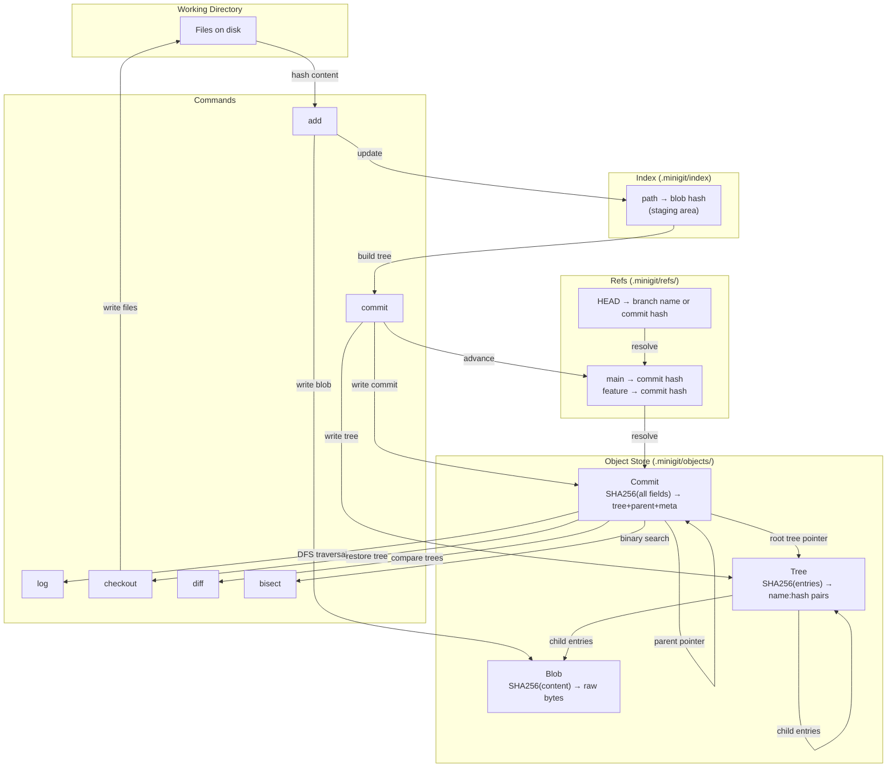

# Build Your Own Mini Version Control System

## 1. Motivation & Real-World Context

Git is not a file-synchronization tool — it is a content-addressable Merkle DAG with a command-line interface bolted on. Every `git add`, `git commit`, and `git log` is a direct operation on these data structures. Building a working subset makes Git's internals permanently legible rather than mysterious.

**Content-addressable storage** means objects are named by their content. A file's SHA-256 hash is its address. Store the file at that address and you get deduplication for free: two files with identical content are one object. Git uses this for blobs, trees, and commits. The ongoing SHA-1 → SHA-256 migration in Git (`git hash-object --format sha256`) is an active engineering project because SHA-1 has known collision vulnerabilities.

**Merkle Trees** are why Git is tamper-evident. A commit points to a root tree. The tree hashes its children (sub-trees and blobs). Any change to any file changes that file's blob hash, which changes the tree hash above it, all the way up to the root tree hash, which changes the commit hash. You cannot silently alter history — the commit hash exposes the corruption.

**IPFS (InterPlanetary File System)** is built entirely on Merkle DAGs with content-addressed blocks. Ethereum's world state trie is a Merkle Patricia Trie. Docker image layers use content-addressed hashing: if two images share a base layer with the same content, Docker stores that layer once. These are not academic structures — they are the foundation of distributed systems you interact with every day.

After completing this project, commands like `git cat-file -p HEAD`, `git log --graph`, and `git bisect` will make immediate mechanical sense rather than seeming like incantations.

## 2. Learning Objectives

By completing this project, you will deeply understand:

1. **How content-addressable storage achieves automatic deduplication** — writing a file at the path derived from its own SHA-256 hash, and why this means identical files are stored exactly once. See [`/algorithms/18-hashing`](/algorithms/18-hashing).

2. **How Merkle Trees compose hashes bottom-up** — why a tree object's hash is the SHA-256 of its children's hashes, and why any leaf change propagates a new hash all the way to the root. See [`/data-structures/22-merkle-tree`](/data-structures/22-merkle-tree).

3. **How a commit DAG encodes branching and merging history** — commits as nodes, parent-pointer edges forming a DAG where branching is two commits sharing one parent and merging is one commit with two parents. See [`/data-structures/23-graph`](/data-structures/23-graph).

4. **How DFS backward traversal produces git log** — walking the DAG from HEAD through parent pointers using depth-first search to emit commits in reverse-chronological order. See [`/algorithms/25-dfs`](/algorithms/25-dfs).

5. **How binary search on a DAG implements git bisect** — using backtracking search on the commit chain to find the first commit that introduced a bug in O(log n) steps. See [`/algorithms/43-backtracking`](/algorithms/43-backtracking).

6. **Why branches are just named pointers to commit hashes** — a branch is a single file containing a commit hash; moving a branch is overwriting that file. HEAD is a pointer to a branch name (or directly to a commit hash in detached HEAD state).

7. **How recursive tree diffing compares two snapshots** — walking two tree objects simultaneously, comparing blob hashes at each path to identify added, removed, and modified files without reading file content.

## 3. Project Scope

**In Scope:**
- Content-addressable object store: write blob, tree, and commit objects named by their SHA-256 hash
- `add` command: hash file contents, write blob object, update staging index
- `commit` command: build tree object from staging index, create commit object with parent pointer, advance branch ref
- `log` command: DFS backward traversal from HEAD printing commit hashes, messages, and timestamps
- `checkout` command: resolve commit → tree, recursively restore working directory files
- Branch support: `branch` to create, `checkout &lt;branch&gt;` to switch; branches as named ref files
- `diff` command: recursive comparison of two commit trees by blob hash, reporting added/removed/modified paths
- `bisect` skeleton: binary search over linear commit history to find first bad commit

**Out of Scope (for v1):**
- Merge conflict resolution (detect merge candidates, leave resolution to user)
- Remote protocol (push/pull/fetch)
- Pack files or object compression (objects stored as raw files)
- Index file locking for concurrent access
- Partial staging (`git add -p`)
- Submodules

## 4. Core DSA Concepts Used

| Concept | Role in this project | Handbook Link | Difficulty |
|---------|----------------------|---------------|------------|
| Merkle Tree | Tree and commit objects are a Merkle tree: each node's hash depends on its children's hashes | [/data-structures/22-merkle-tree](/data-structures/22-merkle-tree) | Hard |
| Hashing (SHA-256) | Content-addressable storage: object name = SHA-256 of object content | [/algorithms/18-hashing](/algorithms/18-hashing) | Beginner |
| Graph (DAG) | Commit history is a directed acyclic graph; parent pointers form edges | [/data-structures/23-graph](/data-structures/23-graph) | Intermediate |
| DFS | `log` command: walk commit DAG backward from HEAD via parent pointers | [/algorithms/25-dfs](/algorithms/25-dfs) | Intermediate |
| Backtracking | `bisect` command: binary search on commit chain, backtrack on bad/good markers | [/algorithms/43-backtracking](/algorithms/43-backtracking) | Intermediate |

## 5. High-Level Architecture

The system stores all objects in a `.minigit/objects/` directory, named by their hex SHA-256 hash. Refs (branches, HEAD) live in `.minigit/refs/`. The staging index is a JSON file at `.minigit/index`.



**Key interfaces:**

```
ObjectStore
  Write(content []byte) (hash string, err error)
  Read(hash string) ([]byte, error)
  Exists(hash string) bool

type BlobObject struct { Content []byte }
type TreeEntry struct { Name string; Hash string; IsTree bool }
type TreeObject struct { Entries []TreeEntry }
type CommitObject struct {
    Tree      string
    Parent    string  // empty string for root commit
    Author    string
    Message   string
    Timestamp time.Time
}
```

## 6. Implementation Milestones (with Hints)

### Milestone 1: Content-Addressable Object Store

**Goal:** Implement the raw object store: write arbitrary bytes → hash → store at hash-named path; read by hash. Implement `init` command to create the `.minigit/` directory layout.

**Key Challenges:** Ensuring the stored file path is derived entirely from the hash (so the same content always maps to the same path), and handling the two-level directory structure that Git uses (`objects/ab/cdef...` from first two hex chars) to avoid filesystem limits on directory entries.

**Hints & Guidance:**
- SHA-256 of content produces a 32-byte hash. Encode to 64-character hex string. Use the first two characters as a subdirectory: `objects/a3/4f7b...`.
- `init`: create `.minigit/`, `.minigit/objects/`, `.minigit/refs/heads/`, `.minigit/refs/tags/`. Write `.minigit/HEAD` containing `ref: refs/heads/main`.
- `Write(content)`: compute hash, check if `objects/xx/yyy...` already exists (skip write if so — deduplication), otherwise `mkdir -p` the subdirectory and write the file.
- `Read(hash)`: reconstruct path from first two chars + remainder, read and return bytes. Return an error if missing.
- Test deduplication explicitly: write the same content twice, verify only one file exists in the object store.
- In C#: `SHA256.HashData(bytes)` → `Convert.ToHexString(hash).ToLowerInvariant()`. In Go: `sha256.Sum256(content)` → `fmt.Sprintf("%x", hash)`.

**Success Criteria:**
- `init` creates the correct directory structure
- Writing the same content twice stores exactly one object file
- Read(hash) returns the original bytes
- Read of a nonexistent hash returns a clear error
- Object path for hash `a3b4c5d6...` is `objects/a3/b4c5d6...`

### Milestone 2: Blob and Tree Objects

**Goal:** Implement blob serialization (content → blob hash) and tree object serialization/deserialization (list of `name:type:hash` entries → tree hash → stored object). Implement the `add` command to stage files.

**Key Challenges:** Designing a deterministic serialization format for tree entries so the same directory contents always produce the same tree hash. Recursively hashing subdirectories.

**Hints & Guidance:**
- Blob format: just the raw file bytes. No header needed for v1 (Git adds a `blob &lt;size&gt;\0` header — you can add this as a stretch goal).
- Tree format: sort entries by name before serializing (critical for determinism). Each entry: `&lt;type&gt; &lt;name&gt;\0&lt;hash&gt;\n` or a JSON array — choose one and be consistent.
- `add &lt;path&gt;`: read file, compute blob hash via `ObjectStore.Write(content)`, update `.minigit/index` JSON map with `path → blob hash`.
- For recursive directory add (`add .`): walk the directory tree, skip `.minigit/`, create blob for each file, build tree objects bottom-up.
- Tree hashing: serialize the sorted `[]TreeEntry` to bytes, hash those bytes, store at that hash. Two directories with identical contents get the same tree hash.
- Verify the Merkle property manually: change one file in a directory, add it, rebuild the tree, confirm the tree hash changed.

**Success Criteria:**
- Two files with identical content produce the same blob hash
- A tree object's hash changes if any child blob hash changes
- `add` correctly updates the index with current blob hashes
- Recursive `add .` correctly builds tree objects for nested subdirectories
- Index can be read back and all hashes resolve to existing objects

### Milestone 3: Commit Object and the `commit` Command

**Goal:** Implement commit object serialization (tree hash + parent hash + author + message + timestamp → commit hash). Implement `commit -m "message"` command that builds a root tree from the index, creates a commit, and advances the current branch ref.

**Key Challenges:** Handling the first commit (no parent), resolving HEAD to the current branch, and advancing the branch ref atomically.

**Hints & Guidance:**
- Commit format (deterministic): `tree &lt;hash&gt;\nparent &lt;hash&gt;\nauthor &lt;name&gt;\ntimestamp &lt;unix&gt;\nmessage &lt;text&gt;`. Omit the `parent` line entirely for the root commit.
- Commit hash = SHA-256 of the serialized commit bytes. Store in object store.
- Resolving HEAD: read `.minigit/HEAD`. If it contains `ref: refs/heads/main`, read `.minigit/refs/heads/main` for the current commit hash (empty string if no commits yet). If it contains a raw hash, you are in detached HEAD mode.
- Advancing branch: after creating the commit object, write the new commit hash to `.minigit/refs/heads/&lt;branch&gt;`.
- Build root tree from index: reconstruct the tree hierarchy from flat `path → hash` index entries. Group by directory, build tree objects bottom-up.
- Print the short commit hash (first 7 chars) on success, matching Git's output style.

**Success Criteria:**
- First commit has no parent field; its hash is deterministic given the same content and timestamp
- Second commit's parent field contains the first commit's hash
- `refs/heads/main` advances to the new commit hash after each commit
- The same files committed at the same timestamp always produce the same commit hash
- Verify with `ObjectStore.Read(commitHash)` that the stored bytes decode back to the commit struct

### Milestone 4: `log` via DFS Backward Traversal

**Goal:** Implement `log` command: starting from HEAD, walk the commit DAG backward through parent pointers using DFS, printing each commit's hash, author, timestamp, and message.

**Key Challenges:** Detecting the root commit (no parent) to stop traversal. Handling potential DAG structure (multiple parents from a merge commit — visit each parent branch).

**Hints & Guidance:**
- `log` is iterative DFS from HEAD: read commit, print it, follow parent pointer, repeat until parent is empty.
- For a linear history, a simple while loop suffices. For a DAG with merge commits, use a stack (or recursive DFS) and a `visited` set to avoid revisiting shared ancestors.
- Output format: `commit &lt;full_hash&gt;\nAuthor: &lt;author&gt;\nDate:   &lt;timestamp&gt;\n\n    &lt;message&gt;\n`. Mirror Git's format for familiarity.
- `--oneline` flag: print only `&lt;short_hash&gt; &lt;message&gt;` — one line per commit.
- `--graph` stretch: detect when a commit has two parents, draw ASCII branch lines. Start simple: just indent merge commits.
- Test with a chain of 5 commits: verify `log` prints them newest-first.

**Success Criteria:**
- `log` with no commits prints nothing (or "no commits yet")
- `log` after 3 commits prints all 3 in reverse chronological order
- Each commit entry shows full hash, author, date, and message
- `log` on a branching DAG visits commits in correct topological order without duplicates
- A visited set prevents infinite loops if the DAG ever has unexpected cycles

### Milestone 5: Branches and `checkout`

**Goal:** Implement `branch &lt;name&gt;` to create a new branch pointing at HEAD's commit. Implement `checkout &lt;branch&gt;` to switch branches: update HEAD, restore the working directory from the branch's commit tree.

**Key Challenges:** Restoring the working directory from a tree object recursively — recreating the exact file layout stored in the commit's tree. Handling the case where checkout would overwrite locally modified files (warn but proceed in v1).

**Hints & Guidance:**
- `branch &lt;name&gt;`: read current commit hash from HEAD, write it to `refs/heads/&lt;name&gt;`. Update HEAD to `ref: refs/heads/&lt;name&gt;`.
- `checkout &lt;branch&gt;`: write `ref: refs/heads/&lt;branch&gt;` to HEAD. Then resolve branch → commit hash → root tree hash. Recursively restore files.
- Tree restoration (recursive): given a tree hash, read the tree object, iterate entries. For blob entries: `ObjectStore.Read(blobHash)` → write bytes to path on disk. For sub-tree entries: mkdir + recurse.
- Clear the working directory (except `.minigit/`) before restoring — or diff trees and only change what is different (harder but correct).
- Detached HEAD: `checkout &lt;commitHash&gt;` writes the raw hash to HEAD directly (not a ref pointer). `log` still works from a detached HEAD.
- Test: commit file A on main, create branch feature, commit file B on feature, checkout main → B should be gone from working directory.

**Success Criteria:**
- `branch feature` creates `refs/heads/feature` pointing at current HEAD commit
- `checkout feature` updates HEAD and restores the working directory to match that branch's latest commit
- Files present in one branch but not another appear and disappear correctly on checkout
- `checkout &lt;commitHash&gt;` enters detached HEAD state and restores that commit's files
- The branch's commit history is preserved independently after branching

### Milestone 6: `diff` and `bisect`

**Goal:** Implement `diff &lt;commitA&gt; &lt;commitB&gt;` to show files added, removed, and modified between two commits using recursive tree comparison. Implement `bisect` as a binary search over a linear commit chain to find the first "bad" commit.

**Key Challenges:** Recursive tree comparison requires walking two trees simultaneously, aligning entries by name, and classifying each pair. Bisect requires collecting the commit chain as a list, then binary searching with user feedback.

**Hints & Guidance:**
- `diff`: resolve both commits to their root tree hashes. Recursive diff function: given treeHashA and treeHashB (either may be empty string for "does not exist"), read both tree objects, merge their entry lists by name, classify each: added (only in B), removed (only in A), modified (same name, different hash), unchanged (same hash — skip). Recurse into sub-tree pairs.
- Output: `+ path` for added, `- path` for removed, `~ path` for modified. Show the before/after blob hashes for modified files.
- `bisect start`: collect the commit chain from HEAD to root as a `[]commitHash` slice (DFS log traversal). Binary search: present the middle commit to the user, ask good/bad, narrow the range. Stop when the range is 1 commit.
- Bisect is O(log n): for 1024 commits, 10 questions find the bad commit. Print this count at the start.
- The `bisect` is interactive: `checkout` each candidate commit so the user can run their tests and report good/bad.
- Backtracking perspective: bisect is backtracking with a binary-search pruning strategy — each good/bad answer eliminates half the search space.

**Success Criteria:**
- `diff HEAD~1 HEAD` correctly identifies added, removed, and modified files between the last two commits
- Unchanged files do not appear in the diff output
- Diff on two commits that share no common files lists all files as added or removed appropriately
- `bisect` with 8 commits requires at most 3 queries to identify the bad commit
- Bisect correctly identifies the first bad commit when given a consistent good/bad oracle

## 7. Stretch Goals

1. **Merge command with conflict detection:** Implement `merge &lt;branch&gt;` by finding the common ancestor commit (LCA on the DAG), three-way diffing the two branches against the common ancestor, and writing a merge commit with two parents. Mark files with conflicts using `&lt;&lt;&lt;&lt;&lt;&lt;`/`======`/`>>>>>>` markers and leave resolution to the user.

2. **Pack format for object compression:** Real Git packs objects into a binary `.pack` file with delta compression. Implement a simple pack: serialize all objects into one binary file with an index, using zlib compression per object. Measure size reduction on a real repository.

3. **SHA-1 → SHA-256 migration flag:** Add a `--hash-algo` option to `init` that selects sha1 or sha256. Show concretely how the hash algorithm affects object addresses. Implement a migration command that rewrites all objects from SHA-1 addresses to SHA-256 addresses — the same problem the real Git project is solving.

4. **Interactive rebase skeleton:** Implement `rebase &lt;branch&gt;` that replays commits from the current branch on top of `&lt;branch&gt;` by re-creating each commit with the new parent. This changes commit hashes (because parent changes) — demonstrating why `git push --force` is needed after a rebase.

5. **Merkle proof verification:** Given a commit hash and a file path, generate a Merkle proof (the chain of tree hashes from root to the blob) that proves the file's content is included in that commit, without reading any other files. Verify the proof from the commit hash alone.

## 8. Testing & Validation Strategy

**Unit tests — object store:**
- Write a known string, verify the stored file path contains the correct SHA-256 hex.
- Write the same string twice, verify `objects/` has exactly one file.
- Read a nonexistent hash returns error; read the written hash returns original bytes.

**Unit tests — Merkle property:**
- Create a tree with files A, B, C. Record tree hash T1. Modify file B. Rebuild tree. Verify new tree hash T2 ≠ T1. Verify blob hash for A and C are unchanged. Verify blob hash for B changed.
- Commit on top of a commit: verify `parent` field of second commit equals hash of first commit.

**Integration tests — command sequences:**
- `init` → `add file.txt` → `commit -m "first"` → verify `refs/heads/main` contains a valid commit hash.
- `commit` → `commit` (no changes): should either refuse or create an identical tree commit — define behavior and test it.
- `branch feature` → add file → `commit` on feature → `checkout main` → verify feature's file is gone.
- `diff main feature`: verify correct added/removed classification.

**End-to-end test:**
- Replicate a sequence of real Git operations on a small test repo using both real Git and your implementation. Compare the structural output (number of objects, dependency graph shape) even if hashes differ due to format differences.

**Bisect correctness:**
- Create 16 commits where the 10th introduces a "bug" (a known string in a file). Run bisect with an oracle that checks for the string. Verify it finds commit 10 in exactly 4 queries.

## 9. C# and Go Implementation Notes

**C# notes:**
- `System.Security.Cryptography.SHA256.HashData(ReadOnlySpan&lt;byte&gt; source)` — static method, no allocation, available in .NET 5+. Returns `byte[]`. Use `Convert.ToHexString(hash).ToLowerInvariant()` for the hex string.
- `System.Text.Json.JsonSerializer` for index and tree object serialization. Keep serialization simple and deterministic: sort dictionary keys before serializing.
- `System.IO.File.WriteAllBytes` / `ReadAllBytes` for object storage. `Directory.CreateDirectory` handles nested mkdir.
- Model objects as `record` types for structural equality: `record BlobObject(byte[] Content)`, `record CommitObject(string Tree, string Parent, string Author, string Message, long Timestamp)`.
- `string.IsNullOrEmpty(parent)` to detect root commit cleanly.
- For the recursive tree restore, use `Directory.EnumerateFiles(path, "*", SearchOption.AllDirectories)` to list files before clearing them.

**Go notes:**
- `crypto/sha256`: `hash := sha256.Sum256(content)` returns `[32]byte`. `hex.EncodeToString(hash[:])` gives the 64-char hex string.
- `os.WriteFile(path, data, 0644)` and `os.ReadFile(path)` for object store I/O. `os.MkdirAll(dir, 0755)` for the two-level directory.
- `encoding/json` for index and tree objects. Always marshal tree entries in sorted order: `sort.Slice(entries, func(i,j int) bool { return entries[i].Name &lt; entries[j].Name })` before marshaling.
- Use `filepath.Walk` for recursive directory traversal in `add .`. Skip entries where `strings.HasPrefix(path, ".minigit")`.
- Represent the commit DAG with `type CommitNode struct { Hash string; Commit CommitObject; Parents []*CommitNode }` for in-memory traversal during `log` and `bisect`.
- Error wrapping: `fmt.Errorf("reading object %s: %w", hash, err)` throughout for clear error chains.

## 10. Potential Extensions & Related Projects

- **Build Your Own IPFS Node (subset):** IPFS is a content-addressed Merkle DAG over a peer-to-peer network. Your object store is structurally identical to an IPFS block store. Add a simple TCP server that serves objects by hash and you have the core of an IPFS node.
- **Build Your Own Docker Layer Cache:** Docker images are stacks of content-addressed layers. Each layer is a tar archive identified by its SHA-256 hash. Your Merkle tree builder is directly applicable to building and verifying image layer manifests.
- **Build Your Own Blockchain (mini):** A blockchain is a linear Merkle chain of blocks where each block contains the hash of the previous block. Your commit chain (each commit hashing in its parent hash) is structurally identical. Add proof-of-work and a network layer for the full structure.
- **Relate to Stream Analytics Pipeline (`19-stream-analytics-pipeline.md`):** Ethereum's Merkle Patricia Trie combines your Merkle tree (for integrity) with a Patricia/Radix trie (for efficient key lookup). The two projects together cover the complete Ethereum state structure.
- **Relate to Geospatial Index (`21-geospatial-index.md`):** Git's `git bisect` is binary search on a sorted commit chain — the same binary search used in KD-tree nearest-neighbor pruning. Both use the same algorithmic primitive to eliminate half the search space per step.
