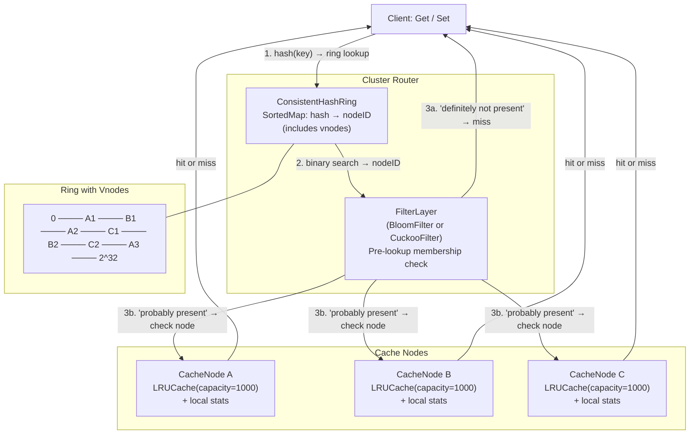

# Build Your Own Distributed Cache

## 1. Motivation & Real-World Context

A single-machine cache has a hard ceiling: the RAM of one server. When your data volume or request rate exceeds that ceiling, you need to distribute the cache across a cluster. The central problem is routing: given a key, which node holds it? And when the cluster changes size, how much data moves?

**Memcached** introduced consistent hashing to the mainstream. Facebook's Memcached deployment (the largest in the world as of the 2013 paper) used consistent hashing to distribute hundreds of terabytes of cache data across thousands of servers. When a server is added or removed, only `K/n` keys need to migrate — where K is total keys and n is cluster size — rather than rehashing everything.

**Cassandra** places nodes on a consistent hash ring and uses 150 virtual nodes per physical node to smooth out load distribution. Without virtual nodes, if you have 3 nodes equally spaced, adding a 4th node only takes load from one of the three. With 150 virtual positions per node, the new node takes roughly equal load from all existing nodes.

**Amazon DynamoDB**'s original internal partitioning (Dynamo, 2007 paper) is the canonical consistent hashing reference implementation. The paper introduced the vnode concept that every distributed system since has borrowed. Reading it after building this project makes every paragraph immediately concrete.

**Redis Cluster** uses a different but related approach: 16,384 hash slots assigned to nodes, with `slot = CRC16(key) % 16384`. Your consistent hash ring is the generalization of this fixed-slot scheme.

**Bloom Filters** appear at every level of the cache stack. Cassandra uses Bloom Filters per SSTable to avoid disk reads for keys that definitely do not exist. Redis's built-in `BF.EXISTS` command (RedisBloom module) serves the same purpose. A Bloom Filter check is cheap enough to run on every cache miss — if it says "definitely not here," you skip the node lookup entirely.

## 2. Learning Objectives

By completing this project, you will deeply understand:

1. **Why naive hash-based sharding (`key % n`) is catastrophic on cluster resize** — the math showing that changing n by 1 invalidates nearly every key assignment, and how consistent hashing limits migration to `K/n` keys. See [`/algorithms/46-consistent-hashing`](/algorithms/46-consistent-hashing).

2. **How a sorted ring with binary search implements consistent hashing in O(log n)** — placing node hashes on a sorted array, using binary search to find the first node clockwise from any key hash, and wrapping around at the ring boundary. See [`/algorithms/46-consistent-hashing`](/algorithms/46-consistent-hashing).

3. **How virtual nodes solve the load imbalance problem** — why 3 physical nodes with 1 position each leads to uneven load when nodes differ in capacity, and why 150 virtual positions per node produces near-uniform distribution. See [`/algorithms/46-consistent-hashing`](/algorithms/46-consistent-hashing).

4. **How LRU cache provides O(1) get and put with bounded memory per node** — the doubly linked list + hash map combination that makes both access and eviction O(1). See [`/data-structures/10-lru-cache`](/data-structures/10-lru-cache).

5. **How Bloom Filters reduce unnecessary lookups with a probabilistic membership check** — the bit array + multiple hash functions structure, why false positives are possible but false negatives are not, and how to tune m (bits) and k (hash functions) for a target false positive rate. See [`/data-structures/24-bloom-filter`](/data-structures/24-bloom-filter) and [`/algorithms/45-bloom-filter-alg`](/algorithms/45-bloom-filter-alg).

6. **Why Cuckoo Filters outperform Bloom Filters when deletions are needed** — fingerprint-based storage in two tables, the cuckoo displacement protocol, and why you cannot delete from a standard Bloom Filter (which bit do you clear?). See [`/data-structures/28-cuckoo-filter`](/data-structures/28-cuckoo-filter).

7. **How consistent hashing, LRU eviction, and probabilistic filters compose into a complete cache tier** — routing, eviction, and false-positive-free miss detection as orthogonal concerns that stack cleanly on top of each other.

## 3. Project Scope

**In Scope:**
- Consistent hash ring with binary search for O(log n) node lookup
- Virtual nodes: each physical node owns configurable number of ring positions
- LRU cache per cluster node with configurable capacity
- Cluster router: `Get(key)` and `Set(key, value, ttl)` routed to correct node via ring
- Bloom Filter as a pre-lookup membership check layer
- Cuckoo Filter with deletion support as an alternative to Bloom Filter
- Benchmarks: key migration count on node add/remove (naive vs consistent hashing), false positive rate measurement for both filters
- Simulation of node failure and re-routing of its keys to the successor node

**Out of Scope (for v1):**
- Network layer (nodes are in-process goroutines/objects, not separate servers)
- Data replication (keys are not replicated to successor nodes for fault tolerance)
- TTL expiry background goroutine
- Write-through or write-behind cache semantics
- Consistent read/write quorums
- Gossip protocol for cluster membership

## 4. Core DSA Concepts Used

| Concept | Role in this project | Handbook Link | Difficulty |
|---------|----------------------|---------------|------------|
| Consistent Hashing | Map keys to nodes on a virtual ring; minimize key migration on cluster resize | [/algorithms/46-consistent-hashing](/algorithms/46-consistent-hashing) | Hard |
| LRU Cache | Per-node bounded-memory cache with O(1) eviction | [/data-structures/10-lru-cache](/data-structures/10-lru-cache) | Intermediate |
| Bloom Filter | Pre-lookup membership check to skip unnecessary node queries | [/data-structures/24-bloom-filter](/data-structures/24-bloom-filter) | Intermediate |
| Cuckoo Filter | Deletable alternative to Bloom Filter with fingerprint-based storage | [/data-structures/28-cuckoo-filter](/data-structures/28-cuckoo-filter) | Hard |
| Hashing | Hash keys and node names to ring positions and filter slots | [/algorithms/18-hashing](/algorithms/18-hashing) | Beginner |

## 5. High-Level Architecture

The `Cluster` routes all requests through a `ConsistentHashRing`. Each ring position maps to a `CacheNode`, which wraps an `LRUCache`. A `FilterLayer` (Bloom or Cuckoo) sits in front of node lookups.



**Key interfaces:**

```
ConsistentHashRing
  AddNode(nodeID string)
  RemoveNode(nodeID string)
  GetNode(key string) string     // returns nodeID

CacheNode
  Get(key string) (value, bool)
  Set(key string, value string)
  Evictions() int

BloomFilter
  Add(item string)
  MightContain(item string) bool  // false = definitely not present

CuckooFilter
  Add(item string) bool
  Contains(item string) bool
  Delete(item string) bool
```

## 6. Implementation Milestones (with Hints)

### Milestone 1: Consistent Hash Ring with Binary Search

**Goal:** Implement a consistent hash ring using a sorted array (or sorted map) of `uint32` ring positions. `AddNode` places one position for a node. `GetNode(key)` hashes the key, binary searches for the first position ≥ hash, wraps around to index 0 if none found (ring wrap).

**Key Challenges:** Handling the ring wrap-around (key hash greater than all node hashes should map to the first node). Producing an even key distribution across nodes.

**Hints & Guidance:**
- Represent the ring as `[]uint32` (sorted positions) and a parallel `[]string` (node IDs at each position). Keep them in sync.
- Hash a node name to its ring position: `hash32(nodeID)` where `hash32` uses FNV-1a or MurmurHash3 over the string bytes, reduced to `uint32`.
- `GetNode(key)`: compute `keyHash = hash32(key)`. Binary search for the first `ringPosition >= keyHash`. If none (key hash > all positions), wrap to index 0.
- In Go: `sort.Search(len(ring), func(i int) bool { return ring[i] >= keyHash })`. If result == len(ring), return ring[0].
- In C#: `Array.BinarySearch` returns a bitwise complement on miss — `~result` gives the insertion point.
- Proof of correctness: add nodes A, B, C. For 10,000 random keys, count how many map to each node. Expect roughly equal thirds. Print the distribution.

**Success Criteria:**
- Three nodes on the ring receive roughly 33% of keys each (within ±5%)
- Key always maps to the same node for the same ring configuration
- After removing a node, the keys that mapped to it now map to the next clockwise node
- Ring wrap: a key with hash > all node positions maps to node at ring index 0

### Milestone 2: Virtual Nodes for Load Balancing

**Goal:** Extend `AddNode` to place `vnodeCount` positions per physical node (using `hash32(nodeID + strconv.Itoa(i))` for position i). Demonstrate that vnode count dramatically improves load balance.

**Key Challenges:** Mapping virtual node positions back to physical node IDs. Removing a node must remove all its virtual positions.

**Hints & Guidance:**
- Position label: for node "A" with 3 vnodes, generate positions for "A-0", "A-1", "A-2". The physical node is the prefix before the dash.
- Maintain a `map[uint32]string` from ring position to physical nodeID for O(1) position → node resolution after the binary search gives you the position.
- `RemoveNode(nodeID)`: iterate all positions, delete those where the mapped nodeID matches, rebuild the sorted array.
- Benchmark load balance: 1 vnode per node → coefficient of variation of key counts across nodes. 10 vnodes → lower. 150 vnodes → near-uniform. Plot the curve.
- Expected result: with 150 vnodes and 3 nodes, no node should receive more than 40% or less than 27% of keys (vs. potentially 60%/20%/20% with 1 vnode each).
- Cassandra's default of 150 vnodes per node is empirically chosen — your benchmark will show why.

**Success Criteria:**
- With 1 vnode per node: key distribution coefficient of variation > 20%
- With 150 vnodes per node: coefficient of variation &lt; 5%
- All virtual positions for a physical node are removed on `RemoveNode`
- Key migration on AddNode: with 150 vnodes and 3 nodes, adding a 4th node moves ~25% of keys (roughly K/4). Measure this.

### Milestone 3: Per-Node LRU Cache Integration

**Goal:** Replace each "node" with a `CacheNode` wrapping an LRU cache of configurable capacity. Implement cluster-level `Get(key)` and `Set(key, value)`. Verify that the correct node receives each request.

**Key Challenges:** The `Set` route and the `Get` route must reach the same node for a given key. After eviction, a `Get` for the evicted key is a miss even though the key was previously set.

**Hints & Guidance:**
- LRU cache per node: reuse your LRU implementation from project 05 (or implement fresh with doubly linked list + hash map, O(1) get/put/evict).
- Cluster `Get(key)`: `nodeID = ring.GetNode(key)` → `nodes[nodeID].Get(key)`. Return value and hit/miss flag.
- Cluster `Set(key, value)`: `nodeID = ring.GetNode(key)` → `nodes[nodeID].Set(key, value)`.
- Add eviction counters per node: how many keys were evicted due to capacity? This surfaces capacity planning requirements.
- Simulate cache warming: `Set` 10,000 key-value pairs across a 3-node cluster with per-node capacity 1000. Verify ~1000 keys per node are retained (others evicted).
- Test correctness: `Set("hello", "world")` → `Get("hello")` returns `("world", true)` always, assuming no eviction in between.

**Success Criteria:**
- `Set` followed immediately by `Get` for the same key returns the value
- Keys are distributed across nodes proportionally to ring assignment
- Per-node eviction count increases when node capacity is exceeded
- Cluster-level hit rate is measurable: `(hits / (hits + misses)) * 100`
- Removing a node makes all its keys unreachable (they will route to the successor but not be present)

### Milestone 4: Key Migration Analysis

**Goal:** Measure exactly how many keys migrate when a node is added or removed, and compare consistent hashing against naive modulo sharding. Prove the `K/n` migration bound empirically.

**Key Challenges:** Simulating "migration" requires tracking the old and new node assignments for every key in the population.

**Hints & Guidance:**
- Naive sharding: `node = hash(key) % n`. When n increases by 1, check each key: does `hash(key) % (n+1)` equal the same index as before? Count mismatches.
- Consistent hashing: record node assignment for all 100,000 keys. Add a new node. Record new assignments. Count changed assignments.
- For naive sharding with n=3 → n=4: approximately 75% of keys change node. For consistent hashing with 150 vnodes: approximately 25% of keys change node.
- Print a table: "Method | Before nodes | After nodes | Keys migrated | % migrated".
- Test both node addition (scale-out) and node removal (failure/scale-in).
- Show that consistent hashing with vnodes achieves `~K/(n+1)` migration for node addition and `~K/n` for node removal.

**Success Criteria:**
- Naive sharding: adding 1 node to a 3-node cluster migrates > 70% of keys
- Consistent hashing: adding 1 node to a 3-node cluster migrates &lt; 30% of keys
- The migrated percentage is close to `100/(n+1)%` for consistent hashing
- Results are reproducible with a fixed key set and fixed ring configuration

### Milestone 5: Bloom Filter as Pre-Lookup Layer

**Goal:** Implement a Bloom Filter and integrate it as a pre-check before node lookups. If the filter says "definitely not present," skip the node query and return a miss immediately.

**Key Challenges:** Tuning the Bloom Filter's false positive rate (m bits, k hash functions). Understanding when false positives cause unnecessary node lookups but never missed hits.

**Hints & Guidance:**
- Bloom Filter: `m`-bit array, `k` hash functions. `Add(item)`: set bits at `h1(item) % m`, `h2(item) % m`, ..., `hk(item) % m`. `MightContain(item)`: return true iff all k bits are set.
- For k hash functions from two base hashes: `h_i(x) = (h1(x) + i * h2(x)) % m`. Use FNV-1a and MurmurHash3 as h1 and h2.
- Optimal k for given m and n (n = expected insertions): `k = (m/n) * ln(2)`. False positive rate: `(1 - e^(-kn/m))^k`.
- Target: false positive rate &lt; 1% with n=10,000 items → need m ≈ 96,000 bits (12 KB). Extremely cheap.
- Integration: `Cluster.Get(key)` checks filter first. If `MightContain` returns false, return miss without hitting any node. If true, proceed to node lookup.
- After `Set(key, value)`: call `filter.Add(key)`. After key expires or is evicted: you cannot remove from a Bloom Filter — it may falsely say the key is present until the filter is rebuilt.
- Measure: what percentage of cache misses does the Bloom Filter correctly short-circuit? (On a cold cache: nearly 100%. On a warm cache: nearly 0% — all keys are in the filter.)

**Success Criteria:**
- Bloom Filter with m=96,000 bits and k=6 achieves &lt; 1% false positive rate on 10,000 items
- `MightContain` never returns false for an item that was `Add`ed
- False positive rate measured empirically matches the theoretical formula within 0.5%
- Integration: Bloom Filter reduces node lookups for cache misses by the measured false-negative-free miss rate

### Milestone 6: Cuckoo Filter with Deletion Support

**Goal:** Implement a Cuckoo Filter as a replacement for the Bloom Filter. Demonstrate deletion: after `Delete(key)`, subsequent `Contains(key)` returns false. Compare false positive rates and memory usage between Bloom and Cuckoo at the same item count.

**Key Challenges:** The cuckoo displacement protocol — when both candidate buckets are full, displace an existing fingerprint and re-insert it. Avoiding infinite displacement loops (maximum displacement limit).

**Hints & Guidance:**
- Cuckoo Filter stores 4-bit (or 8-bit) fingerprints, not full hashes. Each item has two candidate bucket positions: `b1 = hash(item) % numBuckets` and `b2 = b1 XOR hash(fingerprint) % numBuckets`.
- The XOR trick makes the second bucket computable from the first without knowing the original item — enabling lookup and deletion from either bucket.
- Each bucket holds b entries (b=4 is standard). On insertion, try b1 first, then b2. If both full: pick one at random, displace one of its fingerprints, attempt to re-insert the displaced fingerprint at its alternate bucket. Repeat up to MaxKicks=500 times. If MaxKicks exceeded, the filter is full — return false.
- `Delete(item)`: compute fingerprint, compute b1 and b2, remove the fingerprint from whichever bucket contains it. This is safe because the fingerprint + bucket position uniquely identifies the item (with high probability).
- False positive rate comparison at n=10,000: Bloom Filter (m=96,000 bits) ≈ 1%. Cuckoo Filter (8-bit fingerprints, 4 slots per bucket, n=10,000) ≈ 0.1% using ~80,000 bits. Cuckoo wins on both FP rate and supports deletion.
- Measure deletion correctness: add 1,000 items, delete 500, verify those 500 return `Contains=false`, verify the other 500 still return `Contains=true`.

**Success Criteria:**
- Cuckoo Filter false positive rate &lt; 1% at n=10,000 items
- `Delete` followed by `Contains` returns false for the deleted item
- Deletion does not affect `Contains` for items that were not deleted
- Side-by-side comparison table: Filter | Bits Used | FP Rate | Supports Deletion
- Cluster integration: swap Bloom for Cuckoo and verify deleted keys are no longer "found" by the filter

## 7. Stretch Goals

1. **Replication factor = 2:** For each key, route to the first two distinct clockwise nodes. `Set` writes to both nodes. `Get` reads from the first node; on miss, try the second (replica). This gives single-node-failure tolerance. Measure the extra storage overhead.

2. **LFU eviction variant:** Replace the per-node LRU cache with the O(1) LFU cache from project 05. Run a Zipfian workload and compare cluster-level hit rates. LFU should retain ultra-hot keys better than LRU under Zipfian access patterns.

3. **Consistent hashing with weighted nodes:** Assign different vnode counts to nodes based on their "capacity" (e.g., a large node gets 300 vnodes, a small node gets 100). Verify that key distribution is proportional to vnode count. This is how Cassandra handles heterogeneous hardware.

4. **Cluster membership gossip (mini):** Implement a simplified gossip protocol where each node periodically sends its view of the cluster membership to a random peer. Nodes that have not been heard from in T seconds are marked as dead and removed from the ring. Simulate node failure and recovery.

5. **Redis RESP protocol layer:** Wrap the cluster in a TCP server that speaks a minimal subset of the Redis Serialization Protocol (RESP): `GET`, `SET`, `DEL`. Test with the real `redis-cli` tool or a Redis client library. This makes the distributed cache a drop-in Redis replacement for simple workloads.

## 8. Testing & Validation Strategy

**Unit tests — consistent hash ring:**
- Single node: all keys map to it. Add a second node: roughly half the keys move. Add a third: roughly a third of the original set moves.
- Key stability: after adding and then removing a node (back to original state), all keys map to their original nodes.
- Determinism: given the same node set and key, `GetNode` always returns the same result across process restarts.

**Unit tests — Bloom Filter:**
- After adding n items, `MightContain` returns true for all n items (no false negatives).
- Test 100,000 items not added to the filter; count how many `MightContain` returns true. Should be &lt; FP rate × 100,000.
- Filter is correct at boundaries: m=1 (saturated immediately), m=very large (nearly zero FP rate).

**Unit tests — Cuckoo Filter:**
- Add 1,000 items. `Contains` returns true for all 1,000.
- Delete 500. `Contains` returns false for all 500, true for the other 500.
- Add items up to 90% capacity. Insertion should succeed with &lt; 1% failure rate.
- Confirm XOR property: for any item, `b2 = b1 XOR hash(fingerprint) % n`, compute b1 from b2 using the same formula — must recover b1.

**Integration tests:**
- Warm the cluster with 50,000 keys. Add a new node. Measure: percentage of subsequent `Get` calls that are misses due to key migration (expected: ~20% of keys are now on a different node and will miss until re-populated).
- Bloom Filter integration: with 10,000 pre-loaded keys and 1,000 queries for non-existent keys, fewer than 1% of miss queries should reach a cache node (rest short-circuited by filter).

**Benchmark suite:**
- `Set` and `Get` throughput: operations/second on a single node vs. a 3-node cluster.
- Ring lookup latency: binary search over 150 * N positions; should be &lt; 1 microsecond for N ≤ 10.
- Filter check overhead: Bloom check vs. no check — confirm filter reduces total latency on miss-heavy workloads.

## 9. C# and Go Implementation Notes

**C# notes:**
- `SortedDictionary&lt;uint, string&gt;` for the consistent hash ring. `uint` is a 32-bit unsigned integer matching the hash space. Use `SortedDictionary.Keys.GetEnumerator()` for ring traversal, or copy keys to `uint[]` and use `Array.BinarySearch` for O(log n) lookup.
- `System.Collections.BitArray` for Bloom Filter. Initialize with `new BitArray(m)`. Bit operations: `bitArray[index] = true`, `bitArray[index]` for read.
- For hash functions in Bloom Filter: implement FNV-1a 32-bit (simple, fast) and a second independent hash via FNV-1a with a different seed. Use double-hashing to derive k hash values.
- LRU cache: reuse or re-implement `LinkedList&lt;Node&gt;` + `Dictionary<string, LinkedListNode&lt;Node&gt;>`. `LinkedList.First` and `LinkedList.Last` for O(1) head/tail access.
- `ConcurrentDictionary&lt;string, CacheNode&gt;` for the node registry. Each node's LRU cache should be individually locked (one `lock` object per node, not one global lock).

**Go notes:**
- Use `uint32` for hash values throughout (consistent hashing is typically 32-bit). `sort.Search` on `[]uint32` for O(log n) binary search.
- `sync.RWMutex` per `CacheNode`: `RLock/RUnlock` for `Get`, `Lock/Unlock` for `Set` and eviction. Do not use a single global mutex — it serializes all nodes.
- Bloom Filter bit array: `[]uint64` is more efficient than `[]bool` (64 bits per element). Access bit `i`: `arr[i/64] & (1 &lt;&lt; (i%64)) != 0`. Set bit `i`: `arr[i/64] |= 1 &lt;&lt; (i%64)`.
- FNV-1a in Go: `hash/fnv` package. `h := fnv.New32a(); h.Write([]byte(key)); return h.Sum32()`.
- For Cuckoo Filter fingerprints, use `uint8` (8-bit fingerprint). Each bucket is `[4]uint8`. The filter is `[]Bucket` of length numBuckets.
- Use `math/rand` with a fixed seed for all benchmarks so results are reproducible across runs.

## 10. Potential Extensions & Related Projects

- **Build Your Own Redis Cluster (protocol layer):** This project already implements the core of Redis Cluster's consistent hashing and per-node caching. Add a RESP TCP server (project 17's stretch goal) and cluster handshake (CLUSTER MEET) messages, and you have a multi-node Redis Cluster.
- **Build Your Own CDN Edge Selection:** CDNs use consistent hashing to select which edge node serves a given URL. Every URL maps to an edge node via its hash, and edge nodes maintain LRU caches of origin responses. Your cluster is the data-plane implementation.
- **Relate to Stream Analytics Pipeline (`19-stream-analytics-pipeline.md`):** Bloom and Cuckoo Filters appear in both projects. In the stream analytics pipeline, they serve membership checks over a high-velocity stream. In the distributed cache, they serve as pre-lookup guards. The implementations are identical — only the context differs.
- **Build Your Own Key-Value Store:** The distributed cache is one step away from a persistent key-value store. Add a write-ahead log (WAL) to each node (append-only file of operations) and you have durability. Add SSTable compaction and you have a mini-LevelDB.
- **Relate to Mini Version Control (`16-mini-version-control.md`):** Both projects use SHA-based hashing as a core primitive. Version control uses it for content-addressable object storage; distributed caching uses it for ring position assignment. The same `hash32` function appears in both, illustrating how hashing composes into radically different systems.
