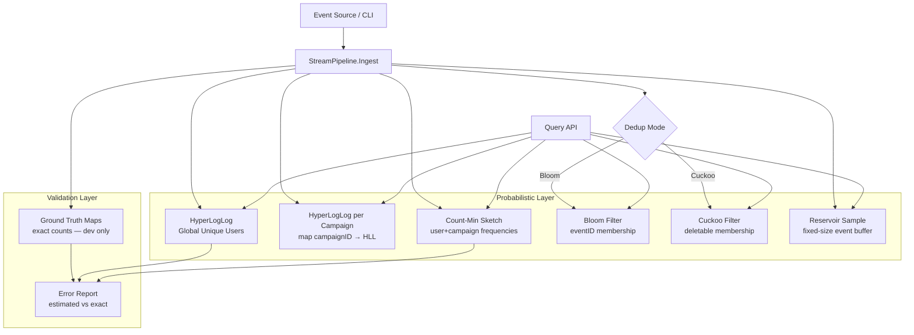

# Build Your Own Stream Analytics Pipeline

## 1. Motivation & Real-World Context

Production systems do not wait for you to run a batch job over yesterday's data. Ad impressions, clickstreams, API access logs, and IoT sensor readings arrive continuously at rates that make exact counting and exact storage impossible on a single machine. The engineering response is probabilistic data structures: structures that trade a controlled amount of accuracy for orders-of-magnitude reductions in memory and CPU.

**Redis HyperLogLog.** Redis's `PFADD` and `PFCOUNT` commands implement HyperLogLog cardinality estimation in ~12 KB per sketch, regardless of how many unique elements you add. Twitter's early "how many unique visitors saw this tweet?" metric used HyperLogLog-style estimators because storing every user ID was prohibitively expensive. A single Redis instance can track billions of unique IDs across thousands of keys with fixed memory per key.

**Count-Min Sketch in ad-tech.** Real-time bidding systems process millions of impressions per second. They need approximate frequency counts — "how many times did user X see campaign Y today?" — without a hash map keyed by every user-campaign pair. Count-Min Sketch provides O(1) updates and queries with a bounded overestimate error. Cassandra's streaming analytics stack and many Flink/Spark streaming jobs use Count-Min Sketch as the hot-path frequency layer.

**Bloom and Cuckoo Filters in stream deduplication.** When a stream contains duplicate events (retries, at-least-once delivery), you need a fast "have I seen this event ID before?" check. Bloom Filters are the standard answer when deletions are rare. Cuckoo Filters replace them when events expire and must be removed from the membership set without rebuilding the entire filter. Kafka consumers and CDN log processors use both patterns.

**Reservoir Sampling for representative subsets.** You cannot store every event in a 10-million-events-per-second stream, but you often need a uniform random sample for debugging, A/B test analysis, or model training. Reservoir sampling maintains a fixed-size sample in one pass with O(1) memory — the same algorithm used in database query optimizers and streaming ETL pipelines to produce statistically valid subsamples.

After completing this project, every "approximate analytics" feature in Redis, Cassandra, Flink, and ad-tech dashboards will have a concrete implementation behind it.

---

## 2. Learning Objectives

By completing this project, you will deeply understand:

1. **How HyperLogLog estimates cardinality in fixed memory** — the register array, stochastic averaging, bias correction, and why error is ~1.04/√m regardless of stream length. See [HyperLogLog](/data-structures/26-hyperloglog).

2. **How Count-Min Sketch provides frequency estimates with one-sided error** — the d × w counter matrix, multiple hash functions, and why queries always overestimate (never underestimate) the true count. See [Count-Min Sketch](/data-structures/27-count-min-sketch).

3. **How Bloom Filters enable O(1) stream deduplication with no false negatives** — the bit array + k hash functions design, false positive rate tuning, and why deletions are impossible without rebuilding. See [Bloom Filter](/data-structures/24-bloom-filter) and [Bloom Filter Algorithm](/algorithms/46-bloom-filter-alg).

4. **How Cuckoo Filters support deletable membership with fingerprint buckets** — the two-bucket XOR trick, displacement protocol, and when Cuckoo outperforms Bloom for sliding-window deduplication. See [Cuckoo Filter](/data-structures/28-cuckoo-filter).

5. **How Reservoir Sampling maintains a uniform random sample in one pass** — the replace-with-probability-k/n rule, why every element has equal inclusion probability, and how to extend to weighted sampling. See [Reservoir Sampling](/algorithms/20-reservoir-sampling).

6. **How probabilistic structures compose into a streaming analytics pipeline** — each structure answers a different question (unique count, frequency, membership, sample) and they stack cleanly behind a single event ingestion API.

7. **How to measure and validate approximation error empirically** — comparing estimated vs. exact values, plotting error distributions, and choosing parameters (m, k, d, w, reservoir size) for production targets.

---

## 3. Project Scope

**In Scope:**
- Event ingestion API: `Ingest(eventID, userID, campaignID, timestamp)`
- HyperLogLog for approximate unique user count (global and per-campaign)
- Count-Min Sketch for approximate impression frequency per (user, campaign) pair
- Bloom Filter for at-least-once deduplication of event IDs
- Cuckoo Filter as a deletable alternative for sliding-window deduplication
- Reservoir Sampling to maintain a fixed-size random event sample
- Query API: `UniqueUsers()`, `UniqueUsers(campaign)`, `Frequency(user, campaign)`, `IsDuplicate(eventID)`, `Sample() []Event`
- Error measurement harness: compare all estimates against exact hash-map ground truth
- CLI dashboard printing live stats every N events

**Out of Scope (for v1):**
- Distributed stream processing (Kafka, Flink, Spark)
- Windowed aggregation (tumbling/sliding time windows as first-class objects)
- Persistence or crash recovery of sketch state
- Concurrent multi-threaded ingestion (single-threaded v1)
- HyperLogLog++ bias correction tables (use standard HLL with simple bias correction)
- Count-Min Sketch conservative update or Count Sketch variant

---

## 4. Core DSA Concepts Used

| Concept | Role in this project | Handbook Link | Difficulty |
|---------|----------------------|---------------|------------|
| HyperLogLog | Approximate distinct user count in O(1) memory per sketch | [/data-structures/26-hyperloglog](/data-structures/26-hyperloglog) | Hard |
| Count-Min Sketch | Approximate frequency counts for user-campaign impression pairs | [/data-structures/27-count-min-sketch](/data-structures/27-count-min-sketch) | Hard |
| Bloom Filter | Fast deduplication check: has this event ID been seen before? | [/data-structures/24-bloom-filter](/data-structures/24-bloom-filter) | Intermediate |
| Bloom Filter Algorithm | k-hash design, false positive rate formula, optimal m and k | [/algorithms/46-bloom-filter-alg](/algorithms/46-bloom-filter-alg) | Intermediate |
| Cuckoo Filter | Deletable membership for sliding-window event deduplication | [/data-structures/28-cuckoo-filter](/data-structures/28-cuckoo-filter) | Hard |
| Reservoir Sampling | Fixed-size uniform random sample of stream events | [/algorithms/20-reservoir-sampling](/algorithms/20-reservoir-sampling) | Intermediate |
| Hashing | Hash user IDs, campaign IDs, and event IDs into sketch positions | [/algorithms/18-hashing](/algorithms/18-hashing) | Beginner |

---

## 5. High-Level Architecture

The pipeline ingests events through a single API. Each event fans out to four probabilistic structures plus a ground-truth validator (for development). Queries read from the appropriate structure without scanning the full stream.

**Key interfaces:**

- `StreamPipeline` — `Ingest`, `UniqueUsers()`, `UniqueUsers(campaign)`, `Frequency(user, campaign)`, `IsDuplicate(eventID)`, `Sample()`, `ErrorReport()`
- `HyperLogLog` — `Add(item)`, `Count() int64`
- `CountMinSketch` — `Increment(key, delta)`, `Estimate(key) int64`
- `BloomFilter` — `Add`, `MightContain` | `CuckooFilter` — `Add`, `Contains`, `Delete`
- `ReservoirSampler` — `Add(event)`, `Sample() []Event`

---

## 6. Implementation Milestones (with Hints)

### Milestone 1: Event Model and Ingestion API

**Goal:** Define the event schema and build the ingestion entry point that all probabilistic structures will plug into.

**Key Challenges:**
- Designing a stable event struct that carries all fields needed by downstream structures without redundant parsing.
- Generating a synthetic event stream for testing: configurable rate, duplicate injection rate, and campaign/user distributions.

**Hints & Guidance:**
- Event struct: `EventID string`, `UserID string`, `CampaignID string`, `Timestamp int64`. Use `EventID` as the deduplication key (simulates Kafka message IDs or UUIDs).
- `Ingest(event)`: validate non-empty fields, then dispatch to each registered structure. Return an error if `EventID` is empty.
- Build a `SyntheticStream(n int, duplicateRate float64)` generator that produces n events with Zipfian-distributed users and campaigns. Inject duplicates by repeating random prior `EventID`s at the configured rate.
- Maintain ground-truth maps in dev mode: `map[string]bool` for seen event IDs, `map[string]struct{}` for unique users, `map[string]map[string]int64` for exact frequencies.

**Success Criteria:**
- `Ingest` accepts 100,000 synthetic events without error.
- Ground-truth maps reflect exact counts after ingestion.
- Duplicate injection at 10% produces exactly 10,000 repeated event IDs in a 100,000-event stream.

---

### Milestone 2: HyperLogLog for Unique User Estimation

**Goal:** Implement HyperLogLog and integrate it for global unique user counting and per-campaign unique user counting.

**Key Challenges:**
- Register update: `rank = position of leftmost 1-bit in hash(userID)` after a prefix of leading zeros. Store the maximum rank seen per register.
- Cardinality estimate: harmonic mean of `2^register[i]` values, multiplied by bias correction constant α_m.
- Per-campaign sketches: lazily create a new `HyperLogLog` on first event for each `campaignID`.

**Hints & Guidance:**
- Use m = 2^p registers with p = 14 (16,384 registers, ~12 KB, ~0.81% standard error). Hash the user ID, take the top p bits as register index, use remaining bits for rank computation.
- `Add(userID)`: `hash = hash64(userID)`, `idx = hash >> (64-p)`, `w = hash &lt;&lt; p | 1` (ensure at least one bit), `rank = leadingZeros(w) + 1`, `registers[idx] = max(registers[idx], rank)`.
- `Count()`: compute raw estimate `E = alpha_m * m^2 / sum(2^(-registers[i]))`. Apply simple bias correction for small cardinalities: if E ≤ 5m/2, use linear counting for zero registers.
- Per-campaign: `map[string]*HyperLogLog` keyed by campaign ID. `UniqueUsers(campaign)` returns that sketch's count.

**Success Criteria:**
- After ingesting 100,000 events with 10,000 unique users, `UniqueUsers()` returns a value within 3% of 10,000.
- Per-campaign unique counts are within 5% of ground truth for campaigns with ≥ 100 unique users.
- Memory per HyperLogLog sketch is fixed regardless of how many users are added.

---

### Milestone 3: Count-Min Sketch for Impression Frequency

**Goal:** Implement Count-Min Sketch and use it to estimate how many times each (userID, campaignID) pair appeared in the stream.

**Key Challenges:**
- Key encoding: concatenate `userID + "\x00" + campaignID` before hashing to avoid ambiguous key boundaries.
- Update: increment all d row counters at position `hash_i(key) % w`.
- Query: return the minimum across all d rows (the min is the estimate; overestimate comes from hash collisions).

**Hints & Guidance:**
- Parameters: d = 4 rows, w = 200,000 columns. Expected overestimate error ε = e/w ≈ 0.0000136 per row; with d=4, failure probability δ = (1/2)^d = 1/16 for estimates exceeding true + ε·N.
- `Increment(key, delta)`: for each row i, `counters[i][hash_i(key) % w] += delta`.
- `Estimate(key)`: return `min(counters[i][hash_i(key) % w])` for i in 0..d-1.
- On each `Ingest`, call `Increment(userID+"\x00"+campaignID, 1)`.
- Compare top-10 (user, campaign) pairs by estimated frequency against ground truth. Report mean absolute error.

**Success Criteria:**
- For the 1,000 most frequent (user, campaign) pairs, estimated counts are within 5% of exact counts.
- No estimate is ever less than the true count (Count-Min Sketch never underestimates).
- `Estimate` for a pair that never appeared returns 0.

---

### Milestone 4: Bloom Filter for Event Deduplication

**Goal:** Implement a Bloom Filter and use it to detect duplicate event IDs in an at-least-once delivery stream.

**Key Challenges:**
- On `Ingest`: check `MightContain(eventID)` first. If true, mark as duplicate and skip downstream updates (or count as duplicate). If false, `Add(eventID)` and proceed.
- Tuning m and k for expected n = 1,000,000 unique events with false positive rate p = 0.01.

**Hints & Guidance:**
- Optimal parameters: `m = -n * ln(p) / (ln 2)² ≈ 9,585,058 bits ≈ 1.14 MB`, `k = (m/n) * ln(2) ≈ 7`.
- Double hashing: `h_i(x) = (h1(x) + i * h2(x)) % m` for i in 0..k-1.
- `IsDuplicate(eventID)`: if `MightContain(eventID)` returns true before `Add`, the event is a duplicate. Track duplicate count separately.
- False positives: a never-before-seen event ID may appear as duplicate. Measure FP rate against ground truth.

**Success Criteria:**
- True duplicates (injected at 10%) are detected with 100% accuracy (no false negatives).
- False positive rate on non-duplicate events is below 2% with configured m and k.
- Duplicate detection is at least 50x faster than a hash-map lookup in a benchmark of 1,000,000 checks.

---

### Milestone 5: Cuckoo Filter for Sliding-Window Deduplication

**Goal:** Implement a Cuckoo Filter and swap it in as the deduplication layer. Demonstrate deletion for sliding-window semantics.

**Key Challenges:**
- Fingerprint-based buckets: each item maps to two candidate buckets via `b1 = hash(item) % numBuckets` and `b2 = b1 XOR hash(fingerprint)`.
- Displacement on insert: if both buckets are full, evict a random fingerprint and re-insert it at its alternate bucket. Limit to MaxKicks = 500.
- Sliding window: after every 10,000 events, delete the oldest 1,000 event IDs from the filter to simulate a bounded window.

**Hints & Guidance:**
- 8-bit fingerprints, 4 slots per bucket, numBuckets = 262,144 (≈ 1 MB total).
- `Delete(eventID)`: compute fingerprint, find it in b1 or b2, remove it.
- Sliding window simulation: maintain a FIFO queue of the last 10,000 event IDs. On window slide, dequeue 1,000 IDs and call `Delete` on each.
- Compare: after a window slide, Bloom Filter still reports old IDs as "possibly seen" (false positives accumulate). Cuckoo Filter correctly forgets deleted IDs.

**Success Criteria:**
- `Delete` followed by `Contains` returns false for the deleted event ID.
- After sliding window deletion, Cuckoo Filter false duplicate rate drops; Bloom Filter false duplicate rate stays elevated.
- Side-by-side table: Filter Type | Memory | FP Rate | Supports Deletion | Post-Window FP Rate.

---

### Milestone 6: Reservoir Sampling and Live Dashboard

**Goal:** Implement reservoir sampling and build a CLI dashboard that prints live pipeline statistics.

**Key Challenges:**
- Reservoir algorithm: for the first k events, fill the reservoir. For event n > k, replace a random reservoir slot with probability k/n.
- Dashboard: print unique users (global + top 3 campaigns), top 5 frequency pairs, duplicate rate, sample size, and error metrics.

**Hints & Guidance:**
- Reservoir size k = 1,000. `Add(event)`: if `len(reservoir) &lt; k`, append. Else, `j = randomInt(0, count)`, if `j &lt; k`, `reservoir[j] = event`.
- Verify uniformity: run 10,000 trials of reservoir sampling on a stream of 100,000 events. Each event should appear in the reservoir with probability ≈ k/100,000 = 1%.
- Dashboard prints every 10,000 events: event count, unique users (estimated vs exact), duplicate rate, reservoir size, top campaign, and top frequency pair.
- `ErrorReport()`: return max/avg relative error across all metrics.

**Success Criteria:**
- Reservoir of size 1,000 from a 100,000-event stream: each event has inclusion probability within 10% of 1% (chi-squared test or empirical frequency check).
- Dashboard prints all metrics and updates correctly as events are ingested.
- Full pipeline processes 1,000,000 events in under 10 seconds on a modern laptop.

---

## 7. Stretch Goals

1. **Time-windowed HyperLogLog.** Maintain one HLL sketch per hour (24 sketches rolling). `UniqueUsers(window)` returns the estimate for a specific time window. Compare memory cost vs. a single global sketch.

2. **Conservative Count-Min Sketch update.** Only increment a counter if the current value is less than the true count would allow (requires external exact count, but reduces overestimate in hybrid mode). Measure error reduction.

3. **Theta Sketch union.** Implement sketch merging: `HLL_A.Merge(HLL_B)` to estimate unique users across two streams without re-reading events. This is how Apache DataSketches and Druid power multi-segment cardinality queries.

4. **Weighted Reservoir Sampling.** Extend reservoir sampling so events with higher `bidPrice` are more likely to be selected. Used in ad-tech for oversampling high-value impressions.

5. **Persistent sketch serialization.** Serialize all sketches to a binary file on shutdown and restore on startup. Measure file size vs. raw event log size for the same stream.

---

## 8. Testing & Validation Strategy

**HyperLogLog tests:**
- Add n distinct items where n ∈ {100, 1,000, 10,000, 100,000}. Verify estimate is within 3% of n for n ≥ 1,000.
- Add the same item 1,000 times; count must not change (duplicates do not inflate cardinality).
- Merge two sketches built from disjoint user sets; merged count ≈ sum of individual counts.

**Count-Min Sketch tests:**
- Increment key 100 times; estimate ≥ 100 and estimate ≤ 100 + ε·totalIncrements.
- Estimate for a key never incremented returns 0.
- No estimate is ever less than the true count across 10,000 random keys.

**Bloom Filter tests:**
- Zero false negatives: add 10,000 event IDs, check all 10,000 — all return `MightContain = true`.
- Empirical FP rate on 100,000 non-added IDs &lt; 2% with configured m and k.

**Cuckoo Filter tests:**
- Add 1,000 items, delete 500, verify `Contains = false` for deleted, `Contains = true` for retained.
- Sliding window: after deleting 1,000 old IDs, none of those IDs return `Contains = true`.

**Integration tests:**
- Ingest 500,000 events with 10% duplicates, 50,000 unique users, 20 campaigns. Compare all pipeline estimates against ground truth. Print error report; all metrics within 5%.
- Swap Bloom → Cuckoo dedup mode; re-run same stream; verify Cuckoo post-window FP rate is lower.

---

## 9. C# and Go Implementation Notes

### C#

- Use `System.Collections.BitArray` or `ulong[]` for Bloom Filter bit manipulation. `ulong[]` matches Go's approach and is faster for bulk operations.
- HyperLogLog registers: `byte[] registers` (each register stores a rank 0–255). Use `BitOperations.LeadingZeroCount` (.NET 5+) for rank computation on the hashed value.
- Count-Min Sketch: `int[,] counters` with dimensions `[d, w]`. Use `MemoryMarshal` or `Span&lt;int&gt;` for row iteration if profiling shows allocation pressure.
- Reservoir sampler: `List&lt;Event&gt;` pre-allocated to capacity k. Use `Random.Shared.Next(count)` for the replacement index.
- For hash functions: implement FNV-1a 64-bit and MurmurHash3 64-bit as h1 and h2. Avoid `string.GetHashCode()` — it is not stable across process restarts.

### Go

- HyperLogLog: `registers []uint8`, `p int` (precision). `bits.LeadingZeros64(w)` for rank. Package layout: one file per structure.
- Count-Min Sketch: `[][]uint32` for counters. Use `hash/fnv` and a seeded `maphash.Hash` for independent row hash functions.
- Bloom Filter: `[]uint64` bit array. Set bit i: `bits[i/64] |= 1 &lt;&lt; (i%64)`.
- Cuckoo Filter: `type Bucket [4]uint8`. Filter is `[]Bucket` of length `numBuckets`. Fingerprint: `uint8(hash64(item) >> 56)`.
- Reservoir: `rand.Intn(count)` for replacement. Use a seeded `rand.Rand` in tests for reproducibility.
- Ground-truth maps: `map[string]struct{}` for sets (memory-efficient). Disable in production via build tag or config flag.

---

## 10. Potential Extensions & Related Projects

1. **Build Your Own Distributed Cache (`17-distributed-cache.md`).** Bloom and Cuckoo Filters appear in both projects. In the distributed cache, they guard node lookups. In this pipeline, they deduplicate stream events. The implementations are identical — only the context differs.

2. **Build Your Own Key-Value Store (`11-key-value-store.md`).** The Bloom Filter from the KV store project is the same structure used here for deduplication. HyperLogLog could extend the KV store with a `PFADD`/`PFCOUNT` command for unique-key counting.

3. **Build Your Own Time-Series Analytics Engine.** Add tumbling time windows to Count-Min Sketch (one sketch per 5-minute bucket) and you have the core of a real-time metrics system like Grafana's streaming layer or Datadog's intake pipeline.

4. **Build Your Own Full-Text Search Engine (`13-full-text-search-engine.md`).** Reservoir sampling selects representative documents for index testing. Bloom Filters guard the "already indexed" check in incremental indexing pipelines.

5. **Build Your Own Rate Limiter.** Count-Min Sketch frequency estimates are the foundation of sliding-window rate limiters (used in Cloudflare, Stripe API, and Envoy proxy). Replace campaign IDs with API endpoint names and user IDs with client IPs.