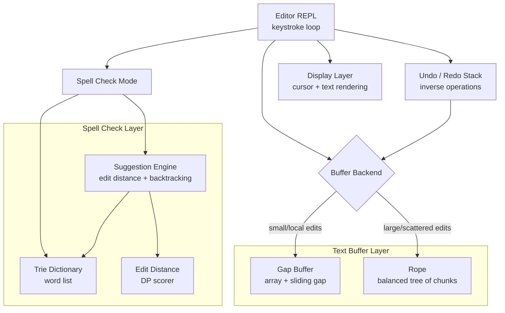

# Build Your Own Text Editor Engine

## 1. Motivation & Real-World Context

Every text editor you have ever used — VS Code, Emacs, Vim, Sublime Text, Notepad++ — is built on one of a small number of text buffer data structures. The choice of buffer structure determines whether typing at the cursor is O(1) or O(n), whether large-file operations are feasible, and whether undo/redo can be implemented efficiently. Building a working editor engine makes these trade-offs concrete.

**Emacs and the Gap Buffer.** Emacs stores the entire buffer in a single array with a movable gap at the cursor position. Inserting at the cursor is O(1) amortized (write into the gap). Moving the cursor far from the gap is O(n) (slide the gap). For typical editing — small movements between keystrokes — the gap buffer is extremely fast and memory-efficient. GNU Emacs has used this design for decades.

**Xi Editor and the Rope.** Xi editor (Raph Levien, 2017) uses a rope — a balanced binary tree where leaves hold text chunks and internal nodes track subtree weights (character counts). Insert, delete, and split at any position are O(log n). VS Code's piece tree (a variant of the rope) handles multi-megabyte files without copying the entire buffer on every keystroke. Ropes are the right structure when files are large or edits are scattered.

**Trie-based spell checking.** Every spell checker — from Microsoft Word to LanguageTool to the red squiggles in your IDE — stores a dictionary in a Trie (prefix tree). Checking whether "hello" is a word is a single root-to-leaf walk. Generating suggestions for a misspelled word uses edit-distance search over the Trie with backtracking. The Trie + edit distance combination is the algorithmic core of real-time spell checking.

**Edit Distance in autocomplete and fuzzy matching.** VS Code's IntelliSense, Google's search suggestions, and `git diff` all rely on edit distance (Levenshtein distance) to rank candidates. When you type "fucntion" the editor suggests "function" because the edit distance is 2 (transpose + substitute). Building edit-distance search over a Trie gives you a working spell checker and fuzzy autocomplete engine.

After completing this project, you will understand why Emacs feels instant on small files, why VS Code handles 100 MB logs without freezing, and how your IDE knows "function" is closer to "fucntion" than "functor."

---

## 2. Learning Objectives

By completing this project, you will deeply understand:

1. **How a gap buffer achieves O(1) amortized insertion at the cursor** — the gap invariant, gap movement cost, and when gap buffers outperform ropes. See [Gap Buffer](/data-structures/30-gap-buffer).

2. **How a rope achieves O(log n) insertion, deletion, and split at any position** — tree rebalancing via concatenation and splitting, weight propagation in internal nodes, and leaf chunking. See [Rope](/data-structures/29-rope).

3. **How a Trie enables prefix-based dictionary lookup in O(m) time** — node structure, `isEndOfWord` marking, and why Tries outperform hash maps for prefix queries. See [Trie](/data-structures/17-trie).

4. **How edit distance measures string similarity via dynamic programming** — the insertion, deletion, and substitution recurrence, and the O(m·n) DP table. See [Edit Distance](/algorithms/35-edit-distance).

5. **How backtracking over a Trie generates spell-check suggestions** — pruning the search when the current edit budget is exhausted, and why Trie traversal + edit distance beats brute-force comparison against every dictionary word. See [Backtracking](/algorithms/43-backtracking).

6. **When to choose gap buffer vs. rope** — the crossover point where file size and edit locality make one structure clearly superior, and how real editors use hybrid approaches (piece tree = rope variant).

7. **How undo/redo composes with either buffer structure** — storing inverse operations (insert ↔ delete) on a stack, and why rope splits make undo efficient.

---

## 3. Project Scope

**In Scope:**
- Gap buffer: insert, delete, cursor movement, `String()` export
- Rope: insert, delete, char-at, substring, concatenate, split
- Pluggable buffer backend: switch between gap buffer and rope via interface
- Trie dictionary loaded from a word list file
- Spell check: highlight misspelled words in the buffer
- Suggestion engine: top-k suggestions for a misspelled word via Trie + edit distance backtracking
- Simple editor REPL: cursor movement, insert, delete, undo, redo, spell-check mode
- Benchmark: gap buffer vs. rope on small-localized edits vs. scattered edits on a 1 MB file

**Out of Scope (for v1):**
- Syntax highlighting or language server protocol
- Multi-cursor editing
- Unicode grapheme cluster handling (treat each `rune`/`char` as one character; document the limitation)
- Persistent file I/O with memory-mapped files
- Concurrent editing / operational transformation
- Red-black or AVL tree balancing for the rope (use naive concatenation; rebalance as stretch goal)

---

## 4. Core DSA Concepts Used

| Concept | Role in this project | Handbook Link | Difficulty |
|---------|----------------------|---------------|------------|
| Gap Buffer | Default text buffer; O(1) insert at cursor for localized editing | [/data-structures/30-gap-buffer](/data-structures/30-gap-buffer) | Intermediate |
| Rope | Alternative buffer for large files; O(log n) insert/delete at any position | [/data-structures/29-rope](/data-structures/29-rope) | Hard |
| Trie | Dictionary storage for spell checking and prefix lookup | [/data-structures/17-trie](/data-structures/17-trie) | Intermediate |
| Edit Distance | Scoring candidate suggestions by Levenshtein distance | [/algorithms/35-edit-distance](/algorithms/35-edit-distance) | Intermediate |
| Backtracking | Generating spell-check suggestions by exploring edit operations over the Trie | [/algorithms/43-backtracking](/algorithms/43-backtracking) | Intermediate |
| Dynamic Array | Underlying storage for gap buffer and rope leaf chunks | [/data-structures/02-dynamic-array](/data-structures/02-dynamic-array) | Beginner |

---

## 5. High-Level Architecture

The editor engine has three layers: a pluggable text buffer, a spell-checking layer backed by a Trie, and a REPL that ties them together.

**Key interfaces:**

- `TextBuffer` — `Insert`, `Delete`, `CharAt`, `Length`, `String`, `MoveCursor`, `Cursor`
- `Trie` — `Insert`, `Search`, `StartsWith`
- `SuggestionEngine` — `Suggest(word, maxDist, topK) []Suggestion`
- `Editor` — `HandleKey`, `Undo`, `Redo`, `CheckSpelling() []Misspelling`

---

## 6. Implementation Milestones (with Hints)

### Milestone 1: Gap Buffer with Cursor Operations

**Goal:** Implement a gap buffer that supports O(1) amortized insertion and deletion at the cursor, cursor movement, and full text export.

**Key Challenges:**
- Gap invariant: the buffer is a single `[]rune` array. A gap of uninitialized slots sits at the cursor. `gapStart` and `gapEnd` mark the gap boundaries. Text before the gap is `[0..gapStart)` and text after is `[gapEnd..len)`.
- Moving the cursor requires sliding the gap — O(n) in the distance moved. Inserting at the cursor writes into the gap and shrinks it — O(1) if the gap has room, O(n) if the gap must grow.
- Growing the gap: when `gapEnd - gapStart == 0`, allocate a new array 1.5× the size, copy text before and after the gap, and create a new gap in the middle.

**Hints & Guidance:**
- `MoveCursor(pos)`: if `pos &lt; gapStart`, shift characters from `[pos..gapStart)` right into the gap (gap moves left). If `pos > gapStart`, shift characters from `[gapStart..pos)` left into the gap (gap moves right). Update `gapStart = pos`.
- `Insert(text)`: ensure gap has room (grow if needed), copy `text` into the gap at `gapStart`, advance `gapStart` by `len(text)`.
- `Delete(count)`: move `count` characters immediately after the gap into the gap (effectively deleting them). Advance `gapEnd` by `count`.
- `String()`: return `string(buf[0:gapStart]) + string(buf[gapEnd:])`.
- Test: insert "Hello", move cursor to position 0, insert "X" → "XHello". Delete 1 at position 1 → "Xello".

**Success Criteria:**
- Insert, delete, and cursor movement produce correct text for 1,000 random operation sequences (fuzz test against a naive `[]rune` reference).
- Insert at cursor (no cursor movement between inserts) is O(1) amortized — benchmark 100,000 consecutive inserts at the same position.
- `String()` matches the reference buffer after every operation.

---

### Milestone 2: Rope with Split, Concatenate, and Index

**Goal:** Implement a rope (binary tree of text chunks) that supports O(log n) insert, delete, char-at, and substring operations.

**Key Challenges:**
- Leaf nodes hold a `string` chunk (target 64–256 characters per leaf). Internal nodes hold left and right children plus `weight` (total characters in the left subtree).
- `CharAt(pos)`: if `pos &lt; node.weight`, recurse left; else recurse right with `pos - node.weight`.
- `Insert(pos, text)`: split the rope at `pos` into left and right ropes, concatenate `left + newLeaf(text) + right`.
- `Delete(pos, count)`: split at `pos`, split the right part at `count`, concatenate left + remainder.

**Hints & Guidance:**
- `Split(pos)`: walk the tree to find the leaf containing position `pos`. Split that leaf's string into `leftStr` and `rightStr` at the local offset. Rebuild two ropes from the pieces.
- `Concat(a, b)`: create an internal node with `a` as left child, `b` as right child, `weight = a.Length()`.
- Keep leaves at roughly equal size: if a leaf exceeds 512 characters after insert, split it in half.
- For v1, skip explicit rebalancing (AVL/Red-Black). The tree may degrade to a linked list of chunks, which is still O(n) worst case but O(log n) average for random positions.
- Test against gap buffer: run the same 1,000-operation sequence on both backends; `String()` must match.

**Success Criteria:**
- `CharAt`, `Insert`, `Delete` correct for all positions in a 10,000-character document.
- Split/concatenate round-trip: `Concat(Split(rope, pos).Left, Split(rope, pos).Right)` produces the original rope's text.
- Insert at random positions in a 1 MB file completes in O(log n) per operation (measure: 10,000 random inserts in &lt; 1 second).

---

### Milestone 3: Pluggable Buffer and Undo/Redo

**Goal:** Define a `TextBuffer` interface implemented by both gap buffer and rope. Add undo/redo via an operation stack.

**Key Challenges:**
- Undo/redo: every mutating operation pushes an inverse operation onto the undo stack. `Insert(pos, "hello")` pushes `Delete(pos, 5)`. Undo pops and applies the inverse; pushes the original onto the redo stack.
- Switching backends: the REPL accepts a `--backend gap` or `--backend rope` flag. All editor operations go through the interface.

**Hints & Guidance:**
- `TextBuffer` interface: `Insert(pos, text)`, `Delete(pos, count)`, `CharAt(pos)`, `Length()`, `String()`, `MoveCursor(pos)`, `Cursor()`.
- Operation record: `type EditOp struct { Kind Insert|Delete; Pos int; Text string }`. `Insert` stores the inserted text; `Delete` stores the deleted text.
- Undo stack: `[]EditOp`. On undo, pop, apply inverse, push to redo stack. On new edit after undo, clear redo stack.
- Cursor tracking: store `cursor int` in the `Editor` struct, not in the buffer. The buffer is cursor-agnostic.
- Benchmark harness: 1 MB file, 10,000 inserts at random positions. Gap buffer vs. rope — plot latency per operation. Gap buffer wins on localized edits (cursor stays near edit site); rope wins on scattered edits.

**Success Criteria:**
- Both backends pass the same 1,000-operation fuzz test.
- Undo/redo: 50 random edits, undo all 50, redo all 50 — final text matches pre-undo state.
- Benchmark report: gap buffer vs. rope latency for localized vs. scattered edits on 1 MB file.

---

### Milestone 4: Trie Dictionary and Spell Check

**Goal:** Load a dictionary into a Trie and implement spell checking that identifies all misspelled words in the buffer.

**Key Challenges:**
- Dictionary loading: read a word list file (e.g., `/usr/share/dict/words` or a bundled `words.txt`). Insert each word into the Trie. Mark `isEndOfWord = true` at the terminal node.
- Word extraction: scan the buffer left-to-right, extract contiguous alphabetic sequences as candidate words. Check each against the Trie.
- Misspelling report: `[]Misspelling{Word, StartPos, EndPos}`.

**Hints & Guidance:**
- Trie node: `children map[rune]*TrieNode`, `isEndOfWord bool`. For memory efficiency, use a sorted slice of children (26 entries for lowercase a-z) instead of a map.
- `Search(word)`: walk from root, following child pointers for each character. Return `node.isEndOfWord` at the end.
- Spell check scan: maintain `wordStart` index. On non-alpha character, extract `buffer[wordStart:pos]`, call `Search`. If false, record misspelling.
- Load at least 50,000 words. Verify "hello" → true, "helo" → false, "a" → true (if in dictionary).
- Performance: spell-check a 10,000-word document in &lt; 100 ms.

**Success Criteria:**
- Dictionary loads 50,000+ words; `Search` returns true for known words, false for random strings.
- Spell check on a paragraph with 5 intentional misspellings identifies all 5 with correct positions.
- Words at buffer boundaries (start, end) are correctly extracted and checked.

---

### Milestone 5: Edit Distance and Suggestion Engine

**Goal:** Implement Levenshtein edit distance and a suggestion engine that finds the top-k closest dictionary words for a misspelling using Trie traversal with backtracking.

**Key Challenges:**
- Edit distance DP: `dp[i][j]` = min edits to transform `a[0..i)` into `b[0..j)`. Recurrence: `dp[i][j] = min(dp[i-1][j]+1, dp[i][j-1]+1, dp[i-1][j-1]+cost)` where `cost = 0` if `a[i-1]==b[j-1]`, else `1`.
- Trie backtracking for suggestions: DFS the Trie, tracking the current edit distance budget. At each node, try match (cost 0), insert (cost 1), delete (cost 1), substitute (cost 1). Prune branches where accumulated cost > `maxDist`.
- Return top-k suggestions sorted by edit distance.

**Hints & Guidance:**
- `EditDistance(a, b)`: standard O(m·n) DP. Optimize space to O(min(m,n)) if needed, but the full table is fine for suggestion lengths.
- `Suggest(word, maxDist, topK)`: DFS from Trie root with state `(node, wordIndex, currentDist, currentPath)`. Prune when `currentDist > maxDist`. At each node, try match (cost 0), insert (cost 1), delete (cost 1), and substitute (cost 1). Collect `isEndOfWord` nodes as candidates; sort by distance, return top k.
- Test: `Suggest("fucntion", 2, 5)` returns "function" as the top suggestion. `Suggest("helo", 1, 5)` returns "hello", "helot", "helos".

**Success Criteria:**
- `EditDistance("kitten", "sitting")` = 3. `EditDistance("hello", "hello")` = 0.
- `Suggest("fucntion", 2, 5)` includes "function" with distance 2.
- Suggestion engine returns results in &lt; 50 ms for any word with `maxDist ≤ 2` against a 50,000-word dictionary.

---

### Milestone 6: Editor REPL with Spell-Check Mode

**Goal:** Build an interactive REPL that supports text editing, undo/redo, and spell-check mode with inline suggestions.

**Key Challenges:**
- REPL commands: `i &lt;text&gt;` (insert at cursor), `d &lt;n&gt;` (delete n chars), `l`/`r` (move cursor left/right), `u` (undo), `r` (redo), `s` (spell check), `fix &lt;word&gt;` (show suggestions), `b gap|rope` (switch backend), `show` (display buffer), `quit`.
**Hints & Guidance:**
- REPL loop: read a line, parse command, dispatch. On `show`, print buffer with `|` cursor marker (e.g., `Hello |world`).
- `s` (spell check): print misspellings with position and suggestions. `fix &lt;word&gt;` calls `Suggest` and prints ranked results.
- Trap Ctrl-C for clean exit. On exit, print final buffer contents and operation count.
- Demo script: insert a paragraph with typos, spell-check, show suggestions, apply top suggestion via insert/delete, undo, redo.

**Success Criteria:**
- REPL accepts all commands and produces correct buffer state.
- Spell-check mode identifies misspellings and offers valid suggestions.
- Full demo: load paragraph → spell check → fix top misspelling → undo → redo → final text is correct.
- Both backends (gap and rope) work identically through the REPL.

---

## 7. Stretch Goals

1. **Piece Tree (VS Code's approach).** Implement a piece table: an array of `(bufferIndex, start, length)` pieces pointing into two underlying buffers (original file + append buffer). Edits only modify the piece array, never the original buffer. Compare performance with rope on read-heavy workloads.

2. **AVL-balanced rope.** Add AVL rebalancing on concatenate to guarantee O(log n) height. Measure height before and after 100,000 random inserts with and without balancing.

3. **Syntax-aware spell check.** Skip words inside string literals and comments. Requires a minimal tokenizer (stretch within stretch) or a configurable "skip regions" list.

4. **Multi-level undo with operation merging.** Merge consecutive single-character inserts into one undo step (how VS Code groups keystrokes). Implement a time window: inserts within 500 ms of each other merge into one undo operation.

5. **Diff view.** Implement Myers diff between two buffer states (before/after an edit session). Display added lines with `+` and removed lines with `-`. This is the algorithm behind `git diff` and VS Code's change highlighting.

---

## 8. Testing & Validation Strategy

**Gap buffer tests:**
- 1,000 random operation sequences (insert, delete, move cursor) verified against a naive `[]rune` reference implementation.
- Insert 100,000 characters at the same cursor position: verify O(1) amortized (total time linear, not quadratic).
- Grow/shrink: buffer handles growth from 0 to 1 MB and back without corruption.

**Rope tests:**
- `CharAt(i)` matches `String()[i]` for all i in 0..Length()-1.
- 1,000 random insert/delete operations match gap buffer output.
- Split/concatenate identity: `Concat(Split(r, k).L, Split(r, k).R).String() == r.String()` for random k.

**Trie tests:**
- Insert 50,000 words; `Search` returns true for all, false for 10,000 random non-words.
- `StartsWith("pre")` returns true if any inserted word begins with "pre".

**Edit distance tests:**
- Known pairs: ("kitten", "sitting") → 3, ("", "abc") → 3, ("abc", "") → 3, ("abc", "abc") → 0.
- Symmetry: `EditDistance(a, b) == EditDistance(b, a)`.

**Suggestion engine tests:**
- "fucntion" → top suggestion is "function".
- "aequeosque" → no suggestions with `maxDist=1`; suggestions exist with `maxDist=3`.
- Performance: &lt; 50 ms per query against 50,000-word dictionary.

**Integration tests:**
- Full REPL session: 20 commands including insert, delete, undo, redo, spell check. Final buffer matches expected text.
- Backend switch: run the same session on gap buffer and rope; outputs are identical.

---

## 9. C# and Go Implementation Notes

### C#

- Gap buffer: `char[]` or `StringBuilder` with manual gap tracking. `StringBuilder` is tempting but does not expose gap semantics — use a raw `char[]` for learning purposes.
- Rope: `class RopeNode { bool IsLeaf; string Text; RopeNode Left, Right; int Weight; }`. Implement `IRope` interface.
- Trie: `class TrieNode { TrieNode[] Children = new TrieNode[26]; bool IsEndOfWord; }`. Index via `c - 'a'`. For case-insensitive matching, lowercase on insert and lookup.
- Edit distance: `int[,] dp` table. Use `ReadOnlySpan&lt;char&gt;` for zero-allocation comparisons in the hot loop.
- Undo stack: `Stack&lt;EditOp&gt;` for undo, `Stack&lt;EditOp&gt;` for redo.
- REPL: `Console.ReadLine()` loop. Consider `System.CommandLine` for a more polished CLI in extensions.

### Go

- Gap buffer: `[]rune` with `gapStart`, `gapEnd int`. Use `unicode.IsLetter` for spell-check word extraction.
- Rope: struct with `leaf bool`, `text string`, `left, right *Rope`, `weight int`. Generics are not needed — ropes are string-specific.
- Trie: `type TrieNode struct { children [26]*TrieNode; isEnd bool }`. Load dictionary with `bufio.Scanner` over the word file.
- Edit distance: `[][]int` DP table. For suggestion engine, pass `maxDist` as a pruning parameter in the DFS.
- Benchmarks: `testing.B` with `b.ReportAllocs()`. Compare `GapBuffer.Insert` vs. `Rope.Insert` at random positions on a 1 MB string.
- Use `strings.Builder` for `String()` export on the gap buffer to avoid O(n²) string concatenation.

---

## 10. Potential Extensions & Related Projects

1. **Build Your Own Autocomplete Engine (`07-autocomplete-engine.md`).** The Trie from this project is the same structure used for autocomplete. Add frequency-weighted ranking to the suggestion engine and you have a complete autocomplete system. The edit-distance stretch goal here is the "fuzzy match" feature in that project.

2. **Build Your Own Full-Text Search Engine (`13-full-text-search-engine.md`).** A text editor's buffer is a single-document index. Replace the Trie dictionary with an inverted index and the spell checker becomes a search engine's "did you mean?" feature.

3. **Build Your Own Mini Version Control (`16-mini-version-control.md`).** Add a diff view (stretch goal 5) and snapshot-on-save (commit the buffer state as a blob). You have the core of a content-addressable editor with history — the architecture behind Git-backed editors like Atom's early prototypes.

4. **Build Your Own Time-Travel Debugger.** Record every `EditOp` with a timestamp. Allow jumping to any point in the edit history by replaying operations from the initial empty buffer. This is the algorithm behind undo trees in advanced editors and `rr` (record-and-replay debuggers).

5. **Build Your Own Code Formatter.** Add a thin tokenizer layer over the buffer (keywords, identifiers, literals, operators). Implement a simple pretty-printer that walks the token stream and re-indents. The buffer engine from this project is the foundation; the Trie handles keyword recognition.