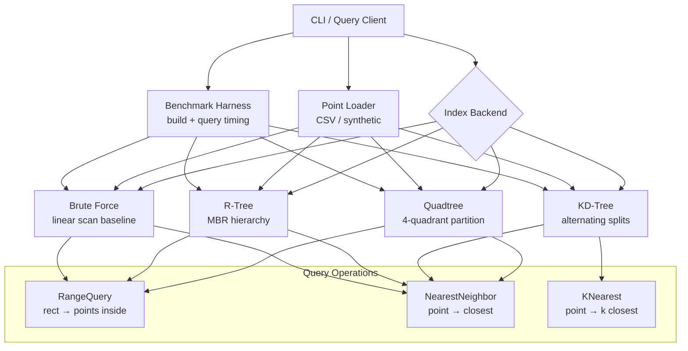

# Build Your Own Geospatial Index

## 1. Motivation & Real-World Context

Every "find the nearest X" feature in a production system — Uber matching you to a driver, DoorDash finding restaurants near you, a game engine culling off-screen objects, MongoDB's `2dsphere` index answering geo queries — is backed by a spatial index. The naive approach (scan every point, compute distance) is O(n) and breaks at scale. Spatial indexes reduce this to O(log n) average case by partitioning space.

**PostGIS and R-Trees.** PostGIS, the spatial extension for PostgreSQL, uses GiST indexes (Generalized Search Tree) that are R-Tree variants. When you run `SELECT * FROM restaurants WHERE ST_DWithin(location, ST_MakePoint(-73.98, 40.75), 1000)` PostGIS walks an R-Tree to find only the bounding boxes that overlap the query circle, then refines with exact distance. Without the index, PostgreSQL scans every row.

**Uber H3 and hexagonal grids.** Uber's H3 geospatial indexing system partitions the world into hexagonal cells at 16 resolution levels. While H3 is a flat-grid approach rather than a tree, the problem it solves is identical: given a lat/lng, which cell (and which nearby cells) should I search? Game engines use quadtrees for the same purpose in 2D worlds: partition the map into quadrants, recurse into the quadrant containing the query point.

**MongoDB 2dsphere.** MongoDB's `2dsphere` index is an R-Tree-like structure over GeoJSON geometries. Queries like `$near`, `$geoWithin`, and `$geoIntersects` all use the spatial index to avoid full collection scans. Understanding R-Trees makes MongoDB's geo query planner legible.

**KD-Trees for nearest-neighbor.** Machine learning libraries (scikit-learn's `KDTree`, scipy's `cKDTree`) use KD-Trees for k-nearest-neighbor queries in arbitrary dimensions. Collision detection in physics engines, ray tracing acceleration structures (BVH is a KD-Tree cousin), and recommendation systems ("users similar to you") all reduce to nearest-neighbor search in multi-dimensional space.

After completing this project, every geo query in PostGIS, MongoDB, Uber, and game engines will have a concrete tree-walk behind it.

---

## 2. Learning Objectives

By completing this project, you will deeply understand:

1. **How a quadtree partitions 2D space into four quadrants per level** — insertion by descending into the quadrant containing the point, splitting when a leaf exceeds capacity, and range query by pruning quadrants that do not overlap the query rectangle. See [Quadtree](/data-structures/32-quadtree).

2. **How a KD-Tree alternates splitting dimensions for efficient nearest-neighbor search** — the median-split invariant, recursive descent with dimension cycling, and why the nearest neighbor may live in the "far" subtree. See [KD-Tree](/data-structures/33-kd-tree).

3. **How an R-Tree groups nearby objects into minimum bounding rectangles (MBRs)** — node overflow and splitting, MBR enlargement on insert, and why R-Trees handle extended objects (polygons, line segments) that point indexes cannot. See [R-Tree](/data-structures/34-rtree).

4. **How binary search enables efficient range queries on sorted projections** — projecting points onto an axis and binary-searching for the query range boundaries, as a baseline comparison against tree-based indexes. See [Binary Search](/algorithms/07-binary-search).

5. **When to choose quadtree vs. KD-Tree vs. R-Tree** — quadtrees for uniform 2D point distributions and rendering, KD-Trees for nearest-neighbor in k dimensions, R-Trees for spatial objects with extent (rectangles, polygons).

6. **How bounding-box pruning eliminates entire subtrees from search** — the core optimization shared by all spatial indexes: if a node's bounding region does not intersect the query region, skip the entire subtree.

7. **How to benchmark spatial indexes against brute-force scan** — measuring query latency, index build time, and memory usage across datasets of varying size and distribution.

---

## 3. Project Scope

**In Scope:**
- `Point` type: `ID string`, `X float64`, `Y float64` (use normalized coordinates 0..1 or lat/lng)
- Quadtree: insert, range query (rectangle), nearest neighbor
- KD-Tree (2D): build from point set, nearest-neighbor query, k-nearest-neighbors
- R-Tree: insert points (as degenerate MBRs), range query, nearest neighbor
- Brute-force baseline: linear scan for range and nearest-neighbor queries
- Benchmark harness: build time, query latency, and memory for n ∈ {1K, 10K, 100K, 1M}
- CLI: load points from CSV, run queries interactively, print results and timing
- Synthetic data generator: uniform random, clustered (Gaussian blobs), and grid distributions

**Out of Scope (for v1):**
- Geographic coordinate systems (WGS84, projections, great-circle distance)
- Polygon and line-segment storage (R-Tree stores points only in v1; stretch goal adds rectangles)
- Concurrent index access
- Disk-persisted indexes
- H3 hexagonal grid indexing

---

## 4. Core DSA Concepts Used

| Concept | Role in this project | Handbook Link | Difficulty |
|---------|----------------------|---------------|------------|
| Quadtree | 2D space partitioning for range and nearest-neighbor queries | [/data-structures/32-quadtree](/data-structures/32-quadtree) | Intermediate |
| KD-Tree | Alternating-dimension tree for efficient k-NN search | [/data-structures/33-kd-tree](/data-structures/33-kd-tree) | Hard |
| R-Tree | MBR-based index for spatial range queries with object extent | [/data-structures/34-rtree](/data-structures/34-rtree) | Hard |
| Binary Search | Baseline sorted-projection range query for comparison | [/algorithms/07-binary-search](/algorithms/07-binary-search) | Beginner |
| Binary Search Tree | Conceptual foundation; KD-Tree is a spatial BST | [/data-structures/13-binary-search-tree](/data-structures/13-binary-search-tree) | Beginner |
| Array | Underlying point storage and sorted projections | [/data-structures/02-dynamic-array](/data-structures/02-dynamic-array) | Beginner |

---

## 5. High-Level Architecture

The geospatial index system supports three index backends behind a common query API. A benchmark harness compares all backends against brute-force scan.

**Key interfaces:**

- `SpatialIndex` — `Insert`, `RangeQuery(rect)`, `NearestNeighbor(query)`, `Size()`
- `Point` — `ID string`, `X, Y float64` | `Rectangle` — `MinX, MinY, MaxX, MaxY`
- `KDTree` — `Build(points)`, `KNearest(query, k)`
- `Benchmark` — `Run(index, queries, n) BenchmarkResult`

---

## 6. Implementation Milestones (with Hints)

### Milestone 1: Point Model, Distance Functions, and Brute-Force Baseline

**Goal:** Define the point and rectangle types, implement Euclidean distance, and build the brute-force baseline that all indexes will be compared against.

**Key Challenges:**
- Distance function: `Dist(a, b) = sqrt((a.X-b.X)² + (a.Y-b.Y)²)`. Provide both squared distance (for comparisons) and actual distance (for reporting).
- Brute-force range query: iterate all points, check `rect.Contains(point)`.
- Brute-force nearest neighbor: iterate all points, track minimum distance.

**Hints & Guidance:**
- `Rectangle.Contains(p)`: `p.X >= MinX && p.X &lt;= MaxX && p.Y >= MinY && p.Y &lt;= MaxY`.
- `Rectangle.Intersects(other)`: not `! (MaxX &lt; other.MinX || MinX > other.MaxX || ...)`.
- Synthetic data: `UniformRandom(n)` fills [0,1]×[0,1]. `Clustered(n, k)` places k Gaussian blobs. `Grid(n)` places points on a √n × √n grid.
- CSV format: `id,x,y` per line. Load with a simple parser.
- Brute-force is correct by definition — use it to validate all tree-based indexes.

**Success Criteria:**
- `Dist((0,0), (3,4))` = 5.0. Squared distance = 25.0.
- Brute-force range query on 10,000 uniform points with a 0.1×0.1 rectangle returns the correct count (verify against manual count).
- Brute-force nearest neighbor returns the correct point for 1,000 random queries against a 10,000-point dataset.

---

### Milestone 2: Quadtree with Insert and Range Query

**Goal:** Implement a point quadtree that supports insertion and rectangular range queries with subtree pruning.

**Key Challenges:**
- Each node represents a rectangular region. Internal nodes have four children (NW, NE, SW, SE). Leaf nodes hold up to `capacity` points (use 4 or 8).
- Insert: if the leaf is not full, add the point. If full, subdivide into four children, redistribute existing points, then insert the new point.
- Range query: if the query rectangle does not intersect the node's region, prune. If the node is a leaf, check each point. Otherwise, recurse into all four children.

**Hints & Guidance:**
- Root node covers the full space: `[0, 0, 1, 1]` (or the bounding box of all data).
- Subdivide: `midX = (minX + maxX) / 2`, `midY = (minY + maxY) / 2`. NW = `[minX, midX] × [midY, maxY]`, NE = `[midX, maxX] × [midY, maxY]`, etc.
- On subdivision, redistribute: for each point in the leaf, determine which quadrant it belongs to and insert into the corresponding child. The leaf becomes an internal node with four children.
- Range query pruning: `if !queryRect.Intersects(node.Bounds)`, return empty. This is the core optimization.
- Verify: insert 10,000 points, range query a 0.2×0.2 square, compare result count with brute-force.

**Success Criteria:**
- Range query results match brute-force exactly for 100 random rectangles on a 10,000-point dataset.
- Range query on 100,000 points with a small query rectangle (0.05×0.05) is at least 10x faster than brute-force.
- Insert 100,000 points without stack overflow (tree depth is bounded by space subdivision, not point count).

---

### Milestone 3: Quadtree Nearest-Neighbor Search

**Goal:** Implement nearest-neighbor query on the quadtree, including the critical "search the far side" optimization.

**Key Challenges:**
- Start at the root, descend into the quadrant containing the query point (same as insert).
- At the leaf, find the closest point. Record the best distance found so far (`bestDist`).
- Backtrack: for each ancestor, check if the query point's perpendicular distance to the ancestor's dividing line is less than `bestDist`. If so, the nearest point might be in the sibling quadrant — search it.

**Hints & Guidance:**
- `NearestNeighbor(query)`: recursive function with `best *Point` and `bestDist float64` passed by reference.
- Descend: at each internal node, go into the child quadrant containing the query point first.
- At leaf: update `best` and `bestDist` for each point in the leaf.
- Backtrack check: at each internal node, compute the distance from the query point to the far sibling's region. If `distToFarRegion &lt; bestDist`, recursively search the far sibling.
- This "circle overlaps far region" test is the same logic used in KD-Tree and R-Tree nearest-neighbor searches.
- Test: 10,000 random nearest-neighbor queries against a 100,000-point quadtree. Results must match brute-force for every query.

**Success Criteria:**
- Nearest-neighbor results match brute-force for 1,000 random queries on a 100,000-point dataset.
- Nearest-neighbor query is at least 5x faster than brute-force on 100,000 points.
- Edge case: query point exactly on a quadrant boundary returns a valid nearest neighbor.

---

### Milestone 4: KD-Tree Build and Nearest-Neighbor

**Goal:** Implement a 2D KD-Tree with median-split construction and nearest-neighbor search (including k-nearest).

**Key Challenges:**
- Build: at each level, sort points by the current dimension (X at even depth, Y at odd depth), take the median as the node, recursively build left (below median) and right (above median) subtrees.
- Nearest-neighbor search: descend into the side of the splitting plane containing the query point. After visiting the near side, check if the perpendicular distance to the splitting plane is less than `bestDist` — if so, also search the far side.
- k-nearest: maintain a max-heap of size k ordered by distance. Update when a closer point is found.

**Hints & Guidance:**
- `Build(points, depth)`: if empty, return nil. `dim = depth % 2`. Sort by `points[i].X` or `points[i].Y`. Median at `len/2`. Left = `Build(points[:median], depth+1)`, Right = `Build(points[median+1:], depth+1)`.
- For efficient build, use `sort.Slice` or quickselect (O(n) median) instead of full sort at each level.
- `NearestNeighbor(query, node, depth)`: compare query to node.point, update best. `dim = depth % 2`. If `query[dim] &lt; node.point[dim]`, search left first, then conditionally search right. Else, search right first, then conditionally search left.
- Far-side condition: `abs(query[dim] - node.point[dim]) &lt; bestDist`.
- k-NN: use a min-heap or sorted slice of size k. When a new point is closer than the k-th best, insert and evict the farthest.
- Compare KD-Tree vs. quadtree nearest-neighbor latency on uniform and clustered data.

**Success Criteria:**
- Nearest-neighbor matches brute-force for 1,000 queries on 100,000 points.
- k-NN with k=10 returns exactly 10 points, sorted by distance, matching brute-force.
- KD-Tree build time for 100,000 points is under 1 second.

---

### Milestone 5: R-Tree with MBR Insertion and Range Query

**Goal:** Implement a basic R-Tree that groups points into minimum bounding rectangles and supports range queries.

**Key Challenges:**
- Each node has an MBR (`minX, minY, maxX, maxY`) and up to `M` children (use M=8). Leaf children are points; internal children are sub-trees.
- Insert: find the child whose MBR needs the least enlargement to include the new point. Descend. If a node overflows (M+1 children), split it.
- Split: use a simple quadratic split — pick two seed entries farthest apart, assign remaining entries to the group whose MBR enlargement is smaller.
- Range query: if the query rectangle does not intersect a node's MBR, prune. Otherwise, if leaf, check points; if internal, recurse into all children.

**Hints & Guidance:**
- Point as degenerate MBR: a point `(x, y)` has MBR `(x, y, x, y)`.
- `MBR.Enlargement(p)`: compute the area increase if point `p` is added to the MBR. `newArea - oldArea`.
- Insert descent: at each internal node, choose the child with minimum `Enlargement(point)`. Tie-break by minimum area.
- Quadratic split: (1) pick seed pair with maximum wasted area (MBR of pair minus sum of individual areas). (2) Assign each remaining entry to the group with smaller area enlargement.
- Range query: identical pruning logic to quadtree — `if !queryRect.Intersects(node.MBR)`, skip.
- Verify range query results against brute-force for 100 random rectangles.

**Success Criteria:**
- Range query results match brute-force for 100 random rectangles on 10,000 points.
- R-Tree handles 100,000 point insertions without error (splits occur correctly).
- Range query on 100,000 points is at least 10x faster than brute-force for small query rectangles.

---

### Milestone 6: Benchmark Harness and CLI

**Goal:** Build a benchmark harness comparing all four backends and a CLI for interactive queries.

**Key Challenges:**
- Benchmark: for each index, measure (1) build/insert time, (2) range query latency (100 queries, report p50/p99), (3) nearest-neighbor latency (1,000 queries, report p50/p99), (4) memory usage.
- CLI commands: `load <file.csv>`, `build <quadtree|kdtree|rtree>`, `range &lt;x1&gt; &lt;y1&gt; &lt;x2&gt; &lt;y2&gt;`, `nearest &lt;x&gt; &lt;y&gt;`, `knn &lt;x&gt; &lt;y&gt; &lt;k&gt;`, `bench`, `quit`.

**Hints & Guidance:**
- Print a benchmark table: index name, build time, range query p50/p99, nearest-neighbor p50/p99, memory (MB). Run at n = 1K, 10K, 100K, 1M.
- Plot or print speedup: `bruteForceLatency / indexLatency` for each index and query type.
- CLI `nearest 0.5 0.5`: print the closest point ID, coordinates, and distance.
- CLI `range 0.4 0.4 0.6 0.6`: print all points in the rectangle with count.

**Success Criteria:**
- Benchmark runs on all four backends with consistent results across 3 runs.
- All tree-based indexes show ≥ 5x speedup over brute-force for range and nearest-neighbor queries at n ≥ 10,000.
- CLI accepts all commands and produces correct results verified against brute-force.
- Benchmark report is printed in a readable table format.

---

## 7. Stretch Goals

1. **R-Tree with rectangle objects.** Extend the R-Tree to store axis-aligned rectangles (not just points). Range query returns all rectangles intersecting the query rectangle. This is the core PostGIS use case.

2. **Geo-hash baseline.** Implement geohash encoding: encode (lat, lng) as a base-32 string at configurable precision. Range query by prefix matching on the geohash string. Compare with quadtree — geohash is simpler but less precise at cell boundaries.

3. **Radius query (circle search).** Implement `RadiusQuery(center, radius)` by converting to a bounding-box range query (square circumscribing the circle) followed by an exact distance filter on candidates. Compare candidate counts between indexes.

4. **Bulk-loaded KD-Tree.** Replace recursive median-split build with a bulk-loading algorithm (sort by X, partition into vertical strips, sort each strip by Y, partition into horizontal strips). Measure build time improvement for n = 1,000,000.

5. **Visualization.** Export the quadtree or R-Tree structure as SVG: draw node boundaries, points, and query rectangles. Highlight pruned subtrees during a range query animation. This makes the pruning optimization visible.

---

## 8. Testing & Validation Strategy

**Distance and geometry tests:**
- `Dist((0,0), (3,4))` = 5.0. `Rectangle.Contains` and `Rectangle.Intersects` correct for all edge cases (touching edges, contained, disjoint).
- Point on rectangle boundary is considered inside.

**Quadtree tests:**
- Insert n points, range query with a rectangle covering the full space returns all n points.
- Range query results match brute-force for 100 random rectangles on datasets of 1K, 10K, 100K points.
- Nearest-neighbor matches brute-force for 1,000 random queries.
- Deep tree: 100,000 clustered points do not cause stack overflow.

**KD-Tree tests:**
- Build from 10,000 points. Tree height is O(log n) — verify height &lt; 2 * log2(n).
- Nearest-neighbor and k-NN results match brute-force for all test queries.
- Empty tree: nearest-neighbor returns error/no result.

**R-Tree tests:**
- Insert 10,000 points. All range queries match brute-force.
- Node invariants: every node's MBR tightly encloses all its children's MBRs.
- Split correctness: after splitting a node with M+1 entries, both resulting nodes have ≤ M entries and their MBRs are valid.

**Integration tests:**
- Load a real dataset (e.g., 50,000 city coordinates from a public CSV). Run range and nearest-neighbor queries. Verify results are geographically plausible.
- CLI end-to-end: load → build → range → nearest → knn → bench → quit.

---

## 9. C# and Go Implementation Notes

### C#

- Point struct: `record struct Point(string ID, double X, double Y)`. Rectangle: `record struct Rectangle(double MinX, double MinY, double MaxX, double MaxY)`.
- Quadtree node: `class QuadNode { Rectangle Bounds; List&lt;Point&gt; Points; QuadNode[] Children; }`. Children array length 4, null when leaf.
- KD-Tree: `class KDNode { Point Data; KDNode Left, Right; }`. Build with `Array.Sort` or LINQ `OrderBy` for median selection.
- R-Tree: `class RTreeNode { Rectangle MBR; List&lt;RTreeEntry&gt; Entries; bool IsLeaf; }`. Quadratic split implementation follows Guttman's original algorithm.
- k-NN max-heap: `PriorityQueue&lt;Point, double&gt;` (.NET 6+) with inverted comparison for max-heap behavior.
- Benchmarking: `System.Diagnostics.Stopwatch` for timing. `GC.GetTotalMemory(true)` before and after index build for memory measurement.
- Binary search baseline: sort points by X, use `Array.BinarySearch` to find range boundaries.

### Go

- Point: `type Point struct { ID string; X, Y float64 }`. Rectangle: `type Rect struct { MinX, MinY, MaxX, MaxY float64 }`.
- Quadtree: `type QuadNode struct { bounds Rect; points []Point; children [4]*QuadNode }`. Use pointers for children (nil = leaf).
- KD-Tree build: use `sort.Slice` for median selection, or implement quickselect for O(n) build.
- R-Tree: `type RTreeNode struct { mbr Rect; entries []RTreeEntry; leaf bool }`. Split when `len(entries) > M`.
- k-NN: use `container/heap` with a max-heap of size k. Or maintain a sorted slice of k elements.
- Benchmarks: `testing.B` for Go benchmarks. `runtime.MemStats` for memory measurement.
- CSV loading: `encoding/csv` package. Synthetic data: `math/rand` with fixed seed.
- Visualization stretch goal: `image` or `svg` package to draw the tree structure.

---

## 10. Potential Extensions & Related Projects

1. **Build Your Own Route Planner (`08-route-planner.md`).** The route planner uses graph search (Dijkstra/A*) on road networks. This project's spatial index answers "which road segments are near this point?" — the preprocessing step that makes graph-based routing feasible on large maps. Combine both projects for a complete navigation system.

2. **Build Your Own Game Engine Spatial Partition.** Quadtrees are the standard broad-phase collision detection structure in 2D game engines (Box2D, Unity's 2D physics). Insert game objects, query for potential collision pairs within a region, then run narrow-phase exact collision. This project's quadtree is the broad-phase layer.

3. **Build Your Own Distributed Cache (`17-distributed-cache.md`).** Geospatial indexes and consistent hashing solve analogous problems: given a key (location or cache key), which node/bucket is responsible? H3 hexagonal grids are to geo-distributed systems what consistent hash rings are to cache clusters.

4. **Build Your Own Full-Text Search Engine (`13-full-text-search-engine.md`).** Spatial indexing and inverted indexing share the same pattern: preprocess data into a tree/grid structure, prune aggressively at query time, refine candidates with exact computation. The benchmark methodology from this project transfers directly.

5. **Build Your Own Time-Series Analytics Engine.** Replace 2D points with (timestamp, value) pairs. A KD-Tree with time as one dimension enables efficient range queries over time windows — the core of time-series databases like TimescaleDB and InfluxDB's TSM index.