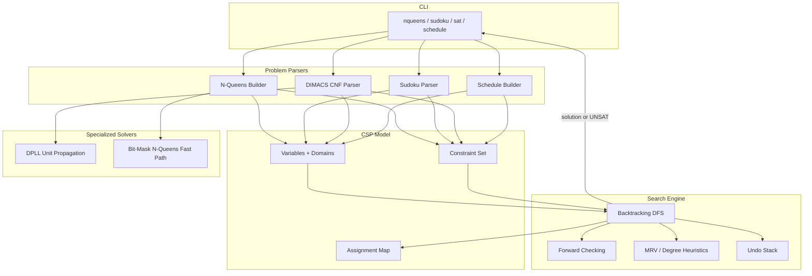

# Build Your Own Constraint Solver

## 1. Motivation & Real-World Context

Constraint satisfaction is the hidden engine behind puzzles, compilers, and operations research. A **constraint satisfaction problem (CSP)** asks: assign values to variables such that every constraint is satisfied. The search space is exponential — a 9×9 Sudoku has 9⁸¹ possible fillings before constraints — yet production solvers routinely crack instances in milliseconds by pruning aggressively instead of brute-forcing.

**Sudoku solvers** reduce to CSP search with propagation: placing a `5` removes `5` from every peer cell's domain. Forward checking prunes branches before recursion descends.

**SAT solvers** (Z3, MiniSat) power hardware verification and model checking. CNF formulas are Boolean CSPs; DPLL combines unit propagation, pure literal elimination, and backtracking — the same skeleton you will build.

**Scheduling with constraints** assigns crews, hospital shifts, and university timetables under no-overlap and coverage rules — the same backtracking + propagation core used by OR-Tools, CPLEX, and Gurobi.

**Compiler register allocation** is graph-coloring CSP: variables alive at the same time cannot share a register. LLVM and GCC layer spill-cost heuristics on this constraint model.

**N-Queens** is the canonical backtracking benchmark. Bit masks track occupied rows, columns, and diagonals in O(1) — a technique reused in SAT solvers and subset enumeration.

After completing this project, backtracking search, propagation, and heuristic variable ordering will be concrete mechanisms you can recognize in Sudoku apps, SAT competition solvers, and compiler optimization passes.

## 2. Learning Objectives

By completing this project, you will deeply understand:

1. **How a CSP decomposes into variables, domains, and constraints** — the uniform interface that lets one search engine solve N-Queens, Sudoku, SAT, and scheduling problems without rewriting the core algorithm. See [`/fundamentals/02-recursion-and-memoization`](/fundamentals/02-recursion-and-memoization).

2. **How recursive backtracking explores a search tree with explicit undo** — choose a variable, try each domain value, recurse, backtrack on failure by restoring state. See [`/algorithms/44-backtracking`](/algorithms/44-backtracking).

3. **How DFS maps directly onto the backtracking call stack** — each recursive call descends one level; returning from a call is backtracking up the tree. See [`/algorithms/26-dfs`](/algorithms/26-dfs).

4. **How constraint propagation prunes domains before search descends** — forward checking removes inconsistent values from unassigned variables' domains after each assignment, detecting dead ends early. See [`/algorithms/44-backtracking`](/algorithms/44-backtracking).

5. **How bit masks accelerate N-Queens and set-based constraint checks** — packing row, column, and diagonal occupancy into integers for O(1) conflict detection. See [`/algorithms/45-bit-manipulation`](/algorithms/45-bit-manipulation).

6. **How greedy heuristics guide search order without guaranteeing optimality** — Minimum Remaining Values (MRV) picks the most constrained variable; Degree heuristic breaks ties by constraint connectivity. See [`/fundamentals/04-greedy-paradigm`](/fundamentals/04-greedy-paradigm).

7. **How DPLL extends backtracking for Boolean SAT** — unit propagation (forced assignments), pure literal elimination, and learned clause concepts in a mini SAT solver.

## 3. Project Scope

**In Scope:**
- CSP framework: `Variable`, `Domain`, `Constraint` interfaces; assignment map; undo stack for backtracking
- Generic backtracking search engine with optional forward checking
- N-Queens solver: count solutions and enumerate all solutions for N ≤ 14
- Sudoku solver: 9×9 grid input, constraint propagation, MRV heuristic
- Mini DPLL SAT solver: parse DIMACS CNF, unit propagation, solve satisfiable/unsatisfiable instances
- Job scheduling solver: assign tasks to time slots with precedence and resource constraints
- CLI: `nqueens`, `sudoku`, `sat`, `schedule` commands with timing and step counts
- Statistics: nodes visited, backtracks, propagations, solve time

**Out of Scope (for v1):**
- Full arc consistency (AC-3) or constraint learning (clause learning / CDCL)
- Optimization (soft constraints, minimize cost) — stretch goal only
- Parallel or distributed solving
- SMT theories (integers, arrays, bitvectors)
- Full LLVM-style register allocator with spilling and coalescing

## 4. Core DSA Concepts Used

| Concept | Role in this project | Handbook Link | Difficulty |
|---------|----------------------|---------------|------------|
| Backtracking | Core search: assign, recurse, undo on failure | [/algorithms/44-backtracking](/algorithms/44-backtracking) | Intermediate |
| DFS | Search tree traversal via recursive call stack | [/algorithms/26-dfs](/algorithms/26-dfs) | Intermediate |
| Recursion | Search engine structure; base case = all variables assigned | [/fundamentals/02-recursion-and-memoization](/fundamentals/02-recursion-and-memoization) | Beginner |
| Bit Manipulation | N-Queens: O(1) row/col/diag conflict checks via bit masks | [/algorithms/45-bit-manipulation](/algorithms/45-bit-manipulation) | Intermediate |
| Greedy | MRV and Degree heuristics for variable ordering | [/fundamentals/04-greedy-paradigm](/fundamentals/04-greedy-paradigm) | Intermediate |
| Stack | Undo stack for domain restoration during backtrack | [/data-structures/04-stack](/data-structures/04-stack) | Beginner |

## 5. High-Level Architecture

The solver is a single search engine parameterized by problem-specific constraints. Each problem type implements the CSP interface; the engine handles assignment, propagation, and backtracking uniformly.



**Key interfaces:**

```
type Variable struct { ID int; Domain []int }
type Assignment map[int]int  // variable ID → value

type Constraint interface {
    IsSatisfied(assignment Assignment) bool
    IsConsistent(varID int, value int, assignment Assignment) bool
    AffectedVariables() []int
}

type CSPSolver interface {
    Variables() []Variable
    Constraints() []Constraint
    Assign(varID, value int)
    Unassign(varID int)
    IsComplete(assignment Assignment) bool
}

SearchEngine
  Solve(solver CSPSolver, opts SearchOptions) (Assignment, Stats, error)
  SolveAll(solver CSPSolver, opts SearchOptions) ([]Assignment, Stats, error)
```

## 6. Implementation Milestones (with Hints)

### Milestone 1: CSP Framework and Assignment Model

**Goal:** Define the CSP interfaces (`Variable`, `Constraint`, `CSPSolver`), an assignment map, and an undo stack that records domain changes for backtracking.

**Key Challenges:** Designing constraints to be checkable incrementally (only inspect relevant variables) rather than scanning the entire assignment on every trial. Ensuring `Unassign` fully restores prior domain state.

**Hints & Guidance:**
- A `Variable` holds an `ID` and a mutable `Domain` slice. Keep domains as copies — never share slice backing arrays between variables.
- `Assignment` is a `map[int]int` of assigned variable IDs. Unassigned variables are absent from the map.
- `Constraint.IsConsistent(varID, value, assignment)` checks whether adding `value` to `varID` violates the constraint given current assignments. Only fully assigned constraints need `IsSatisfied`.
- Undo stack: on each domain reduction, push `(varID, removedValue)` pairs. On backtrack, pop and restore.
- `IsComplete`: every variable has an entry in the assignment map.
- Test with a trivial problem: three variables, domains `{1,2}`, constraint `v0 ≠ v1`. Verify that assigning `v0=1` and `v1=1` is rejected.

**Success Criteria:**
- Variables and constraints can be constructed programmatically
- Assignment and unassignment update the map correctly
- Undo stack restores domains to their pre-propagation state
- A manual test confirms inconsistent assignments are detected

### Milestone 2: Backtracking Search Engine

**Goal:** Implement the generic recursive backtracking search that tries each domain value for the next unassigned variable, recurses on success, and backtracks on failure.

**Key Challenges:** Correct backtracking order (unassign before trying the next value). Tracking statistics (nodes visited, backtracks). Avoiding infinite recursion when no variable is assignable.

**Hints & Guidance:**
- Base case: `IsComplete(assignment)` → return success.
- Recursive step: pick an unassigned variable (static order for now), iterate its domain values, call `IsConsistent` for each constraint touching that variable, assign, recurse, unassign on failure.
- Increment `nodesVisited` on each recursive entry; increment `backtracks` when all values for a variable fail.
- Return a bool or optional assignment — do not throw on UNSAT; return `nil`/empty to signal failure.
- Implement `SolveAll` by continuing search after finding a solution instead of returning immediately. Pass a solution limit to avoid enumerating millions of N-Queens solutions accidentally.
**Success Criteria:**
- Solves the trivial `v0 ≠ v1` problem with three variables
- Returns UNSAT correctly when no assignment exists
- `SolveAll` finds all solutions for a 4-variable permutation problem
- Statistics report nodes visited and backtrack count

### Milestone 3: N-Queens with Bit Manipulation

**Goal:** Implement N-Queens as a CSP and as a specialized bit-mask solver. Count solutions and enumerate all solutions for N ≤ 12.

**Key Challenges:** Encoding diagonal constraints correctly. Using three bit masks (`cols`, `diag1`, `diag2`) to track occupied squares in O(1). Relating the bit-mask approach to the generic CSP version.

**Hints & Guidance:**
- CSP formulation: N variables (one per row), domain `{0..N-1}` (column index). Constraints: all-different on columns, plus diagonal constraints between every pair of rows.
- Bit-mask solver: recursive function `solve(row, cols, diag1, diag2, board)`. Available positions = `available = ((1&lt;<N) - 1) & ~(cols | diag1 | diag2)`.
- Extract the least significant set bit: `pos = available & -available` (two's complement trick). Place queen at `pos`, recurse with updated masks: `cols | pos`, `(diag1 | pos) &lt;&lt; 1`, `(diag2 | pos) >> 1`.
- Diagonal shift direction: one diagonal moves left-to-right (shift left), the other right-to-left (shift right). Draw a 4×4 board and verify.
- Compare node counts: generic CSP vs. bit-mask for N = 8, 10, 12. Known counts: N=8 → 92, N=10 → 724, N=12 → 14,200.

**Success Criteria:**
- CSP solver finds 92 solutions for N=8
- Bit-mask solver matches CSP solution count for N ≤ 12
- Bit-mask solver is measurably faster than generic CSP for N ≥ 10
- `nqueens --count 8` prints `92` with timing

### Milestone 4: Sudoku with Forward Checking and MRV

**Goal:** Parse a 9×9 Sudoku puzzle (81-char string or file), solve it using backtracking with forward checking, and apply the MRV heuristic for variable ordering.

**Key Challenges:** Implementing Sudoku constraints (row, column, box all-different). Forward checking: after assigning a cell, remove that digit from all peers' domains. MRV: select the unassigned cell with the smallest remaining domain.

**Hints & Guidance:**
- Represent the grid as 81 variables (index 0..80). Domain for empty cells: `{1..9}` minus digits already in row, column, and 3×3 box. Given cells have domain size 1.
- Precompute peer lists: for each cell, the 20 peers (row + column + box, excluding self). Store as `[][]int` for O(1) lookup.
- Forward checking: after `Assign(cell, digit)`, for each peer not yet assigned, remove `digit` from its domain. If any peer's domain becomes empty, backtrack immediately.
- Push every domain removal onto the undo stack — forward checking and backtracking share the same undo mechanism from Milestone 1.
- MRV: among unassigned variables, pick the one with `len(domain)` smallest. Tie-break with Degree heuristic: pick the variable involved in the most constraints with other unassigned variables.
- Validate output: every row, column, and box contains 1–9 exactly once.
- Test on a known hard puzzle and report solve time under 100ms.

**Success Criteria:**
- Solves easy, medium, and hard 9×9 puzzles correctly
- Forward checking reduces nodes visited vs. plain backtracking (measure and report)
- MRV further reduces nodes visited vs. static variable ordering
- Invalid puzzles (multiple conflicts in givens) return a clear error

### Milestone 5: Mini DPLL SAT Solver

**Goal:** Parse DIMACS CNF files, implement DPLL with unit propagation and pure literal elimination, and report SAT/UNSAT with a satisfying assignment.

**Key Challenges:** Efficient unit propagation (watch lists or eager scan for v1). Parsing DIMACS format (`p cnf &lt;vars&gt; &lt;clauses&gt;` followed by clauses terminated by 0). Handling empty clauses (immediate UNSAT).

**Hints & Guidance:**
- DIMACS: variables numbered 1..N. Positive literal = variable true; negative = variable false. Clause `1 -3 5 0` means `(x1 ∨ ¬x3 ∨ x5)`.
- DPLL skeleton: (1) unit propagate, (2) eliminate pure literals, (3) pick unassigned variable, (4) try true, recurse, (5) try false, recurse, (6) backtrack.
- Unit clause: a clause with exactly one unassigned literal forces that literal's value. Propagate repeatedly until no unit clauses remain.
- Pure literal: a variable that appears with only one polarity in all remaining clauses. Assign it to satisfy those clauses. Remove satisfied clauses; simplify others.
- Empty clause detection: if any clause has all literals falsified, return UNSAT at this branch.
- For v1, eager clause scanning after each assignment is fine. Test `(x1 ∨ x2) ∧ (¬x1 ∨ x3)` → SAT; `(x1) ∧ (¬x1)` → UNSAT.

**Success Criteria:**
- Parses valid DIMACS CNF files without error
- Returns SAT with a verifiable satisfying assignment (every clause has at least one true literal)
- Returns UNSAT for trivially inconsistent formulas
- Solves uf20-098.cnf-scale instances (20 variables) in under 1 second

### Milestone 6: Scheduling Solver and CLI

**Goal:** Model a job scheduling problem (tasks, time slots, precedence, resource limits) as a CSP and expose all solvers through a unified CLI with timing and statistics.

**Key Challenges:** Encoding precedence constraints (`task A before task B` → `slot(A) &lt; slot(B)`). Resource constraints (at most K tasks using resource R per slot). Producing human-readable schedules.

**Hints & Guidance:**
- Variables: one per task, domain = available time slots `{0..T-1}`.
- Precedence constraint: `IsConsistent` checks that `assignment[A] &lt; assignment[B]` when both are assigned; when only one is assigned, prune domain values that would violate ordering.
- Resource constraint: for each slot and resource, at most K tasks assigned. Forward check: after assigning a task to a slot, count tasks already in that slot using the same resource; if at capacity, remove that slot from other unassigned tasks' domains.
- CLI: `nqueens &lt;N&gt; [--count]`, `sudoku &lt;file&gt;`, `sat <file.cnf>`, `schedule <file.json>`. Print solve time, nodes visited, backtracks.
- Schedule output: task → slot mapping plus ASCII Gantt chart. Document the register-allocation analogy (tasks = live ranges, slots = registers) in help text.

**Success Criteria:**
- Schedule solver respects all precedence and resource constraints
- UNSAT schedules (over-constrained) return a clear message
- CLI runs all four problem types with consistent statistics output
- End-to-end: parse → solve → verify → print schedule in under 500ms for 20-task instances

## 7. Stretch Goals

1. **Arc consistency (AC-3):** Implement full arc consistency propagation before and during search. Measure domain reduction and node-count improvement over forward checking on hard Sudoku instances.

2. **Graph-coloring register allocator:** Build a live-range interference graph from a linear IR (list of `(var, start, end)` live intervals). Color with backtracking + MRV. Spill the variable with highest degree when colors are exhausted.

3. **CDCL clause learning:** Extend the SAT solver with conflict analysis and learned clause generation (the algorithm behind modern MiniSat/Z3). Compare solve times on hard UNSAT instances.

4. **Optimization mode:** Add soft constraints with costs. Find the solution that minimizes total cost (e.g., minimize schedule makespan or register spills) using branch-and-bound pruning.

5. **Sudoku generator:** Generate valid puzzles by filling a complete grid with backtracking, then removing clues while maintaining a unique solution (test uniqueness by counting solutions with `SolveAll` capped at 2).

## 8. Testing & Validation Strategy

**Unit tests — CSP framework:**
- Assign and unassign restore state correctly after 10 sequential assignments and backtracks.
- Undo stack correctly restores domains after forward checking removes 5 values across 3 variables.

**Unit tests — backtracking:**
- `v0 ≠ v1, v1 ≠ v2, v0 ≠ v2` with domain `{1,2}`: exactly 2 solutions (permutations of two values).
- Fully constrained UNSAT: `v0 = 1, v0 = 2` returns no solution.

**N-Queens tests:**
- Solution counts match known values for N = 1..12.
- Bit-mask and CSP solvers agree on solution count for N = 8, 10, 12.
- No solution places two queens in the same column or on the same diagonal.

**Sudoku tests:**
- Solved output passes row, column, and box uniqueness validation.
- Puzzle with givens violating row constraint returns error without entering search.
- Forward checking visits fewer nodes than plain backtracking on a fixed hard puzzle (assert ratio &lt; 0.5).

**SAT tests:**
- Single clause `(x1)` returns SAT with `x1=true`.
- Contradiction `(x1) ∧ (¬x1)` returns UNSAT.
- For every SAT result, verify each clause has at least one satisfied literal.
- Parse and solve uf20 series instances; compare SAT/UNSAT result with known benchmarks.

**Scheduling and integration tests:**
- Precedence chain and over-capacity instances return valid schedule or UNSAT respectively.
- CLI end-to-end for all four problem types. N-Queens N=12 bit-mask completes in under 100ms.

## 9. C# and Go Implementation Notes

**C# notes:**
- `record struct Variable(int ID, List&lt;int&gt; Domain)`. Undo stack: `Stack&lt;(int VarID, int RemovedValue)>`.
- Bit manipulation: `available = ((1 &lt;&lt; n) - 1) & ~(cols | diag1 | diag2)`. Extract LSB: `pos = available & (-available)` — cast to `int` carefully for N > 31 (use `long` for N up to 62).
- DIMACS parsing: `StreamReader` line by line; skip `c` comment lines; parse `p cnf` header; split clause lines on whitespace.
- Recursive `Search(...)` returns bool; pass stats via `ref SearchStats`. Precompute Sudoku peer lists statically. Use `System.CommandLine` and `Stopwatch` for CLI and timing.

**Go notes:**
- `type Variable struct { ID int; Domain []int }`. Undo via `[]DomainChange` truncated on backtrack.
- Bit manipulation: same masks as C# but use `uint` or `uint64`. For N > 32, use `uint64` throughout.
- DIMACS parsing: `bufio.Scanner` for line reading. `strconv.Atoi` for literals. Clauses end at `0`.
- Recursive search: return `(Assignment, bool)`. Go's stack handles recursion depth for typical puzzles; use explicit stack for very deep SAT instances if needed.
- Package layout: `solver/` for engine, `cmd/constraintsolver/` for CLI. Benchmark N-Queens variants with `testing.B`.

## 10. Potential Extensions & Related Projects

- **Build Your Own Mini Version Control (`16-mini-version-control.md`):** Git bisect prunes half the search space per step — the same prune-and-search instinct as constraint propagation.
- **Build Your Own Route Planner (`08-route-planner.md`):** Scheduling with time windows and routing with deadlines are both graph-structured CSPs solved with heuristics + backtracking.
- **Build Your Own API Rate Limiter (`18-api-rate-limiter.md`):** Both rate limiters and constraint solvers answer "is this feasible right now?" under hard limits.
- **Build Your Own Text Editor Engine (`20-text-editor-engine.md`):** The undo stack in the editor and the undo stack in this solver share the same LIFO restoration pattern.
- **Build Your Own Stream Analytics Pipeline (`19-stream-analytics-pipeline.md`):** Windowed event assignment is a continuous scheduling CSP — this project's batch scheduler is the offline analogue.